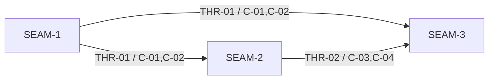

# Threading - substrate-gateway-backend-adapter-contract

## Execution horizon summary

- **Active seam**: `SEAM-3`
  - `SEAM-3` is active because `SEAM-2` has closed, `THR-02` is published, and the parity/validation seam can now consume the landed protocol/schema truth.
- **Next seam**: none
  - no downstream seam remains in this pack after `SEAM-3`.
- **Future seams**: none
  - no remaining seam stays outside the forward window after `SEAM-3` activation.

Horizon policy for this extracted pack:

- only an active seam gets authoritative downstream deep planning by default
- the next seam may later receive seam-local review and slices, but only provisional deeper planning until upstream contract truth is published
- `SEAM-3` now has seam-local review and slices because the upstream protocol/schema handoff is published
- active and next seams must reserve `S99` seam-exit intent, and seams that own undefined contracts may later reserve `S00` for contract definition

## Contract registry

- **Contract ID**: `C-01`
  - **Type**: `config`
  - **Owner seam**: `SEAM-1`
  - **Direct consumers**: `SEAM-2`, `SEAM-3`
  - **Derived consumers**: gateway adapter docs, policy review, and any future backend inventory or allowlist validation surfaces
  - **Thread IDs**: `THR-01`
  - **Definition**: the stable `<kind>:<name>` backend-id contract, ordered config/policy/inventory evaluation, and the invalid-selection versus dependency-unavailable versus policy-denied classification used before adapter dispatch.
  - **Canonical contract ref**: `docs/contracts/substrate-gateway-backend-adapter-selection.md`
  - **Versioning / compat**: the backend-id grammar, deny-by-default posture, one-backend-id-to-one-adapter-identity rule, and failure taxonomy must remain stable for future `cli:*` and `api:*` adapters.

- **Contract ID**: `C-02`
  - **Type**: `schema`
  - **Owner seam**: `SEAM-1`
  - **Direct consumers**: `SEAM-2`, `SEAM-3`
  - **Derived consumers**: `status --json` readers, operator docs, tests, and later gateway capability publication work
  - **Thread IDs**: `THR-01`
  - **Definition**: the publication boundary for any additive adapter-visible gateway status metadata while preserving the existing `status --json` envelope and `client_wiring.*` owner line.
  - **Canonical contract ref**: `docs/contracts/substrate-gateway-status-schema.md`
  - **Versioning / compat**: no new adapter-visible field family may ship without an explicit owner line; existing `status --json` semantics remain externally owned and must stay backward-compatible.

- **Contract ID**: `C-03`
  - **Type**: `API`
  - **Owner seam**: `SEAM-2`
  - **Direct consumers**: `SEAM-3`
  - **Derived consumers**: `substrate-gateway`, shared client helpers, event/trace review, and future adapter harness implementations
  - **Thread IDs**: `THR-02`
  - **Definition**: the selected-backend to adapter-dispatch lifecycle, capability-validation order, request normalization and response emission ordering, and the exact handoff boundary between local adapter translation and externally owned ADR-0017 / ADR-0028 semantics.
  - **Canonical contract ref**: `docs/contracts/substrate-gateway-backend-adapter-protocol.md`
  - **Versioning / compat**: unsupported capabilities and extension keys must fail closed, and the protocol may evolve only through explicit versioned contract changes that preserve the stable backend-id boundary.

- **Contract ID**: `C-04`
  - **Type**: `schema`
  - **Owner seam**: `SEAM-2`
  - **Direct consumers**: `SEAM-3`
  - **Derived consumers**: adapter implementations, validation artifacts, and any future durable schema publication
  - **Thread IDs**: `THR-02`
  - **Definition**: the adopted Universal Agent API subset for capability advertisement, versioned extension keys, request and response payloads, adapter error objects, and backend-defined session-handle facets.
  - **Canonical contract ref**: `docs/contracts/substrate-gateway-backend-adapter-schema.md`
  - **Versioning / compat**: field names, defaults, omission rules, and bounded error detail must stay explicit and additive; session-handle facets remain gateway-contract data rather than Substrate policy input.

## Thread registry

- **Thread ID**: `THR-01`
  - **Producer seam**: `SEAM-1`
  - **Consumer seam(s)**: `SEAM-2`, `SEAM-3`
  - **Carried contract IDs**: `C-01`, `C-02`
  - **Purpose**: publish the stable backend-id selection contract and the adapter-visible status publication boundary before protocol/schema or parity work consumes them.
  - **State**: `published`
  - **Revalidation trigger**: backend-id grammar changes, allowlist semantics change, selection failure buckets change, or the adapter-visible `status --json` owner line changes.
  - **Satisfied by**: `governance/seam-1-closeout.md` recording the landed selection contract and publication boundary, followed by seam-local review in `SEAM-2` and `SEAM-3` that revalidates the upstream handoff.
  - **Notes**: this is the pack's main guardrail against reintroducing provider-specific sub-identities or widening the status schema without an owner.

- **Thread ID**: `THR-02`
  - **Producer seam**: `SEAM-2`
  - **Consumer seam(s)**: `SEAM-3`
  - **Carried contract IDs**: `C-03`, `C-04`
  - **Purpose**: publish one deterministic adapter protocol and one bounded schema inventory before parity, compatibility, and validation proof rely on them.
  - **State**: `published`
  - **Revalidation trigger**: capability ids change, extension-key subset changes, request/response or error fields change, session-handle facets change, or ADR-0017 / ADR-0028 handoff wording changes.
  - **Satisfied by**: `governance/seam-2-closeout.md` recording the landed protocol/schema contract and publication of `THR-02`, followed by `SEAM-3` seam-local review revalidating the published handoff against parity and compatibility proof.
  - **Notes**: this thread protects the pack from hiding unresolved event/trace ownership questions inside implementation-specific adapter behavior.

## Dependency graph

## Critical path

1. `SEAM-1` first:
   - the pack cannot safely define adapter protocol or parity proof until the stable backend-id contract, selection taxonomy, and `status --json` publication boundary are fixed
2. `SEAM-2` second:
   - once the upstream selection contract is published, the adapter protocol and schema can become concrete without widening ADR-0017 or ADR-0028
3. `SEAM-3` third:
   - cross-platform parity, compatibility, and validation only make sense after the first two seams have published the contract truth being proven

## Workstreams

- **Contract surface lane**
  - Primary seam: `SEAM-1`
  - Focus: backend-id semantics, policy/input order, failure taxonomy, adapter-visible status publication boundary
- **Protocol and schema lane**
  - Primary seam: `SEAM-2`
  - Focus: dispatch lifecycle, capability and extension-key subset, request/response/error/session-handle schema, ADR-0017 / ADR-0028 handoff line
- **Parity and validation lane**
  - Primary seam: `SEAM-3`
  - Focus: Linux/macOS/Windows guarantees, ADR-0024 supersession proof, ADR-0040 alignment posture, manual validation gate

Workstream note:

- these are grouping labels only; remediation ownership remains seam-only
