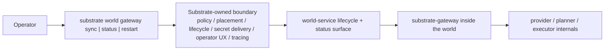
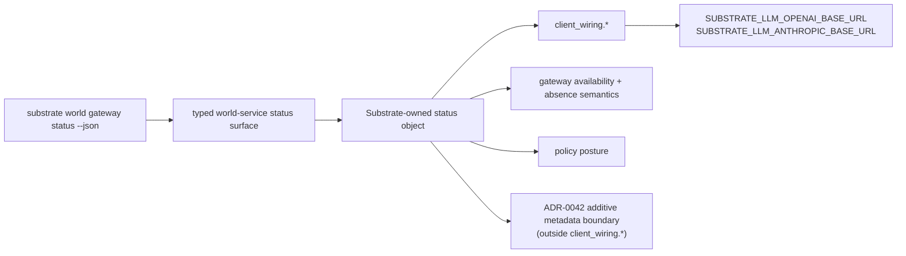
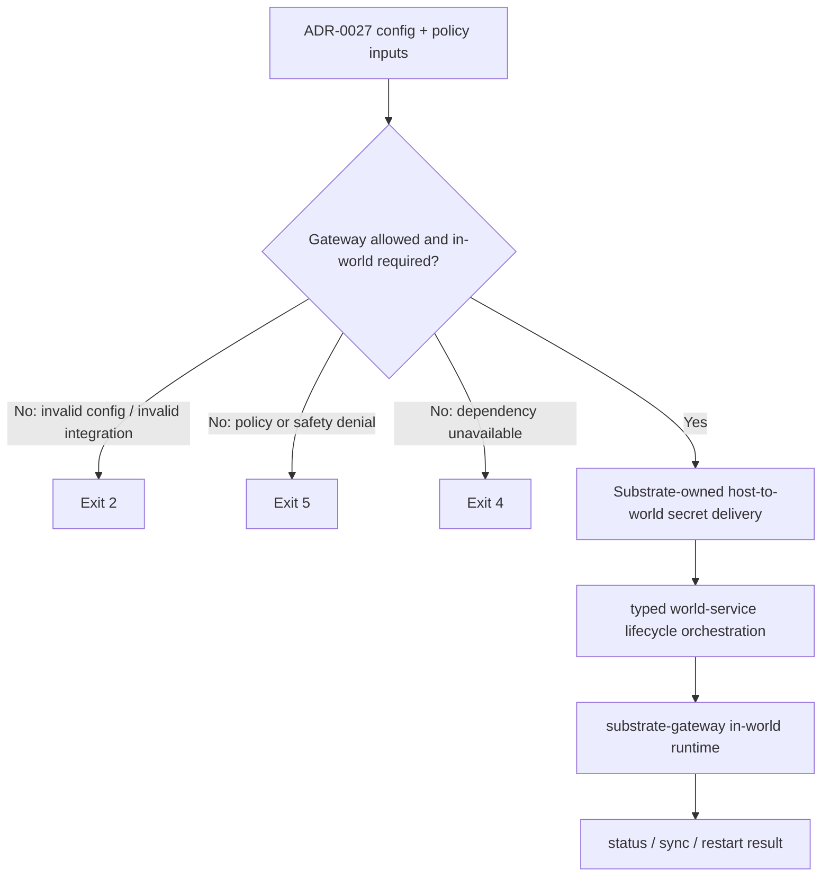
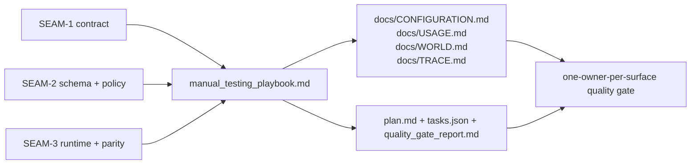

# Review Surfaces - substrate-gateway-boundary-and-runtime-ownership

These diagrams orient the pack. They show the actual operator workflow, status/policy boundary, typed runtime path, and documentation lock-in shape that are expected to land.
They do not, by themselves, satisfy seam-local pre-exec review.
`SEAM-1` and `SEAM-2` still require seam-local `review.md` artifacts later.

## R1 - Operator workflow and ownership boundary

## R2 - Machine-readable status and wiring authority

## R3 - Policy, placement, and secret-delivery flow

## R4 - Cross-doc and quality-gate lock-in

