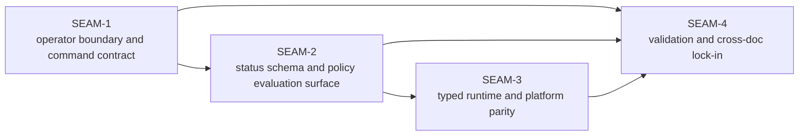

# Seam Map - substrate-gateway-boundary-and-runtime-ownership

The pre-planning pack already separated the work into a stable contract-first planning spine. This extractor preserves that critical path, but lifts it into governance-ready seams instead of reproducing slice specs.

| Seam | Horizon | Type | Core value | Direct blockers | Main touch surface | Source-pack anchors |
| --- | --- | --- | --- | --- | --- | --- |
| `SEAM-1` | `active` | `integration` | Lock one Substrate-owned operator boundary for the gateway command family, absent-state behavior, stable wiring semantics, exit taxonomy, and ownership split. | None inside the pack. | `contract.md`, `pre-planning/spec_manifest.md`, `docs/USAGE.md`, `crates/shell/src/builtins/world_gateway.rs` | ADR-0040 user contract, `pre-planning/spec_manifest.md`, `pre-planning/minimal_spec_draft.md`, `SGBRO-PWS-contract` |
| `SEAM-2` | `next` | `integration` | Pin the machine-readable status/wiring schema and the fail-closed policy/trust boundary as a single authoritative surface reused by runtime and validation seams. | `SEAM-1`, `THR-01` | `gateway-status-schema-spec.md`, `policy-spec.md`, `crates/transport-api-types/src/lib.rs`, `crates/transport-api-client/src/lib.rs` | `pre-planning/spec_manifest.md`, `pre-planning/impact_map.md`, `SGBRO-PWS-schema_inventory` |
| `SEAM-3` | `future` | `platform` | Define the typed world-service lifecycle/status path and Linux/macOS/Windows parity guarantees without letting runtime-private probes become the operator contract. | `SEAM-2`, `THR-02`, `THR-03` | `platform-parity-spec.md`, `crates/world-service/src/handlers.rs`, `crates/world-service/src/service.rs`, `docs/WORLD.md` | selected Option A in `pre-planning/impact_map.md`, `pre-planning/ci_checkpoint_plan.md`, `SGBRO-PWS-world_service_profile` |
| `SEAM-4` | `future` | `conformance` | Prove one-owner-per-surface coverage and lock docs, manual validation, task/checkpoint wiring, and quality-gate evidence against the landed contracts. | `SEAM-3`, `THR-01`, `THR-02`, `THR-03`, `THR-04` | `manual_testing_playbook.md`, `plan.md`, `tasks.json`, `quality_gate_report.md`, `docs/CONFIGURATION.md`, `docs/TRACE.md`, `docs/USAGE.md` | `pre-planning/ci_checkpoint_plan.md`, `pre-planning/impact_map.md`, `SGBRO-PWS-docs_validation`, `SGBRO-PWS-tasks_checkpoints` |

Why this split is the right seam map:

- `SEAM-1` has one purpose: establish the trusted operator boundary before any schema, runtime, or doc surface can safely consume it.
- `SEAM-2` has one purpose: publish the machine-readable status contract and the policy/trust boundary as one inventory seam, matching the accepted pre-planning split.
- `SEAM-3` has one purpose: define how the CLI and shared clients reach typed lifecycle/status behavior across Linux, macOS, and Windows without turning implementation-private behavior into contract.
- `SEAM-4` has one purpose: prevent drift by locking manual validation, docs, checkpoint wiring, and quality-gate evidence after the runtime-adjacent contracts exist.

Why no additional seams were extracted:

- A separate status-only seam and a separate policy-only seam would over-fragment the accepted `schema_inventory` lane and create two downstream review surfaces where the pre-planning pack already showed one shared inventory seam.
- A separate provisioning seam would be premature because the pre-planning pack explicitly keeps provisioning out of this feature boundary.
- A separate docs-only seam would be too small and would sever docs from the validation and checkpoint evidence that actually prove the ownership boundary stayed coherent.

Horizon note:

- `SEAM-1` is the only seam eligible for authoritative deep planning by default.
- `SEAM-2` may later receive seam-local review and only provisional deeper planning.
- `SEAM-3` and `SEAM-4` remain seam briefs until upstream contracts and closeouts exist.
