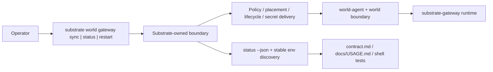
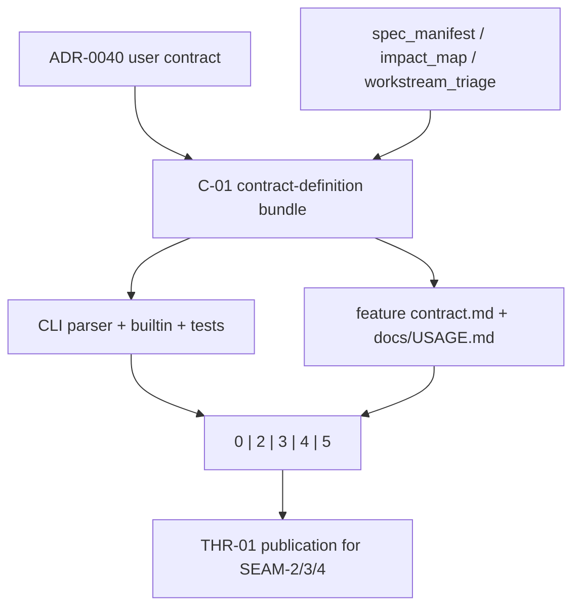

# Review Bundle - SEAM-1 Operator boundary and command contract

This artifact feeds `gates.pre_exec.review`.
`../../review_surfaces.md` is pack orientation only.

## Falsification questions

- Can archived `substrate world status gateway` or `substrate world sync gateway` wording still leak into CLI parsing, tests, or docs after this seam lands?
- Can human-readable `status` output or stable env export text redefine wiring semantics instead of inheriting `status --json` as the machine-readable authority?
- Can exit `2`, `3`, `4`, and `5` or the ownership split still collapse invalid integration, dependency-unavailable, policy-denial, and gateway-internal behavior into one ambiguous operator story?

## R1 - Operator workflow and ownership boundary that should land

## R2 - Contract publication and downstream handoff flow

## Likely mismatch hotspots

- `docs/project_management/packs/draft/substrate-gateway-boundary-and-runtime-ownership/pre-planning/impact_map.md` intentionally treats `crates/shell/src/builtins/world_gateway.rs` and `crates/shell/tests/world_gateway.rs` as create surfaces, so execution must preserve that assumption instead of misreading their current absence as contradictory runtime evidence.
- `docs/project_management/adrs/draft/ADR-0040-substrate-gateway-boundary-and-runtime-ownership.md` still points at `packs/active/llm_and_agent_config_policy_surface/*` in `Related Docs`, which can reintroduce stale ownership cues into downstream seam planning if `SEAM-1` does not normalize it.
- `docs/project_management/_archived/next/llm_gateway_in_world/contract.md` still carries alternate command ordering and older gateway-runtime assumptions that must not look normative once `C-01` is published.

## Pre-exec findings

- Basis revalidated against current repo evidence:
  - ADR-0040 still names the authoritative `sync|status|restart` command family, the `status --json` authority rule, the stable env names, and the `0|2|3|4|5` exit taxonomy.
  - `pre-planning/spec_manifest.md`, `pre-planning/impact_map.md`, `pre-planning/minimal_spec_draft.md`, and `pre-planning/workstream_triage.md` still converge on one Substrate-owned operator boundary and one downstream-first sequencing spine.
  - `SEAM-1` has no required upstream closeout; `THR-01` is outbound only and this seam is responsible for publishing it.
  - `S00` remains required because `C-01` is owned by this seam and must be made concrete before the implementation and docs slices execute.
- No remediation is opened during decomposition. The seam-local slice structure is narrow enough to keep the current blockers inside owned execution work.

## Pre-exec gate disposition

- **Review gate**: passed
- **Contract gate concerns**:
  - `S00` must make the command family, `status --json` authority, stable env semantics, exit taxonomy, ownership split, and durable publication surfaces explicit.
- **Revalidation prerequisites**:
  - re-check ADR-0040, `pre-planning/spec_manifest.md`, `pre-planning/impact_map.md`, `pre-planning/workstream_triage.md`, and any newly created CLI/builtin/test surfaces immediately before landing
- **Contract gate**: passed (`S00` makes `C-01` concrete enough for execution and maps it to explicit implementation, docs, and verification surfaces without waiting on post-exec publication.)
- **Revalidation gate**: passed (there is no upstream handoff to ingest, and the current repo evidence still matches the seam basis and create-surface assumptions recorded in pre-planning.)
- **Opened remediations**: none

## Planned seam-exit gate focus

- **What must be true before downstream promotion is legal**:
  - `THR-01` is published with explicit evidence that the command family, absent-state behavior, stable env semantics, exit taxonomy, and ownership split all land on one contract surface.
- **Which outbound contracts/threads matter most**: `C-01`, `THR-01`
- **Which review-surface deltas would force downstream revalidation**:
  - any change to the command family, status-entrypoint rule, stable env semantics, exit-code mapping, or ownership table
