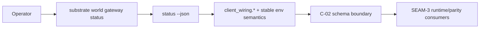
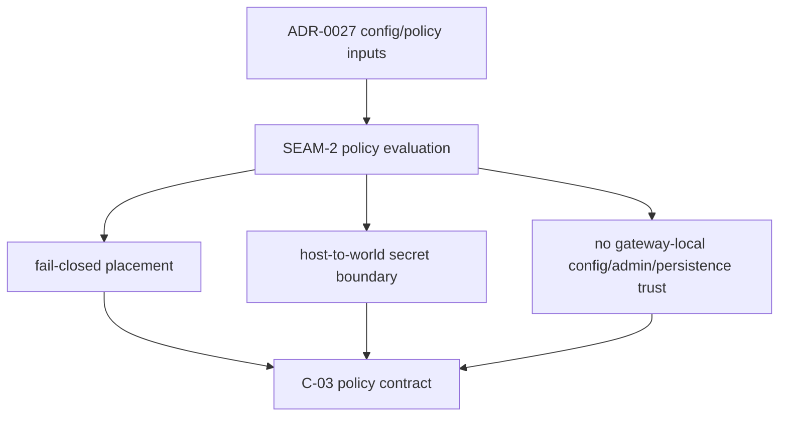

# Review Bundle - SEAM-2 Status schema and policy evaluation surface

This artifact feeds `gates.pre_exec.review`.
`../../review_surfaces.md` is pack orientation only.

## Falsification questions

- Can the `status --json` envelope drift beyond the published operator boundary so human-readable status or later runtime code silently defines a second wiring contract?
- Can the `client_wiring.*` family or its omission rules drift into ADR-0042 additive metadata or other non-owned status fields?
- Can gateway policy evaluation trust gateway-local config, admin, or persistence surfaces, or authorize host fallback when fail-closed in-world placement is required?

## R1 - Status schema and wiring boundary

## R2 - Policy evaluation and trust-boundary flow

## Likely mismatch hotspots

- `status --json` already exists as the operator entrypoint but does not yet publish its owned top-level shape or omission rules.
- ADR-0042 metadata could crowd into the same surface unless the `client_wiring.*` boundary stays explicit.
- Policy evaluation can drift toward gateway-local control-plane behavior unless the no-host-fallback and non-trust rules stay first-class.

## Pre-exec findings

- `SEAM-1` closeout now publishes `THR-01` with the command family, status authority rule, stable env semantics, exit taxonomy, and ownership split this seam consumes.
- The target seam brief already isolates the two owned contract surfaces: `C-02` for schema/inventory and `C-03` for fail-closed evaluation and trust boundaries.
- No blocking remediations currently target `SEAM-2`, `THR-02`, or `THR-03`.

## Pre-exec gate disposition

- **Review gate**: passed
- **Contract gate**: passed
- **Revalidation gate**: passed
- **Opened remediations**: none

## Planned seam-exit gate focus

- What must be true before downstream promotion is legal:
  - `status --json` has one explicit top-level shape and one explicit `client_wiring.*` boundary
  - fail-closed no-host-fallback behavior is concrete
  - gateway-local config/admin/persistence remain out of trust
  - `THR-02` and `THR-03` can be published from closeout-backed schema and policy truth
- Which outbound contracts/threads matter most:
  - `C-02`
  - `C-03`
  - `THR-02`
  - `THR-03`
- Which review-surface deltas would force downstream revalidation:
  - top-level status JSON shape changes
  - `client_wiring.*` or absence-semantics changes
  - fail-closed placement or trust-boundary changes
  - ADR-0042 boundary changes
