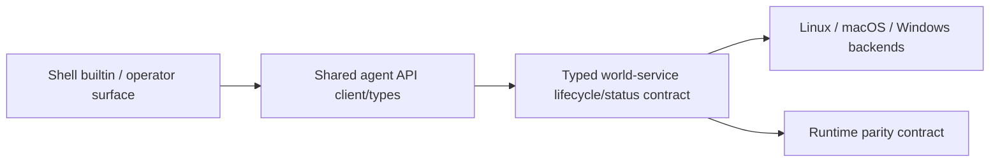
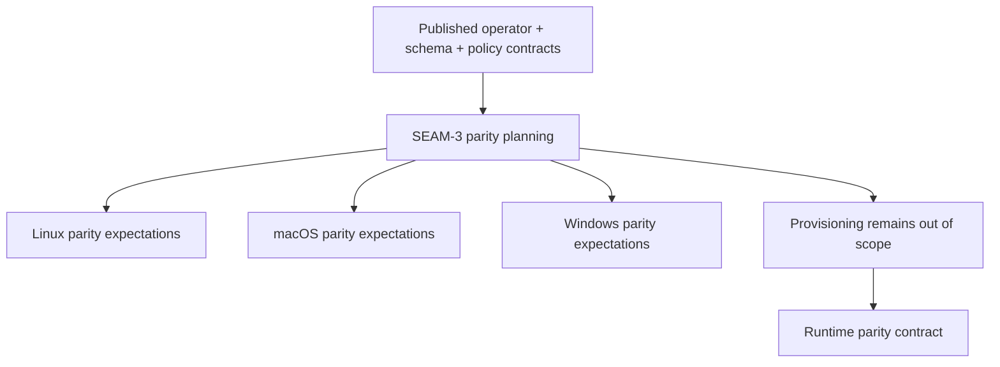

# Review Bundle - SEAM-3 Typed runtime and platform parity

This artifact feeds `gates.pre_exec.review`.
`../../review_surfaces.md` is pack orientation only.

## Falsification questions

- Can the CLI or docs still define lifecycle/status behavior through raw exec probing instead of one typed world-service contract?
- Can Linux, macOS, and Windows surface materially different operator-visible lifecycle/status semantics without an explicit allowed-divergence rule?
- Can provisioning or gateway-local runtime internals leak into the typed lifecycle/status contract this seam is supposed to own?

## R1 - Typed lifecycle/status ownership

## R2 - Platform parity and deferred provisioning

## Likely mismatch hotspots

- Shell-side exec probing could reappear if the typed world-service lifecycle/status contract is not made explicit first.
- Shared client/server alignment can drift if `crates/transport-api-types` and `crates/transport-api-client` move ahead of the owned runtime/parity contract baseline.
- Platform parity language can accidentally absorb provisioning or backend-private layout decisions unless the allowed-divergence list stays explicit.

## Pre-exec findings

- `../../governance/seam-1-closeout.md` publishes the operator boundary consumed by this seam.
- `../../governance/seam-2-closeout.md` publishes the status-schema and policy threads this seam depends on.
- The owned runtime/parity contract baseline is not yet concrete enough for execution because both `docs/project_management/packs/draft/substrate-gateway-boundary-and-runtime-ownership/platform-parity-spec.md` and `docs/contracts/substrate-gateway-runtime-parity.md` are still missing.

## Pre-exec gate disposition

- **Review gate**: passed
- **Contract gate**: failed
- **Revalidation gate**: passed
- **Opened remediations**:
  - `REM-001`

## Planned seam-exit gate focus

- What must be true before downstream promotion is legal:
  - the typed lifecycle/status ownership boundary is explicit
  - shell and shared clients consume one runtime contract
  - Linux/macOS/Windows guarantees and any allowed divergence list are concrete
  - provisioning remains explicitly out of scope
- Which outbound contracts/threads matter most:
  - `C-04`
  - `THR-04`
- Which review-surface deltas would force downstream revalidation:
  - typed lifecycle/status contract shape changes
  - shell/client consumption path changes
  - allowed divergence or evidence requirement changes
  - provisioning scope changes
