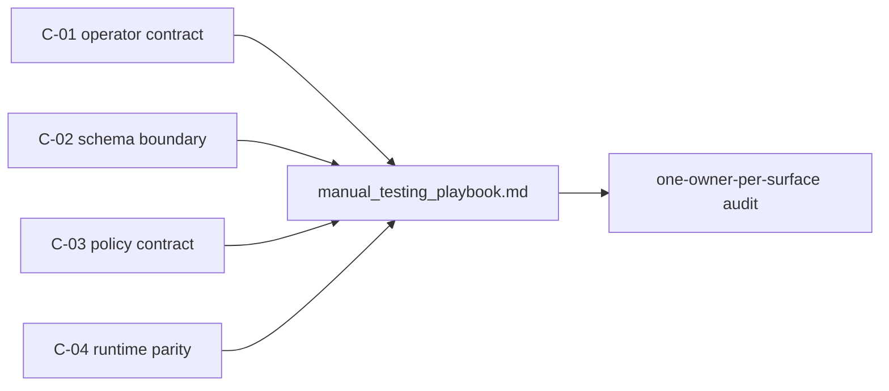
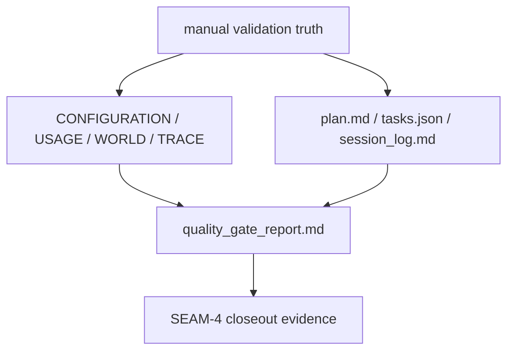

# Review Bundle - SEAM-4 Validation and cross-doc lock-in

This artifact feeds `gates.pre_exec.review`.
`../../review_surfaces.md` is pack orientation only.

## Falsification questions

- Can the manual playbook still describe command, status, policy, or runtime ownership in a way that contradicts the landed upstream contracts?
- Can docs or quality-gate artifacts restate stale `status --json`, `client_wiring.*`, fail-closed, or platform-parity wording even though the underlying contracts are already published?
- Can checkpoint or task wiring drift from the accepted seam/slice ordering and still appear to validate the feature correctly?

## R1 - One-owner-per-surface validation path

## R2 - Docs and planning lock-in

## Likely mismatch hotspots

- `manual_testing_playbook.md` can lag the landed operator, schema, policy, and runtime/parity contracts even when code is correct.
- `docs/CONFIGURATION.md`, `docs/USAGE.md`, `docs/WORLD.md`, and `docs/TRACE.md` can preserve stale ownership wording or stale archived links unless the lock-in scope stays explicit.
- `plan.md`, `tasks.json`, `session_log.md`, and `quality_gate_report.md` can drift from the accepted seam ordering and still give a false impression of full conformance coverage.

## Pre-exec findings

- `../../governance/seam-1-closeout.md`, `../../governance/seam-2-closeout.md`, and `../../governance/seam-3-closeout.md` all exist, landed, and publish the upstream truth this seam consumes.
- `THR-01`, `THR-02`, `THR-03`, and `THR-04` are all available to this seam, and `THR-02` through `THR-04` are now revalidated against the active conformance touch set.
- No blocking remediations currently target `SEAM-4` or any of its inbound thread handoffs.
- This seam does not own a new contract surface, so the contract gate reduces to consuming the landed upstream contracts without redefining them locally.

## Pre-exec gate disposition

- **Review gate**: passed
- **Contract gate**: passed
- **Revalidation gate**: passed
- **Opened remediations**: none

## Planned seam-exit gate focus

- What must be true before pack closeout is legal:
  - the manual playbook cites one owner per ADR-0040 surface
  - `docs/CONFIGURATION.md`, `docs/USAGE.md`, `docs/WORLD.md`, and `docs/TRACE.md` reflect the same landed truth
  - `plan.md`, `tasks.json`, `session_log.md`, and `quality_gate_report.md` align with the accepted seam and slice ordering
  - stale archived references are normalized or explicitly carried as follow-up evidence
- Which inbound threads matter most:
  - `THR-01`
  - `THR-02`
  - `THR-03`
  - `THR-04`
- Which review-surface deltas would force revalidation during execution:
  - command/ownership wording changes
  - `status --json` or `client_wiring.*` meaning changes
  - fail-closed or non-trust policy wording changes
  - runtime parity or allowed-divergence wording changes
