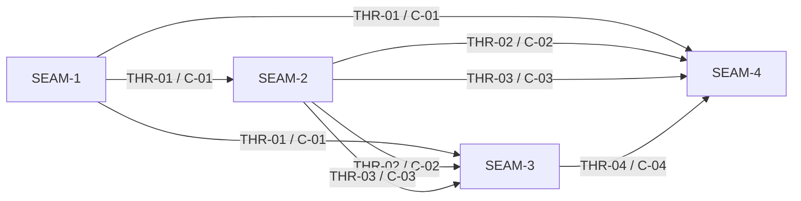

# Threading - substrate-gateway-boundary-and-runtime-ownership

## Execution horizon summary

- **Active seam**: `SEAM-1`
  - This is inferred from the accepted planning spine: command boundary and ownership language must be fixed before schema, policy, runtime, or docs-validation seams can safely reuse it.
- **Next seam**: `SEAM-2`
  - This seam is the immediate downstream consumer because it turns the locked operator boundary into the authoritative machine-readable status and policy-evaluation surfaces.
- **Future seams**: `SEAM-3`, `SEAM-4`
  - Typed runtime/parity and validation lock-in remain future seams because they should consume published upstream contracts instead of carrying speculative detail now.

Horizon policy for this extracted pack:

- only the active seam gets authoritative downstream deep planning by default
- the next seam may later receive seam-local review and only provisional deeper planning
- the future seams remain seam briefs only until upstream closeouts and published threads exist

## Contract registry

- **Contract ID**: `C-01`
  - **Type**: `API`
  - **Owner seam**: `SEAM-1`
  - **Direct consumers**: `SEAM-2`, `SEAM-3`, `SEAM-4`
  - **Derived consumers**: operators, shell builtins, docs, and downstream validation artifacts
  - **Thread IDs**: `THR-01`
  - **Definition**: the Substrate-owned operator boundary for `substrate world gateway sync`, `status`, and `restart`, including absent-state behavior, stable wiring entrypoint rules, stable non-secret env outputs, exit-code boundaries, and the durable ownership split against `substrate-gateway`.
  - **Canonical contract ref**: `docs/contracts/substrate-gateway-operator-contract.md`
  - **Versioning / compat**: command spelling, exit-code mapping, stable env names, and the rule that `status --json` is the machine-readable wiring authority must remain stable; additive operator prose must not redefine these semantics.

- **Contract ID**: `C-02`
  - **Type**: `schema`
  - **Owner seam**: `SEAM-2`
  - **Direct consumers**: `SEAM-3`, `SEAM-4`
  - **Derived consumers**: operator docs, tests, and any world-internal clients that consume the stable wiring surface
  - **Thread IDs**: `THR-02`
  - **Definition**: the structured output contract for `substrate world gateway status --json`, including the top-level object shape, `client_wiring.*` field family, non-secret posture, conditional presence rules, and the hard boundary against ADR-0042 additive metadata outside that family.
  - **Canonical contract ref**: `docs/contracts/substrate-gateway-status-schema.md`
  - **Versioning / compat**: field names, omission rules, and `client_wiring.*` semantics must remain compatible; additive fields require downstream revalidation when they touch operator-facing meaning.

- **Contract ID**: `C-03`
  - **Type**: `permission`
  - **Owner seam**: `SEAM-2`
  - **Direct consumers**: `SEAM-3`, `SEAM-4`
  - **Derived consumers**: policy explanations, platform parity docs, and manual validation artifacts
  - **Thread IDs**: `THR-03`
  - **Definition**: the gateway-integration decision flow over existing ADR-0027 inputs, including fail-closed in-world placement, host secret sourcing and host-to-world secret delivery boundaries, distinction between invalid integration state and dependency unavailability, and the ban on trusting gateway-local config/admin/persistence as policy inputs.
  - **Canonical contract ref**: `docs/contracts/substrate-gateway-policy-evaluation.md`
  - **Versioning / compat**: reused key paths stay externally owned, but the decision taxonomy and no-host-fallback rule must remain stable; changes require runtime and docs revalidation.

- **Contract ID**: `C-04`
  - **Type**: `API`
  - **Owner seam**: `SEAM-3`
  - **Direct consumers**: `SEAM-4`
  - **Derived consumers**: shell builtins, shared agent API clients, parity docs, and quality-gate evidence
  - **Thread IDs**: `THR-04`
  - **Definition**: the typed world-agent lifecycle/status contract and the Linux/macOS/Windows parity guarantees that let CLI behavior stay stable without raw exec probing or platform-specific operator contracts.
  - **Canonical contract ref**: `docs/contracts/substrate-gateway-runtime-parity.md`
  - **Versioning / compat**: endpoint ownership, lifecycle/status semantics, allowed divergence, and required validation evidence must stay synchronized across host and backend consumers.

## Thread registry

- **Thread ID**: `THR-01`
  - **Producer seam**: `SEAM-1`
  - **Consumer seam(s)**: `SEAM-2`, `SEAM-3`, `SEAM-4`
  - **Carried contract IDs**: `C-01`
  - **Purpose**: publish one operator boundary so every downstream seam inherits the same command family, ownership split, stable env names, and exit taxonomy.
  - **State**: `defined`
  - **Revalidation trigger**: command spelling, absent-state wording, stable env names, exit-code boundaries, or the Substrate versus `substrate-gateway` ownership split changes.
  - **Satisfied by**: ADR-0040 user contract language, `pre-planning/spec_manifest.md`, and `pre-planning/minimal_spec_draft.md` already define the intended boundary strongly enough for seam-local planning.
  - **Notes**: this is the first critical-path handoff and the main protection against archived ADR-0023 command drift.

- **Thread ID**: `THR-02`
  - **Producer seam**: `SEAM-2`
  - **Consumer seam(s)**: `SEAM-3`, `SEAM-4`
  - **Carried contract IDs**: `C-02`
  - **Purpose**: keep machine-readable status, wiring discovery, and ADR-0042 boundary semantics single-source before runtime and docs consume them.
  - **State**: `defined`
  - **Revalidation trigger**: top-level JSON shape, `client_wiring.*` field family, omission rules, or the boundary against ADR-0042 additive metadata changes.
  - **Satisfied by**: `pre-planning/spec_manifest.md`, `pre-planning/impact_map.md`, and the accepted `SGBRO-PWS-schema_inventory` lane in `pre-planning/workstream_triage.md`.
  - **Notes**: this thread is where `status --json` becomes concrete enough for runtime and docs planning without yet fixing implementation-specific transport details.

- **Thread ID**: `THR-03`
  - **Producer seam**: `SEAM-2`
  - **Consumer seam(s)**: `SEAM-3`, `SEAM-4`
  - **Carried contract IDs**: `C-03`
  - **Purpose**: keep fail-closed placement, secret delivery, and gateway-local non-trust rules single-source across runtime and validation seams.
  - **State**: `defined`
  - **Revalidation trigger**: reused ADR-0027 keys, no-host-fallback posture, exit boundary taxonomy, or trust-boundary rules change.
  - **Satisfied by**: `pre-planning/spec_manifest.md`, `pre-planning/minimal_spec_draft.md`, and the policy/isolation section of `pre-planning/impact_map.md`.
  - **Notes**: this thread keeps policy evaluation from drifting into a second control plane.

- **Thread ID**: `THR-04`
  - **Producer seam**: `SEAM-3`
  - **Consumer seam(s)**: `SEAM-4`
  - **Carried contract IDs**: `C-04`
  - **Purpose**: publish the typed lifecycle/status transport and parity evidence contract that cross-doc validation and quality-gate work will lock in.
  - **State**: `defined`
  - **Revalidation trigger**: typed world-agent endpoint shape, shell/client integration path, allowed divergence list, or Linux/macOS/Windows evidence requirements change.
  - **Satisfied by**: the selected Option A in `pre-planning/impact_map.md`, the accepted `SGBRO-PWS-world_agent_profile` lane in `pre-planning/workstream_triage.md`, and the parity requirements in `pre-planning/ci_checkpoint_plan.md`.
  - **Notes**: this thread deliberately excludes provisioning changes, which stay out of scope for this pack.

## Dependency graph

## Critical path

1. `SEAM-1` first:
   - the operator boundary must be unambiguous before downstream schema, policy, runtime, or docs work can safely consume it
   - this seam is the main guardrail against archived command spellings and ownership drift
2. `SEAM-2` second:
   - once the operator boundary is fixed, the status schema and policy-evaluation surface can become the next authoritative contract layer
   - this seam is the main guardrail against schema drift and fail-closed drift
3. `SEAM-3` third:
   - runtime transport and platform parity should consume published status/policy truth rather than invent it
   - this seam is the main guardrail against shell-probe and platform-private behavior becoming contract
4. `SEAM-4` fourth:
   - cross-doc validation and quality-gate evidence only make sense after the upstream contracts and runtime/parity rules are concrete enough to verify

## Workstreams

- **Operator boundary lane**
  - Primary seam: `SEAM-1`
  - Focus: command family, absent-state behavior, stable env names, exit taxonomy, ownership split
- **Schema and policy inventory lane**
  - Primary seam: `SEAM-2`
  - Focus: `status --json`, `client_wiring.*`, fail-closed policy flow, secret-delivery trust boundary
- **Typed runtime and parity lane**
  - Primary seam: `SEAM-3`
  - Focus: typed world-agent lifecycle/status transport, shared client wiring, Linux/macOS/Windows guarantees
- **Conformance and checkpoint lane**
  - Primary seam: `SEAM-4`
  - Focus: manual validation, docs alignment, plan/task wiring, checkpoint evidence, pack quality gate

Workstream note:

- These are grouping labels only. Remediation ownership remains seam-only.
