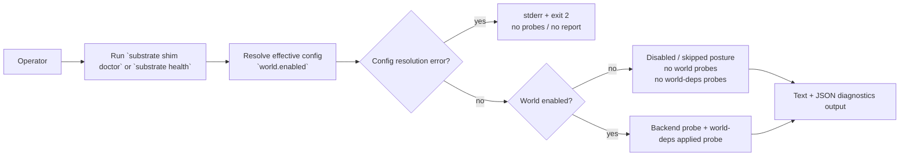
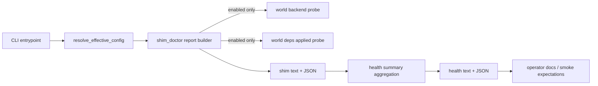
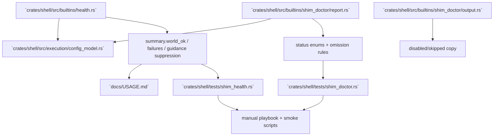

# Review Surfaces - World Disabled Diagnostics

These diagrams orient the pack. They show the actual product/work shape that is expected to land.
They do not, by themselves, satisfy seam-local pre-exec review.
Active and next seams still require seam-local `review.md` artifacts later before they can become `exec-ready`.

## R1 - High-level workflow

## R2 - CLI / service / data flow

## R3 - Touch surface map

