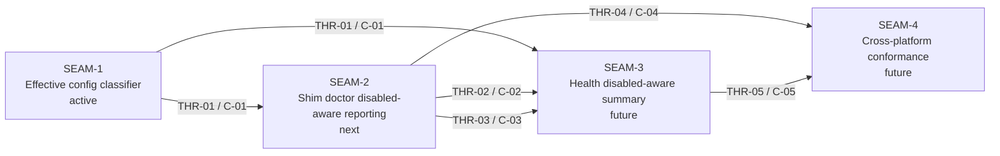

# Seam Map - World Disabled Diagnostics

This extraction lifts the deep-researched source pack into seam briefs and authoritative threading.
It intentionally does **not** recreate source slice triads (`WDD0`, `WDD1`, `WDD2`) as authoritative execution units.
Instead, it normalizes them into seams:

- source `WDD0` maps primarily to `SEAM-1`
- source `WDD1` maps primarily to `SEAM-2`
- source `WDD2` maps primarily to `SEAM-3`
- source manual-playbook / smoke / CP1 conformance work maps to `SEAM-4`

## Horizon posture

- **Active**: `SEAM-1` — the shared classifier and config-error posture that every downstream user-facing seam depends on
- **Next**: `SEAM-2` — the first publishing seam for disabled/skipped diagnostics contracts, but it should stay provisional until `THR-01` is published
- **Future**: `SEAM-3`, `SEAM-4`

## Seam dependency view

## Seam summaries

- **SEAM-1 — Effective config classifier**
  - **Type**: `integration`
  - **Purpose**: produce one canonical `effective_world_enabled` decision and fail-fast config-error posture for both diagnostics commands
  - **Why it is a seam**: it has a crisp boundary, a shared contract (`C-01`), visible touch surfaces, and a verification path that can be isolated before any user-facing output changes
  - **Primary touch surface**: `crates/shell/src/execution/config_model.rs`, diagnostics call sites, diagnostics routing, precedence/error tests

- **SEAM-2 — Shim doctor disabled-aware reporting**
  - **Type**: `capability`
  - **Purpose**: publish the disabled/skipped shim-doctor behavior, JSON status enums, omission rules, and the no-probe boundary
  - **Why it is a seam**: it owns the first externally consumed contract publication for world/world-deps status and is the handoff point to health aggregation
  - **Primary touch surface**: `crates/shell/src/builtins/shim_doctor/report.rs`, `output.rs`, `crates/shell/tests/shim_doctor.rs`

- **SEAM-3 — Health disabled-aware summary**
  - **Type**: `capability`
  - **Purpose**: consume shim status contracts and produce the final operator-facing `substrate health` summary, copy suppression, and docs alignment
  - **Why it is a seam**: it owns a separate user-facing command and a separate summary contract even though it consumes the shim payload
  - **Primary touch surface**: `crates/shell/src/builtins/health.rs`, `crates/shell/tests/shim_health.rs`, `docs/USAGE.md`

- **SEAM-4 — Cross-platform conformance**
  - **Type**: `conformance`
  - **Purpose**: lock Linux/macOS/Windows parity and preserve the source pack's manual/smoke/CP1 evidence posture
  - **Why it is a seam**: it has a distinct verification goal, bounded artifacts, and downstream governance value without adding net-new runtime behavior
  - **Primary touch surface**: manual playbook, smoke scripts, and cross-platform checkpoint evidence

## Why no standalone contract-definition seam was extracted

The source pack already contains unusually mature contract basis artifacts (`contract.md`, `decision_register.md`, and the JSON schema spec).
In this extraction, those basis artifacts are carried forward into the contract registry and thread definitions instead of becoming a separate seam.
That keeps the seam map aligned to implementation and closeout boundaries rather than duplicating already-frozen planning surfaces.
