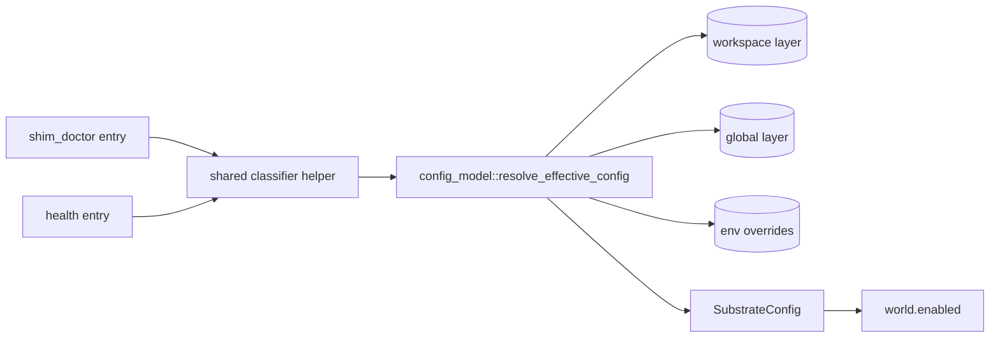

# Review Bundle - SEAM-1 Effective config classifier

This artifact feeds `gates.pre_exec.review`.
`../../review_surfaces.md` is pack orientation only.

## Falsification questions

- Can a config-resolution error still fall through into any diagnostic probing or report output (i.e., not exiting `2` immediately)?
- Can `substrate shim doctor` and `substrate health` disagree on effective `world.enabled` for the same `cwd` + CLI overrides (due to duplicated precedence or divergent routing)?
- Can enabled-workspace override-ignore semantics be bypassed by mapping `--world/--no-world` through an env override rather than `CliConfigOverrides.world_enabled`?

## R1 - Diagnostics classification flow (seam-local)

```mermaid
flowchart LR
  U[Operator] --> CMD[Run `substrate shim doctor` or `substrate health`]
  CMD --> CLI[Parse `--world` / `--no-world`]
  CLI --> DEC[Resolve effective config + classify `world.enabled`]
  DEC --> ERR{Resolver error?}
  ERR -->|yes| FAIL[stderr + exit 2\nno probes / no report]
  ERR -->|no| EN{World enabled?}
  EN -->|yes| CONT[Continue into enabled-mode diagnostics\n(out of scope here)]
  EN -->|no| CONT2[Continue into disabled-mode diagnostics\n(out of scope here)]
```

## R2 - Code / module data flow (seam-local)



## Likely mismatch hotspots

- Multiple codepaths setting `CliConfigOverrides.world_enabled` (or bypassing it) leading to `--world/--no-world` precedence drift.
- Divergent error handling between shim doctor and health (one exits `2`, the other wraps into a report).
- Any “probe first” control-flow that can run before config resolution finishes (especially in diagnostics routing).

## Pre-exec findings

- No new remediation opened in this decomposition. The slices below intentionally force a single helper + shared tests to make divergence and “probe-before-config” regressions hard.

## Pre-exec gate disposition

- **Review gate**: pending
- **Contract gate concerns**: `C-01` must be concrete (rules + verification checklist) and must not depend on post-exec publication as a pre-exec requirement.
- **Revalidation prerequisites**: confirm the external precedence contract (`docs/reference/env/contract.md`) did not drift since the source pack, and confirm no adjacent queued packs rewired diagnostics routing.
- **Opened remediations**: none

## Planned seam-exit gate focus

- **What must be true before downstream promotion is legal**:
  - `THR-01` is published: both diagnostics entrypoints call the same classifier and share the same exit-2-on-config-error posture.
- **Which outbound contracts/threads matter most**: `C-01`, `THR-01`
- **Which review-surface deltas would force downstream revalidation**:
  - Effective-config precedence changes
  - Workspace override-ignore semantics changes
  - Exit-code taxonomy / config-error routing changes
