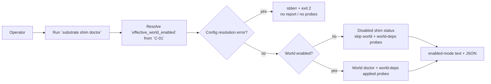
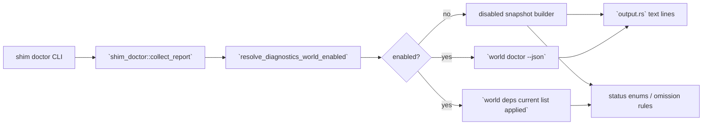

# Review Bundle - SEAM-2 Shim doctor disabled-aware reporting

This artifact feeds `gates.pre_exec.review`.
`../../review_surfaces.md` remains pack orientation only.

## Falsification questions

- Can disabled mode still spawn `substrate world doctor --json` or compute world-deps applied state even after `effective_world_enabled=false`?
- Can disabled JSON/text still leak legacy error/details/report fields or misclassify disabled state as `healthy` / `needs_attention` / `unknown`?
- Can the disabled-mode branch hide enabled-world failures or exact-line regressions because rendering still keys off legacy booleans instead of the new status contracts?

## R1 - Shim-doctor disabled-aware workflow

## R2 - Shim-doctor module flow

## Likely mismatch hotspots

- A helper call exists but the disabled branch still falls through to probe helpers before status rendering finishes.
- Disabled JSON adds new enums but leaves behind `world.error`, `world.details`, or `world_deps.report` in the same payload.
- Exact disabled-mode text lines drift from the contract because output still keys off legacy `ok` or `error` fields.

## Pre-exec findings

- Revalidated the basis against the current repo:
  - `governance/seam-1-closeout.md` now records `THR-01` as published with `promotion_readiness: ready`.
  - `crates/shell/src/execution/config_model.rs` defines `resolve_diagnostics_world_enabled(...) -> Result<bool>` as the published upstream helper.
  - `crates/shell/src/builtins/shim_doctor/report.rs` is the shared report-building surface that now resolves config errors before report output, making it the correct ownership locus for disabled-mode gating.
- No remediation opened during promotion. The seam-local plan keeps the owned contracts concrete in `S1` and the no-probe/reporting implementation in `S2`.

## Pre-exec gate disposition

- **Review gate**: passed
- **Contract gate**: passed (`C-02`, `C-03`, and `C-04` are concrete enough in the slice plan to implement without waiting on post-exec publication)
- **Revalidation**: passed (`THR-01` is published and this seam has refreshed against the closeout-backed helper path)
- **Opened remediations**: none

## Planned seam-exit gate focus

- **What must be true before downstream promotion is legal**:
  - `THR-02`, `THR-03`, and `THR-04` are published from landed disabled-mode status, omission, and exact-line behavior.
- **Which outbound contracts/threads matter most**: `C-02`, `C-03`, `C-04`, `THR-02`, `THR-03`, `THR-04`
- **Which review-surface deltas would force downstream revalidation**:
  - any reintroduced disabled-mode probe path
  - any field-path or omission drift in shim JSON
  - exact disabled-mode copy changes
