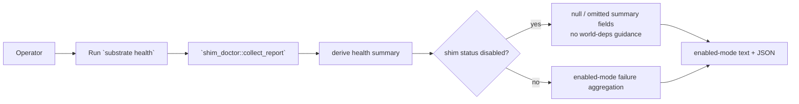
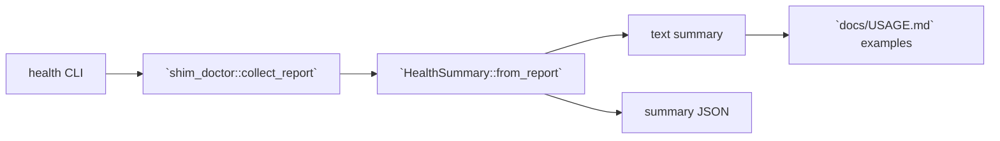

# Review Bundle - SEAM-3 Health disabled-aware summary

This artifact feeds `gates.pre_exec.review`.
`../../review_surfaces.md` remains pack orientation only.

## Falsification questions

- Can `substrate health` still classify disabled shim status as an error because summary derivation keys off legacy `world.ok` or `world_deps_error` surfaces instead of the published status enums?
- Can disabled health text still print enabled-world remediation guidance or miss the exact disabled/skipped contract lines even after `SEAM-2` published them?
- Can docs/examples drift from the landed disabled summary/null/omission posture and mislead operators or downstream packs?

## R1 - Health disabled-aware workflow

## R2 - Health module flow

## Likely mismatch hotspots

- Summary aggregation still treats `world.ok = false` as a failure even when `.shim.world.status = "disabled"`.
- Disabled health text hides or leaks enabled-world remediation guidance because it still keys off missing/blocked deps instead of status enums first.
- Docs/examples restate the older error-driven posture instead of the published summary-null/omission contract.

## Pre-exec findings

- Revalidated the basis against the current repo:
  - `governance/seam-2-closeout.md` records `THR-02`, `THR-03`, and `THR-04` as published with exact disabled copy, status enums, and no-probe evidence.
  - `crates/shell/src/builtins/health.rs` is the correct ownership locus for disabled-aware summary derivation and guidance suppression because it consumes the embedded shim payload and renders the operator-facing summary.
  - `crates/shell/tests/shim_health.rs` and `docs/USAGE.md` are the concrete verification and docs-alignment surfaces for this seam.
- No remediation opened during promotion. The seam-local plan keeps the owned contract concrete in `S1` and the runtime/docs work in `S2`.

## Pre-exec gate disposition

- **Review gate**: passed
- **Contract gate**: passed (`C-05` rules and verification are concrete enough to implement without waiting on post-exec publication)
- **Revalidation**: passed (`THR-01`, `THR-02`, and `THR-03` are published and this seam has refreshed against the closeout-backed handoff)
- **Opened remediations**: none

## Planned seam-exit gate focus

- **What must be true before downstream promotion is legal**:
  - `THR-05` is published from landed health summary behavior, disabled copy, and docs alignment.
- **Which outbound contracts/threads matter most**: `C-05`, `THR-05`
- **Which review-surface deltas would force downstream revalidation**:
  - any regression back to legacy error-string aggregation in `health.rs`
  - any disabled-mode guidance suppression drift in `health.rs`
  - any docs/example drift in `docs/USAGE.md`
