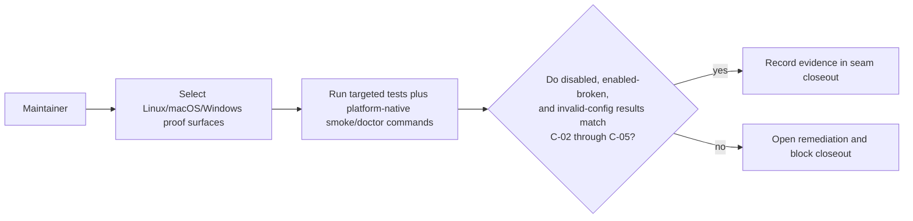
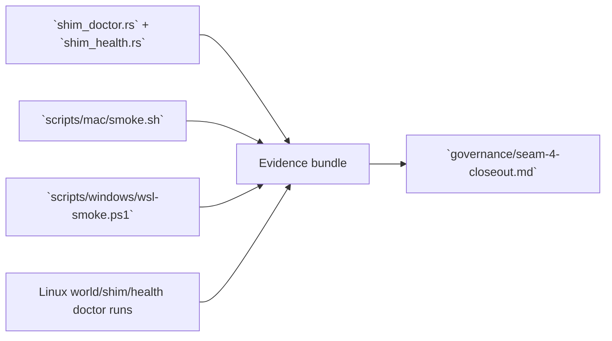

# Review Bundle - SEAM-4 Cross-platform conformance

This artifact feeds `gates.pre_exec.review`.
`../../review_surfaces.md` remains pack orientation only.

## Falsification questions

- Can Linux-only regression tests stay green while macOS or Windows still diverge in socket, pipe, or path behavior for disabled diagnostics flows?
- Can conformance evidence miss a real regression because it checks generic success/failure instead of the exact `C-04` / `C-05` disabled copy and omission contracts?
- Can shared-file churn in `health.rs`, `shim_doctor/report.rs`, `shim_doctor/output.rs`, or `docs/USAGE.md` invalidate parity evidence before closeout without reopening stale triggers?

## R1 - Cross-platform conformance workflow

## R2 - Evidence flow

## Likely mismatch hotspots

- macOS or Windows smoke flows can succeed generically while still drifting on the exact disabled text or invalid-config exit posture.
- shared diagnostics files can change underneath the conformance seam after `SEAM-3` closeout and silently invalidate parity assumptions.
- platform scripts can drift from the repo's actual doctor or health workflows and stop proving the contract that downstream packs depend on.

## Pre-exec findings

- Revalidated the basis against the current repo:
  - `../../governance/seam-2-closeout.md` publishes the disabled shim status, omission, and exact-copy contracts required by `THR-02`, `THR-03`, and `THR-04`.
  - `../../governance/seam-3-closeout.md` publishes the disabled health summary, guidance suppression, and docs-alignment contract required by `THR-05`.
  - `crates/shell/tests/shim_doctor.rs`, `crates/shell/tests/shim_health.rs`, `scripts/mac/smoke.sh`, and `scripts/windows/wsl-smoke.ps1` are the concrete repo-native proof surfaces that can carry this seam without inventing new runtime behavior.
- No remediation opened during promotion. The seam-local plan keeps the first slice focused on the proof matrix and the second slice focused on the executable smoke/checkpoint runs plus shared-file revalidation.

## Pre-exec gate disposition

- **Review gate**: passed
- **Contract gate**: passed (all consumed contracts are published upstream and the seam-local slices pin concrete proof surfaces without inventing a new owned runtime contract)
- **Revalidation**: passed (`THR-02`, `THR-03`, `THR-04`, and `THR-05` are published and this seam has refreshed against the closeout-backed handoff)
- **Opened remediations**: none

## Planned seam-exit gate focus

- **What must be true before downstream closeout is legal**:
  - Linux, macOS, and Windows evidence confirms the landed disabled-status, omission, and exact-copy contracts still hold.
- **Which outbound contracts/threads matter most**: `THR-04`, `THR-05`
- **Which review-surface deltas would force downstream revalidation**:
  - any platform smoke drift that stops asserting exact disabled text or invalid-config exit posture
  - any shared-file drift in `health.rs`, `shim_doctor/report.rs`, `shim_doctor/output.rs`, or `docs/USAGE.md`
  - any doctor-workflow change that alters which commands or fixtures prove the cross-platform contract
