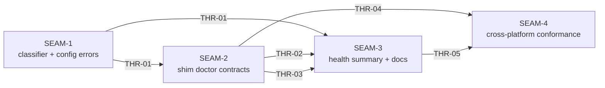

# Threading - World Disabled Diagnostics

## Execution horizon summary

- **Active seam**: `SEAM-3`
  - active consumer of the landed shim status contracts; it now owns the disabled-aware health summary and docs alignment work
- **Next seam**: `SEAM-4`
  - queued conformance seam that now waits primarily on `THR-05` while consuming the published `THR-04` handoff from `SEAM-2`
- **Future seams**: `SEAM-1`, `SEAM-2`
  - `SEAM-1` has left the forward window with a passed seam-exit gate
  - `SEAM-2` has left the forward window after publishing the shim contracts through a passed seam-exit gate

## Source basis carried forward from the deep-researched pack

- **Contract basis**:
  - `contract.md`
  - `decision_register.md`
  - `world-disabled-diagnostics-json-schema-spec.md`
- **Execution basis**:
  - `slices/WDD0/WDD0-spec.md`
  - `slices/WDD1/WDD1-spec.md`
  - `slices/WDD2/WDD2-spec.md`
  - `tasks.json`
- **Validation basis**:
  - `manual_testing_playbook.md`
  - `smoke/linux-smoke.sh`
  - `smoke/macos-smoke.sh`
  - `smoke/windows-smoke.ps1`
- **Cross-queue / risk basis**:
  - `pre-planning/impact_map.md`
  - `pre-planning/workstream_triage.md`
  - `pre-planning/ci_checkpoint_plan.md`

## Contract registry

- **Contract ID**: `C-01`
  - **Type**: config
  - **Owner seam**: `SEAM-1`
  - **Direct consumers**: `SEAM-2`, `SEAM-3`
  - **Derived consumers**: `SEAM-4`; future attribution, json-envelope, and provisioning-related diagnostics work
  - **Thread IDs**: `THR-01`
  - **Definition**: Shared diagnostics-side resolution of effective `world.enabled` via the existing effective-config resolver, including CLI override mapping and fail-fast exit-2 posture on config-resolution failure.
  - **Versioning / compat**: no new config keys or environment variables; consumers must not infer enabled/disabled locally when the resolver fails.

- **Contract ID**: `C-02`
  - **Type**: schema
  - **Owner seam**: `SEAM-2`
  - **Direct consumers**: `SEAM-3`, `SEAM-4`
  - **Derived consumers**: JSON automation, `json-mode`, and future attribution work
  - **Thread IDs**: `THR-02`
  - **Definition**: Canonical world backend status enum at `.world.status` / `.shim.world.status` with values `healthy | needs_attention | disabled | unknown`.
    - Disabled mode publishes `.world.status = "disabled"` and short-circuits all world backend probes before any `substrate world doctor --json` subprocess or equivalent backend call.
    - Enabled healthy mode publishes `.world.status = "healthy"`.
    - Enabled failure mode publishes `.world.status = "needs_attention"` and preserves enabled-mode diagnostics.
    - `unknown` is reserved for genuinely unavailable classification surfaces, not for disabled-by-choice mode.
  - **Versioning / compat**: additive-only field; no renames/removals; downstream consumers must ignore unknown enum values.

- **Contract ID**: `C-03`
  - **Type**: schema
  - **Owner seam**: `SEAM-2`
  - **Direct consumers**: `SEAM-3`, `SEAM-4`
  - **Derived consumers**: provisioning-related diagnostics work and JSON automation
  - **Thread IDs**: `THR-03`
  - **Definition**: Canonical world-deps status enum at `.world_deps.status` / `.shim.world_deps.status` with values `ok | error | skipped_disabled | unknown`, plus disabled-mode omission of probe-derived legacy fields.
    - Disabled mode publishes `.world_deps.status = "skipped_disabled"` and must not compute applied world-deps state.
    - Disabled mode omits probe-derived fields that would imply a real probe occurred, specifically disabled-path `world.error`, `world.details`, `world_deps.error`, and `world_deps.report`.
    - Enabled mode may publish `.world_deps.status = "ok"` or `.world_deps.status = "error"` according to the real applied-state result.
  - **Versioning / compat**: additive-only field; disabled-mode omission is canonical and must not be backfilled by downstream consumers.

- **Contract ID**: `C-04`
  - **Type**: UX affordance
  - **Owner seam**: `SEAM-2`
  - **Direct consumers**: `SEAM-4`
  - **Derived consumers**: docs/examples and future copy-attribution work
  - **Thread IDs**: `THR-04`
  - **Definition**: Exact disabled-mode `substrate shim doctor` lines, no `Error:` lines for disabled/skipped states, and a no-probe operator posture.
    - The disabled-mode text contract is:
      - `World backend:`
      - `  Status: disabled`
      - `  Next: run \`substrate world enable\` to provision`
      - `World deps:`
      - `  Status: skipped (world disabled)`
    - Disabled or skipped states must not print `Error:` lines.
    - Enabled-mode failure text remains fail-visible and must not collapse into disabled wording.
  - **Versioning / compat**: exact-line contract is intentionally small and explicit; enabled-mode copy remains flexible.

- **Contract ID**: `C-05`
  - **Type**: UX affordance
  - **Owner seam**: `SEAM-3`
  - **Direct consumers**: `SEAM-4`
  - **Derived consumers**: `docs/USAGE.md`, future provisioning packs, and human operators who read `substrate health`
  - **Thread IDs**: `THR-05`
  - **Definition**: Disabled-mode `substrate health` copy and summary contract derived from the landed `.shim.world.status` / `.shim.world_deps.status` contract: when `.shim.world.status = "disabled"`, `summary.world_ok = null`, `summary.world_error` and `summary.world_deps_error` are omitted, `world_deps_missing` and `world_deps_blocked` are empty arrays, and skipped-disabled probes do not contribute failure entries. Disabled text must print the exact contract lines from `S1` and suppress enabled-world world-deps guidance such as `substrate world deps current`; enabled-mode failure visibility and guidance remain unchanged.
  - **Versioning / compat**: additive-only summary posture; downstream consumers must treat disabled-mode omission and guidance suppression as canonical, while enabled-mode guidance and failure aggregation remain unchanged unless explicitly amended.

## Thread registry

- **Thread ID**: `THR-01`
  - **Producer seam**: `SEAM-1`
  - **Consumer seam(s)**: `SEAM-2`, `SEAM-3`
  - **Carried contract IDs**: `C-01`
  - **Purpose**: ensure both diagnostics commands branch from one authoritative effective-config decision and one config-error posture.
  - **State**: revalidated
  - **Revalidation trigger**: effective-config precedence changes, workspace override-ignore behavior changes, or diagnostics routing changes for exit-code `2`.
  - **Satisfied by**: `governance/seam-1-closeout.md` records the published resolver-backed helper plus invalid-config fail-fast evidence, and `threaded-seams/seam-2-shim-doctor-disabled-aware-reporting/review.md` revalidates shim-doctor planning against that closeout-backed handoff.
  - **Notes**: `SEAM-2` revalidated against this handoff and published the downstream shim contracts. `SEAM-3` is now the active downstream consumer alongside `THR-02` and `THR-03`.

- **Thread ID**: `THR-02`
  - **Producer seam**: `SEAM-2`
  - **Consumer seam(s)**: `SEAM-3`, `SEAM-4`
  - **Carried contract IDs**: `C-02`
  - **Purpose**: publish the canonical world backend status enum so downstream summary logic and external tooling can distinguish disabled from broken.
  - **State**: published
  - **Revalidation trigger**: JSON envelope/field-shape changes, added attribution fields, or shim payload restructuring.
  - **Satisfied by**: `governance/seam-2-closeout.md` records the landed `.world.status` publication, disabled-mode exact copy, and regression tests that prove disabled, healthy, and needs-attention behavior.
  - **Notes**: `SEAM-3` is now the active consumer of this handoff. Future JSON envelope work must preserve this field path inside any wrapper.

- **Thread ID**: `THR-03`
  - **Producer seam**: `SEAM-2`
  - **Consumer seam(s)**: `SEAM-3`, `SEAM-4`
  - **Carried contract IDs**: `C-03`
  - **Purpose**: carry world-deps status and omission semantics into health aggregation and cross-platform conformance.
  - **State**: published
  - **Revalidation trigger**: world-deps report shape changes, provisioning guidance changes, or any disabled-mode code path that reintroduces probe-backed error fields.
  - **Satisfied by**: `governance/seam-2-closeout.md` records the landed `.world_deps.status` emission, disabled omission semantics, and regression tests proving the no-probe boundary.
  - **Notes**: `SEAM-3` is now the active consumer of this handoff. This thread exists specifically to prevent health from misclassifying skipped-disabled as an error.

- **Thread ID**: `THR-04`
  - **Producer seam**: `SEAM-2`
  - **Consumer seam(s)**: `SEAM-4`
  - **Carried contract IDs**: `C-04`
  - **Purpose**: lock the exact shim-doctor disabled-mode operator experience and prove the no-probe boundary with platform-parity evidence.
  - **State**: published
  - **Revalidation trigger**: copy changes, probe path refactors, or any new world-backend call on the disabled path.
  - **Satisfied by**: `governance/seam-2-closeout.md` records the landed text renderer, exact-line assertions, and evidence that disabled-mode paths do not spawn backend or world-deps probes.
  - **Notes**: `SEAM-4` is now the queued next consumer of this handoff. This thread should not close until conformance evidence exists on Linux/macOS/Windows.

- **Thread ID**: `THR-05`
  - **Producer seam**: `SEAM-3`
  - **Consumer seam(s)**: `SEAM-4`
  - **Carried contract IDs**: `C-05`
  - **Purpose**: carry `substrate health` summary/copy semantics into smoke evidence, docs alignment, and pack closeout.
  - **State**: defined
  - **Revalidation trigger**: summary aggregation logic changes, `docs/USAGE.md` drift, or provisioning packs that modify enabled-mode guidance surfaces.
  - **Satisfied by**: landed health summary behavior, docs updates, and smoke assertions across all required platforms.
  - **Notes**: future packs touching `health.rs` must explicitly revalidate this thread.

## Dependency graph

## Critical path

1. `SEAM-1` has now published `C-01` and the `THR-01` handoff through a passed seam-exit gate.
2. `SEAM-2` has now published `C-02`, `C-03`, and `C-04` so the health command can branch on canonical status enums rather than legacy booleans/strings.
3. `SEAM-3` is the active seam and must publish `C-05` so pack-level validation and operator docs can lock the final disabled-mode summary posture.
4. `SEAM-4` is now the queued next seam and closes the loop with Linux/macOS/Windows evidence once `THR-05` lands.

## Workstreams

- **Foundation workstream**
  - `SEAM-1`
  - Closed foundation seam; its published handoff is now consumed by the active window.

- **Shim reporting workstream**
  - `SEAM-2`
  - Closed publishing seam; its published contracts now feed the active health-summary seam and the queued conformance seam.

- **Health + docs workstream**
  - `SEAM-3`
  - Active execution seam; it now consumes the published shim status contracts instead of planning against provisional assumptions.

- **Conformance workstream**
  - `SEAM-4`
  - Queued next seam; it now consumes landed reality from `SEAM-2` and waits on `SEAM-3` to publish the final health-summary contract.
