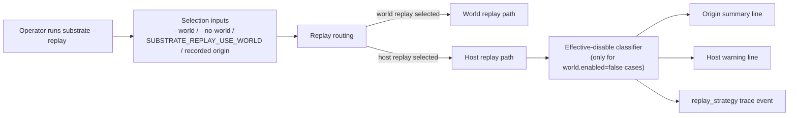
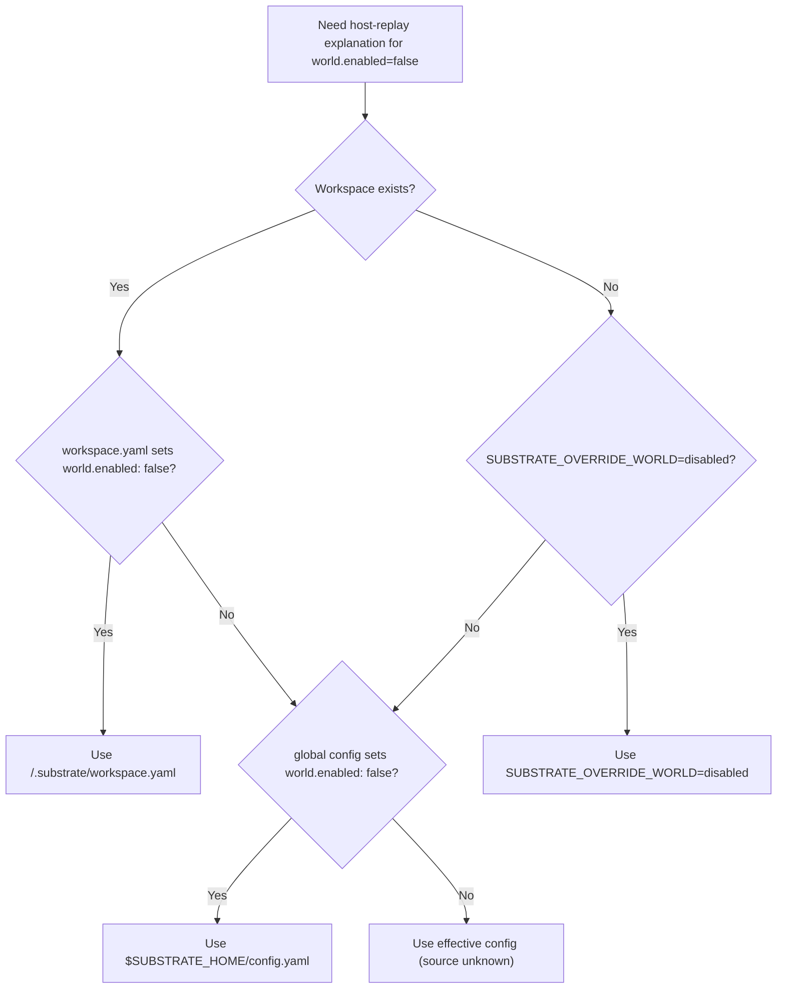
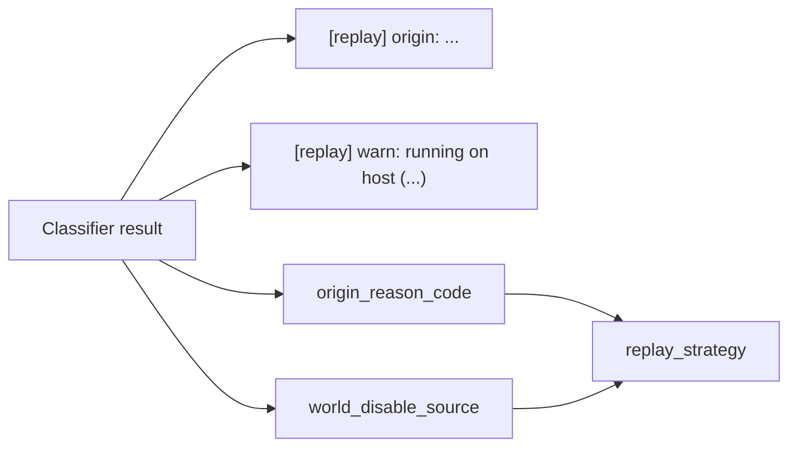
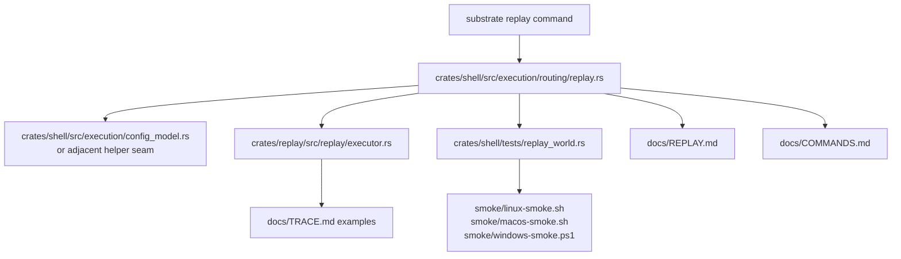

# Review Surfaces - world-disabled-reason-attribution

These diagrams orient the pack. They show the actual replay behavior, provenance resolution path, and telemetry shape that are expected to land.
They do not, by themselves, satisfy seam-local pre-exec review.
`SEAM-1` and `SEAM-2` still require seam-local `review.md` artifacts later.

## R1 - Replay decision and explanation workflow

## R2 - Effective world-disable provenance resolution

## R3 - Runtime output and telemetry publication

## R4 - Touch-surface orientation map

