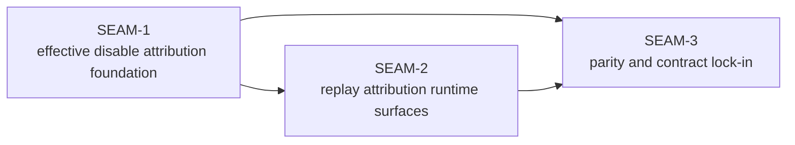

# Seam Map - world-disabled-reason-attribution

The source pack already separated the work into a natural three-step chain. This extractor keeps that same boundary logic, but lifts it one level up into governance-ready seams instead of slice specs.

| Seam | Horizon | Type | Core value | Direct blockers | Main touch surface | Source-pack anchors |
| --- | --- | --- | --- | --- | --- | --- |
| `SEAM-1` | `active` | `integration` | Establish one shared replay-safe classifier for effective `world.enabled=false` attribution, precedence, and redaction. | None inside the pack; external semantic anchor is the source pack's ADR-0037/ADR-0038 interpretation. | `crates/shell/src/execution/config_model.rs`, replay routing call site, replay tests | `contract.md`, `decision_register.md` DR-0001, `pre-planning/minimal_spec_draft.md`, `slices/WDRA0/WDRA0-spec.md` |
| `SEAM-2` | `next` | `capability` | Publish the operator-visible replay copy and machine-readable telemetry that consume the shared attribution contract. | `SEAM-1`, `THR-01`, `THR-02` | `crates/shell/src/execution/routing/replay.rs`, `crates/replay/src/replay/executor.rs`, replay tests | `contract.md`, `telemetry-spec.md`, `decision_register.md` DR-0002/DR-0003, `slices/WDRA1/WDRA1-spec.md` |
| `SEAM-3` | `future` | `conformance` | Lock in regression coverage, docs alignment, smoke evidence, and platform parity once runtime contracts are stable. | `SEAM-2`, `THR-03`, `THR-04` | `crates/shell/tests/replay_world.rs`, `docs/REPLAY.md`, `docs/TRACE.md`, `docs/COMMANDS.md`, `smoke/` | `platform-parity-spec.md`, `manual_testing_playbook.md`, `pre-planning/ci_checkpoint_plan.md`, `slices/WDRA2/WDRA2-spec.md` |

Why this split is the right seam map:

- `SEAM-1` has a single purpose: produce the winning-layer classifier and redaction-safe provenance contract that every later surface consumes.
- `SEAM-2` has a single purpose: publish replay runtime behavior in stderr and trace output without redefining the underlying semantics.
- `SEAM-3` has a single purpose: prevent drift by locking tests, docs, smoke wrappers, and parity evidence after runtime behavior exists.

Why no additional seams were extracted:

- A separate docs-only seam would be too small and would sever docs from the conformance work that verifies them.
- A separate telemetry-only seam would be too coupled to the user-visible runtime behavior in this feature; both are published by the same runtime path and verified together.
- A separate platform seam would be an anti-pattern because the required value is parity across Linux, macOS, and Windows, not a runtime-specific implementation lane.

Horizon note:

- `SEAM-1` is the only seam eligible for authoritative deep planning by default.
- `SEAM-2` may later receive seam-local review and only provisional deeper planning.
- `SEAM-3` remains a seam brief until the runtime contracts are landed and published.
