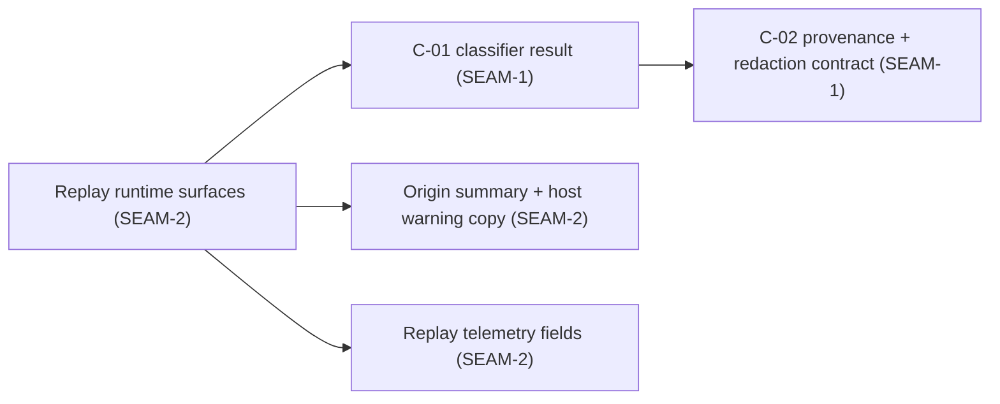
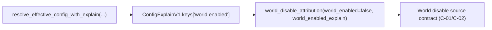

# Review Bundle - SEAM-1 Effective disable attribution foundation

This artifact feeds `gates.pre_exec.review`.
`../../review_surfaces.md` is pack orientation only.

## Falsification questions

- Can replay or later conformance accidentally re-implement precedence/redaction logic instead of consuming a single shared contract (`C-01`/`C-02`)?
- Can the attribution helper leak raw host paths (workspace/global config paths) or raw env values (override env) instead of the tokenized/allowlisted displays?
- Can effective config provenance yield multiple sources for `world.enabled` (or no sources) and still cause us to guess rather than emit the explicit `source_unknown` fallback?

## R1 - Operator-facing flow (contract consumers)

## R2 - Data flow (effective config -> attribution)

## Likely mismatch hotspots

- Existing helper naming and type names (e.g., `DoctorDisableAttribution`) may tempt downstream code to depend on doctor-specific reason strings instead of the structured source contract.
- Any future change that emits multiple provenance sources for `world.enabled` could invalidate the “single winning layer” assumption unless we continue to treat that as `source_unknown`.
- Negative coverage must assert redaction properties (no absolute paths, no raw env values) rather than only asserting expected happy-path strings.

## Pre-exec findings

- None yet (initial seam-local decomposition).

## Pre-exec gate disposition

- **Review gate**: passed
- **Contract gate concerns**:
  - Ensure `C-01`/`C-02` are framed as structured contracts (layer vocabulary + safe displays), not as copy strings.
- **Revalidation prerequisites**:
  - None (first seam; no upstream closeouts). Revalidation is about internal determinism and the explicit `source_unknown` fallback behavior.
- **Opened remediations**:
  - None.

## Planned seam-exit gate focus

- **What must be true before downstream promotion is legal**:
  - `C-01`/`C-02` are concrete and implemented with deterministic tests proving precedence + redaction invariants (including `source_unknown` fallback).
- **Which outbound contracts/threads matter most**:
  - `THR-01` / `C-01`, `THR-02` / `C-02`
- **Which review-surface deltas would force downstream revalidation**:
  - Any layer vocabulary changes, any change in tokenized display strings, or any shift in “workspace beats override env when workspace exists”.
