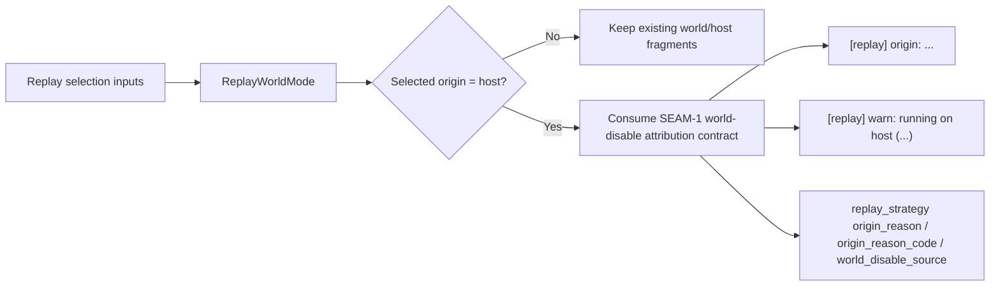
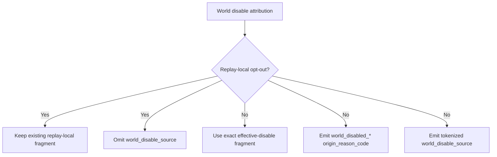

# Review Bundle - SEAM-2 Replay attribution runtime surfaces

This artifact feeds `gates.pre_exec.review`.
`../../review_surfaces.md` is pack orientation only.

## Falsification questions

- Can replay origin summaries or host warnings drift from the exact published attribution fragments by re-implementing precedence or by formatting a second wording table locally in `replay.rs`?
- Can `replay_strategy` emit `world_disable_source` for replay-local opt-out cases, leak raw env/path data, or diverge from the same winner that resolves `world.enabled`?
- Can the recorded-host case or omission rules diverge between stderr and telemetry, leaving operators and trace consumers with conflicting explanations for the same replay decision?

## R1 - Replay runtime attribution flow

## R2 - Effective-disable telemetry gating

## Likely mismatch hotspots

- `crates/shell/src/execution/routing/replay.rs` already formats replay-local reasons and warnings, so runtime adoption could accidentally duplicate effective-disable formatting instead of consuming the shared `SEAM-1` contract.
- `crates/replay/src/replay/executor.rs` owns `replay_strategy` emission, so copy and telemetry could drift unless `origin_reason`, `origin_reason_code`, and `world_disable_source` are derived from the same runtime attribution decision.
- `SEAM-1` now publishes a helper-level `default` layer, but the replay source contract and telemetry enum only define env/workspace/global/unknown effective-disable cases. If implementation reveals a reachable default-disabled replay path, that is a blocker to resolve explicitly before landing rather than a reason to invent a new runtime enum ad hoc.

## Pre-exec findings

- `../../governance/seam-1-closeout.md` now publishes `C-01`, `C-02`, and `THR-01` / `THR-02`, so the prior activation blocker is cleared.
- `C-03` and `C-04` still needed a seam-local contract baseline. That baseline is now concretized in `slice-1-contract-definition-replay-attribution-runtime-surfaces.md`, including exact copy rules, telemetry keys, and omit behavior.
- No additional pre-exec remediation is required from the current evidence. If implementation reveals a reachable runtime case outside the published copy/telemetry enum set, open a blocking `origin_phase: pre_exec` remediation before landing.

## Pre-exec gate disposition

- **Review gate**: passed
- **Contract gate**: passed (`C-03` / `C-04` are concrete, additive-only, and tied directly to the published `SEAM-1` truth)
- **Revalidation gate**: passed (`SEAM-1` closeout already publishes the handoff; later helper/result drift remains a stale-trigger watchpoint, not a current blocker)
- **Opened remediations**: none

## Planned seam-exit gate focus

- **What must be true before downstream promotion is legal**:
  - replay stderr and `replay_strategy` expose one landed contract for effective-disable attribution, including exact recorded-host punctuation and opt-out omission rules
- **Which outbound contracts/threads matter most**:
  - `C-03`, `C-04`, `THR-03`, `THR-04`
- **Which review-surface deltas would force downstream revalidation**:
  - any change in reason fragments, recorded-host punctuation, telemetry field names, enum values, tokenized displays, or emit/omit rules
