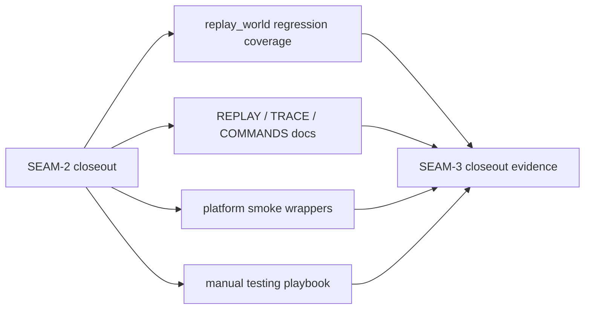

# Review Bundle - SEAM-3 Parity and contract lock-in

This artifact feeds `gates.pre_exec.review`.
`../../review_surfaces.md` is pack orientation only.

## Falsification questions

- Can replay regression coverage still miss one of the published runtime cases, leaving docs or smoke wrappers to lock in behavior that tests never proved?
- Can docs, trace examples, smoke wrappers, or the manual playbook drift from the exact `SEAM-2` closeout fragments, reason codes, or omission rules even though the runtime contract is already published?
- Can parity work leak absolute paths, raw env values, or unsupported platform-specific differences while claiming to reflect the published replay contract?

## R1 - Published runtime truth to parity surfaces

## Likely mismatch hotspots

- `crates/shell/tests/replay_world.rs` can still drift if new assertions do not pin the same exact fragments and structured telemetry values cited in `../../governance/seam-2-closeout.md`.
- `docs/REPLAY.md`, `docs/TRACE.md`, and `docs/COMMANDS.md` can preserve pre-publication examples unless they are refreshed against the landed runtime contract.
- Smoke wrappers and the manual playbook can diverge from tests unless they reference the same cases, filters, and expected values.

## Pre-exec findings

- `../../governance/seam-2-closeout.md` now publishes `C-03`, `C-04`, `THR-03`, and `THR-04`, so the prior horizon blocker is cleared.
- `THR-02` remains revalidated from `SEAM-1`, and `SEAM-3` now consumes published upstream truth rather than provisional planning intent.
- No additional pre-exec remediation is required from the current evidence.

## Pre-exec gate disposition

- **Review gate**: passed
- **Contract gate**: passed
- **Revalidation gate**: passed
- **Opened remediations**: none

## Planned seam-exit gate focus

- **What must be true before closeout is legal**:
  - tests, docs, smoke wrappers, and the manual playbook all point at one published runtime contract and one parity-ready evidence set
- **Which threads matter most**:
  - `THR-02`
  - `THR-03`
  - `THR-04`
- **Which review-surface deltas would force revalidation**:
  - fragment drift
  - telemetry schema drift
  - omission-rule drift
  - platform expectation drift
