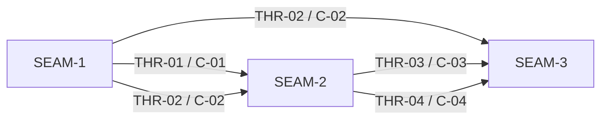

# Threading - world-disabled-reason-attribution

## Execution horizon summary

- **Active seam**: `SEAM-2`
  - `SEAM-1` closeout now publishes `C-01` / `C-02` and marks `promotion_readiness: ready`, so the replay-runtime seam can move into active planning and execution readiness.
- **Next seam**: `SEAM-3`
  - `SEAM-3` is now the immediate downstream consumer because it still depends on `SEAM-2` publishing runtime copy and telemetry truth.
- **Previous active seam**: `SEAM-1`
  - Its closeout is now the authoritative upstream basis for `THR-01` and `THR-02`.

Horizon policy for this extracted pack:

- only the active seam gets authoritative downstream deep planning by default
- the next seam may later receive seam-local review and only provisional deeper planning
- the future seam remains a seam brief only until upstream closeouts and published threads exist

## Contract registry

- **Contract ID**: `C-01`
  - **Type**: `API`
  - **Owner seam**: `SEAM-1`
  - **Direct consumers**: `SEAM-2`
  - **Derived consumers**: `SEAM-3`
  - **Thread IDs**: `THR-01`
  - **Definition**: one replay-safe classifier result that names the winning effective-disable layer for `world.enabled=false` and returns normalized metadata for downstream runtime surfaces without duplicating precedence logic.
  - **Versioning / compat**: the field set and layer vocabulary stay narrow and deterministic; additive expansion requires downstream revalidation because replay runtime and conformance lanes both consume it.

- **Contract ID**: `C-02`
  - **Type**: `state`
  - **Owner seam**: `SEAM-1`
  - **Direct consumers**: `SEAM-2`, `SEAM-3`
  - **Derived consumers**: operators, docs, and tests that rely on the same winning-layer semantics
  - **Thread IDs**: `THR-02`
  - **Definition**: the effective world-disable provenance contract: workspace-exists rule, winning-layer order, tokenized path displays, fixed env-token allowlist, `value_display=false`, and unknown-source fallback.
  - **Versioning / compat**: no silent drift is allowed; any change to precedence, tokenized displays, or fallback wording triggers downstream revalidation.

- **Contract ID**: `C-03`
  - **Type**: `UX affordance`
  - **Owner seam**: `SEAM-2`
  - **Direct consumers**: `SEAM-3`
  - **Derived consumers**: replay operators and docs examples
  - **Thread IDs**: `THR-03`
  - **Definition**: the user-visible replay copy contract covering origin-summary fragments, host-warning fragments, and the exact recorded-host shape `host (recorded; <reason>)`.
  - **Versioning / compat**: exact-string compatibility matters; reason fragments and punctuation changes must be intentional and revalidated against docs and smoke assertions.

- **Contract ID**: `C-04`
  - **Type**: `schema`
  - **Owner seam**: `SEAM-2`
  - **Direct consumers**: `SEAM-3`
  - **Derived consumers**: trace consumers and docs examples
  - **Thread IDs**: `THR-04`
  - **Definition**: additive `replay_strategy` provenance fields for effective-disable attribution, including `origin_reason_code` extension values and the optional `world_disable_source` object.
  - **Versioning / compat**: existing fields remain stable; `world_disable_source` stays omitted for replay-local opt-out cases; enum or field changes require docs/test/smoke revalidation.

## Thread registry

- **Thread ID**: `THR-01`
  - **Producer seam**: `SEAM-1`
  - **Consumer seam(s)**: `SEAM-2`
  - **Carried contract IDs**: `C-01`
  - **Purpose**: publish a replay-safe classifier contract that runtime copy and telemetry can consume without redefining precedence or redaction.
  - **State**: `revalidated`
  - **Revalidation trigger**: helper result fields, layer vocabulary, or helper placement changes.
  - **Satisfied by**: `governance/seam-1-closeout.md` now publishes the landed `C-01` handoff, and `SEAM-2` has revalidated that its runtime adoption plan will consume that published helper contract directly.
  - **Notes**: this remains the first critical-path handoff, but it is no longer a blocker for `SEAM-2` activation.

- **Thread ID**: `THR-02`
  - **Producer seam**: `SEAM-1`
  - **Consumer seam(s)**: `SEAM-2`, `SEAM-3`
  - **Carried contract IDs**: `C-02`
  - **Purpose**: keep provenance precedence and redaction semantics single-source across runtime surfaces and conformance work.
  - **State**: `revalidated`
  - **Revalidation trigger**: ADR-0037 winning-layer interpretation changes, workspace-versus-override rule changes, tokenized path-display changes, or unknown-source fallback changes.
  - **Satisfied by**: `governance/seam-1-closeout.md` publishes the landed provenance/redaction contract, and `SEAM-2` now revalidates against that closeout-backed truth rather than against provisional seam intent.
  - **Notes**: the workspace-exists rule remains load-bearing, and any later helper/result drift still forces downstream revalidation before `SEAM-2` lands.

- **Thread ID**: `THR-03`
  - **Producer seam**: `SEAM-2`
  - **Consumer seam(s)**: `SEAM-3`
  - **Carried contract IDs**: `C-03`
  - **Purpose**: publish the final replay copy contract for origin summaries and host warnings so docs/tests/smoke can lock it in.
  - **State**: `published`
  - **Revalidation trigger**: reason fragments, recorded-host punctuation, host-warning cadence, or replay line count changes.
  - **Satisfied by**: `governance/seam-2-closeout.md` now publishes the landed replay stderr contract, backed by `crates/shell/src/execution/routing/replay.rs`, `crates/shell/tests/replay_world.rs`, and commit `4c28c166`.
  - **Notes**: this thread is the main user-visible contract handoff into the conformance seam.

- **Thread ID**: `THR-04`
  - **Producer seam**: `SEAM-2`
  - **Consumer seam(s)**: `SEAM-3`
  - **Carried contract IDs**: `C-04`
  - **Purpose**: publish the final machine-readable replay provenance contract for conformance, docs, and parity validation.
  - **State**: `published`
  - **Revalidation trigger**: telemetry field names, enum values, emission gates, omission rules, or redaction keys change.
  - **Satisfied by**: `governance/seam-2-closeout.md` now publishes the landed replay telemetry contract, backed by `crates/replay/src/replay/executor.rs`, `crates/replay/tests/planner_executor.rs`, `crates/shell/tests/replay_world.rs`, and commit `05ca9bd6`.
  - **Notes**: Linux/macOS/Windows parity depends on this thread publishing the same schema and values.

## Dependency graph

## Critical path

1. `SEAM-1` first:
   - this seam has now landed and published the shared classifier plus provenance/redaction contract
   - its closeout is the authoritative upstream handoff for all later work
2. `SEAM-2` second:
   - this seam now owns the active window because it publishes the replay behavior that operators and trace consumers will actually see
   - it can proceed against the revalidated `THR-01` / `THR-02` handoff from `SEAM-1`
3. `SEAM-3` third:
   - this seam remains queued behind `SEAM-2` because parity and lock-in should validate already-published runtime truth rather than speculative intermediate behavior

## Workstreams

- **Foundation contract lane**
  - Primary seam: `SEAM-1`
  - Focus: helper extraction, provenance precedence, tokenized displays, redaction invariants, and deterministic baseline tests
- **Runtime adoption lane**
  - Primary seam: `SEAM-2`
  - Focus: replay origin-summary copy, host-warning copy, `replay_strategy` wiring, and omission rules
- **Conformance lane**
  - Primary seam: `SEAM-3`
  - Focus: regression lock-in, docs alignment, smoke wrappers, manual playbook parity, and cross-platform evidence

Workstream note:

- These are grouping labels only. Remediation ownership remains seam-only.
