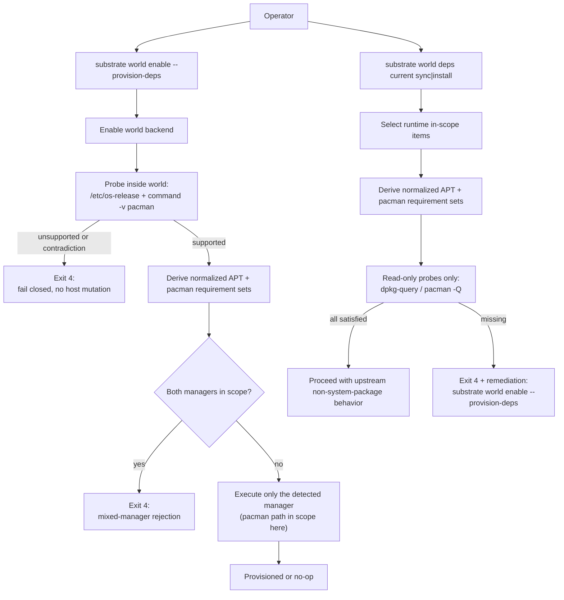
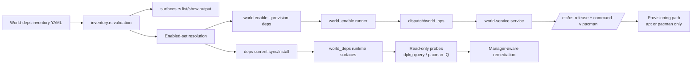
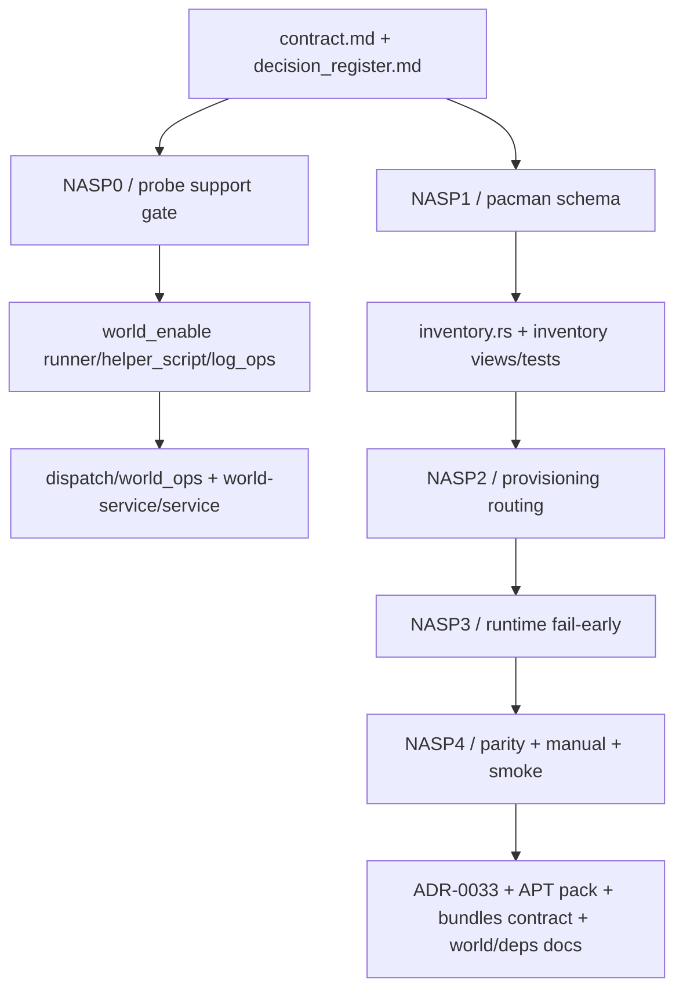
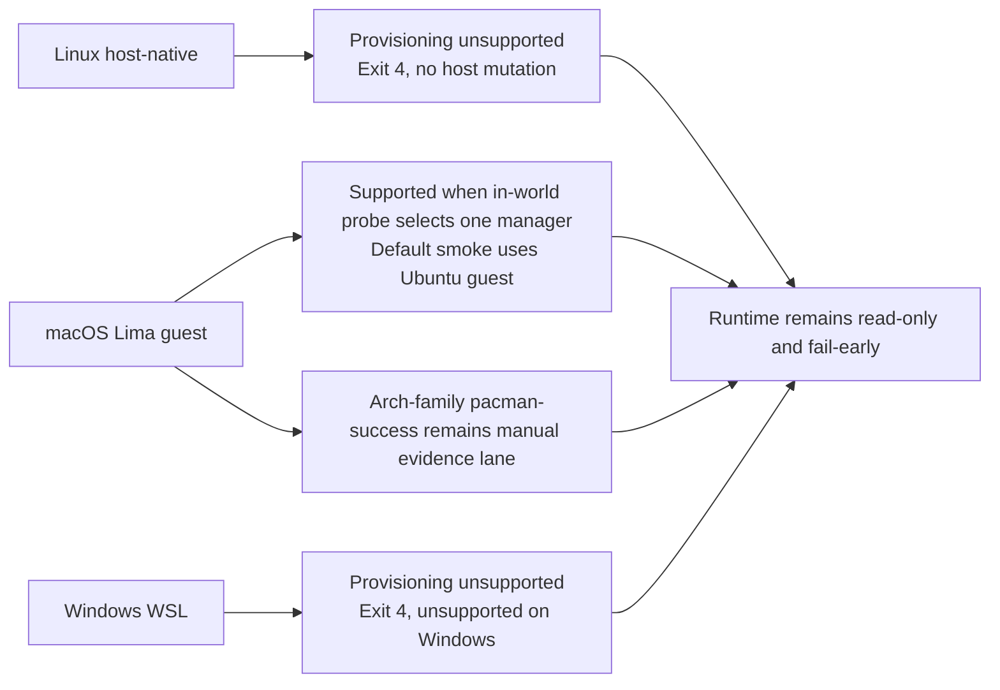

# Add non-APT system-package provisioning support - Review Surfaces

These diagrams orient the pack. They show the actual product/work shape that is expected to land.
They do not, by themselves, satisfy seam-local pre-exec review.

Active and next seams still require seam-local `review.md` later. These pack-level review surfaces exist so reviewers can see the end-to-end manager-aware workflow before seam-local decomposition starts.

## R1 - High-level provisioning and runtime workflow

## R2 - CLI, shell, world-service, and inventory/data flow

## R3 - Touch surface map from contract to conformance

## R4 - Platform posture that must remain true after landing

