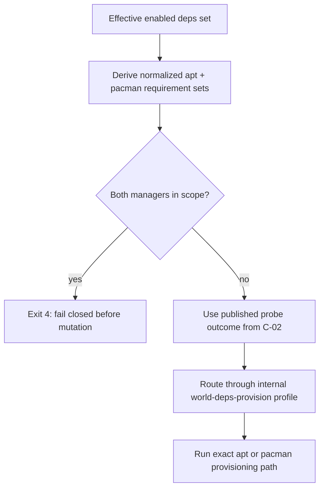
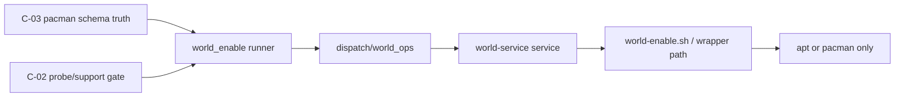

# Review Bundle - SEAM-4 Provisioning routing and pacman execution

This artifact feeds `gates.pre_exec.review`.
`../../review_surfaces.md` is pack orientation only.

## Falsification questions

- Can any mixed-manager path still partially provision one manager before rejecting the other?
- Can request-profile routing still be influenced by `SUBSTRATE_WORLD_REQUEST_PROFILE` or host environment instead of the internal `world-deps-provision` path?
- Can pacman dry-run, no-op detection, or verbose rendering drift between the runner, dispatch, world-service, and helper surfaces?

## R1 - Provisioning workflow

## R2 - Shared execution surface

## Likely mismatch hotspots

- mixed-manager rejection timing in `crates/shell/src/builtins/world_enable/runner/provision_deps.rs`
- request-profile isolation in `crates/shell/src/execution/routing/dispatch/world_ops.rs` and `crates/world-service/src/service.rs`
- helper-script posture in `scripts/substrate/world-enable.sh`
- dry-run and verbose rendering drift across the runner, logging, and test surfaces

## Pre-exec findings

- `THR-01` remains authoritative from `SEAM-1` and current for the shared manager-aware operator contract.
- `THR-02` and `THR-03` were published by `SEAM-2` and `SEAM-3`, then revalidated here against the current provisioning touch surface.
- `REM-003` no longer blocks decomposition: `world_enable.sh`, `world_ops.rs`, and `world-service/src/service.rs` still align with the internal `world-deps-provision` routing boundary and do not contradict the published probe or schema contracts.

## Pre-exec gate disposition

- **Review gate**: passed
- **Contract gate concerns**:
  - `C-04` now has a concrete owner baseline:
    - normalized APT and pacman requirement derivation
    - mixed-manager rejection before mutation
    - internal request-profile routing boundary
    - exact pacman command shape and failure posture
    - stable dry-run / verbose rendering and no-op behavior
- **Revalidation prerequisites**:
  - Consumed published `C-02` (`THR-02`) and `C-03` (`THR-03`) and confirmed the current provisioning surfaces still defer to those upstream contracts.
  - Revalidated the shared helper and world-service touch surfaces that previously drove `REM-003`.
- **Opened remediations**: none

## Planned seam-exit gate focus

- **What must be true before downstream promotion is legal**:
  - `C-04` is published and evidence-backed in provisioning execution, dry-run, and fail-closed behavior.
  - `THR-04` is advanced to `published` with a stable artifact path.
  - Any shared-file deltas from `review_surfaces.md` are explicitly recorded as stale triggers for `SEAM-5` and `SEAM-6`.
- **Which outbound contracts/threads matter most**:
  - `C-04` / `THR-04`
- **Which review-surface deltas would force downstream revalidation**:
  - Any change to normalized requirement derivation, mixed-manager rejection posture, request-profile routing, pacman command shape, or dry-run / verbose rendering.
