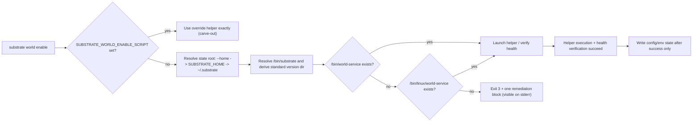
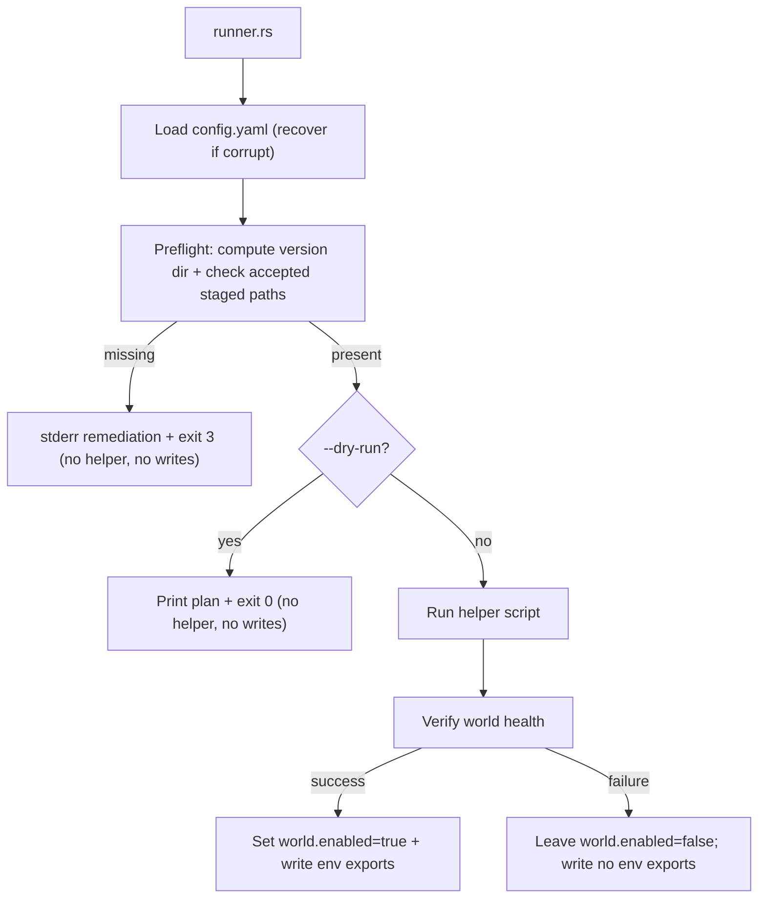

# Review Bundle - SEAM-1 Standard version-dir preflight + deterministic remediation

This artifact feeds `gates.pre_exec.review`.
`../../review_surfaces.md` is pack orientation only.

## Falsification questions

- Can `substrate world enable` still launch the helper or write *any* state (config, env exports, logs, socket activation, provisioning) when the accepted staged `world-service` artifact set is missing in the standard version-dir flow?
- Does the “override carve-out” (`SUBSTRATE_WORLD_ENABLE_SCRIPT`) accidentally inherit standard version-dir guarantees (or vice versa) and create a mixed, ambiguous contract surface?
- Does `--dry-run` still return `0` when no accepted staged artifact exists, or accidentally create/append any host state (config, env exports, helper logs)?

## R1 - Runtime workflow (standard version-dir preflight)

## R2 - Runner control flow + write ordering

## Likely mismatch hotspots

- **Dry-run semantics drift**: today `--dry-run` prints a plan and exits `0` unconditionally; the contract requires `--dry-run` to run the same preflight and exit `0` only when an accepted staged artifact exists.
- **Preflight can drift into helper boundary**: if remediation and ordering checks rely on helper logs, default output suppression can hide the only operator-visible remediation (see `REM-001`).
- **Version-dir derivation bypass**: helper discovery currently prefers prefix bundle scripts; ensure standard version-dir *artifact* preflight still binds to `<home>/bin/substrate` when that path exists and the command is not in the override carve-out.
- **Exit-code taxonomy alignment**: ensure the missing-artifact classification remains stable as `exit 3` and is not conflated with other failure modes (e.g., helper failure, socket/doctor failure).
- **Two execution paths**: `runner.rs` has both `run_enable` and `run_enable_with_provision_deps`; contract changes must apply consistently to both code paths (or be explicitly carved out).

## Pre-exec findings

- Open remediation to honor during implementation:
  - `REM-001` (remediation visibility must not rely on helper output; failure must occur before helper launch in both dry-run and non-dry-run).

## Pre-exec gate disposition

- **Review gate**: passed
- **Contract gate**: passed
- **Revalidation gate**: passed
- **Opened remediations**: none opened by this review bundle beyond the existing pack remediation log entries.

## Planned seam-exit gate focus

- **What must be true before downstream promotion is legal**:
  - `THR-01` and `THR-02` are publishable from closeout-backed truth (paths + ordering + stderr remediation + exit mapping).
- **Which outbound contracts/threads matter most**:
  - `C-01`/`C-03` via `THR-01`, and `C-01`/`C-02` via `THR-02`.
- **Which review-surface deltas would force downstream revalidation**:
  - Any change to accepted staged path set/order/sufficiency, remediation content/visibility, or write ordering relative to helper + verification.
