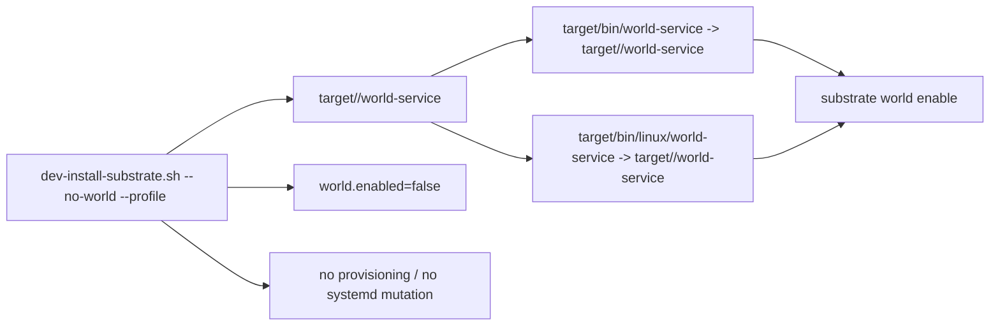
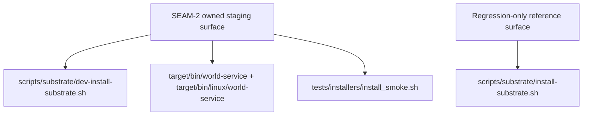

# Review Bundle - SEAM-2 Linux dev-install world-service staging

This artifact feeds `gates.pre_exec.review`.
`../../review_surfaces.md` is pack orientation only.

## Falsification questions

- Can `scripts/substrate/dev-install-substrate.sh --no-world` still skip staging one of the accepted `world-service` paths or stage the wrong profile target?
- Can repeated debug/release dev installs leave stale links because the refresh semantics are weaker than `ln -sfn`?
- Can the `--no-world` path still mutate provisioning, systemd state, or `world.enabled` even though `SEAM-1` requires runtime enable to remain the only success-path toggle?
- Can `scripts/substrate/install-substrate.sh` still drift into the owned touch surface instead of remaining a regression-only reference boundary guarded by installer smoke?

## R1 - Linux enable-later staging flow

## R2 - Scope boundary and regression surface

## Likely mismatch hotspots

- selected-profile mapping drift between debug and release staging
- stale-link refresh semantics on rerun
- `world.enabled` or provisioning side effects leaking into the `--no-world` path
- production-installer scope drift through `scripts/substrate/install-substrate.sh`

## Pre-exec findings

- `THR-01` is published by `SEAM-1` closeout and revalidated here against `../../governance/seam-1-closeout.md`.
- `REM-002` is resolved in this review bundle by narrowing `scripts/substrate/install-substrate.sh` to a regression-only reference surface; the owned touch surface remains `dev-install-substrate.sh`, the two staged link locations, and installer-smoke evidence.
- No new seam-owned remediations were opened during promotion.

## Pre-exec gate disposition

- **Review gate**: passed
- **Contract gate**: passed
- **Revalidation gate**: passed
- **Opened remediations**: none

## Planned seam-exit gate focus

- **What must be true before downstream promotion is legal**:
  - `C-04` is published with closeout-backed staged-link, selected-profile, and disabled-world evidence.
  - `THR-03` is advanced to `published`.
  - Installer-smoke scope remains reference-only for production install surfaces.
- **Which outbound contracts/threads matter most**:
  - `C-04`
  - `THR-03`
- **Which review-surface deltas would force downstream revalidation**:
  - any change to staged-link paths, selected-profile mapping, `ln -sfn` refresh semantics, or the meaning of `--no-world`
