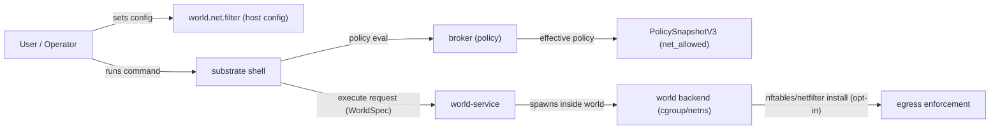
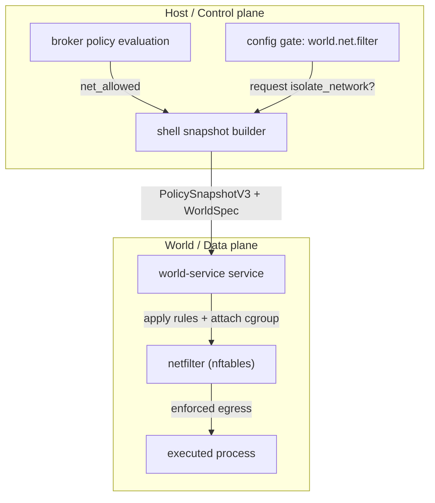
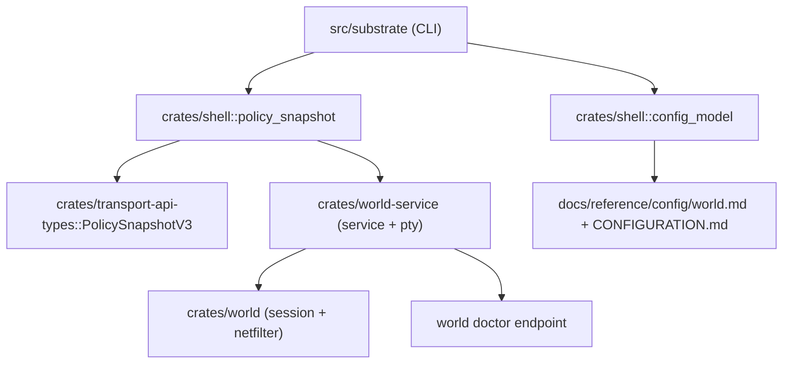

# Review Surfaces - Opt-in World Netfilter Enforcement

These diagrams orient the pack. They show the actual product/work shape that is expected to land.
They do not, by themselves, satisfy seam-local pre-exec review.

For `SEAM-4` (active) and `SEAM-5` (next), the authoritative pre-exec review artifact remains the seam-local `threaded-seams/.../review.md` that will be created during downstream seam decomposition.

## R1 - High-level workflow

## R2 - Control plane vs data plane separation

## R3 - Touch surface map (key modules)

