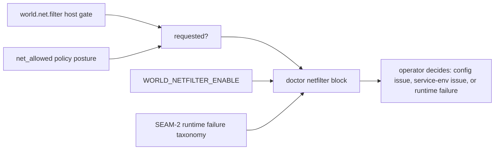
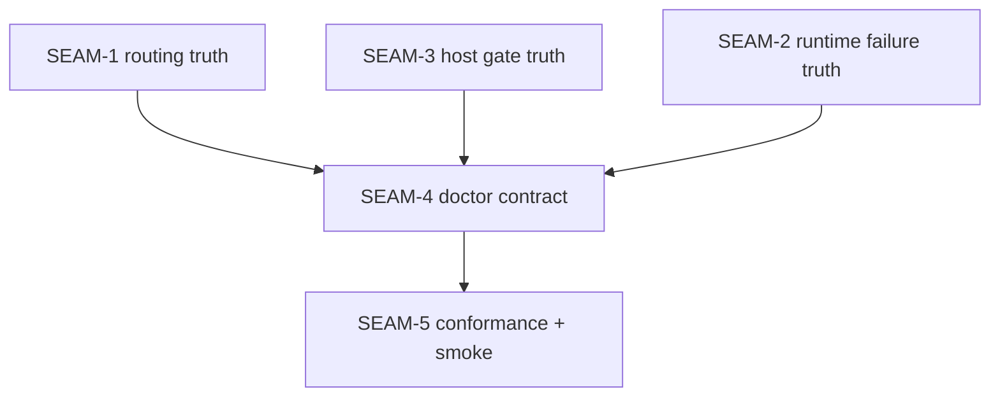

# Review Bundle - SEAM-4 doctor netfilter status observability

This artifact feeds `gates.pre_exec.review`.
`../../review_surfaces.md` is pack orientation only.

## Falsification questions

- Can `substrate world doctor --json` still report generic backend readiness while hiding that filtering was requested but not actually enabled?
- Can the doctor surface omit whether `WORLD_NETFILTER_ENABLE` is present, leaving operators unable to tell host-gate mistakes from service-env mistakes?
- Can distinct fail-closed causes from `SEAM-2` collapse into a low-signal or transport-specific message instead of one actionable `last_failure_reason` surface?
- Can Linux/macOS/Windows doctor rendering diverge enough that the same world-service truth produces inconsistent operator guidance?

## R1 - Operator troubleshooting flow

## R2 - Surface ownership map

## Likely mismatch hotspots

- **Requested-state ambiguity**: the doctor block derives `requested` from the wrong layer, or conflates host-gate enablement with runtime enforcement enablement.
- **Guard visibility gap**: `WORLD_NETFILTER_ENABLE` absence continues to surface only as a runtime error string, rather than an explicit doctor field operators can check before rerunning commands.
- **Failure-taxonomy collapse**: the distinct `SEAM-2` causes (missing env guard, nft install failure, resolution failure, cgroup attach failure) are flattened into a generic "netfilter failed" status with no actionability.
- **Platform rendering drift**: Linux/macOS/Windows shell-side doctor rendering or JSON passthrough omits or renames fields, leaving downstream tests to validate different contracts per platform.

## Pre-exec findings

- The upstream promotion dependency is satisfied:
  - `../../governance/seam-2-closeout.md` records `seam_exit_gate.status: passed`, `promotion_readiness: ready`, and `gates.post_exec.landing: passed`.
  - `../../governance/seam-1-closeout.md` and `../../governance/seam-3-closeout.md` publish the routing and host-gate semantics this seam must consume.
- The active pack control plane was already pointing at `SEAM-4`, but there was no seam-local planning or review bundle. Promotion resolves that documentation gap without inventing any missing landed evidence.
- Contract ownership is coherent:
  - `SEAM-1` retains `C-01` / `C-02` / `C-03`.
  - `SEAM-3` retains `C-04`.
  - `SEAM-4` owns only the additive doctor contract `C-07` and the downstream handoff `THR-05`.
- No blocking remediation currently names `SEAM-4`, its direct transition to `exec-ready`, or its required inbound threads.

## Pre-exec gate disposition

- **Review gate**: passed
- **Review gate concerns**:
  - none; the review bundle now makes the operator-facing mismatch surfaces explicit enough to falsify the planned doctor contract.
- **Contract gate**: passed
- **Contract gate concerns**:
  - none; ownership remains aligned with `../../threading.md`, and this seam only publishes `C-07`.
- **Revalidation**: passed
- **Revalidation concerns**:
  - none; the seam basis now references the landed `SEAM-1`, `SEAM-2`, and `SEAM-3` closeouts rather than provisional upstream assumptions.
- **Opened remediations**:
  - none

## Planned seam-exit gate focus

- **What must be true before downstream promotion is legal**:
  - the doctor contract must publish one additive status block covering requested, enabled, env-guard presence, and last failure reason
  - shell-side `substrate world doctor --json` output must preserve that block without platform-specific drift
  - `THR-05` publication must identify the exact doctor fields and stale triggers `SEAM-5` must consume
- **Which outbound contracts/threads matter most**:
  - `C-07`
  - `THR-05`
- **Which review-surface deltas would force downstream revalidation**:
  - any field-name or schema change in the doctor block
  - any runtime failure-taxonomy or wording change inherited from `SEAM-2`
  - any change to how `requested` is derived from upstream routing and host-gate truth
