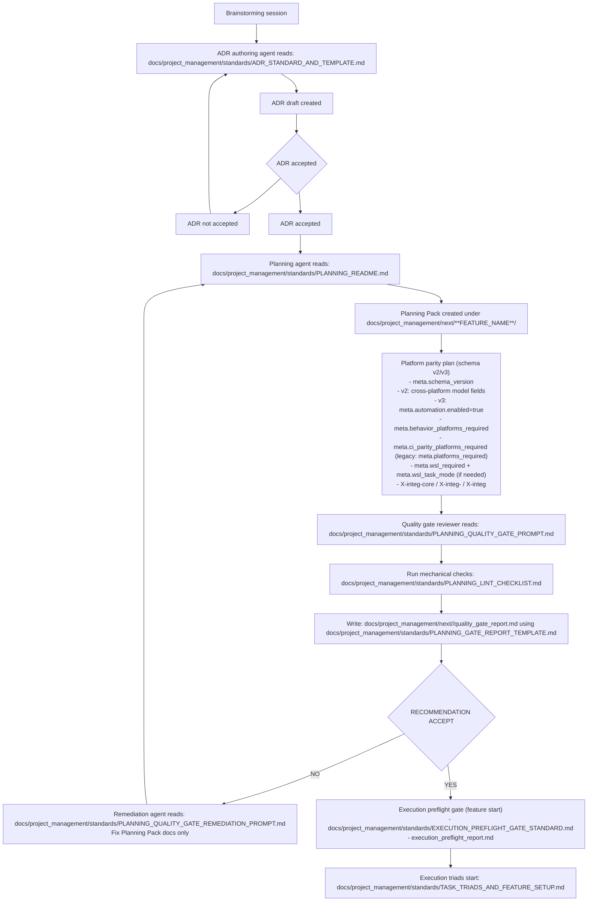

# Planning Workflow Overview (ADR → Planning Pack → Quality Gate → Triads)

This diagram shows the intended handoff flow:
- ADR creation (after brainstorming converges)
- Operator review via `## Executive Summary (Operator)` + drift guard
- Planning Pack creation (execution-ready specs/tasks/prompts)
- Platform parity plan (required when cross-platform)
- Third-party Planning Quality Gate (accept/flag)
- If flagged: planning-doc remediation (docs-only) and re-review
- Execution triads (code/test/integ)
- Cross-platform smoke via `docs/project_management/standards/PLATFORM_INTEGRATION_AND_CI.md`
- Operational defaults:
  - Prefer smaller triads/slices (avoid “grab bag” slices).
  - Prefer stable GitHub Actions dispatch refs (`testing`/`main`) + `PLATFORM=behavior` for smoke.

