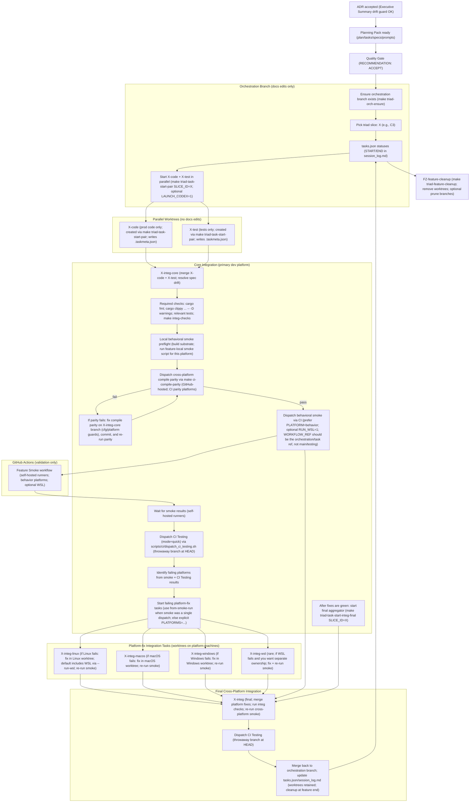
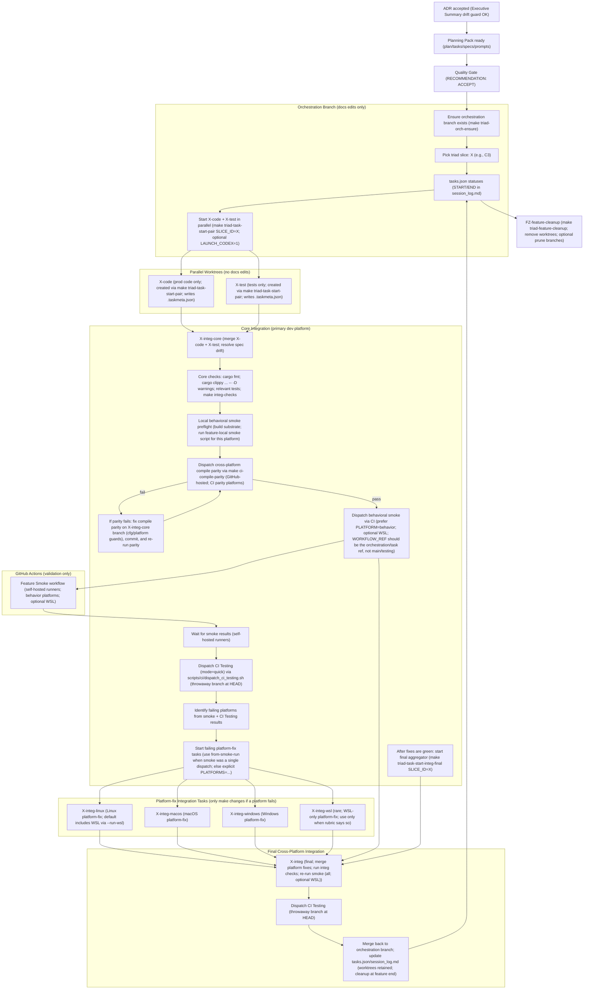
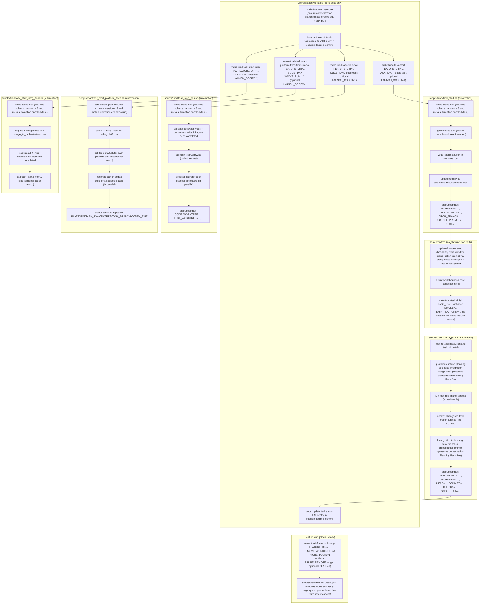

# Triad Workflow (Cross-Platform Integration via Self-Hosted CI)

This diagram is the “execution phase” complement to:
- `docs/project_management/standards/PLANNING_WORKFLOW_OVERVIEW.md`

It shows:
- code/test running in parallel worktrees (created via the triad task runner),
- a core integration merge task (`X-integ-core`),
- parallel platform-fix integration tasks (`X-integ-<platform>`) that only make changes if a platform fails, and
- a final cross-platform integration aggregator (`X-integ`) that merges platform fixes and re-validates.
- worktrees retained through the feature and removed only by the feature cleanup task (`FZ-feature-cleanup`).

Operational notes (important for correct orchestration):
- CI smoke dispatch (`make feature-smoke ...`) validates the **current `HEAD`** by creating/pushing a throwaway branch at that commit; run it from the worktree that contains the code you intend to validate (e.g., the `X-integ-core` or `X-integ` worktree).
- Platform-fix tasks should begin by merging the `X-integ-core` task branch into their own branch before running smoke or making fixes.
- Before any CI dispatch, run a **local behavioral smoke preflight** (fast fail) on the current platform when possible:
  - Build `substrate` in the integration worktree, add `target/debug` to `PATH`, and run the matching feature-local smoke script from `docs/project_management/next/<feature>/smoke/` (or `"$FEATURE_DIR/smoke/"` if you set `FEATURE_DIR`).
  - This catches obvious smoke-script/behavior drift before burning runner time and creating throwaway branches.
- Cross-platform compile parity should be validated before Feature Smoke dispatch to avoid discovering macOS/Windows compilation breaks only after creating temp branches and consuming runner time:
  - `make ci-compile-parity CI_WORKFLOW_REF="$ORCH_BRANCH" CI_REMOTE=origin CI_CLEANUP=1` (dispatches CI Testing in `mode=compile-parity` via `scripts/ci/dispatch_ci_testing.sh`).
  - If compile parity fails: treat it as **blocking** and fix it on the `X-integ-core` branch/worktree (cfg/platform guards), then re-run compile parity until green; do not dispatch Feature Smoke until it is green.
- Workflow dispatch reliability note: GitHub only allows `workflow_dispatch` by workflow file if that workflow is registered on the default branch (`main`). Operationally, this means:
  - You may need to land *workflow-file-only* changes on `main` so the workflow is registered.
  - Do not dispatch runs from `main` (or `testing`) during triad execution; dispatch from the feature’s orchestration/task ref and rely on the dispatcher’s throwaway `checkout_ref` branch to test the exact commit you care about.
- Feature Smoke should be dispatched for **behavior platforms only** (read from `tasks.json` via `PLATFORM=behavior`) unless the feature explicitly requires behavior smoke on all three OSes.
- CI Testing is a separate, stricter gate than Feature Smoke:
  - Use `mode=quick` for automation selection (skip docs/cross-build) before deciding “no-op platform fixes”.
  - Use `mode=full` (default) as the final CI gate on the final `X-integ` commit before merging to `testing`.
- The dispatch scripts are hardened with timeouts to avoid indefinite hangs; default max wait is **2 hours**. If you hit infra slowness, you can override via `FEATURE_SMOKE_WATCH_TIMEOUT_SECS` / `CI_TESTING_WATCH_TIMEOUT_SECS` (see `docs/project_management/standards/PLATFORM_INTEGRATION_AND_CI.md`).
- Headless Codex runs write a PID file while running: `target/triad/<feature>/codex/<task>/codex.pid`. If an orchestration session is interrupted, check for stale PID files before starting new runs.
- Orchestration wrappers should always emit their stdout contract (including `CODEX_EXIT`) even when Codex fails; if you see missing keys, treat it as an automation bug and capture the command output + `target/triad/...` artifact paths for follow-up.

## Task Granularity (Keep Triad Slices Small)

Cross-platform integration goes off the rails fastest when slices are too large to reason about. Prefer more (smaller) tasks/slices over fewer (larger) ones:
- Split along natural seams (CLI wiring vs. backend API vs. schema/tests vs. docs).
- Keep each Codex run focused on a single acceptance criterion cluster.
- Use the older “feature sprint” patterns as references for how small to go:
  - `docs/project_management/_archived/p0-platform-stability/kickoff_prompts/`
  - `docs/project_management/_archived/p0-platform-stability-macOS-parity/kickoff_prompts/`
  - `docs/project_management/_archived/policy_and_config_mental_model_simplification/kickoff_prompts/`

This file includes two diagrams:
- **Diagram A:** The overall cross-platform platform-fix triad flow.
- **Diagram B:** The same flow with explicit emphasis on **WSL bundled-by-default** behavior.
- **Diagram C:** A zoomed-in view of the triad task execution automation (branch/worktree lifecycle, Codex headless launch, and feature cleanup).

## Diagram A — Cross-Platform Platform-Fix Triad Flow

## Diagram B — WSL Bundled by Default (with “Separate WSL Task” Exception)

Default:
- WSL coverage is bundled into `X-integ-linux` by dispatching Linux smoke with `--run-wsl`.

Exception:
- Create `X-integ-wsl` only when the rubric in `docs/project_management/standards/PLATFORM_INTEGRATION_AND_CI.md` justifies separate ownership.

## Diagram C — Task Execution Automation (Zoom In)

This diagram zooms in on the automation pieces used during execution:
- orchestration branch bootstrap (`make triad-orch-ensure`)
- code+test parallel worktree creation (`make triad-task-start-pair`)
- failing platform-fix worktree creation (`make triad-task-start-platform-fixes-from-smoke`)
- single-task worktree creation + registration (`make triad-task-start`)
- optional headless Codex launch (from inside the worktree; kickoff prompt via stdin)
- task finishing (`make triad-task-finish`)
- feature-level cleanup (worktree retention model; `make triad-feature-cleanup`)

