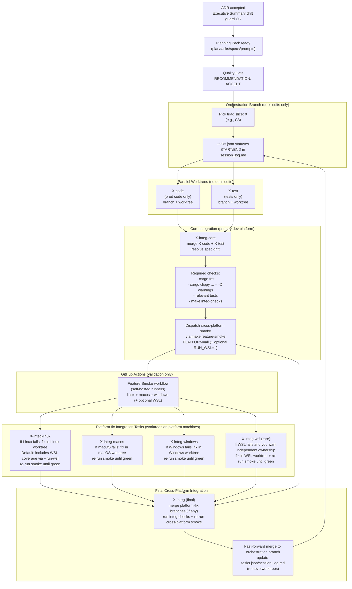
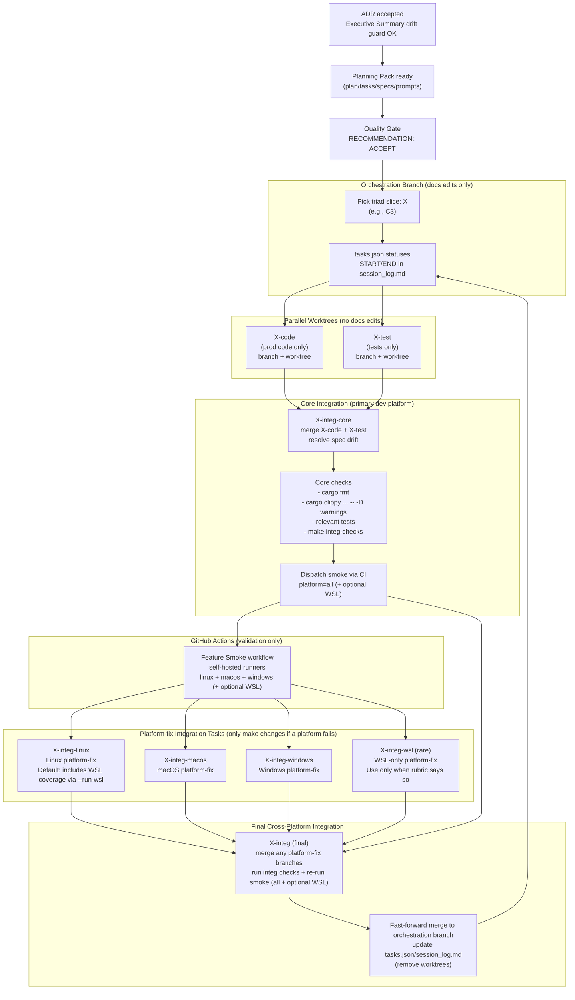

# Triad Workflow (Cross-Platform Integration via Self-Hosted CI)

This diagram is the “execution phase” complement to:
- `docs/project_management/standards/PLANNING_WORKFLOW_OVERVIEW.md`

It shows:
- code/test running in parallel worktrees,
- a core integration merge task (`X-integ-core`),
- parallel platform-fix integration tasks (`X-integ-<platform>`) that only make changes if a platform fails, and
- a final cross-platform integration aggregator (`X-integ`) that merges platform fixes and re-validates.

This file includes two diagrams:
- **Diagram A:** The overall cross-platform platform-fix triad flow.
- **Diagram B:** The same flow with explicit emphasis on **WSL bundled-by-default** behavior.

## Diagram A — Cross-Platform Platform-Fix Triad Flow

## Diagram B — WSL Bundled by Default (with “Separate WSL Task” Exception)

Default:
- WSL coverage is bundled into `X-integ-linux` by dispatching Linux smoke with `--run-wsl`.

Exception:
- Create `X-integ-wsl` only when the rubric in `docs/project_management/standards/PLATFORM_INTEGRATION_AND_CI.md` justifies separate ownership.

