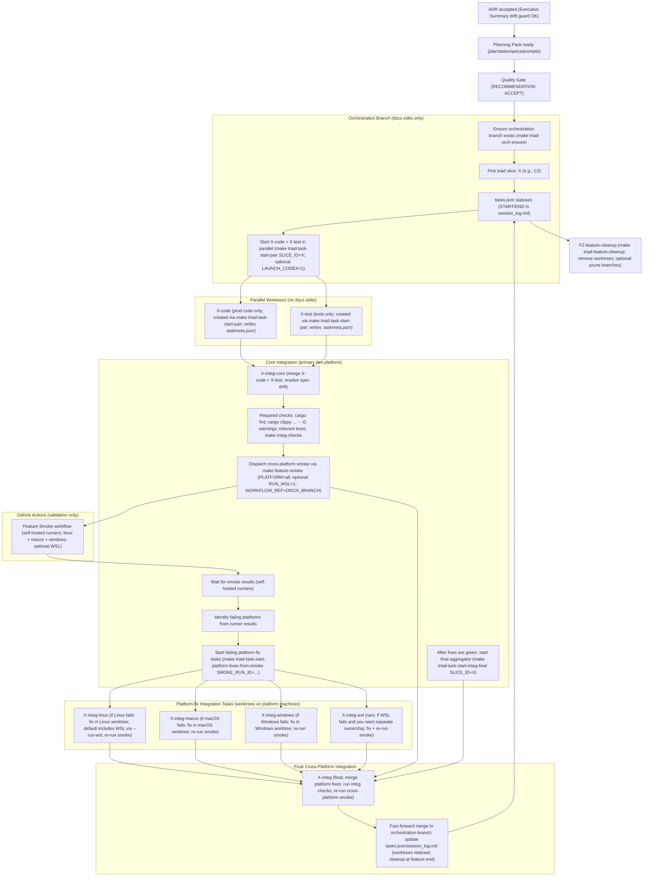
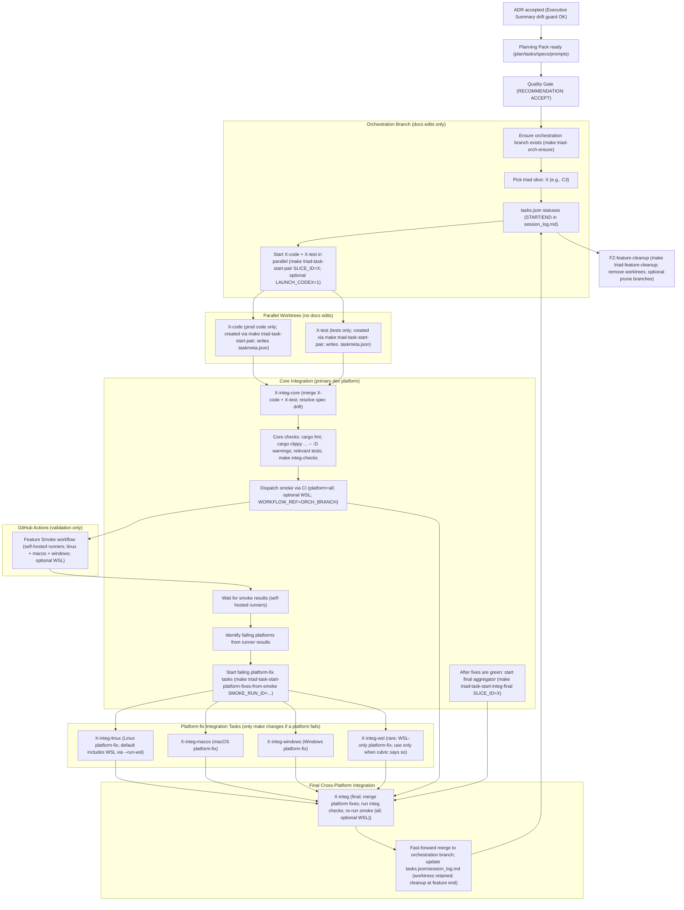
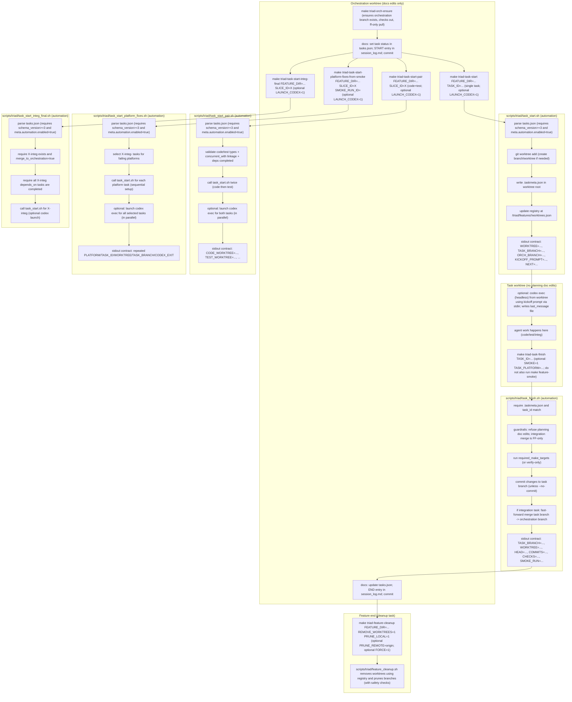

# Triad Workflow (Cross-Platform Integration via Self-Hosted CI)

This diagram is the “execution phase” complement to:
- `docs/project_management/standards/PLANNING_WORKFLOW_OVERVIEW.md`

It shows:
- code/test running in parallel worktrees (created via the triad task runner),
- a core integration merge task (`X-integ-core`),
- parallel platform-fix integration tasks (`X-integ-<platform>`) that only make changes if a platform fails, and
- a final cross-platform integration aggregator (`X-integ`) that merges platform fixes and re-validates.
- worktrees retained through the feature and removed only by the feature cleanup task (`FZ-feature-cleanup`).

This file includes two diagrams:
- **Diagram A:** The overall cross-platform platform-fix triad flow.
- **Diagram B:** The same flow with explicit emphasis on **WSL bundled-by-default** behavior.
- **Diagram C:** A zoomed-in view of the triad task execution automation (branch/worktree lifecycle, Codex headless launch, and feature cleanup).

## Diagram A — Cross-Platform Platform-Fix Triad Flow

## Diagram B — WSL Bundled by Default (with “Separate WSL Task” Exception)

Default:
- WSL coverage is bundled into `X-integ-linux` by dispatching Linux smoke with `--run-wsl`.

Exception:
- Create `X-integ-wsl` only when the rubric in `docs/project_management/standards/PLATFORM_INTEGRATION_AND_CI.md` justifies separate ownership.

## Diagram C — Task Execution Automation (Zoom In)

This diagram zooms in on the automation pieces used during execution:
- orchestration branch bootstrap (`make triad-orch-ensure`)
- code+test parallel worktree creation (`make triad-task-start-pair`)
- failing platform-fix worktree creation (`make triad-task-start-platform-fixes-from-smoke`)
- single-task worktree creation + registration (`make triad-task-start`)
- optional headless Codex launch (from inside the worktree; kickoff prompt via stdin)
- task finishing (`make triad-task-finish`)
- feature-level cleanup (worktree retention model; `make triad-feature-cleanup`)

