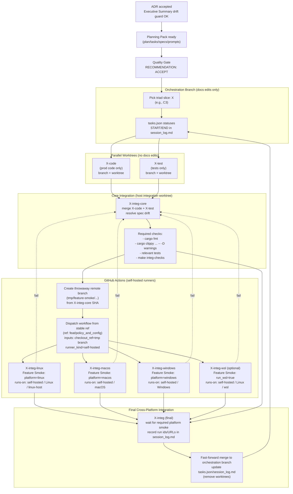

# Triad Workflow (Cross-Platform Integration via Self-Hosted CI)

This diagram is the “execution phase” complement to:
- `docs/project_management/standards/PLANNING_WORKFLOW_OVERVIEW.md`

It shows:
- code/test running in parallel worktrees,
- a core integration merge task,
- platform-specific integration smoke tasks running in parallel on self-hosted runners via GitHub Actions, and
- a final cross-platform integration aggregator that merges + records results.

