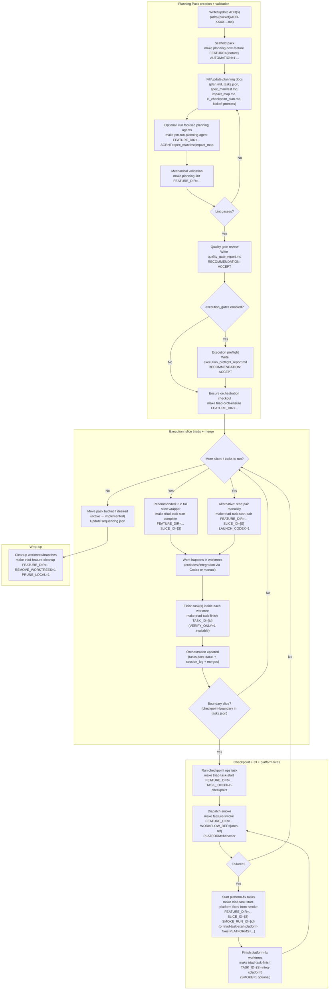

# Project Management System — User Guide (New Workflow)

This guide describes the **current, canonical** Project Management (PM) workflow after the _system/artifacts split_ and the _slice-directory_ layout.

It is written for **operators and agents** who:

- create Planning Packs,
- run planning validation,
- execute slice triads (code/test/integration),
- run CI checkpoints + platform fixes,
- and close out/clean up.

> **Canonical “system” root:** `docs/project_management/system/`  
> **Canonical “artifacts” root:** `docs/project_management/packs/<bucket>/<feature>/`  
> (Legacy `docs/project_management/next/**` is removed; legacy `docs/project_management/standards/**` remains as compatibility stubs.)

---

## Concepts and directory layout

### System vs artifacts

- **System** (portable, reusable): standards, prompts, templates, schemas, scripts
  - `docs/project_management/system/standards/**`
  - `docs/project_management/system/prompts/**`
  - `docs/project_management/system/templates/**`
  - `docs/project_management/system/schemas/**`
  - `docs/project_management/system/scripts/**`

- **Artifacts** (feature/run-specific): Planning Packs, slice specs, reports, logs
  - `docs/project_management/packs/<bucket>/<feature>/...`

### Planning Pack (feature) structure

A Planning Pack typically contains:

- `plan.md` (operator-readable plan + optional frontmatter like `adr_refs`)
- `tasks.json` (execution graph + automation config)
- `spec_manifest.md` (what specs exist / must exist)
- `impact_map.md` (**touch-set allowlist**; enforced at task finish for strict packs)
- `ci_checkpoint_plan.md` (checkpoint boundaries and CI tasks; required for cross-platform packs)
- `quality_gate_report.md` (must contain `RECOMMENDATION: ACCEPT` to start tasks)
- `execution_preflight_report.md` (required only when `tasks.json meta.execution_gates=true`)
- `session_log.md` (append-only operator log)
- `kickoff_prompts/` (feature/ops kickoff prompts)
- `slices/<SLICE_ID>/...` (slice directories; canonical)

### Slice directory structure (canonical)

Each slice is a small vertical unit with its own directory:

```
docs/project_management/packs/<bucket>/<feature>/
  slices/<SLICE_ID>/
    <SLICE_ID>-spec.md
    <SLICE_ID>-closeout_report.md
    kickoff_prompts/
      <task-id>.md   # e.g., C0-code.md, C0-test.md, C0-integ.md
```

> **Source of truth:** `tasks.json` points at the kickoff prompt file via `kickoff_prompt`.  
> Slice tasks usually point into `slices/<SLICE_ID>/kickoff_prompts/...`.  
> Feature/ops tasks usually point into `kickoff_prompts/...`.

### Buckets

Both packs and ADRs are organized into buckets (examples):

- Packs: `draft`, `queued`, `active`, `implemented`, `superseded`
- ADRs: `draft`, `queued`, `implemented`, `superseded`

Bucket changes are usually done via `git mv` (and sometimes helper migration scripts), not by the triad execution scripts.

---

## Required tools and assumptions

Most PM automation scripts expect:

- `git`, `python3`, `jq`
- `codex` (if using `LAUNCH_CODEX=1` or triad wrappers)
- `rg` (ripgrep) is used by some scripts for fast searches

Run commands from:

- **repo root** for planning commands (`planning-*`, `pm-run-planning-agent`, etc.)
- **inside the task worktree root** for `triad-task-finish` (it requires `.taskmeta.json` in that worktree)

---

## The end-to-end workflow (Mermaid)

The diagram below shows the intended “happy path” plus the cross-platform checkpoint branch.



---

## Command-oriented “happy path” recipes

### 1) Create a new planning pack

From repo root:

```bash
# Create an automation-enabled pack under docs/project_management/packs/active/<feature>/
make planning-new-feature FEATURE="my-feature" AUTOMATION=1

# For cross-platform work, add:
# make planning-new-feature FEATURE="my-feature" AUTOMATION=1 CROSS_PLATFORM=1 WSL_REQUIRED=1
```

This scaffolds the pack and runs a basic validation.

---

### 2) Iterate planning docs until lint passes

Set a convenience variable:

```bash
FEATURE_DIR="docs/project_management/packs/active/my-feature"
```

Run focused planning agents (optional):

```bash
make pm-run-planning-agent FEATURE_DIR="$FEATURE_DIR" AGENT=spec_manifest
make pm-run-planning-agent FEATURE_DIR="$FEATURE_DIR" AGENT=impact_map
```

Lint / validate:

```bash
make planning-lint FEATURE_DIR="$FEATURE_DIR"
make planning-validate FEATURE_DIR="$FEATURE_DIR"
```

> Tip: treat `planning-lint` as your “pre-flight checklist” before starting _any_ execution tasks.

---

### 3) Ensure gating reports exist (required to start tasks)

Before any triad execution, `triad-task-start*` requires:

- `quality_gate_report.md` contains `RECOMMENDATION: ACCEPT`
- and if `tasks.json meta.execution_gates=true`:
  - `execution_preflight_report.md` contains `RECOMMENDATION: ACCEPT`

If these are missing or not ACCEPT, `triad-task-start` will refuse to start.

---

### 4) Execute a slice (recommended wrapper)

For a small slice, the simplest operator flow is:

```bash
make triad-task-start-complete FEATURE_DIR="$FEATURE_DIR" SLICE_ID="C0"
```

This wrapper:

- ensures orchestration exists,
- starts code+test in parallel (Codex),
- finishes code+test,
- starts+finishes the slice integration task,
- and emits `NEXT_CHECKPOINT_TASK_ID` if the slice is a checkpoint boundary.

If you prefer to do it manually (or need more control):

```bash
make triad-task-start-pair FEATURE_DIR="$FEATURE_DIR" SLICE_ID="C0" LAUNCH_CODEX=1
# follow the printed WORKTREE paths; in each worktree:
cd <worktree>
make triad-task-finish TASK_ID="C0-code"
# in the test worktree:
make triad-task-finish TASK_ID="C0-test"
# then start integration task:
make triad-task-start FEATURE_DIR="$FEATURE_DIR" TASK_ID="C0-integ" LAUNCH_CODEX=1
cd <integ-worktree>
make triad-task-finish TASK_ID="C0-integ"
```

---

### 5) Non-mutating verification (recommended before finishing)

If you want to “check enforcement” without committing/merging:

```bash
cd <task-worktree>
make triad-task-finish TASK_ID="C0-code" VERIFY_ONLY=1
```

This prints a summary and verifies invariants (including strict touch-set enforcement) without mutating git history.

---

## Decision Register workflow

The **Decision Register** is a _pack-local_ document used for **A/B decisions and tradeoffs** that are:

- important enough to document clearly,
- but **too small / too slice-specific** to justify a full ADR.

**Location (canonical):**

- `docs/project_management/packs/<bucket>/<feature>/decision_register.md`

**Template / rules live in:**

- `docs/project_management/system/standards/planning/PLANNING_RESEARCH_AND_ALIGNMENT_STANDARD.md`

### When it is required

By default, the Decision Register is **required** when you are doing either:

- **decision-heavy** planning (lots of tradeoffs, APIs, contracts, naming, or behavior choices), or
- **cross-platform** work (because platform contracts and testing strategy must be explicit).

Scaffolding it on creation:

```bash
# Decision-heavy pack
make planning-new-feature FEATURE="my-feature" AUTOMATION=1 DECISION_HEAVY=1

# Cross-platform pack (also implies decision-heavy discipline)
make planning-new-feature FEATURE="my-feature" AUTOMATION=1 CROSS_PLATFORM=1 WSL_REQUIRED=1
```

If you started a pack without it and later realize you need it, you can add it manually at the pack root.

### How it relates to ADRs

- **ADRs** live in `docs/project_management/adrs/<bucket>/...` and capture **broader architecture decisions** (often spanning multiple slices).
- The **Decision Register** captures **slice-shaped** choices and can link to ADRs when relevant.

A common pattern:

1. Record a slice-scoped tradeoff in `decision_register.md`
2. If it becomes cross-cutting or long-lived, promote it into an ADR and reference the ADR from the pack (`tasks.json meta.adr_refs`).

---

## Strict pack behavior (Slice Spec v2 + Impact Map enforcement)

Most new packs are **strict** when:

- `tasks.json meta.slice_spec_version >= 2`

In strict mode:

- Slice specs must follow the v2 format (AC IDs, caps, etc.).
- `task_finish` enforces that touched files are allowed by the **Impact Map Touch Set**.
  - The allowlist is read from the **orchestration worktree copy** of `impact_map.md` (not the task worktree).

### If `task_finish` fails with “unplanned touches”

1. **Do not** edit planning docs inside the task worktree.
2. Switch to the orchestration worktree/branch.
3. Update `impact_map.md` Touch Set entries (explicit) to include the touched path(s).
4. Commit on orchestration.
5. Re-run `triad-task-finish` in the task worktree.

Only use the override when absolutely necessary:

```bash
cd <task-worktree>
docs/project_management/system/scripts/triad/task_finish.sh \
  --task-id "C0-code" \
  --allow-unplanned-touch \
  --reason "Temporary mitigation: <why this was unavoidable>; follow-up planned in slice C1"
```

---

## Cross-platform checkpoints and platform fixes

If `tasks.json meta.cross_platform=true`, you will have:

- checkpoint ops tasks like `CP1-ci-checkpoint`
- smoke dispatch steps
- platform-fix tasks (depending on schema/version), often named like:
  - `<slice>-integ-<platform>` (e.g., `C0-integ-macos`)

Typical operator flow at boundaries:

```bash
# Run the checkpoint task (often an ops task — no worktree)
make triad-task-start FEATURE_DIR="$FEATURE_DIR" TASK_ID="CP1-ci-checkpoint"

# Dispatch smoke
make feature-smoke FEATURE_DIR="$FEATURE_DIR" WORKFLOW_REF="<orchestration_branch_or_ref>" PLATFORM=behavior
```

If smoke fails, start platform fix tasks:

```bash
make triad-task-start-platform-fixes-from-smoke   FEATURE_DIR="$FEATURE_DIR" SLICE_ID="C0" SMOKE_RUN_ID="<gh-run-id>" LAUNCH_CODEX=1
```

Finish each platform-fix worktree with `triad-task-finish`. Optionally run smoke automatically at finish with `SMOKE=1` (when configured/desired).

---

## Wrap up and cleanup

When the feature is complete:

1. Move the pack to a final bucket if desired (e.g., `active → implemented`) via `git mv`.
2. Clean up worktrees/branches:

```bash
make triad-feature-cleanup FEATURE_DIR="$FEATURE_DIR" REMOVE_WORKTREES=1 PRUNE_LOCAL=1
```

---

## Quick reference: primary make targets

Planning:

- `make planning-new-feature FEATURE=<name> [AUTOMATION=1] [CROSS_PLATFORM=1] ...`
- `make planning-validate FEATURE_DIR=...`
- `make planning-lint FEATURE_DIR=...`
- `make pm-run-planning-agent FEATURE_DIR=... AGENT=spec_manifest|impact_map`

Triad execution:

- `make triad-orch-ensure FEATURE_DIR=...`
- `make triad-task-start FEATURE_DIR=... TASK_ID=... [LAUNCH_CODEX=1]`
- `make triad-task-start-pair FEATURE_DIR=... SLICE_ID=... [LAUNCH_CODEX=1]`
- `make triad-task-start-complete FEATURE_DIR=... SLICE_ID=...` (recommended)
- `make triad-task-finish TASK_ID=...` _(run inside worktree)_

Cross-platform:

- `make feature-smoke FEATURE_DIR=... WORKFLOW_REF=... PLATFORM=behavior`
- `make triad-task-start-platform-fixes-from-smoke FEATURE_DIR=... SLICE_ID=... SMOKE_RUN_ID=...`

Cleanup:

- `make triad-feature-cleanup FEATURE_DIR=... REMOVE_WORKTREES=1 PRUNE_LOCAL=1`
