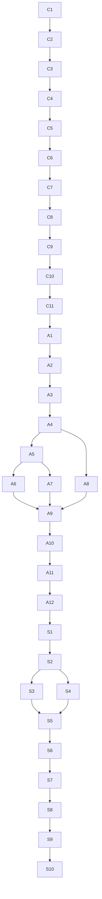

# Hybrid Drift Sentinel Implementation Order

This document maps the approved task docs into a concrete incremental-implementation order.

Primary sources:

- [agent-session-compactor-v0.1-tasks.md](/Users/spensermcconnell/.codex/worktrees/97a0/substrate/docs/specs/agent-session-compactor-v0.1-tasks.md:1)
- [agent-drift-analyzer-v0.1-tasks.md](/Users/spensermcconnell/.codex/worktrees/97a0/substrate/docs/specs/agent-drift-analyzer-v0.1-tasks.md:1)
- [agent-drift-sentinel-v0.2-tasks.md](/Users/spensermcconnell/.codex/worktrees/97a0/substrate/docs/specs/agent-drift-sentinel-v0.2-tasks.md:1)

## Task IDs

### Compactor

- `C1` scaffold the crate
- `C2` define row, audit, and manifest core types
- `C3` implement Codex-home resolution and discovery
- `C4` implement rollout ingestion
- `C5` gate real-session ingestion and upstream parser decision
- `C6` implement normalization
- `C7` implement canonicalization and hashing
- `C8` implement exact dedupe and dedupe-audit emission
- `C9` implement manifest and bundle export
- `C10` wire the thin CLI
- `C11` gate end-to-end validation and freeze the artifact contract

### Analyzer

- `A1` scaffold the crate
- `A2` implement compactor artifact loading and contract checks
- `A3` gate the compactor artifact surface before analyzer heuristics
- `A4` implement deterministic context assembly
- `A5` implement task-frame inference and confidence shaping
- `A6` implement `wrong_plan_branch` scoring
- `A7` implement `ignoring_repo_truth` scoring
- `A8` implement `dead_end_thrash` scoring
- `A9` implement checkpoint segmentation and checkpoint contract
- `A10` implement summary and output bundle export
- `A11` wire the thin CLI
- `A12` gate end-to-end validation and freeze the checkpoint contract

### Sentinel

- `S1` scaffold the crate
- `S2` implement replay-mode checkpoint loading
- `S3` implement scheduler state and trigger classes
- `S4` implement replay-mode operator summaries
- `S5` separate visible warnings from silent checkpoint handling
- `S6` implement optional model adjudication request shaping
- `S7` implement safe adjudication fallback behavior
- `S8` wire the thin CLI for replay mode
- `S9` gate replay-mode usefulness before live work starts
- `S10` gate live-mode entry and only then scope live integration work

## Dependency Chart

## Recommended Packeting

Recommended total: `13 packets`

This is the best balance between forward progress and safe checkpoints. It keeps each packet
focused, gives you clean stop points at the high-risk gates, and preserves the module dependency
chain.

### Packet 1: Compactor foundation

- `C1`
- `C2`
- `C3`

Why:

- creates the crate
- locks the row contract early
- establishes the stable input corpus

### Packet 2: Compactor ingestion gate

- `C4`
- `C5`

Why:

- this is the first real seam-pressure packet
- stop here if `unified-agent-api-*` needs upstream changes

### Packet 3: Compactor row shaping

- `C6`
- `C7`

Why:

- normalization and canonicalization belong together
- they define the analysis-safe row surface

### Packet 4: Compactor compaction/export

- `C8`
- `C9`

Why:

- exact dedupe and bundle emission form the first consumable output

### Packet 5: Compactor CLI and freeze

- `C10`
- `C11`

Why:

- keeps the binary thin and late
- ends with the artifact-contract freeze for analyzer consumers

### Packet 6: Analyzer foundation and artifact gate

- `A1`
- `A2`
- `A3`

Why:

- creates the crate
- proves the compactor contract is truly usable
- stops early if the analyzer needs contract changes upstream

### Packet 7: Analyzer context model

- `A4`
- `A5`

Why:

- context assembly and task-frame inference are the semantic base for all scoring

### Packet 8: Analyzer divergence/truth scoring

- `A6`
- `A7`

Why:

- these two drift classes share the same task-frame and truth-artifact machinery

### Packet 9: Analyzer thrash/checkpoint core

- `A8`
- `A9`

Why:

- `dead_end_thrash` is the special-case scorer
- checkpoint segmentation should land only after all three drift classes exist

### Packet 10: Analyzer export and freeze

- `A10`
- `A11`
- `A12`

Why:

- finishes the reviewable checkpoint bundle
- freezes the replay contract for sentinel consumers

### Packet 11: Sentinel replay core

- `S1`
- `S2`
- `S3`

Why:

- creates the crate
- proves replay input handling
- lands the scheduler before UI polish

### Packet 12: Sentinel operator loop

- `S4`
- `S5`
- `S8`

Why:

- this packet proves whether replay mode is actually useful to an operator
- CLI wiring belongs with replay usability, not with later live integration

### Packet 13: Sentinel adjudication and live gate

- `S6`
- `S7`
- `S9`
- `S10`

Why:

- keeps model work late and optional
- ends with the explicit gate before any live integration starts

## If You Want Fewer Packets

Minimum safe compression: `10 packets`

Safe merges:

- merge Packet 4 and Packet 5 if compactor export is already stable
- merge Packet 8 and Packet 9 if analyzer scoring is landing quickly
- merge Packet 12 and Packet 13 only if replay-mode usefulness is already obvious

Do not compress across these gates:

- `C5`
- `C11`
- `A3`
- `A12`
- `S9`
- `S10`

Those are the points most likely to reveal the wrong seam, the wrong downstream contract, or the
wrong scope for the next packet.

## Gate Policy

Use these rules during incremental implementation:

- `auto-continue`
  - the agent should report the gate result in chat and continue automatically if the gate passes
- `raise-to-user-if-failed`
  - the agent should continue automatically on pass
  - the agent should stop and raise a concrete issue in chat if the gate fails or exposes a real
    seam problem
- `always-check-with-user`
  - the agent should stop for an explicit user decision before proceeding past the gate, even if the
    implementation work appears technically ready

Gate classification for this project:

- `C5` = `raise-to-user-if-failed`
  - parser-surface pressure test; escalate if `unified-agent-api-*` likely needs upstream changes
- `C11` = `auto-continue`
  - compactor artifact freeze; report status and continue if outputs are stable
- `A3` = `raise-to-user-if-failed`
  - analyzer contract gate; escalate if compactor artifacts are not sufficient without distorting
    assumptions
- `A12` = `auto-continue`
  - analyzer checkpoint freeze; report status and continue if replay consumers have a stable contract
- `S9` = `always-check-with-user`
  - replay usefulness gate; confirm the operator value before treating the sentinel as ready to move
    beyond replay validation
- `S10` = `always-check-with-user`
  - live integration gate; require an explicit user decision before starting live-mode or broader
    runtime integration work

## Recommended Incremental-Implementation Order

Use this order exactly unless a gate forces redesign:

1. Packets 1 through 5: finish compactor and freeze its artifact contract
2. Packets 6 through 10: finish analyzer and freeze its checkpoint contract
3. Packets 11 through 13: finish replay-mode sentinel and stop before live integration unless the
   replay gate passes cleanly

## Practical Start Point

If you want the first implementation session to be clean and low-risk, start with:

- Packet 1

If you want the first seam-pressure session instead, start with:

- Packet 2

Only do that if you are intentionally optimizing for early `unified-agent-api-*` pressure testing.
