# Hybrid Drift Sentinel Implementation Order

This document maps the approved task docs into a concrete incremental-implementation order.

Primary sources:

- [agent-session-compactor-v0.1-tasks.md](/Users/spensermcconnell/.codex/worktrees/97a0/substrate/docs/specs/agent-session-compactor-v0.1-tasks.md:1)
- [agent-session-compactor-artifact-finalization-followup-tasks.md](/Users/spensermcconnell/.codex/worktrees/97a0/substrate/docs/specs/agent-session-compactor-artifact-finalization-followup-tasks.md:1)
- [agent-drift-analyzer-v0.1-tasks.md](/Users/spensermcconnell/.codex/worktrees/97a0/substrate/docs/specs/agent-drift-analyzer-v0.1-tasks.md:1)
- [agent-drift-analyzer-checkpoint-calibration-v0.2-tasks.md](/Users/spensermcconnell/.codex/worktrees/97a0/substrate/docs/specs/agent-drift-analyzer-checkpoint-calibration-v0.2-tasks.md:1)
- [agent-session-compactor-bundle-contract-v0.2-tasks.md](/Users/spensermcconnell/.codex/worktrees/97a0/substrate/docs/specs/agent-session-compactor-bundle-contract-v0.2-tasks.md:1)
- [agent-drift-sentinel-v0.2-tasks.md](/Users/spensermcconnell/.codex/worktrees/97a0/substrate/docs/specs/agent-drift-sentinel-v0.2-tasks.md:1)
- [agent-drift-sentinel-live-integration-v0.3-tasks.md](/Users/spensermcconnell/.codex/worktrees/97a0/substrate/docs/specs/agent-drift-sentinel-live-integration-v0.3-tasks.md:1)

## Task IDs

### Compactor

- `C1` scaffold the crate
- `C2` define row, audit, and manifest core types
- `C3` implement Codex-home resolution and discovery
- `C4` implement rollout ingestion
- `C5` gate real-session ingestion and upstream parser decision
- `C6` implement normalization
- `C7` implement canonicalization and hashing
- `C8` implement exact dedupe and dedupe-audit emission
- `C9` implement manifest and bundle export
- `C10` wire the thin CLI
- `C11` gate end-to-end validation and freeze the artifact contract

### Analyzer

- `A1` scaffold the crate
- `A2` implement compactor artifact loading and contract checks
- `A3` gate the compactor artifact surface before analyzer heuristics
- `A4` implement deterministic context assembly
- `A5` implement task-frame inference and confidence shaping
- `A6` implement `wrong_plan_branch` scoring
- `A7` implement `ignoring_repo_truth` scoring
- `A8` implement `dead_end_thrash` scoring
- `A9` implement checkpoint segmentation and checkpoint contract
- `A10` implement summary and output bundle export
- `A11` wire the thin CLI
- `A12` gate end-to-end validation and freeze the checkpoint contract

### Analyzer Calibration Follow-up

- `AC1` lock the checkpoint-calibration metric contract
- `AC2` add deterministic session summary metric helpers
- `AC3` compute checkpoint interval metrics from adjacent boundaries
- `AC4` add per-session diagnostic metrics from existing analyzer context
- `AC5` render the operator summary in the agreed compact format
- `AC6` validate the checkpoint-calibration summary on the bounded real-session smoke
- `AC7` document next-level blocked metrics and contract gaps

### Compactor Bundle Contract v0.2

- `BC1` lock the `v0.2` contract shape and implementation order in repo docs
- `BC2` add `v0.2` export-facing manifest, file, row, and row-ref DTOs
- `BC3` emit archival and compact row JSONL with `source_file_id`
- `BC4` migrate dedupe audit export to id-backed row refs and validate registry sync
- `BC5` cut analyzer input over to `v0.2` and resolve ids at the load boundary
- `BC6` preserve analyzer semantic behavior under the new bundle contract
- `BC7` gate the cutover on a bounded compactor-to-analyzer smoke run

### Compactor Follow-up

- `CF1` define the atomic bundle finalization contract
- `CF2` implement staging-directory bundle export
- `CF3` publish the completed bundle atomically and write `manifest.json` last
- `CF4` implement explicit incomplete-run and cleanup behavior
- `CF5` add interruption and partial-output regression coverage
- `CF6` re-run compactor validation on the hardened artifact seam

### Sentinel

- `S1` scaffold the crate
- `S2` implement replay-mode checkpoint loading
- `S3` implement scheduler state and trigger classes
- `S4` implement replay-mode operator summaries
- `S5` separate visible warnings from silent checkpoint handling
- `S6` implement optional model adjudication request shaping
- `S7` implement safe adjudication fallback behavior
- `S8` wire the thin CLI for replay mode
- `S9` gate replay-mode usefulness before live work starts
- `S10` gate live-mode entry and only then scope live integration work

### Sentinel Live Integration

- `L1` define the incremental live checkpoint event contract
- `L2` implement the bounded live input adapter or fixture loader
- `L3` gate analyzer compatibility for incremental live consumption
- `L4` implement the library-owned live runtime
- `L5` implement the live operator sink surface
- `L6` preserve replay behavior while exposing the bounded live seam
- `L7` run a bounded live end-to-end proof over fixture streams
- `L8` hold the post-slice runtime gate after the bounded live proof

### Sentinel Diagnostics Output

- `SD1` lock the shared replay/live diagnostics-output contract
- `SD2` render compact diagnostics in replay checkpoint presentation
- `SD3` carry the same diagnostics summary through live sink events
- `SD4` prove replay/live diagnostics alignment without scheduler changes
- `SD5` re-run the full sentinel regression wall after the output contract lands

### Sentinel Real Session Live

- `RT1` lock the real-session live contract over one active Codex session
- `RT2` add a sentinel-owned real-session coordinator for one target session
- `RT3` invoke compactor and analyzer libraries directly for the target session
- `RT4` emit only newly observed checkpoints into the existing live runtime
- `RT5` enable the bounded `--mode live` CLI for real-session monitoring
- `RT6` prove the path on an actually active live session while the source session is growing

## Dependency Chart

```mermaid
flowchart TD
    C1 --> C2 --> C3 --> C4 --> C5 --> C6 --> C7 --> C8 --> C9 --> C10 --> C11
    C11 --> CF1 --> CF2 --> CF3 --> CF4 --> CF5 --> CF6
    CF6 --> A1
    A1 --> A2 --> A3 --> A4 --> A5
    A5 --> A6
    A5 --> A7
    A4 --> A8
    A6 --> A9
    A7 --> A9
    A8 --> A9
    A9 --> A10 --> A11 --> A12
    A12 --> AC1 --> AC2 --> AC3 --> AC4 --> AC5 --> AC6 --> AC7
    AC7 --> BC1 --> BC2 --> BC3 --> BC4 --> BC5 --> BC6 --> BC7
    BC7 --> S1
    S1 --> S2 --> S3
    S2 --> S4
    S3 --> S5
    S4 --> S5
    S5 --> S6 --> S7 --> S8 --> S9 --> S10
    S10 --> L1 --> L2 --> L3 --> L4 --> L5 --> L6 --> L7 --> L8
    L8 --> SD1 --> SD2 --> SD3 --> SD4 --> SD5 --> RT1 --> RT2 --> RT3 --> RT4 --> RT5 --> RT6
```

## Recommended Packeting

Recommended total: `21 packets`

This is the best balance between forward progress and safe checkpoints. It keeps each packet
focused, gives you clean stop points at the high-risk gates, and preserves the module dependency
chain.

### Packet 1: Compactor foundation

- `C1`
- `C2`
- `C3`

Why:

- creates the crate
- locks the row contract early
- establishes the stable input corpus

### Packet 2: Compactor ingestion gate

- `C4`
- `C5`

Why:

- this is the first real seam-pressure packet
- stop here if `unified-agent-api-*` needs upstream changes

### Packet 3: Compactor row shaping

- `C6`
- `C7`

Why:

- normalization and canonicalization belong together
- they define the analysis-safe row surface

### Packet 4: Compactor compaction/export

- `C8`
- `C9`

Why:

- exact dedupe and bundle emission form the first consumable output

### Packet 5: Compactor CLI and freeze

- `C10`
- `C11`

Why:

- keeps the binary thin and late
- ends with the artifact-contract freeze for analyzer consumers

### Packet 5A: Compactor artifact-finalization hardening

- `CF1`
- `CF2`
- `CF3`
- `CF4`
- `CF5`
- `CF6`

Why:

- fixes the artifact-seam correctness issue discovered in full-corpus validation
- ensures interrupted runs cannot publish plausible-but-incomplete bundles
- protects `A1-A12` from consuming a half-written compactor output directory

Packet 5A export contract:

- bundle rows, dedupe audit, and summary write into a hidden sibling staging directory
- `manifest.json` writes after the other four contract files
- the final output directory is published only after the staging bundle is complete
- failed or interrupted runs may leave only hidden `.staging-*` sibling directories; the final output path stays absent or preserves the last complete bundle

Packet 5A gate note:

- `2026-05-30`: the hardened compactor export seam passed `cargo build -p agent-session-compactor`, `cargo test -p agent-session-compactor export_bundle -- --nocapture`, `cargo test -p agent-session-compactor -- --nocapture`, and a bounded single-session CLI run for `019e767c-e64b-7b93-a540-7a33a90f780f` that emitted the unchanged five-file bundle with no leftover staging or backup sibling published as final output.

### Packet 6: Analyzer foundation and artifact gate

- `A1`
- `A2`
- `A3`

Why:

- creates the crate
- proves the compactor contract is truly usable
- stops early if the analyzer needs contract changes upstream

Packet 6 gate note:

- `2026-05-30`: `A3` passed without widening the compactor contract because the landed row surface
  preserves literal directive text, stable `RowRef`s, repetition-preserving archival rows, and
  tool-call argument JSON plus `dedupe_identity`, which is sufficient for deterministic objective,
  path, tool, and command-family inference.

### Packet 7: Analyzer context model

- `A4`
- `A5`

Why:

- context assembly and task-frame inference are the semantic base for all scoring

### Packet 8: Analyzer divergence/truth scoring

- `A6`
- `A7`

Why:

- these two drift classes share the same task-frame and truth-artifact machinery

### Packet 9: Analyzer thrash/checkpoint core

- `A8`
- `A9`

Why:

- `dead_end_thrash` is the special-case scorer
- checkpoint segmentation should land only after all three drift classes exist

### Packet 10: Analyzer export and freeze

- `A10`
- `A11`
- `A12`

Why:

- finishes the reviewable checkpoint bundle
- freezes the replay contract for sentinel consumers

Packet 10 gate note:

- `2026-05-30`: `A12` froze a replay-facing checkpoint contract with one deterministic checkpoint
  per analyzed session, stable start/end `RowRef` boundaries, task-frame evidence, three explicit
  drift scores, and an `expected_next_step` field exported through `checkpoints.jsonl` and
  `summary.md`.

### Packet 10A: Analyzer checkpoint calibration

- `AC1`
- `AC2`
- `AC3`
- `AC4`
- `AC5`
- `AC6`
- `AC7`

Why:

- calibrates whether the frozen analyzer checkpoint stream is meaningful before treating replay or
  live warning behavior as fully trustworthy
- keeps the first calibration slice inside analyzer summary/reporting rather than forcing a
  checkpoint-schema or compactor redesign
- produces durable repo-local documentation for which next-level metrics are blocked on richer
  normalization

Packet 10A note:

- if replay or live sentinel work is already landed in the branch, this packet can still run as an
  analyzer-only follow-up and then regenerate bounded replay/live fixtures against the improved
  analyzer summary output
- `2026-05-31`: Packet `v0.3B` kept the compactor bundle contract unchanged while widening the
  analyzer-local `checkpoints.jsonl` export to `schema_version = "v0.2"` with compact
  `diagnostics`. The bounded smoke session `019e767c-e64b-7b93-a540-7a33a90f780f` now reports
  `Turns observed: 1`, `User prompts observed: 1`, `Checkpoints emitted: 16`,
  `Checkpoints per turn: 16.00`, `Checkpoints per user prompt: 16.00`,
  `Avg rows between checkpoints: 17.33`, `Avg seconds between checkpoints: 45.40`,
  `Flagged checkpoints: 8`, `Longest flagged streak: 7`, `Flagged checkpoint rate: 0.50`,
  `Drift-class flagged frequency: wrong_plan_branch=0.44, ignoring_repo_truth=0.06,
  dead_end_thrash=0.00`, `Task-frame transition count: 14`,
  `Task-frame confidence distribution: low=1, medium=15, high=0`, `Working-set churn: 0.93`,
  `Verification density: 0.02`, and `Average evidence items per checkpoint: 174.31`, while the
  session block still reports `Distinct task frames: 15`, `Truth artifacts referenced: 4`, and
  `Verification commands observed: 0`.

### Packet 10B: Compactor bundle contract v0.2

- `BC1`
- `BC2`
- `BC3`
- `BC4`
- `BC5`
- `BC6`
- `BC7`

Why:

- makes the compactor/analyzer seam explicit before more downstream sentinel work relies on the
  current path-heavy export shape
- keeps internal compactor and analyzer behavior largely stable by moving the contract change to
  export and input boundaries
- forces the compactor cutover, analyzer cutover, and bounded smoke evidence to land as one owned
  packet instead of drifting into partial compatibility work

Packet 10B note:

- if replay or live sentinel work already exists in the branch, regenerate any analyzer-backed
  fixtures only after `BC7` passes against a current `v0.2` compactor bundle
- do not treat temporary mixed `v0.1`/`v0.2` loader logic as an acceptable resting state for this
  packet
- follow-up contract tightening may move row `session_id` and repeated `turn_id` strings onto
  manifest file entries, but do not infer session or turn identity from filenames or row order;
  `source_file_id -> manifest file entry` must stay the authoritative resolution path
- `2026-05-31`: `BC2-BC7` landed on session `019e79dc-456c-7e92-bcbc-3b677d9e8b3f`. The
  compactor emitted a `v0.2` bundle with `252` archival rows, `197` compact rows, `26` dedupe
  groups, and a single manifest file-table entry carrying session provenance; row JSONL omits
  repeated `source_file`, repeated `session_id`, and repeated `turn_id`. File entries also carry
  file-scoped `turns`. The analyzer consumed it and emitted `17` checkpoints. The five-file
  bundle measured `1,256,480` bytes versus `1,271,759` bytes for the equivalent contract with
  inline row `turn_id`, reducing the bundle by `15,279` bytes.

### Packet 11: Sentinel replay core

- `S1`
- `S2`
- `S3`

Why:

- creates the crate
- proves replay input handling
- lands the scheduler before UI polish

Packet 11 input note:

- replay-mode validation should use freshly regenerated current-schema analyzer bundles
- do not treat older dev/testing artifacts as valid Packet 11 audit inputs unless they have been
  explicitly regenerated against the current compactor/analyzer contract

### Packet 12: Sentinel operator loop

- `S4`
- `S5`
- `S8`

Why:

- this packet proves whether replay mode is actually useful to an operator
- CLI wiring belongs with replay usability, not with later live integration

### Packet 13: Sentinel adjudication and live gate

- `S6`
- `S7`
- `S9`
- `S10`

Why:

- keeps model work late and optional
- ends with the explicit gate before any live integration starts

Packet 13 gate note:

- `2026-05-30`: `S6-S7` passed with bounded request shaping for optional `gpt-5.4-mini`
  adjudication, safe analyzer-only fallback behavior, and full crate tests green. `S9` replay
  usefulness was reviewed against a freshly regenerated current-schema analyzer bundle for session
  `019e767c-e64b-7b93-a540-7a33a90f780f`; the output was useful enough to complete the replay scope
  even though evidence ranking remained somewhat noisy. `S10` stayed explicitly deferred because no
  user approval was given for live-mode or broader runtime integration work.

### Packet 14: Sentinel live contract and compatibility gate

- `L1`
- `L2`
- `L3`

Why:

- defines what live mode actually consumes without touching broader runtime code
- forces the analyzer-to-sentinel seam check before a live loop exists
- keeps the first post-`S10` packet library-first and testable

### Packet 15: Sentinel live runtime and operator sink

- `L4`
- `L5`
- `L6`

Why:

- lands the reusable live runtime only after the contract is stable
- keeps replay behavior fixed while the live seam is exposed
- preserves thin-binary discipline

### Packet 16: Bounded live proof and post-slice runtime gate

- `L7`
- `L8`

Current landing evidence:

- `crates/agent-drift-sentinel/tests/live_end_to_end.rs` proves the bounded sentinel-local live
  seam over `tests/fixtures/live/append_only_stream.jsonl`
- `2026-06-01`: the downstream checkpoint-compatibility follow-up (`SC2`) refreshed
  `tests/support/mod.rs` and both checked-in live fixtures to current-schema `v0.2` checkpoints
  with `diagnostics`; `cargo test -p agent-drift-sentinel -- --nocapture` and
  `cargo test -p agent-drift-analyzer -- --nocapture` both passed without adding
  diagnostics-driven sentinel behavior
- the packet still stops before shell/world or broader host-runtime wiring; `L8` remains an
  explicit user gate even after the bounded proof passes

Why:

- proves the live slice over fixture-driven streams without pretending shell/world integration
- ends with a fresh approval gate before any broader runtime wiring starts

### Packet 17: Sentinel diagnostics output

- `SD1`
- `SD2`
- `SD3`
- `SD4`
- `SD5`

Why:

- turns already-landed analyzer diagnostics into a durable downstream operator contract
- improves warning legibility before changing real-session runtime behavior
- keeps the next slice bounded to output semantics rather than scheduler policy

Packet 17 note:

- this packet should not change `SchedulerPolicy`, cooldowns, heartbeat cadence, or
  repeated-failure semantics
- replay console output and live sink events should expose the same diagnostics facts for the same
  checkpoint
- bounded replay proofs should use current analyzer bundles regenerated from the live upstream
  contract

### Packet 18: Real-session live mode over active Codex session artifacts

- `RT1`
- `RT2`
- `RT3`
- `RT4`
- `RT5`
- `RT6`

Why:

- graduates the sentinel from fixture-only live proofs to honest real-session monitoring
- keeps the real-time path grounded in the existing compactor/analyzer crates instead of inventing
  a second transcript parser inside the sentinel
- satisfies the proof bar with an actually active session rather than archived playback alone

Packet 18 note:

- the real-session source of truth is the active `rollout-*.jsonl` artifact under `CODEX_HOME`
- the semantic path remains `rollout -> compactor -> analyzer -> sentinel`, even though the
  sentinel coordinates the live loop
- `RT6` must be proven against a session that is actively growing while the sentinel is running;
  archived/static session files are insufficient evidence for this packet

## If You Want Fewer Packets

Minimum safe compression: `17 packets`

Safe merges:

- merge Packet 4 and Packet 5 if compactor export is already stable
- merge Packet 5 and Packet 5A only if the finalization hardening stays tightly bounded to export
  code and test coverage
- merge Packet 8 and Packet 9 if analyzer scoring is landing quickly
- merge Packet 10A and Packet 10B only if the analyzer summary work and bundle-contract cutover
  are still isolated to the compactor/analyzer seam and sentinel fixture regeneration remains
  strictly downstream
- merge Packet 12 and Packet 13 only if replay-mode usefulness is already obvious
- merge Packet 17 and Packet 18 only if the diagnostics-output contract is already settled before
  real-session live work begins and the packet still ends with a real active-session proof
- no additional live-slice merges are recommended because `L3`, `L7`, and `L8` are the point of
  keeping the post-`S10` work bounded

Do not compress across these gates:

- `C5`
- `C11`
- `CF6`
- `A3`
- `A12`
- `BC5`
- `BC7`
- `S9`
- `S10`
- `L3`
- `L7`
- `L8`

Those are the points most likely to reveal the wrong seam, the wrong downstream contract, or the
wrong scope for the next packet.

## Gate Policy

Use these rules during incremental implementation:

- `auto-continue`
  - the agent should report the gate result in chat and continue automatically if the gate passes
- `raise-to-user-if-failed`
  - the agent should continue automatically on pass
  - the agent should stop and raise a concrete issue in chat if the gate fails or exposes a real
    seam problem
- `always-check-with-user`
  - the agent should stop for an explicit user decision before proceeding past the gate, even if the
    implementation work appears technically ready

Gate classification for this project:

- `C5` = `raise-to-user-if-failed`
  - parser-surface pressure test; escalate if `unified-agent-api-*` likely needs upstream changes
- `C11` = `auto-continue`
  - compactor artifact freeze; report status and continue if outputs are stable
- `CF6` = `auto-continue`
  - compactor artifact-finalization freeze; report status and continue if interrupted runs no
    longer publish incomplete bundles
- `A3` = `raise-to-user-if-failed`
  - analyzer contract gate; escalate if compactor artifacts are not sufficient without distorting
    assumptions
- `A12` = `auto-continue`
  - analyzer checkpoint freeze; report status and continue if replay consumers have a stable contract
- `S9` = `always-check-with-user`
  - replay usefulness gate; confirm the operator value before treating the sentinel as ready to move
    beyond replay validation
- `S10` = `always-check-with-user`
  - live integration gate; require an explicit user decision before starting live-mode or broader
    runtime integration work
- `L3` = `raise-to-user-if-failed`
  - live analyzer-compatibility gate; escalate if incremental live consumption needs analyzer
    contract changes instead of patching around them in the sentinel
- `L7` = `always-check-with-user`
  - bounded live-proof usefulness gate; require human review of noise and operator value before
    treating the sentinel-local live seam as approved
- `L8` = `always-check-with-user`
  - post-slice runtime gate; require a new explicit decision before any shell/world or broader
    host-runtime wiring starts

## Recommended Incremental-Implementation Order

Use this order exactly unless a gate forces redesign:

1. Packets 1 through 5: finish compactor and freeze its artifact contract
2. Packet 5A: harden compactor artifact finalization before analyzer work starts
3. Packets 6 through 10: finish analyzer and freeze its checkpoint contract
4. Packets 11 through 13: finish replay-mode sentinel and stop before live integration unless the
   replay gate passes cleanly
5. Packets 14 through 16: implement only the bounded sentinel-local live slice and stop again
   before broader runtime integration

## Practical Start Point

If you want the first implementation session to be clean and low-risk, start with:

- Packet 1

If you want the first seam-pressure session instead, start with:

- Packet 2

Only do that if you are intentionally optimizing for early `unified-agent-api-*` pressure testing.

If compactor `C1-C11` has already landed and you are resuming from the current state, start with:

- Packet 5A

If replay-mode sentinel `S1-S10` has landed and you are resuming after the explicit live-slice
approval, start with:

- Packet 14
