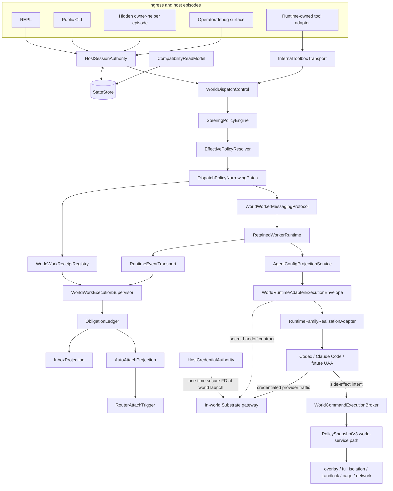

# Target Architecture

## Executive decision

Substrate's permanent runtime architecture is a surface-neutral durable control plane:

> Surfaces are ingress. Sessions are authority. Long-lived work returns receipts. World work is supervised. Obligations are canonical. Credentials enter worlds once through the in-world gateway. UAA side effects are brokered. Policy can only narrow. Runtime-family adapters stay thin.



`RuntimeToolInvocationAdapter -> InternalToolboxTransport` is the model-visible ingress route. Native CLI, REPL, and operator surfaces call the same authority and dispatch core through typed internal APIs; they do not detour through an agent-visible tool protocol.

## Authority map

| Boundary | Owns | Must not own |
|---|---|---|
| SurfaceAdapter / HostExecutionEpisode | input normalization, live channels, rendering, episode-local cancellation, readiness observations | durable posture, world binding, retained continuity, successor allocation, terminal truth, transition-intent issuance/claim/application |
| HostSessionAuthority | exact session/caller/lineage/session-world-binding resolution; durable posture transitions; revision-bound host-transition-intent issuance, claim validation, replay-safe application, and reconciliation | physical world realization or ownership metadata, runtime-process placement, transport loops, provider mechanics, compatibility projection |
| StateStore | bounded atomic physical persistence, migrations, schema evolution | lifecycle, receipt, supervisor, routing, or liveness-derived semantic authority; generic activated-store writes |
| CompatibilityReadModel | legacy reads, torn-root diagnostics, compatibility projection/migration | new authority writes or overriding newer revisions |
| WorldDispatchControl | typed world verbs and orchestration of authority/policy/receipt/runtime boundaries; blocking compatibility inspect/wait/cancel routing that consumes exact receipt/supervisor truth | physical world ownership adoption, provider-specific execution, direct policy invention, or ownership of accepted-work/observation truth |
| SteeringPolicyEngine | deny-by-default action/mode/backend/session/world/autonomy decisions | effective policy materialization or runtime launch |
| EffectivePolicyResolver | parent-policy composition and immutable `PolicySnapshotV3` materialization | enforcement by advisory flags alone |
| WorldWorkReceiptRegistry | proposed acceptance-record identity/request context before submission; durable immutable accepted task/turn identity only after runtime acknowledgement; immutable recording of any owner-supplied host-transition correlation | runtime acceptance itself, active observation claims, frame/event journals, terminal reconciliation, stream ownership, host-transition interpretation, or worker lifecycle policy |
| RuntimeEventTransport | producer-assigned stable stream/frame/event/terminal identity and monotonic ordering | receipt acceptance, durable observation, retained-message semantics, obligation semantics, or completeness |
| WorldWorkExecutionSupervisor | durable active-observation claims, no-gap post-acceptance frame/event journal, exact acceptance joins, opaque correlation-byte retention, duplicate/reorder rejection, caller-drop survival, restart recovery/reconciliation, and monotonic terminal closeout | proposal or immutable acceptance-record truth, foreground tool semantics, model-facing identity, retained-message or host-transition semantics, or obligation classification/materialization |
| WorldWorkerMessagingProtocol | fail-closed producer-side normalization of provider events plus exact retained target/source, active-run, thread, typed event class, attention, and request/message/event causation semantics | transport ordering, receipt acceptance, observation ownership, or obligation materialization |
| RetainedWorkerRuntime | worker create/continue/park/cancel/stop/fork/inspect/invalidate lifecycle; retained admission, R0-registration join, transport-claim, routability, and exact terminal truth | HSA world binding, physical world ownership metadata, host-session posture, or obligation projection |
| ObligationLedger | obligation classification, idempotent materialization, canonical revisions and records, completeness watermarks/cuts, closed snapshots, and attention/review/deferred-action truth | runtime identity generation, stream observation, host rendering, prompt replay, or direct worker continuation |
| Inbox / AutoAttach / Router | derived review view, attach eligibility, sanctioned host ownership restoration | approving, answering, forking, or continuing workers |
| AgentConfigProjectionService | logical inventory and non-secret effective/native projection per worker identity; launch-time secret-handoff intent | treating `.codex`, `CODEX_HOME`, `config.toml`, auth files, or workspace files as credential authority |
| WorldRuntimeAdapterExecutionEnvelope | guest-realizable launch contract bound to world, worker, config, policy snapshot, credential posture, secret-handoff ref, and equality-only exact world-ownership prerequisite | raw credential payloads, HSA or backend ownership authority, provider-specific parsing, or unrestricted side effects |
| WorldCommandExecutionBroker | every UAA shell/edit/write/tool/process/network side effect under the accepted policy snapshot | bypassing world-service because the initial process is in-world |
| RuntimeFamilyRealizationAdapter | provider launch, resume, output parsing, non-secret native config format, gateway endpoint wiring, provider cancellation mechanics; runtime-family/world-backend physical world realization and exact ownership-metadata publication under validated HSA proof | raw host credentials; minting or changing HSA binding, admission, policy, receipt, obligation, routability, or terminal semantics |

## Non-negotiable invariants

### 1. Durable session truth is process-independent

Durable truth is the exact session identity, authoritative lineage, workspace/world binding, attach contract, retained-worker refs, resume handles, posture, and policy revision. Helper PID, attached client, socket reachability, startup stream state, and owner-process liveness are observations only.

Runtime execution scope and durable session world binding are distinct authority dimensions.
`AgentDescriptorV1.execution_scope` and the matching launch knob describe runtime placement;
`DurableSessionAuthorityV1.world_binding` describes the parent orchestration session's exact
available world substrate. Runtime placement and session binding are not bijective: a host-executing
orchestrator may own a world-backed durable session, while a world-executing runtime requires that
exact binding. The frozen Start acceptance matrix is:

| Descriptor and launch scope | Session world binding | Result |
|---|---|---|
| `Host` | `None` | accept |
| `Host` | `Some(exact binding)` | accept |
| `World` | `Some(exact binding)` | accept |
| `World` | `None` | reject |

Descriptor scope must still equal requested launch scope, and any present binding must contain the
exact non-empty world ID and generation supplied by session truth. `Host + Some` does not place the
host runtime in the world. Host participant manifests remain host-scoped and do not acquire
participant-level world placement fields; the binding stays on the durable session authority.
World filesystem, network, caging, policy, capability, and enforcement semantics are unchanged.

#### Exact bound-world physical ownership

The durable session binding and the backend's physical ownership metadata are separate truths.
`HostSessionAuthority` alone says which exact world ID and generation belong to the session. The
runtime-family/world backend may only realize that already-authoritative tuple physically. For the
bounded B3.2a-WA prerequisite, `ExactBoundWorldOwnershipAdoptionV1` is an internal operation
contract, not a `world-api` field and not a persisted wire-schema version. It permits one exact
transition:

```text
GenericExactBoundWorld -> SharedSessionOwnerExactBoundWorld
```

The transition preserves world ID and generation, exact-joins the validated HSA session/policy and
project/world-spec identity, and durably publishes ownership metadata before member process
creation. An exact already-adopted tuple joins without rewrite; any foreign owner, changed session,
generation, policy, project, spec, missing/corrupt metadata, or ambiguous publication fails closed.
Shell state, helper state, PID, timeout, socket, caller disappearance, process liveness, prompt
content, and compatibility projections are never adoption authority. Adoption changes no HSA or
RetainedWorkerRuntime record and proves neither transport submission nor member launch, Registered,
routability, or terminal success. Compatibility requests without the exact authority-managed proof
and ordinary world execution retain their existing physical-realization behavior.

### 2. Private transports are fast paths

Prompt, stop, cancel, toolbox, and heartbeat channels use one of:

```text
Available
UnavailableButDurableAuthorityExists
UnavailableAndNoAuthoritativeRoute
StaleOrOrphaned
```

A stale episode may not overwrite a newer authority revision. An unavailable channel may not block durable closeout when exact authority and closeout rules permit it.

Hidden-helper plan creation, load, removal, and delivery are fast-path transport mechanics. They may carry a durable transition-intent reference and immutable commitment hash, but plan presence, successful read, or deletion never issues, claims, applies, expires, or rejects authority. Authority retains an access-controlled, hash-verified reprojection payload until exact terminal handoff, so load-then-remove plus helper failure cannot destroy the retry route. Exact retry resumes or joins recorded application/input results without repeating them; a substituted or stale plan fails closed.

### 3. Routing is exact and fail-closed

Every world verb resolves exact session, caller, backend, world id/generation, and task/worker/active-run identity. Backend-only selection ambiguity fails closed. Model-facing callers never supply internal lease, resume, UAA-session, or participant lineage truth.

### 4. Long-lived work accepts before it completes

`run_world_task` and `continue_world_worker` persist accepted receipts and return durable handles before terminal exit. A blocking UX may wait on the receipt; it may not redefine the core contract. The supervisor—not the foreground tool call—owns the terminal-framed stream.

Durable observation ownership may land before model-visible early return: the foreground may remain
a compatibility waiter over the receipt while the supervisor alone ingests and closes the stream.
At the exact acceptance transition, the supervisor claim must become durable before any subsequent
frame can be consumed outside its journal. Dropping a foreground waiter or guard cannot delete an
accepted record, supervisor claim, journal entry, or supervised work.

### 5. Cancel targets active work

Cancel resolves an active task/turn receipt. Worker identity establishes routing context; it does not prove active cancelable work. `NoActiveCancelableWork` is distinct from stale linkage, invalid identity, owner unreachable, and already terminal.

### 6. Obligations are event-derived canonical truth

Attention-driving runtime events are persisted by the supervisor and materialized by
`ObligationLedger` into idempotent obligations as they arrive, before terminal exit when applicable.
For an accepted retained stream, every post-acknowledgement semantic `Event` frame is normalized
into the typed messaging envelope and included in the ledger's ordered classified-event set; an
unknown, untyped, or omitted event keeps the materialization cut non-Complete.
The ledger alone advances the per-session revision and materialized-through watermark and declares
a Complete cut for an exact runtime-generated terminal event ID/sequence. Stream exhaustion, EOF,
timeout, PID/helper/socket state, inbox rows, pending counts, worker flags, and compatibility
projections cannot establish event completion or obligation completeness. Host `awaiting_attention`
derives from unresolved obligations. Worker `attention_pending` is a separate lifecycle state.

### 7. Auto-attach restores ownership only

The router may discover, claim, restore/launch a sanctioned host episode, record the outcome, and stop. It may not submit a prompt, approve, fork, answer, or continue a worker.

### 8. World placement and policy mediation are separate proofs

A world-scoped UAA must both:

1. start from a guest-realizable runtime envelope; and
2. route every side-effecting operation through Substrate-owned policy enforcement.

`cwd`, `CODEX_HOME`, `SUBSTRATE_CAGED`, `add_dirs`, or `external_sandbox=true` do not prove operation mediation.

### 9. `external_sandbox` assigns responsibility

For world-scoped UAA execution, `agent_api.exec.external_sandbox.v1=true` means Substrate's broker/world-service path is the sandbox authority. If that path is unavailable for any side-effecting channel, the operation fails closed.

### 10. Dispatch policy only narrows

```text
effective_turn_policy =
  current parent policy
  AND retained-worker capability cap, when present
  AND dispatch/turn narrowing patch, when present
```

Accepted work uses an immutable `PolicySnapshotV3`. Parent policy changes affect future acceptance; they do not silently mutate active work.

### 11. Existing `world_fs` enforcement is the execution path

Dispatch narrowing uses restricted `PolicyPatch.world_fs`, canonical finalization, `PolicySnapshotV3`, and the existing world-service overlay/full-isolation/Landlock/caged/network machinery. Do not create a parallel filesystem sandbox.

### 12. Runtime-native configuration is projection

Projection identity includes retained-worker identity; workspace plus backend plus world generation is too coarse. Runtime homes and workspace overlays may be durable or mutable by policy, but never become the source of Substrate authority.

### 13. Credentials are launch-time gateway handoff, not projected files

For world-scoped UAA adapters, host credentials must not be copied into the world as durable runtime-native files.

The target V1 end-to-end contract is:

```text
host credential authority
  -> launch-time secret handoff
  -> secure one-time FD
  -> in-world Substrate gateway
  -> gateway-owned credential/session material
  -> UAA adapter accesses credentials only through the gateway/broker contract
```

The carrier segment through the in-world gateway is already a landed positive primitive on the managed gateway path: `GatewayAuthBundleV1`, the `world-service` inherited-pipe launcher, `SUBSTRATE_LLM_AUTH_BUNDLE_FD`, and gateway-side one-time read/validation exist with focused integration coverage. Refactor slices must preserve and adopt that carrier, not recreate it.

The remaining target gap is consumer realization: direct world Codex/member execution must be pointed at the managed gateway, and its per-worker `CODEX_HOME`, `config.toml`, provider endpoint, and other runtime-native files must be constructed by Substrate from logical config plus accepted policy. Current seed-home auth/config copying is a compatibility bridge. The complete Codex-through-gateway path remains unproven until that adoption and projection path is exercised by production-path smoke/e2e.

The in-world Substrate gateway is the credential-receiving boundary. Credentials are passed once at world launch through a secure FD scoped to that gateway. The gateway consumes the payload, prevents inheritance by the UAA child, closes the descriptor, and owns upstream credential application/session material.

Runtime-native files such as `CODEX_HOME`, `.codex`, `config.toml`, `.mcp.json`, or auth files may contain bounded non-secret projection hints when required, but they must not become durable credential authority. The UAA runtime does not read the secret FD directly.

Copying host credentials and a minimal Codex `config.toml` into the world is a transitional compatibility bridge only. It must be explicitly named and logged, must have retirement criteria, and cannot satisfy `ContractCorrectAndProven`.

If secure gateway handoff is unavailable for a credential-requiring world adapter, that adapter must fail closed or run under the explicitly named, logged, non-promotable compatibility mode. V1 permits no unnamed fallback to ambient host credentials, copied auth, or host keyring discovery.

### 14. `SUBSTRATE_HOME` is private per-user authority state

`SUBSTRATE_HOME` contains one operating-system user's configuration, policy, dependency inventory,
runtime, and authority state. Creating and accepting that root is part of authority bootstrap: the
physical directory is owned by the intended per-user owner, has exact owner-only mode `0700`
independent of ambient umask, has no foreign ACL grants, and is opened and revalidated no-follow
before any descendant bootstrap. Existing nonconforming roots fail closed without chmod, chown,
ACL removal, migration, adoption, deletion, or other automatic repair. Custom homes remain valid
only when they satisfy the same contract. Multiple operating-system principals directly sharing
one `SUBSTRATE_HOME` are unsupported in A1 V1.

Directory creation and identity acceptance are distinct. `mkdirat` success establishes only a
candidate name under an already-opened trusted parent; portable Linux/macOS APIs do not atomically
create a directory and return its inode-bound handle. The accepted `PrivateSubstrateHomeV1`
physical identity begins at the first successful no-follow directory open followed by
descriptor-based owner, type, exact-mode, ACL, filesystem, and physical-identity validation. The
parent remains descriptor-bound across candidate creation and opening and must already have the
expected type and owner, no write authority for another principal, and no disallowed ACL grant.
Legitimate concurrent Substrate creators converge when one creates and another observes
`AlreadyExists`: each no-follow opens and validates the candidate, and only its exact accepted
descriptor identity may proceed.

After that first accepted open, all descendant access remains descriptor-relative and the child
name is rejoined to the accepted descriptor identity at required publication or acceptance
boundaries. Rename, replacement, owner/mode/ACL drift, or validation uncertainty fails closed.
Preventing malicious root or malicious code already executing under the same UID from substituting
the child before the first descriptor acquisition is outside the A1 V1 threat model. A1.1d-5
therefore requires neither an impossible atomic create-and-bind claim nor a privileged creation
broker; adding such a broker is a separately approved architecture change.

World members do not gain direct traversal authority over the host user's private home. They
consume configuration, policy, dependency, and credential material through Substrate-owned
projection and mediation boundaries. A privileged Substrate service may access the private root
only as the currently landed service boundary requires; that access does not convert the root into
shared state. If an unprivileged world process is found to depend on direct traversal, work stops
for an explicit projection/broker boundary change rather than broadening permissions.

Private-home enforcement does not alter effective policy or narrow world capabilities. Existing
filesystem read/discovery/write rules, host visibility, isolation and copy/overlay strategy,
network modes and DNS enforcement, PTY/non-PTY execution, dependency synchronization, gateway
handoff, runtime availability, shims, replay, traces, diagnostics, and lifecycle/binding behavior
remain governed by their existing contracts. A separate shared installation root may be designed
later; `SUBSTRATE_ROOT`/installation-root separation is not part of A1.1d-5.

## Review question

Every refactor PR must be able to answer:

> Can Substrate prove exact session identity, exact applicable binding, exact applicable policy snapshot, exact applicable credential handoff, exact applicable work receipt, and durable lifecycle/obligation truth for this action regardless of ingress surface?

If the answer depends on a helper still running, a socket being reachable, a terminal tool call returning, or an env variable being trusted, the target architecture has not landed.
