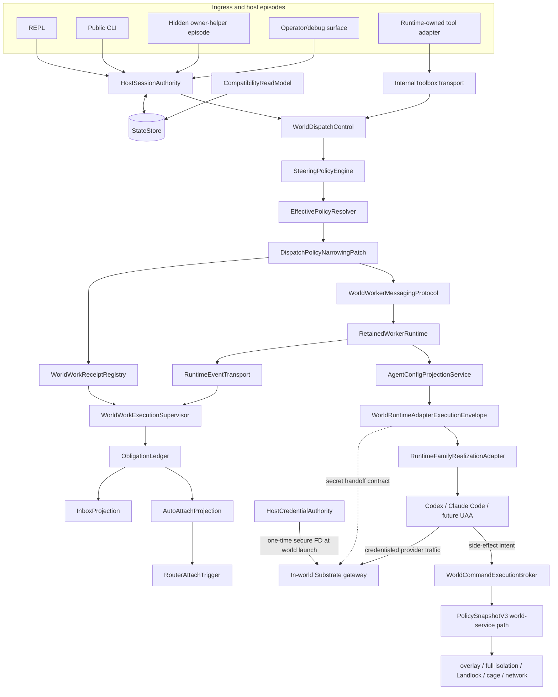

# Target Architecture

## Executive decision

Substrate's permanent runtime architecture is a surface-neutral durable control plane:

> Surfaces are ingress. Sessions are authority. Long-lived work returns receipts. World work is supervised. Obligations are canonical. Credentials enter worlds once through the in-world gateway. UAA side effects are brokered. Policy can only narrow. Runtime-family adapters stay thin.



`RuntimeToolInvocationAdapter -> InternalToolboxTransport` is the model-visible ingress route. Native CLI, REPL, and operator surfaces call the same authority and dispatch core through typed internal APIs; they do not detour through an agent-visible tool protocol.

### Current B1/B2.1 control state

The immutable receipt core is recovered and review-clean through `6436289f`; the durable
supervisor core through `c519024b`; exact replay/startup activation through `de727091`; and the
versioned authority-store correction through `717579b0`. The action-scoped B-owned dispatch view,
including the read-only active-task tool adapter, is review-clean through `83101dcb`. This records
only the B1/B2.1-0 prerequisite: B1 and B2.1 remain below complete, their joint production
integration closeout has not begun, foreground behavior remains blocking until B2.2, B3.1 is not
dependency-ready, and no seam classification is promoted.

## Authority map

| Boundary | Owns | Must not own |
|---|---|---|
| SurfaceAdapter / HostExecutionEpisode | input normalization, live channels, rendering, episode-local cancellation, readiness observations; the current bounded production activation call into canonical supervisor recovery | durable posture, world binding, retained continuity, successor allocation, restart discovery/reconciliation, supervisor-record interpretation, terminal truth, transition-intent issuance/claim/application |
| HostSessionAuthority | exact session/caller/lineage/session-world-binding resolution; durable posture transitions; revision-bound host-transition-intent issuance, claim validation, replay-safe application, and reconciliation | physical world realization or ownership metadata, runtime-process placement, transport loops, provider mechanics, compatibility projection |
| StateStore | bounded atomic physical persistence, migrations, schema evolution | lifecycle, receipt, supervisor, routing, or liveness-derived semantic authority; generic activated-store writes |
| CompatibilityReadModel | legacy reads, torn-root diagnostics, compatibility projection/migration | new authority writes or overriding newer revisions |
| WorldDispatchControl | typed world verbs and orchestration of authority/policy/receipt/runtime boundaries; blocking compatibility inspect/wait/cancel routing that consumes exact receipt/supervisor truth | physical world ownership adoption, provider-specific execution, direct policy invention, or ownership of accepted-work/observation truth |
| SteeringPolicyEngine | deny-by-default action/mode/backend/session/world/autonomy decisions | effective policy materialization or runtime launch |
| EffectivePolicyResolver | parent-policy composition and immutable `PolicySnapshotV3` materialization | enforcement by advisory flags alone |
| WorldWorkReceiptRegistry | proposed acceptance-record identity/request context before submission; durable immutable accepted task/turn identity only after runtime acknowledgement; immutable recording of any owner-supplied host-transition correlation | runtime acceptance itself, active observation claims, frame/event journals, terminal reconciliation, stream ownership, host-transition interpretation, or worker lifecycle policy |
| RuntimeEventTransport | producer-assigned stable stream/frame/event/terminal identity and monotonic ordering; bounded process-memory retention and exact replay transport for supplied acceptance-record/stream/cursor identity | receipt acceptance, durable observation, stream enumeration, fuzzy lookup, lifecycle or terminal truth, retained-message semantics, obligation semantics, or completeness |
| WorldWorkExecutionSupervisor | sole ownership of durable active-observation claims, no-gap post-acceptance frame/event journal, exact acceptance joins, opaque correlation-byte retention, duplicate/reorder rejection, caller-drop survival, restart discovery/recovery/reconciliation, unresolved replay state, and monotonic terminal closeout | proposal or immutable acceptance-record truth, foreground tool or startup-surface semantics, model-facing identity, producer-frame retention, retained-message or host-transition semantics, or obligation classification/materialization |
| WorldWorkerMessagingProtocol | fail-closed producer-side normalization of provider events plus exact retained target/source, active-run, thread, typed event class, attention, and request/message/event causation semantics | transport ordering, receipt acceptance, observation ownership, or obligation materialization |
| RetainedWorkerRuntime | worker create/continue/park/cancel/stop/fork/inspect/invalidate lifecycle; retained admission, R0-registration join, transport-claim, routability, and exact terminal truth | HSA world binding, physical world ownership metadata, host-session posture, or obligation projection |
| ObligationLedger | obligation classification, idempotent materialization, canonical revisions and records, completeness watermarks/cuts, closed snapshots, and attention/review/deferred-action truth | runtime identity generation, stream observation, host rendering, prompt replay, or direct worker continuation |
| Inbox / AutoAttach / Router | derived review view, attach eligibility, sanctioned host ownership restoration | approving, answering, forking, or continuing workers |
| AgentConfigProjectionService | logical inventory and non-secret effective/native projection per worker identity; launch-time secret-handoff intent | treating `.codex`, `CODEX_HOME`, `config.toml`, auth files, or workspace files as credential authority |
| WorldRuntimeAdapterExecutionEnvelope | guest-realizable launch contract bound to world, worker, config, policy snapshot, credential posture, secret-handoff ref, and equality-only exact world-ownership prerequisite | raw credential payloads, HSA or backend ownership authority, provider-specific parsing, or unrestricted side effects |
| WorldCommandExecutionBroker | every UAA shell/edit/write/tool/process/network side effect under the accepted policy snapshot | bypassing world-service because the initial process is in-world |
| RuntimeFamilyRealizationAdapter | provider launch, resume, output parsing, non-secret native config format, gateway endpoint wiring, provider cancellation mechanics; runtime-family/world-backend physical world realization and exact ownership-metadata publication under validated HSA proof | raw host credentials; minting or changing HSA binding, admission, policy, receipt, obligation, routability, or terminal semantics |

## Non-negotiable invariants

### 1. Durable session truth is process-independent

Durable truth is the exact session identity, authoritative lineage, workspace/world binding, attach contract, retained-worker refs, resume handles, posture, and policy revision. Helper PID, attached client, socket reachability, startup stream state, and owner-process liveness are observations only.

Runtime execution scope and durable session world binding are distinct authority dimensions.
`AgentDescriptorV1.execution_scope` and the matching launch knob describe runtime placement;
`DurableSessionAuthorityV1.world_binding` describes the parent orchestration session's exact
available world substrate. Runtime placement and session binding are not bijective: a host-executing
orchestrator may own a world-backed durable session, while a world-executing runtime requires that
exact binding. The frozen Start acceptance matrix is:

| Descriptor and launch scope | Session world binding | Result |
|---|---|---|
| `Host` | `None` | accept |
| `Host` | `Some(exact binding)` | accept |
| `World` | `Some(exact binding)` | accept |
| `World` | `None` | reject |

Descriptor scope must still equal requested launch scope, and any present binding must contain the
exact non-empty world ID and generation supplied by session truth. `Host + Some` does not place the
host runtime in the world. Host participant manifests remain host-scoped and do not acquire
participant-level world placement fields; the binding stays on the durable session authority.
World filesystem, network, caging, policy, capability, and enforcement semantics are unchanged.

#### Exact bound-world physical ownership

The durable session binding and the backend's physical ownership metadata are separate truths.
`HostSessionAuthority` alone says which exact world ID and generation belong to the session. The
runtime-family/world backend may only realize that already-authoritative tuple physically. For the
bounded B3.2a-WA prerequisite, `ExactBoundWorldOwnershipAdoptionV1` is an internal operation
contract, not a `world-api` field and not a persisted wire-schema version. It permits one exact
transition:

```text
GenericExactBoundWorld -> SharedSessionOwnerExactBoundWorld
```

The transition preserves world ID and generation, exact-joins the validated HSA session/policy and
project/world-spec identity, and durably publishes ownership metadata before member process
creation. An exact already-adopted tuple joins without rewrite; any foreign owner, changed session,
generation, policy, project, spec, missing/corrupt metadata, or ambiguous publication fails closed.
Shell state, helper state, PID, timeout, socket, caller disappearance, process liveness, prompt
content, and compatibility projections are never adoption authority. Adoption changes no HSA or
RetainedWorkerRuntime record and proves neither transport submission nor member launch, Registered,
routability, or terminal success. Compatibility requests without the exact authority-managed proof
and ordinary world execution retain their existing physical-realization behavior.

### 2. Private transports are fast paths

Prompt, stop, cancel, toolbox, and heartbeat channels use one of:

```text
Available
UnavailableButDurableAuthorityExists
UnavailableAndNoAuthoritativeRoute
StaleOrOrphaned
```

A stale episode may not overwrite a newer authority revision. An unavailable channel may not block durable closeout when exact authority and closeout rules permit it.

Hidden-helper plan creation, load, removal, and delivery are fast-path transport mechanics. They may carry a durable transition-intent reference and immutable commitment hash, but plan presence, successful read, or deletion never issues, claims, applies, expires, or rejects authority. Authority retains an access-controlled, hash-verified reprojection payload until exact terminal handoff, so load-then-remove plus helper failure cannot destroy the retry route. Exact retry resumes or joins recorded application/input results without repeating them; a substituted or stale plan fails closed.

### 3. Routing is exact and fail-closed

Every world verb resolves exact session, caller, backend, world id/generation, and task/worker/active-run identity. Backend-only selection ambiguity fails closed. Model-facing callers never supply internal lease, resume, UAA-session, or participant lineage truth.

### 4. Long-lived work accepts before it completes

`run_world_task` and `continue_world_worker` persist accepted receipts and return durable handles before terminal exit. A blocking UX may wait on the receipt; it may not redefine the core contract. The supervisor—not the foreground tool call—owns the terminal-framed stream.

Durable observation ownership may land before model-visible early return: the foreground may remain
a compatibility waiter over the receipt while the supervisor alone ingests and closes the stream.
At the exact acceptance transition, the supervisor claim must become durable before any subsequent
frame can be consumed outside its journal. Dropping a foreground waiter or guard cannot delete an
accepted record, supervisor claim, journal entry, or supervised work.

#### B2.1-3 restart and producer-replay boundary

`WorldWorkExecutionSupervisor` alone discovers durable nonterminal observations, interprets claims
and journals, validates the exact acceptance-record/stream/cursor join, starts reconciliation, and
decides whether exact B0 truth may advance or terminalize an observation. A startup surface may
invoke exactly one canonical recovery operation and retain the returned observation tasks. The
current `run_async_repl` call is only that bounded production activation hook: it cannot enumerate
or interpret supervisor records, reproduce recovery logic, or make lifecycle decisions. This hook
does not establish complete ingress-surface neutrality and cannot promote `SurfaceAdapter`,
`HostExecutionEpisode`, or `WorldWorkExecutionSupervisor`.

World-service may keep a bounded process-memory producer registry of exact B0 frames and expose
replay only for a supplied exact acceptance-record ID, exact stream ID, and exact frame cursor.
Frame identity, canonical bytes, and ordering remain unchanged. The endpoint cannot enumerate
streams or accept a fuzzy, backend-only, session-only, or otherwise partial lookup. Explicit stream,
per-stream frame, and per-stream byte limits are mandatory. Missing, mismatched, expired,
unavailable, corrupt, reordered, or conflicting replay fails closed. Producer replay cannot create
acceptance, an observation claim, terminal truth, an obligation, lifecycle truth, or success.

The supported restart domains are exact:

1. After a host/shell restart while the world-service registry survives, the durable supervisor
   discovers its nonterminal claim, reconnects by exact acceptance/stream/cursor identity, replays
   missing frames, and resumes live observation without duplicate journal transitions.
2. After a world-service restart, or whenever producer replay is unavailable, the durable claim
   remains nonterminal and unresolved. No terminal result, success, cancellation, deletion, cursor
   advance, or Complete obligation cut is fabricated. The shell may report the exact unresolved or
   replay-unavailable state, but PID, helper, socket, process, readiness, timeout, caller presence,
   endpoint absence, EOF, and stream exhaustion cannot resolve it.

Ordinary shell startup must distinguish fatal recovery-initialization corruption from a valid
nonterminal claim whose producer is unavailable. Corrupt storage, invalid claim identity, or an
impossible durable state fails closed. An individually unavailable producer stays durably
unresolved and does not require startup to pretend the stream resumed successfully.

### 5. Cancel targets active work

Cancel resolves an active task/turn receipt. Worker identity establishes routing context; it does not prove active cancelable work. `NoActiveCancelableWork` is distinct from stale linkage, invalid identity, owner unreachable, and already terminal.

### 6. Obligations are event-derived canonical truth

Attention-driving runtime events are persisted by the supervisor and materialized by
`ObligationLedger` into idempotent obligations as they arrive, before terminal exit when applicable.
For an accepted retained stream, every post-acknowledgement semantic `Event` frame is normalized
into the typed messaging envelope and included in the ledger's ordered classified-event set; an
unknown, untyped, or omitted event keeps the materialization cut non-Complete.
The ledger alone advances the per-session revision and materialized-through watermark and declares
a Complete cut for an exact runtime-generated terminal event ID/sequence. Stream exhaustion, EOF,
timeout, PID/helper/socket state, inbox rows, pending counts, worker flags, and compatibility
projections cannot establish event completion or obligation completeness. Host `awaiting_attention`
derives from unresolved obligations. Worker `attention_pending` is a separate lifecycle state.

### 7. Auto-attach restores ownership only

The router may discover, claim, restore/launch a sanctioned host episode, record the outcome, and stop. It may not submit a prompt, approve, fork, answer, or continue a worker.

### 8. World placement and policy mediation are separate proofs

A world-scoped UAA must both:

1. start from a guest-realizable runtime envelope; and
2. route every side-effecting operation through Substrate-owned policy enforcement.

`cwd`, `CODEX_HOME`, `SUBSTRATE_CAGED`, `add_dirs`, or `external_sandbox=true` do not prove operation mediation.

### 9. `external_sandbox` assigns responsibility

For world-scoped UAA execution, `agent_api.exec.external_sandbox.v1=true` means Substrate's broker/world-service path is the sandbox authority. If that path is unavailable for any side-effecting channel, the operation fails closed.

### 10. Dispatch policy only narrows

```text
effective_turn_policy =
  current parent policy
  AND retained-worker capability cap, when present
  AND dispatch/turn narrowing patch, when present
```

Accepted work uses an immutable `PolicySnapshotV3`. Parent policy changes affect future acceptance; they do not silently mutate active work.

### 11. Existing `world_fs` enforcement is the execution path

Dispatch narrowing uses restricted `PolicyPatch.world_fs`, canonical finalization, `PolicySnapshotV3`, and the existing world-service overlay/full-isolation/Landlock/caged/network machinery. Do not create a parallel filesystem sandbox.

### 12. Runtime-native configuration is projection

Projection identity includes retained-worker identity; workspace plus backend plus world generation is too coarse. Runtime homes and workspace overlays may be durable or mutable by policy, but never become the source of Substrate authority.

### 13. Credentials are launch-time gateway handoff, not projected files

For world-scoped UAA adapters, host credentials must not be copied into the world as durable runtime-native files.

The target V1 end-to-end contract is:

```text
host credential authority
  -> launch-time secret handoff
  -> secure one-time FD
  -> in-world Substrate gateway
  -> gateway-owned credential/session material
  -> UAA adapter accesses credentials only through the gateway/broker contract
```

The carrier segment through the in-world gateway is already a landed positive primitive on the managed gateway path: `GatewayAuthBundleV1`, the `world-service` inherited-pipe launcher, `SUBSTRATE_LLM_AUTH_BUNDLE_FD`, and gateway-side one-time read/validation exist with focused integration coverage. Refactor slices must preserve and adopt that carrier, not recreate it.

The remaining target gap is consumer realization: direct world Codex/member execution must be pointed at the managed gateway, and its per-worker `CODEX_HOME`, `config.toml`, provider endpoint, and other runtime-native files must be constructed by Substrate from logical config plus accepted policy. Current seed-home auth/config copying is a compatibility bridge. The complete Codex-through-gateway path remains unproven until that adoption and projection path is exercised by production-path smoke/e2e.

The in-world Substrate gateway is the credential-receiving boundary. Credentials are passed once at world launch through a secure FD scoped to that gateway. The gateway consumes the payload, prevents inheritance by the UAA child, closes the descriptor, and owns upstream credential application/session material.

Runtime-native files such as `CODEX_HOME`, `.codex`, `config.toml`, `.mcp.json`, or auth files may contain bounded non-secret projection hints when required, but they must not become durable credential authority. The UAA runtime does not read the secret FD directly.

Copying host credentials and a minimal Codex `config.toml` into the world is a transitional compatibility bridge only. It must be explicitly named and logged, must have retirement criteria, and cannot satisfy `ContractCorrectAndProven`.

If secure gateway handoff is unavailable for a credential-requiring world adapter, that adapter must fail closed or run under the explicitly named, logged, non-promotable compatibility mode. V1 permits no unnamed fallback to ambient host credentials, copied auth, or host keyring discovery.

### 14. `SUBSTRATE_HOME` is private per-user authority state

`SUBSTRATE_HOME` contains one operating-system user's configuration, policy, dependency inventory,
runtime, and authority state. Creating and accepting that root is part of authority bootstrap: the
physical directory is owned by the intended per-user owner, has exact owner-only mode `0700`
independent of ambient umask, has no effective other-principal authority, rejects every observable
POSIX access or default ACL, and is opened and revalidated no-follow before any descendant
bootstrap. On Linux, `ENODATA` means only that the kernel returned no ACL data; it does not prove
physical xattr absence and is accepted only with exact owner/type/`0700` mode, stable descriptor
identity, no-follow traversal, and replacement-safety proof. Existing nonconforming roots fail
closed without chmod, chown, ACL removal, migration, adoption, deletion, or other automatic repair.
Custom homes remain valid only when they satisfy the same contract. Multiple operating-system
principals directly sharing one `SUBSTRATE_HOME` are unsupported in A1 V1.

Directory creation and identity acceptance are distinct. `mkdirat` success establishes only a
candidate name under an already-opened trusted parent; portable Linux/macOS APIs do not atomically
create a directory and return its inode-bound handle. The accepted `PrivateSubstrateHomeV1`
physical identity begins at the first successful no-follow directory open followed by
descriptor-based owner, type, exact-mode, ACL, filesystem, and physical-identity validation. The
parent remains descriptor-bound across candidate creation and opening and must already have the
expected type and owner and no create/delete/rename/replacement authority for another principal.
Ancestor access ACLs and default ACLs are different security surfaces. A named access entry is
evaluated after the ACL mask: effective read/search without effective write does not itself grant
replacement authority, while any effective write bit remains rejected, including write-only
entries. Default ACLs can be inherited into a new child and are rejected on every ancestor before
candidate creation in V1; supporting one requires a later separately approved contract. Malformed,
unreadable, unsupported, or ambiguous ACL state also fails closed. Under supported Linux POSIX
access-ACL semantics, `ACL_MASK` is the file group-class mode bits, so a named user/group entry
cannot retain effective write while the descriptor's authoritative group-write bit is clear.
Unknown ACL models are outside that proof and fail closed. These ancestor distinctions never weaken
the final root's exact owner, exact `0700`, observable-ACL rejection, or owner-only descendant modes.
Legitimate concurrent Substrate creators converge when one creates and another observes
`AlreadyExists`: each no-follow opens and validates the candidate, and only its exact accepted
descriptor identity may proceed.

After that first accepted open, all descendant access remains descriptor-relative and the child
name is rejoined to the accepted descriptor identity at required publication or acceptance
boundaries. Rename, replacement, owner/mode/ACL drift, or validation uncertainty fails closed.
Preventing malicious root or malicious code already executing under the same UID from substituting
the child before the first descriptor acquisition is outside the A1 V1 threat model. A1.1d-5
therefore requires neither an impossible atomic create-and-bind claim nor a privileged creation
broker; adding such a broker is a separately approved architecture change.

World members do not gain direct traversal authority over the host user's private home. They
consume configuration, policy, dependency, and credential material through Substrate-owned
projection and mediation boundaries. A privileged Substrate service may access the private root
only as the currently landed service boundary requires; that access does not convert the root into
shared state. If an unprivileged world process is found to depend on direct traversal, work stops
for an explicit projection/broker boundary change rather than broadening permissions.

Private-home enforcement does not alter effective policy or narrow world capabilities. Existing
filesystem read/discovery/write rules, host visibility, isolation and copy/overlay strategy,
network modes and DNS enforcement, PTY/non-PTY execution, dependency synchronization, gateway
handoff, runtime availability, shims, replay, traces, diagnostics, and lifecycle/binding behavior
remain governed by their existing contracts. A separate shared installation root may be designed
later; `SUBSTRATE_ROOT`/installation-root separation is not part of A1.1d-5.

#### Installation prefix authority and platform realization

The public installer or uninstaller selects exactly one normalized `InstallBootstrapContextV1`.
For V1, `selected_host_prefix`, `host_substrate_home`, and `host_substrate_root` are the same host
path and are bound to one platform-scoped intended principal. A declared `--prefix`, `--home`,
`-Prefix`, or the wrapper's self-derived installed prefix fixes that context before any child,
generated projection, sudo crossing, service renderer, doctor, runtime provisioner, or platform
adapter runs. A child may validate the transported context but may not reconstruct it from
`$HOME`, `$USERPROFILE`, CWD, an outer `SUBSTRATE_HOME`, or an independently selected root.

Generated `env.sh`, manager/profile/preexec helpers, configuration, version, dependency,
install-state, and Lima known-hosts files are projections of that decision. They never become
prefix-selection authority. When an
installed helper at A runs under conflicting ambient home B, it must self-derive A, validate any
encoded context/commitment against A, export both `SUBSTRATE_HOME=A` and `SUBSTRATE_ROOT=A`, and
consume only A. A missing, malformed, or conflicting projection fails closed; B is not a fallback.
The normal install/uninstall product gate must pass without an outer override. An explicitly named
diagnostic override may exercise a negative test, but it cannot satisfy product proof.

The shared Rust wire model lives in `transport-api-types`; OS path/principal construction remains
at the public shell/script entry. Its fixed line-framed, base64url field encoding has one
cross-language golden-vector suite and does not reuse, move, or duplicate the shell-private A1
authority-store canonical codec. Successful install-sensitive CLI routes construct this context
before private-home/dependency scaffolding; parse failures, help, `--version`, and `--version-json`
exit without creating private-home, dependency, shim, manager, trace, or generated-install state.
Installer-managed or focused private-home regression callers that need the existing scaffold use the
hidden `--install-bootstrap-home-v1` action only with
`--install-bootstrap-context-v1 <carrier>`. The root dispatcher strictly authenticates the carrier,
binds its Unix account+UID to the current principal, validates checked H/R projections, calls only the
existing explicit-context private-home/dependency bootstrap, and returns. Environment values alone
cannot select the action or internal-child mode, and normal output/errors/logs/traces never disclose
the carrier. Automatic
shim deploy, shim doctor/repair, physical shim telemetry, and shell/replay backend-factory callers
consume explicit context or mapping projections rather than common ambient path resolution.
Installer-managed product-CLI children use the hidden argv carrier as their child discriminator;
an environment carrier never selects internal mode. A context-aware Substrate-owned sudo child validates that
same argv carrier, while an arbitrary system tool receives only minimal context-derived argv from
the still-owning installer and never receives a meaningless carrier or preserved ambient home.
Before any internal-child dispatch, the current Unix account+UID or Windows account+SID must equal
the committed principal; a self-consistent carrier for another principal fails before projection
or mutation. Standalone self-derivation accepts the live Unix release link, Unix dev A/bin symlink,
and Windows release A/bin copy shapes through one exact invocation-witness algorithm; a direct
repository binary or ambiguous PATH witness still requires an explicit prefix.
World-deps/doctor/config/policy/gateway leaves receive typed context or a checked projection, and
host Codex paths derive from the committed Unix principal's account-database home.

Route C's Host/World doctor identity fields are a non-authoritative projection of that same
authenticated context. The public doctor execution is not classified as read-only: on Linux, the
existing `handle_host_command` → `host_doctor_main` and
`handle_world_command` → `world_doctor_main` paths carry typed IH to the final host-visible JSON or
text report. Optional `WorldDoctorReportV1` host-prefix and commitment fields remain data only: old
wire JSON may omit them, the in-world `doctor_world` producer emits them absent and reads no host
carrier, environment, prefix, principal, or context, and only the host shell may populate them from
typed IH. The legacy report adapter may project them only when its existing caller explicitly
supplies typed IH. A conflicting ambient home/root or generated projection cannot replace A.
Diagnostics never decode or disclose hidden carrier bytes, credentials, request bytes, secrets, or
sensitive principal material. The projected identity fields cannot install, repair, restart,
clean up, or otherwise change world, policy, capability, filesystem/network enforcement,
placement, caging, receipt, supervisor, retained-worker, credential, or lifecycle state. The public
Doctor compatibility path retains its existing active readiness, socket, service, endpoint, and
probe behavior. This is not a new authority seam, module owner, or execution family.

At the Route D checkpoint, the intended rule applied to the complete authenticated
shell/shim-doctor snapshot carrier.
The typed Unix report path passes one already-validated `InstallBootstrapContextV1` through
`collect_report_for_context` and `build_report` to both its embedded world-doctor and world-deps
branches. Health fixtures are diagnostic projections beneath `A/health` only; an ambient
`B/health/world_doctor.json` or `B/health/world_deps.json` cannot replace, supplement, redirect, or
appear in the A-bound report. When the embedded world-doctor branch invokes the existing product
CLI, the child receives the same canonical hidden argv carrier and only context-derived checked
environment projections. Those projections are child transport, never authority reconstruction.
Later source closure proved that the ordinary child could activate infrastructure and probe the
world, so the claim that the nested diagnostic was non-mutating was incorrect and is superseded by
the controlling F5-PD section below. A missing, malformed, tampered, wrong-principal, or contextless
Unix witness fails closed. Carrier bytes, credentials, request bytes, commitments not
already intended for public diagnostics, and sensitive principal data never enter report JSON,
text, fixtures, errors, logs, traces, or snapshots.

This closure changes no report schema, world-doctor meaning, fixture payload meaning, dependency
classification, world enforcement, policy, capability, service, installation, cleanup, receipt,
supervisor, retained-worker, credential, or lifecycle behavior. Non-Unix behavior stays on its
existing cfg path. The Unix checked-projection `collect_report` entrypoint and its crate-private
re-export remain temporary behavior-frozen R2-3 compatibility; Route D neither calls that path from
typed Health nor migrates the physical shim, replay, global trace compatibility, or platform-native
adapters.

#### Remaining authenticated runtime projections

Routes A–D are individually review-clean, but they do not exhaust the authenticated-context path.
The failed R2-2 integration closeout found two remaining projection seams and one diagnostic
composition invariant. R2-2E is implementation-, proof-, and review-complete. F0, F0a, F0b, and
F0-HC were then implemented, proof-complete, review-clean, committed, and preserved. R2-2F was the
exact next packet at that checkpoint. At the later F3/F4 checkpoint, F5-PD was the exact next
prerequisite beneath F5; the completed-F section below supersedes that historical status. A renewed
Routes A–F integration closeout follows F.

R2-2E makes world-gateway projection a pure consumer of already-authenticated A. The landed shell world
entry validates A before disabled/unavailable classification, then supplies it to one request-scoped
gateway context. Configuration and effective policy use their existing explicit-bootstrap-home
resolvers; `execution/policy_snapshot.rs` remains the sole policy-snapshot owner and adds the one
explicit-bootstrap-home world-network entrypoint; `execution/agent_inventory.rs` reuses its existing
bootstrap-home inventory loader. `world_gateway.rs` may combine those explicit outputs but may not
parse or re-resolve policy. Runtime-family and Codex paths are projections of A and the committed
Unix principal's account-database home. Environment-only invocation, malformed/tampered/mismatched
context, and a disabled route without valid A fail before gateway mutation, forwarding, or launch.
The contextless synthesized-unavailable constructor is removed. Linux uses the fixed canonical
`/run/substrate.sock` on this authenticated route; ambient socket overrides cannot retarget it.
On macOS, no authenticated typed endpoint source exists in E's closed allowlist: the authenticated
route therefore fails before client construction or ambient `auto_select`; it cannot invent or
accept an endpoint from environment/platform-control state. Lower Lima forwarding, known-hosts, and
transport realization remain R2-3. Windows and other contextless gateway entries likewise fail
before config, policy, inventory, disabled-state classification, or client selection until R2-3
supplies authenticated platform mapping. Existing ambient macOS/Windows compatibility clients remain
frozen and unreachable from the E route. Their cfg proof is build/static fail-closed preservation,
not native or authenticated product proof. Existing network allow/deny meaning, request schemas,
service behavior, and launch-time
gateway credential handoff do not change, and no host credential file becomes durable authority.

The exact landed E evidence is commit `7e8e83802885c0ece93efcaacccc26503eeb6715`, tree
`02a1a2f6b7e4be47ed9ec38537c805ae348c96b6`, ordinary/full-index patch identities
`fb7b65b02cdac46857750b64ebd5ceab651e8e99910c05240b187c3e729444ff` and
`c712f467ac92efb0de7b524272479741ac6b318201cf45dbd994116ec0e8b862`. This completes only
PI-111's R2-2E implementation/proof clause. The managed gateway secure-FD path is landed,
regression-proven, and unchanged by E; direct-member Codex/UAA gateway adoption remains unresolved,
transitional, non-promotable, and E3/D1/D3-owned. R2-2 itself remains incomplete, and no target seam
is promoted.

**A1.1d-5R2-2F0a — SUBSTRATE_HOME test isolation** joins R2-2F0 to establish one
test-process-only authority-environment boundary around every
same-process mutation of `SUBSTRATE_WORLD_SOCKET` or `SUBSTRATE_HOME`. F0's historically blocked candidate
already proves its exact socket pair 100/100 in parallel and 20/20 serially, but final broad runs
were `1118 passed / 150 failed` and `1119 passed / 149 failed`; the extra failure was
`dispatch_contract_adapter_active_task_resolution_requires_supervisor_claim`, which passes alone.
Non-source transition tracing proved that the unannotated
`prompt_submit_continuity_prefers_persisted_session_contract` fixture can set its private HOME,
the target can replace it, and the competitor can then remove the target's HOME while both overlap.
The pair failed 20/20 in parallel. The stable same-process serial harness controlled only
competitor-then-target and failed 0/10; separate-process sequential runs passed in both directions.
Stable libtest could not force reverse same-process order, so no such result is claimed. Commit
`f5a150f94d585b1f55ec0067845cd5d715773c78` first adds the exact unannotated competing mutation;
the target and its HOME-mutating fixture arrive later at
`83101dcbcc750e6e8fb8979bea19f1f777792188`, the first source commit where the exact pair coexists.

The reviewed topology is one process-global authority-environment lock, not separate HOME/socket
locks. At least 88 shell-library test functions depend jointly on HOME and socket state, and source
closure found opposite existing acquisition orders, so separate locks would permit mixed
authority snapshots and lock-order inversion. The shared boundary captures exact prior `OsString`
or absence, installs the test-owned value or absence, spans all dependent async/process work and
cleanup, restores during normal return or panic unwinding, and releases only after restoration.
Same-thread nesting must be explicitly safe and restore in stack order; panic/poison behavior must
be explicit and cannot strand later tests. `#[serial]` may remain but is never sufficient by
itself. Integration-test binaries remain process-local: direct parent mutations receive an
equivalent per-binary disposition, while child-only `Command::env` inputs need no cross-process
lock.

F0 also owns a source-closure-proven async cleanup correction in nine socket-owning tests in
`execution/orchestrator_world_dispatch.rs`: abort the server, await confirmed task cancellation,
finish fixture-owned socket/task cleanup, restore the environment, and release the isolation lock,
in that order. Reverse declaration/drop order and a single scheduler yield are not proof of task
termination. Production world-socket/HOME resolution, readiness, retained-worker behavior, retry
validation, and runtime bytes remain unchanged.

**A1.1d-5R2-2F0b — deterministic renderer-output test isolation** removes process-global
descriptor replacement from the two renderer fallback tests without changing the renderer's
production contract. Source closure binds the future change to the private Unix-only
`PublicPromptRenderer` ownership in
`crates/shell/src/execution/agent_runtime/control.rs`. `PublicPromptRenderer::render` remains
the production entry point; `PublicPromptRenderer::new` and the two production caller bodies,
`run_hidden_owner_helper_startup_prompt_stream_with_projection` and
`run_public_prompt_command`, remain frozen. A private explicit-writer core or equivalent private
sink adapter may sit beneath `render`; the production adapter must choose and lock only the
selected real stdout or stderr stream in the same order as today, write the same bytes and newline,
perform the same flush, and preserve which serialization/write errors propagate or are ignored.
No public API, output transport, registry, side table, process-global lock, environment-selected
sink, or eager dual-stream locking is permitted.

The observed stdout helper uses `dup2` on process fd 1. A parallel libtest reporter therefore
contributed its `.` to the test pipe, producing exactly
`".[codex] task_progress: fields=alpha, beta, gamma (+1 more)\n"`. The forced same-process
matrix passed 376 and failed 124 of 500 runs; isolated, same-process serial, and separate-process
controls passed 100/100, and parallel pretty reporting passed 99/100. The clean-E target/helper are
byte-identical to the F0/F0a candidate, so candidate introduction is unnecessary. The fd 2 helper
has the same ownership and structural race and is migrated with fd 1 even though only stdout
appeared in the wall. Tests receive their own stdout/stderr memory writers and compare the complete
exact selected bytes plus an empty nonselected stream. Filtering reporter bytes, partial-line
search, sleeps, retries, serial-only correctness, thread reduction, ignore, and weaker assertions
are outside the architecture.

R2-2F, when started after combined F0/F0a/F0b closeout, creates one request-scoped
`AuthenticatedWorldDepsContextV1` (or equivalently named typed
value) from the already-validated install context. It holds A's trusted bootstrap home/root,
non-secret commitment, explicit launch CWD/workspace scope, effective configuration and policy,
global config/deps paths, and the authenticated runtime-request projection. Normal current, global,
and workspace operations, world probes, install/sync, provision-deps, and post-provision sync receive
that value explicitly; no environment binding, process-global side table, parallel resolver, or
lower ambient re-entry is permitted. CWD remains an explicit workspace-scope input and never selects
the host authority root. An additive authenticated request builder serves only world-deps and
provision-deps and reuses R2-2E's projection convention. The existing shared ambient request
builders are frozen for explicit R2-3 compatibility work because their impact breadth is
HIGH/CRITICAL.

On the authenticated Unix/Linux route, doctor truth is constituent-coherent: a report may identify A only when configuration, effective
policy/world-fs policy, inventory, dependency state, world-deps runtime observations, and nested
world-doctor output all carry matching A prefix/commitment evidence. Missing evidence, a mismatched
fixture or child, a mixed A/B snapshot, or missing `ok` is `NeedsAttention`/unavailable or a closed
error, never inferred healthy A. Host and World doctor receive A-derived world-fs policy rather than
calling ambient profile/broker selectors. Only the F5-PD authenticated passive child is guaranteed
non-mutating. World-deps retains its separate F5-owned readiness/execution behavior, and the normal
public Host/World Doctor compatibility paths retain
their existing readiness, socket/service, endpoint, execute-fallback, and probe effects and are not
passive. Identity evidence is non-secret, while carrier bytes,
prompt/request bytes, credentials, tokens, and sensitive principal material remain excluded from
JSON, text, fixtures, errors, logs, traces, and snapshots. macOS, Windows, fallback, and other
non-Unix world-deps/Health/doctor paths remain named R2-3 compatibility/unproven routes because F
does not edit their platform adapters and they do not receive this authenticated context. They may
preserve explicitly labeled ambient compatibility or report unavailable/fail closed, but cannot
claim coherent A-bound truth or satisfy F acceptance. Non-Unix cfg coherence means build/static
preservation and no A-bound success claim.

F begins only after combined F0/F0a/F0b closeout is published and all runtime commits are replayed
exactly above it. The closeout precondition is now satisfied; F itself remains unstarted. The post-E
`1114 passed / 149 failed / 0 ignored` result is genuine but
nondeterministic before F0 because the same runtime can produce `1113 passed / 150 failed / 0
ignored` through the proven shared-socket collision. F0's candidate then exposed the separate HOME
interference through `1118/150` versus `1119/149`; neither is closeout proof. The post-fork
candidate then produced historical parallel walls `1134/146`, `1134/146`, and `1133/147`; only the third
added the stdout renderer fallback test because raw fd capture admitted reporter output. Combined
F0/F0a/F0b closeout has published the deterministic F comparison baseline after one serial and
three default-parallel broad walls: each `1280/1235/45/0`, with an identical inherited
failure-name/signature set. That value remains distinct from the
**R2-2 historical starting baseline** of `1089 passed / 149 failed` and the **clean Route D
comparison baseline** of `1101 passed / 149 failed / 0 ignored`. Routes A–E are immutable prior
evidence for F0/F0a/F0b and F, and renewed R2-2 integration closeout remains after F.

A physical symlink shim recovers A from an explicit invocation pathname or exactly one matching
no-follow candidate when bare `argv[0]` requires absolute-PATH enumeration. PATH order has no
prefix precedence; zero or multiple candidates fail closed. CWD may resolve only an explicitly
relative invocation pathname and is never a prefix fallback. This preserves the current shim
deployment shape without granting R2 replacement or cleanup authority. After that witness and
current-principal check, shell manager initialization and manager hints consume only the generated base `A/manager_hooks.yaml` and
optional `A/manager_hooks.local.yaml`; ambient home, `SUBSTRATE_MANAGER_MANIFEST`, and the compiled
repository are not normal physical-shim manifest authority. Dev/release writers project the
already-selected manifest to A only after IH exists, so its content/location cannot select A.
Because the shim is a separate public process entry, its exact `context.rs` witness functions are
the sole additional OS-principal/path observation owner: they resolve the current Unix account+UID
or Windows account+SID and then construct the shared IH. They do not define a shim-local context,
hash codec, ambient identity fallback, or second prefix precedence rule.

Trace output and policy-commit metadata are projections of that same decision, not another home
selector. After IH construction and current-principal binding, the R2-1 shell entry constructs an
explicit product-bound `TraceContext` posture carrying exact `A/trace.jsonl` and policy Git
directory A before any shell manager, policy, span, or execution logger runs. That closed posture
cannot read `SUBSTRATE_HOME`, `$HOME`, `SHIM_TRACE_LOG`, CWD, or `dirs::home_dir()` to choose either
path; `init_trace(None)` initializes or reuses its already-bound A target, and a later explicit path
must match A. The additive explicit policy lookup reads only the supplied A directory, returns no
commit for missing/unreadable/invalid Git metadata, and never retries under an account default, B,
the repository, or CWD.

The shared `set_global_trace_context` signature and set-once/global-registration behavior remain
unchanged and neutral: the setter does not validate IH, select A, infer a path, or distinguish shell
from physical shim. Pre-existing callers that cannot yet construct IH retain the exact starting
behavior under a named `LegacyAmbientCompatibility` posture. That posture is temporary,
non-promotable, and forbidden on every migrated R2-1 shell product path; it cannot satisfy shell A/B
proof. R2-3 owns physical-shim explicit binding, already-frozen replay/platform caller migration,
compatibility-posture removal, and the final global rule that unbound `init_trace(None)` fails. No
caller-identity side table is permitted. Existing trace serialization, writer, flush,
rotation/retention, rename, span, replay, policy, and environment-hash behavior is byte-frozen.

R2-1 realizes exactly this shell-side boundary through runtime commit
`2653c2ef20ae2e119a444811e6fb46e86d1a6ec6`: the shared IH carrier authenticates one normalized A
and current Unix account+UID before shell mutation; every migrated shell trace/policy consumer reuses
`ExplicitProduct(A/trace.jsonl, A)`; and the unprivileged A/B matrix observes no product access under
B. `set_global_trace_context`, physical-shim and replay production files, trace lifecycle bodies,
and `LegacyAmbientCompatibility` behavior remain unchanged. Their migration/removal remains PI-118
and R2-3 work, not a latent R2-1 completion claim.

Lima and WSL are separate authority domains. One `PlatformBootstrapMappingV1` binds the host-context
commitment to an exact platform instance, then independently resolves the platform-native home and
principal. The host path/account is never asserted equal to the guest path/account. A host prefix
does not become a guest path by string conversion, and a backend may not choose a guest home that
is unrelated to the committed mapping. Prefix-scoped host sockets and shims remain derived from the
host context; instance-scoped guest sockets/services and Windows forwarder state must reject a
conflicting commitment rather than silently switch owners. Native macOS and Windows execution is
required for native proof; static cross-platform inspection is only static evidence.

PM also commits one host platform-control root without making it an install/state root. Lima's is
the committed host principal's account-database home plus `/.lima`; public parents scrub outer
`HOME`/`LIMA_HOME`, internal mismatches reject, and every Lima child receives the canonical values
overwritten. Windows uses the current-token Known Folder `LocalApplicationData`, never the
`LOCALAPPDATA`/`USERPROFILE` environment. A canonical SID+registered-distro+machine-ID+pipe digest
scopes the shared PID root there, while config/logs remain exactly under A and are passed explicitly.
These are typed projections, not side tables, prefix selectors, or R2 deletion provenance.

Lima construction is two-stage: validated host context plus the declared/default VM selector may
only realize the absent/stopped declared instance; the running guest's machine ID, account-database
principal, and native home then finalize the mapping before R2-owned guest/service/socket
propagation. VM delete/rebuild, staged-tree replacement, legacy-unit/socket cleanup, forwarded
socket unlink, forwarding-handle teardown, and timeout kill remain R3. Shim telemetry and replay pass a typed verified projection into the backend
factory; the factory never selects a home, socket, pipe, instance, or principal from ambient state.
For V1 normal-product Lima transport, the finalized mapping selects the exact future SSH
Unix-domain-socket target from `<selected_host_prefix>/sock/agent.sock` to
`/run/substrate.sock`; an available `vsock-proxy`, TCP listener, ambient endpoint, or backend
auto-selector cannot replace it. R2-3 does not activate that target: its validated normal-product
path stops before forwarding with an explicit R3 lifecycle prerequisite, because the current SSH
constructor reaches socket unlink, timeout kill, and handle-drop teardown. R3 may activate the
PM-bound target only after it owns PI-101/PI-113/PI-114. Existing VSock and SSH-TCP code remains
available only to directly called, explicitly labeled diagnostic/test paths and cannot satisfy PM,
normal-product, or native mapping proof; R2 neither creates a new selector, deletes that code, nor
executes or acquires its cleanup semantics.
The Windows forwarder likewise validates IH/PM/current account+SID before its live WSL child edge;
`wsl -d` receives only the registered PM distro and overwritten PM-derived target/commitment
projections. Ambient forwarder target variables, `WSLENV`, config, or defaults cannot replace that
mapping. Existing TCP compatibility input is diagnostic-only after PM verification and cannot
satisfy the normal mapping proof.

The Linux ACL bridge is deliberately not a context-aware helper: it never selects A/H/R or an
intended principal and independently enumerates the fixed `substrate` group. Its root/systemd
boundary is closed over exactly the fixed socket, state-directory-traverse, and world-deps-tree
tuples. The owning provisioner validates IH/principal first; any other helper mode/target/group
fails before ACL mutation. This bounded fixed-system-leaf rule does not weaken the full-carrier
rule for any Substrate child that reads or reconstructs context.

R2 owns selection and transport of this context, including the exact context later consumed by
rollback or removal. R3 alone owns deletion authority, current-attempt rollback, managed-artifact
ownership used for deletion, crash cleanup, uninstall convergence, and restoration of
installer-created account/system state. No R2 carrier or mapping is deletion provenance.

The bounded Linux A1.1d-5R1 implementation is review-clean through
`4d0acff68e20d86b97fe5367b8a4617554f33ef4`. That evidence proves only this effective-authority
correction: it does not close `RG-HOME-01` or `RG-INSTALL-01`, complete A1.1d/A1, promote a seam,
or begin R2/R3.

## Review question

Every refactor PR must be able to answer:

> Can Substrate prove exact session identity, exact applicable binding, exact applicable policy snapshot, exact applicable credential handoff, exact applicable work receipt, and durable lifecycle/obligation truth for this action regardless of ingress surface?

If the answer depends on a helper still running, a socket being reachable, a terminal tool call returning, or an env variable being trusted, the target architecture has not landed.

## F0-HC test-process coordination topology

F0-HC changes no target production architecture. Its environment-inventory correction freezes the
test-only topology used by the completed F0/F0a/F0b implementation to establish a
deterministic shell-library proof wall. Immutable-source closure now proves 86 environment names:
74 parent-process mutations and 12 child-only projections or read-only names. In addition to the
three known XDG mutations—`XDG_CONFIG_HOME`, `XDG_DATA_HOME`, and `XDG_STATE_HOME`—the same
wrapper-argument audit found `SUBSTRATE_OVERRIDE_ANCHOR_MODE`,
`SUBSTRATE_OVERRIDE_ANCHOR_PATH`, and `SUBSTRATE_OVERRIDE_CAGED`. No XDG-specific coordinator,
production owner, or side table is introduced. Complete parent-mutation closure is exactly 534
tests in 35 files, correcting the prior 518-test claim; A2 is 129 direct tests, comprising 116
additive tests plus 13 existing-source F0a tests. Stable-reader participation is an explicit
disposition and does not turn read-only tests into parent mutators.

The two same-class `platform_tests::update_world_env_sets_*_flags` omissions also use this lane.
Their future scope is test-only exact capture/restoration of the six names changed by the
production-frozen `update_world_env`; no platform product behavior or XDG-specific owner is added.

The environment lane is one reentrant `cfg(test)` authority-environment coordinator shared by all
same-process ambient environment writers and causally dependent stable readers. A guard captures
each prior `OsString` or absence without conversion, installs the complete test snapshot, retains
the lock across dependent async work and inherited subprocess construction, restores every key in
reverse stack order during normal return or unwind, and only then unlocks. Poison behavior must be
explicit and recovery must never silently admit an unguarded snapshot. Same-thread nesting is
either stack-safe or rejected before mutation. Secret-bearing values are never rendered, logged,
or persisted.

The authenticated-gateway negative-authority test deliberately installs conflicting ambient XDG
roots while authenticated A and the account-database Codex home remain authoritative. Its existing
assertions and exact prior-value-or-absence restoration are immutable semantics; the only future
change is participation in the unified environment lane through its test-only
`AmbientSelectionGuard`. The two settings tests that pass the three override names through
`EnvGuard::new` receive the same lane. Their stable production readers—including
`parse_env_overrides`, gateway request-context construction, and Codex auth-state path resolution—
remain byte-frozen.

The already-listed `SUBSTRATE_SHELL` is also a parent mutation: the host-replay test calls shared
`set_env`/`restore_env`, while `SpanBuilder::new` reads it to classify the trace component. Because
early returns bypass the manual restore and the helper captures `String` rather than `OsString`,
its future test-only migration must provide unwind/early-return-safe exact restoration under the
same unified lane. The stable trace reader remains byte-frozen.

Current-directory mutation uses a separate reentrant `cfg(test)` coordinator because paths can be
injected for most production-adjacent work and CWD does not need to share a lock with descriptors,
hooks, or sockets. When both lanes are needed, the only permitted order is authority environment
then CWD. The prior `PathBuf` is restored before the CWD guard unlocks. The complete parent-process
lock order is therefore environment → CWD; reverse acquisition is forbidden. Existing event
registry locks remain child-local implementation details rather than a third parent-process lane.
Existing per-file locks and `#[serial]` remain supplemental and may not be treated as process-wide
exclusion.

Other process resources do not enter a giant lock:

- renderer output uses the already-authorized F0b private explicit-writer seam; raw `dup2` capture
  of fd 1 or 2 is removed from those two tests;
- private retry behavior, dispatch fixture identity, and private stop transport roots become
  explicit test dependencies with no production side table;
- global trace retargeting, the event sender registry, the non-keyed socket-activation cache,
  `PTY_ACTIVE`, `ACTIVE_PTY` and its Windows input gate, and the mutable global broker receive bounded helper-process isolation
  because their present APIs cannot coexist safely inside one libtest process without
  production-adjacent redesign;
- stdin fd flags use a helper child whose fd 0 is a fresh child-owned open-file description
  (`Stdio::null()` or a dedicated pipe), never inherited fd 0. The terminal/console-mode case uses
  a fresh child-owned PTY slave on Unix or child-owned console on Windows, also never inherited
  parent fd 0, so the guarded mutation is exercised rather than skipped. Proof compares parent
  flags/mode before and after both normal child exit and panic/abort before child restoration;
- every helper-process protocol has a recursion-proof sentinel, bounded timeout, exact nonzero and
  signal-result propagation, and kill-then-wait/reap on timeout; the full suite is never serialized
  or recursively relaunched;
- ordering sleeps become barriers, readiness channels, or explicit state publication; protocol
  timeouts with deterministic readiness remain unchanged;
- every owned task/server teardown follows request stop or abort → await/join confirmed
  termination → verify fixture/socket/process cleanup → restore process state → unlock → return.

This topology preserves all production readers, writers, signatures, cache behavior, signal
installation, runtime lifecycle, renderer routing, error propagation, policies, capabilities,
credential transport, and platform behavior byte-for-byte. A future implementation that requires
a production global registry, changes a product caller, or cannot obey the lock order stops as
`ProductRegressionDecisionRequired` or `CrossDocumentChangeRequired`; it is not absorbed into the
harness packet.

Source closure is a continuing gate, not a one-time count. The direct mutation-primitive inventory
must reconcile with every wrapper definition and every callsite, resolving literal, constant,
array/table, loop, and parameterized names. Any unresolved dynamic name is an explicit failure;
`Command::{env,env_remove,env_clear}` remains child-only unless the same path also invokes a parent
mutation primitive. Every mutating test and every overlapping stable reader must map to one exact
participation or isolation disposition whenever the preserved candidate is restored and
revalidated.

## Differential evidence authority after the final harness candidate

The target proof architecture separates semantic and concurrency authority. It does not require an
unavailable historical artifact to answer a question its retained bytes cannot answer.
The bounded provenance result is `HistoricalParallelArtifactUnavailable`.

Historical serial evidence is semantic authority because its 1,263-test inventory, failure names,
and normalized signatures are complete. The final candidate is compared test-by-test against that
artifact, and the binding matrix remains: 1,202 `PassToPass`, zero `PassToFail`, 45
`FailToSameFailure`, zero `FailToChangedFailure`, 16 causally audited `FailToPass`, zero `Removed`,
zero `RenamedOrSubstituted`, 17 authorized `NewPass`, zero `NewFail`, and zero `NewIgnored`.
Deterministic listing at both endpoints, the exact 17 additions, and zero removed or substituted
tests are part of the same semantic boundary.

Final-candidate concurrency authority is independent: three default-parallel walls and one serial
wall must agree exactly on 1,280 discovered, 1,235 passed, 45 failed, 0 ignored, the complete
failure-name set, and normalized signatures. This proves that execution mode no longer changes the
candidate's semantic result. The historical parallel aggregate of 1,263 discovered, 1,113 passed,
150 failed, and 0 ignored is diagnostic evidence of the old interference only. Although two
fragments of the same transcript yield the 150-name union, normalized panic output survives for
only 37 names, so it cannot establish complete named-and-signed transitions.

This split is an evidence-authority correction, not weaker architecture. `PassToFail`, `NewFail`,
`Removed`, `RenamedOrSubstituted`, `NewIgnored`, and changed-signature gates remain zero-tolerance.
All 16 serial `FailToPass` transitions received causal audit and all 17 `NewPass` transitions are
the exact authorized tests. Runtime commit `770a6a9de9f537f7bc179c75421abbc3fff05b8d`, tree
`61fdd2e9476f1ce3e041720ce106f7c3427895be`, preserves the reviewed 45-file patch exactly. Fresh
containment reviewer `/root/final_containment_corrected_authority`
(`019f8681-7957-7cc3-88fa-37ab3ad2fc87`) returned `CLEAN`. The F0/F0a/F0b/F0-HC harness packet was
complete at that checkpoint; F was then the exact next architectural packet and no seam was
promoted. The later F3/F4 and F5-PD sections supersede that historical live-status statement.

The final GitNexus snapshot reports 45 files, 365 changed indexed symbols, and one medium process
attribution. The attributed `new` resolves to `AuthorityEnvTestTempDir::new` under `#[cfg(test)]`,
so no production execution flow changes. The sole production hunk is the authorized mechanical
F0b writer delegation and preserves output/error semantics byte-for-byte. All 38 process-resource
dispositions are implemented or retained, with no new owner, policy, capability, credential,
gateway, receipt, supervisor, worker, placement, caging, lifecycle, or user-facing behavior.

## Historical F explicit Linux readiness architecture

F1 (`eae02af959f0b7066015bb242ffa45fc7a01d591`) and F2
(`d30d8cec764e2338fb48475747733091d3af22bf`) were complete local increments at that checkpoint.
F3/F4 were then incomplete and preserved only as blocked evidence at
`a343f0796d19d66c168c5bb2797856710cff5708`. The preservation does not authorize the candidate's
environment or readiness behavior. F3/F4 are now complete as recorded in the controlling F5-PD
section below; F5-PD is the sole next prerequisite beneath F5.

Linux readiness remains a single-owner architecture:

```text
legacy callers
    -> ensure_world_service_ready()
       -> derive legacy socket and legacy binary-selection inputs exactly as today
       -> private explicit-target readiness core

authenticated F builder
    -> validate authenticated context, profile, and launch CWD
    -> private explicit-target readiness core(
           /run/substrate.sock,
           immutable installed-product service posture)
    -> construct AgentClient and exact ExecuteRequest
```

`ensure_world_service_ready()` remains the public-within-crate compatibility entry point. Its
legacy resolution of `SUBSTRATE_WORLD_SOCKET`, socket-activation posture, binary candidate order,
and errors is mechanically delegated without externally observable change. No existing caller is
redirected to a new signature.

The private core receives the exact target socket path. It may consume the existing activation
report's mode as lifecycle observation, but must not consume that report's resolved path or use it
to replace the target argument. It owns, once, the capability probe, activation wait, stale-socket
safety, spawn fallback, readiness loop, timeouts, and error classification. It does not resolve its
target from `SUBSTRATE_WORLD_SOCKET`, `SUBSTRATE_HOME`, `SUBSTRATE_ROOT`, `HOME`, XDG state, CWD, or
a process-global side table.

Socket path alone is insufficient to preserve spawn fallback without importing ambient binary
selection into the authenticated path. The minimum additional private input is therefore a
non-secret readiness service posture. Compatibility passes `LegacyCompatibility`, preserving the
existing candidate order: `SUBSTRATE_WORLD_AGENT_BIN`, PATH discovery, then relative release/debug
candidates. Authenticated F passes `InstalledLinuxProduct`, whose only executable is the immutable
installer/service-unit path `/usr/local/bin/substrate-world-service`. That posture is
request-scoped, unavailable to environment override, and used only inside the readiness owner. It
does not alter service units, fixed socket behavior, or lifecycle ownership.

The explicit F order is security-significant. Missing, malformed, tampered, wrong-principal, or
mismatched authority fails before readiness, request construction, mutation, or launch. A valid
context under conflicting B then reaches readiness using `/run/substrate.sock`, independent of
ambient socket and binary selectors. Only after readiness succeeds may the builder construct the
request consumed by `surfaces.rs::run_world_command_for_deps_at` or
`provision_deps.rs::execute_with_profile`.

Existing semantics remain frozen: the capability endpoint and probe interpretation; 150 ms probe
I/O timeouts; socket-activation detection; 100 ms activation polling for 2,000 ms; manual-only
stale-socket removal; unknown-mode preservation; compatibility override rejection; compatibility
binary discovery and spawn behavior; 50 ms readiness polling for 1,000 ms; and current error
classification/text. Linux fixed units and socket, macOS/Windows adapters, world-service,
transport schemas, policy/capability behavior, retained workers, and all other process lifecycle
owners remain unchanged. Any need to exceed this boundary is `ArchitecturalDecisionRequired`.

## F5-PD authenticated passive diagnostic architecture

The earlier Route C/Route D statement that the nested World doctor child is read-only was too
broad. The public compatibility path may inspect service state, connect the activation socket,
call `/v1/doctor/world`, run filesystem probes, and fall back to `/v1/execute`. Its public CLI
behavior remains frozen; F5-PD does not make it passive and does not change its output, errors,
readiness, platform behavior, or lifecycle semantics.

F5-PD adds one internal observation mode solely for the existing F5 child-process composition:

```text
shim/Health parent
  -> encode the already-validated InstallBootstrapContextCarrierV1 on hidden argv
  -> exec the product CLI with hidden passive mode + world doctor --json
  -> parse and fail-close the bounded child result

child CLI
  -> parse hidden mode and require the exact World Doctor JSON action
  -> decode/validate carrier, commitment, declared selector, and current Unix principal
  -> reject conflicting checked projections
  -> branch before installing projections or entering ordinary bootstrap/routing
  -> emit authenticated unavailable and exit with the existing diagnostic failure class
```

The branch is inside `run_shell_with_cli` immediately after
`decode_and_bind_unix_install_bootstrap_context` succeeds and before
`install_bootstrap_projections`. It is therefore also before home-deps scaffold creation, trace
initialization, `ShellConfig::from_cli`, effective config/policy resolution, platform routing,
`handle_world_command`, service readiness, `socket_activation_report`, socket connection,
activation/start, HTTP/WebSocket transport, world construction, filesystem/capability probes, and
the execute fallback. Environment state alone cannot select this mode, and checked environment
projections remain consistency checks rather than authority.

On Linux, whenever the existing World-enabled `build_report` branch reaches
`gather_world_doctor_snapshot`, that function takes this authenticated child path. It no longer
selects `A/health/world_doctor.json` before child construction. The World-disabled branch remains
frozen and returns `disabled_world_doctor_snapshot` without spawning a child or consulting a
fixture. The Linux value-decoder is
retained only under `cfg(test)` for direct fixture/evidence tests; no authenticated Linux product
invocation can select it. Existing non-Linux production retains
its legacy fixture/public-child compatibility behavior byte-for-byte; that path is explicitly
unproven, cannot supply F5-PD/F5 evidence or authority, and cannot claim A-bound/native truth. This
correction is limited to the authenticated Linux nested World Doctor fixture. F5 retains ownership
of its separately source-closed world-deps evidence/composition work.

The hidden discriminator is an additive field on the existing `WorldAction::Doctor` CLI grammar,
not on the top-level `Cli` struct. This avoids a synthetic initialization requirement in
`auto_sync.rs`. The Rust enum layout changes only to carry the hidden internal bit; the normal
`world doctor [--json]` grammar, help, output, errors, and dispatch remain behaviorally unchanged.
The ordinary platform Doctor arm ignores the field only after routing has proved it false; the
authenticated true case is intercepted before bootstrap projections.

The passive child has no new lifecycle or evidence owner. It may project only the authenticated
non-secret selected-prefix/commitment identity already intended for diagnostics and compile-time
platform labeling. Those facts establish which A was authenticated; they do not establish service
or world health. No existing durable runtime-health record is both authoritative and permitted,
so the initial implementation reports `ok=false` and `world.status=unavailable`. A coherent
success claim is forbidden until a later source-closed decision identifies an already-existing
authoritative durable source without adding persistence, transport, or lifecycle ownership.

Evidence classification is closed:

| Candidate evidence | Classification | F5-PD use |
|---|---|---|
| Validated hidden argv `InstallBootstrapContextCarrierV1`, its current-principal check, selected prefix, and non-secret commitment | Authoritative and permitted for diagnostic identity only | Required before result construction; never health proof |
| Compile-time target/platform label | Diagnostic-only and permitted | Bounded labeling only |
| Fixed-socket metadata or a proven non-activating service-manager query | Diagnostic-only and semantically insufficient | Not read by the initial implementation; absence/inactivity/unprovability means unavailable |
| Existing config, policy, inventory, dependency, trace, log, cache, socket, process, unit, or filesystem metadata | Insufficient for coherent runtime health unless separately authenticated and source-closed | No current production read; unavailable |
| `A/health/world_doctor.json`, injected World Doctor reports, or synthetic markers on the authenticated Linux path | Test evidence only | Direct `cfg(test)` decoder tests only; unreachable from authenticated Linux production collection |
| Existing non-Linux World Doctor fixture/public-child compatibility | Forbidden compatibility evidence for F5-PD/F5 | Behavior-frozen; no A-bound coherence or native proof |
| HOME/XDG/CWD, `SUBSTRATE_WORLD_SOCKET`, activation overrides, ambient B, global state, compatibility resolvers, or repository-relative paths | Forbidden ambient/compatibility evidence | Never selected or consulted |
| Public `world doctor`, readiness owners, socket connect, `/v1/doctor/world`, `/v1/execute`, active filesystem/network/capability probes, provisioning, repair, cleanup, or synchronization | Forbidden active evidence | Never reached |

The existing `WorldDoctorSnapshot` and public wire types stay unchanged. At the Linux raw-stdout
boundary, `run_json_subcommand` first decodes into exact private `#[serde(deny_unknown_fields)]`
wire structs, so duplicate and unknown fields fail before a lossy `serde_json::Value` can collapse
them. The parent command decoder then receives expected A identity and accepts only the exact private schema, explicit
`ok=false`, `world.status=unavailable`, matching host/world A identity, empty stderr, and exit 4.
It discards the raw payload after validation and constructs only bounded unavailable state. The
Linux value decoder becomes `cfg(test)`-only and delegates to the same identity/schema/redaction
rules for direct fixture tests; non-Linux compatibility decoding remains unchanged. A recursive
forbidden-key scan rejects credential, token,
authorization, password, secret, prompt, request/body/bytes/input, carrier, auth-bundle, parent or
full environment, and commitment-preimage material without echoing it.

The parent uses the existing contract-owned `NeedsAttention` fail-closed class plus a bounded
unavailable/incoherent reason; coherent still requires exact A identity and complete constituents.
No field is silently overloaded into success, and no transport/schema change is authorized.
Malformed, duplicate-key, tampered, conflicting, stale, mixed A/B, secret-bearing, wrong-exit, or stderr-bearing
child evidence is rejected as incoherent or the existing closed error class, with `ok=false` and
without retaining the rejected payload. Missing adequate evidence is unavailable. Human and JSON
views must express the same fail-closed outcome.

Service-manager or filesystem metadata may be added to a later passive implementation only when
source closure proves the exact read cannot activate, create, lock-promote, touch, truncate,
migrate, repair, or rewrite anything. The passive path never connects the activation socket.
Inactive, absent, or unprovable service state remains unavailable. No privileged broker, daemon,
endpoint, persistence format, side table, or duplicate config/policy/platform/service/doctor owner
is permitted.

On Linux, the authenticated internal mode may return only unavailable unless the permitted evidence
contract above is met. Non-Linux compatibility remains frozen: no native readiness or health proof
is fabricated, and unsupported/unproven paths fail closed. Every non-Linux target rejects the hidden
passive discriminator without altering its ordinary compatibility route. Normal public
`substrate world doctor --json` remains unchanged on every platform.

## A1.1d-5R2-2F completed diagnostic architecture

The F5-PD boundary described above is implemented at `653a7d91489563bc2a8e3395feeb53e159254240`
and remains frozen. F5 is implemented at `2bb4696d7181d974c1b02e33d82e09422cdae7de`.
Together they close the authenticated Linux diagnostic composition path without creating a new
runtime-health authority.

The final composition has one identity owner and two deliberately different evidence classes:

| Constituent | Final authority and classification |
|---|---|
| Authenticated carrier, selected A, current principal, and non-secret commitment | Required identity/provenance evidence; never sufficient runtime-health evidence |
| A-derived config/global inventory plus request-scoped launch-CWD/workspace inventory used to construct the passive world-deps snapshot | Authenticated diagnostic scope joined through the shared context; missing scope is unavailable and conflicting scope is incoherent |
| F5-PD child | Authenticated non-mutating World identity evidence; its bounded unavailable result cannot be promoted to runtime health |
| `A/health/world_deps.json` | Compatibility/test evidence only; physical path and identity must match A, runtime claims are rejected, and the payload is never retained as production truth |
| Missing passive runtime-health evidence | `Error`/unavailable with `ok=false`; never inferred from identity, carrier presence, config, inventory, or fixture existence |
| Duplicate, unknown, malformed, partial, stale, mixed A/B, tampered, conflicting, or secret-bearing evidence | Incoherent/fail-closed; rejected bytes and marker values are not retained or echoed |
| World disabled | Existing disabled snapshot, with no child, fixture, runtime observation, or mutation |
| macOS, Windows, and other non-Linux routes | Existing compatibility or unavailable behavior; no authenticated/native F proof claim |

Linux `WorldDepsDoctorSnapshotV1` carries the selected-prefix and commitment identity needed for
the exact-A join and rejects unknown top-level fields before lossy value use. The Linux collector
performs no applied/runtime probe: it returns an empty applied set plus the bounded reason
`passive runtime health evidence unavailable`. The parent validates identity, commitment, CWD,
inventory mode, builtins mode, item shape, and duplicate membership before classification. A
fixture may prove only that a compatibility payload is well-formed and bound to A; retained output
is recomposed from the passive A collector rather than copied from that payload.

The resulting Host, World, world-deps, shim-doctor, and Health views share the same fail-closed
truth. No surface may report success while a required constituent is unavailable or incoherent.
The existing rendering and report envelopes are sufficient, so F adds no parallel resolver,
side table, service endpoint, persistence format, transport schema, or lifecycle owner.

The non-capability boundary is unchanged. F cannot start/restart or connect to a service or
activation socket, call `/v1/doctor/world` or `/v1/execute`, create a world, probe runtime
filesystem/capability state, execute a workload, install/sync/provision, mutate config/policy/
metadata/fixtures/sockets/service state, or repair/clean/rollback. Public World Doctor remains the
active compatibility diagnostic it was before F5-PD; only the hidden authenticated nested child is
passive.

The managed gateway's one-time secure-FD producer/receiver/bundle remains a landed, separately
owned primitive and is unchanged. Direct world Codex/UAA adoption of that gateway remains open
under `RG-CONFIG-02`, `RG-CONFIG-04`, `RG-UAA-02`, and `RG-UAA-03`; copied seed-home/config compatibility is not
promoted. Likewise no policy, network, world-fs, caging, placement, receipt, supervisor, retained
worker, cleanup, rollback, or platform-native capability moves into F.

F is therefore complete as a bounded authenticated Linux composition closure, not as native
cross-platform proof and not as R2-2 integration closeout. The next architectural node is
`A1.1d-5R2-2 renewed production-fix-free integration closeout`; it must not repair production code.
