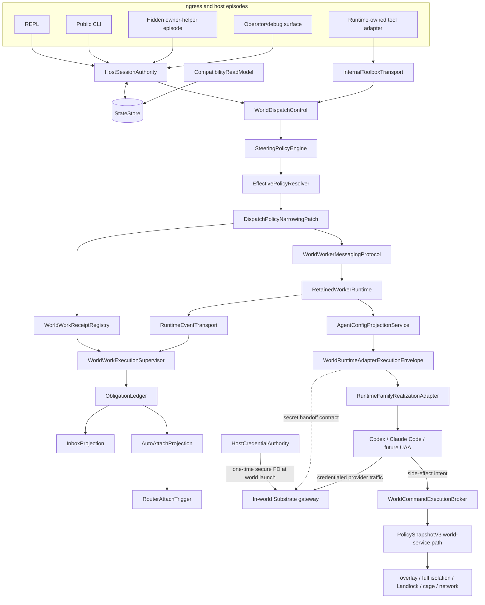

# Target Architecture

## Executive decision

Substrate's permanent runtime architecture is a surface-neutral durable control plane:

> Surfaces are ingress. Sessions are authority. Long-lived work returns receipts. World work is supervised. Obligations are canonical. Credentials enter worlds once through the in-world gateway. UAA side effects are brokered. Policy can only narrow. Runtime-family adapters stay thin.



`RuntimeToolInvocationAdapter -> InternalToolboxTransport` is the model-visible ingress route. Native CLI, REPL, and operator surfaces call the same authority and dispatch core through typed internal APIs; they do not detour through an agent-visible tool protocol.

### Current B1/B2.1 control state

Canonical content: [`b1-b2-1/architecture.md#current-b1b21-control-state`](b1-b2-1/architecture.md#current-b1b21-control-state).

## Authority map

| Boundary | Owns | Must not own |
|---|---|---|
| SurfaceAdapter / HostExecutionEpisode | input normalization, live channels, rendering, episode-local cancellation, readiness observations; the current bounded production activation call into canonical supervisor recovery | durable posture, world binding, retained continuity, successor allocation, restart discovery/reconciliation, supervisor-record interpretation, terminal truth, transition-intent issuance/claim/application |
| HostSessionAuthority | exact session/caller/lineage/session-world-binding resolution; durable posture transitions; revision-bound host-transition-intent issuance, claim validation, replay-safe application, and reconciliation | physical world realization or ownership metadata, runtime-process placement, transport loops, provider mechanics, compatibility projection |
| StateStore | bounded atomic physical persistence, migrations, schema evolution | lifecycle, receipt, supervisor, routing, or liveness-derived semantic authority; generic activated-store writes |
| CompatibilityReadModel | legacy reads, torn-root diagnostics, compatibility projection/migration | new authority writes or overriding newer revisions |
| WorldDispatchControl | typed world verbs and orchestration of authority/policy/receipt/runtime boundaries; blocking compatibility inspect/wait/cancel routing that consumes exact receipt/supervisor truth | physical world ownership adoption, provider-specific execution, direct policy invention, or ownership of accepted-work/observation truth |
| SteeringPolicyEngine | deny-by-default action/mode/backend/session/world/autonomy decisions | effective policy materialization or runtime launch |
| EffectivePolicyResolver | parent-policy composition and immutable `PolicySnapshotV3` materialization | enforcement by advisory flags alone |
| WorldWorkReceiptRegistry | proposed acceptance-record identity/request context before submission; durable immutable accepted task/turn identity only after runtime acknowledgement; immutable recording of any owner-supplied host-transition correlation | runtime acceptance itself, active observation claims, frame/event journals, terminal reconciliation, stream ownership, host-transition interpretation, or worker lifecycle policy |
| RuntimeEventTransport | producer-assigned stable stream/frame/event/terminal identity and monotonic ordering; bounded process-memory retention and exact replay transport for supplied acceptance-record/stream/cursor identity | receipt acceptance, durable observation, stream enumeration, fuzzy lookup, lifecycle or terminal truth, retained-message semantics, obligation semantics, or completeness |
| WorldWorkExecutionSupervisor | sole ownership of durable active-observation claims, no-gap post-acceptance frame/event journal, exact acceptance joins, opaque correlation-byte retention, duplicate/reorder rejection, caller-drop survival, restart discovery/recovery/reconciliation, unresolved replay state, and monotonic terminal closeout | proposal or immutable acceptance-record truth, foreground tool or startup-surface semantics, model-facing identity, producer-frame retention, retained-message or host-transition semantics, or obligation classification/materialization |
| WorldWorkerMessagingProtocol | fail-closed producer-side normalization of provider events plus exact retained target/source, active-run, thread, typed event class, attention, and request/message/event causation semantics | transport ordering, receipt acceptance, observation ownership, or obligation materialization |
| RetainedWorkerRuntime | worker create/continue/park/cancel/stop/fork/inspect/invalidate lifecycle; retained admission, R0-registration join, transport-claim, routability, and exact terminal truth | HSA world binding, physical world ownership metadata, host-session posture, or obligation projection |
| ObligationLedger | obligation classification, idempotent materialization, canonical revisions and records, completeness watermarks/cuts, closed snapshots, and attention/review/deferred-action truth | runtime identity generation, stream observation, host rendering, prompt replay, or direct worker continuation |
| Inbox / AutoAttach / Router | derived review view, attach eligibility, sanctioned host ownership restoration | approving, answering, forking, or continuing workers |
| AgentConfigProjectionService | logical inventory and non-secret effective/native projection per worker identity; launch-time secret-handoff intent | treating `.codex`, `CODEX_HOME`, `config.toml`, auth files, or workspace files as credential authority |
| WorldRuntimeAdapterExecutionEnvelope | guest-realizable launch contract bound to world, worker, config, policy snapshot, credential posture, secret-handoff ref, and equality-only exact world-ownership prerequisite | raw credential payloads, HSA or backend ownership authority, provider-specific parsing, or unrestricted side effects |
| WorldCommandExecutionBroker | every UAA shell/edit/write/tool/process/network side effect under the accepted policy snapshot | bypassing world-service because the initial process is in-world |
| RuntimeFamilyRealizationAdapter | provider launch, resume, output parsing, non-secret native config format, gateway endpoint wiring, provider cancellation mechanics; runtime-family/world-backend physical world realization and exact ownership-metadata publication under validated HSA proof | raw host credentials; minting or changing HSA binding, admission, policy, receipt, obligation, routability, or terminal semantics |

## Non-negotiable invariants

### 1. Durable session truth is process-independent

Durable truth is the exact session identity, authoritative lineage, workspace/world binding, attach contract, retained-worker refs, resume handles, posture, and policy revision. Helper PID, attached client, socket reachability, startup stream state, and owner-process liveness are observations only.

Runtime execution scope and durable session world binding are distinct authority dimensions.
`AgentDescriptorV1.execution_scope` and the matching launch knob describe runtime placement;
`DurableSessionAuthorityV1.world_binding` describes the parent orchestration session's exact
available world substrate. Runtime placement and session binding are not bijective: a host-executing
orchestrator may own a world-backed durable session, while a world-executing runtime requires that
exact binding. The frozen Start acceptance matrix is:

| Descriptor and launch scope | Session world binding | Result |
|---|---|---|
| `Host` | `None` | accept |
| `Host` | `Some(exact binding)` | accept |
| `World` | `Some(exact binding)` | accept |
| `World` | `None` | reject |

Descriptor scope must still equal requested launch scope, and any present binding must contain the
exact non-empty world ID and generation supplied by session truth. `Host + Some` does not place the
host runtime in the world. Host participant manifests remain host-scoped and do not acquire
participant-level world placement fields; the binding stays on the durable session authority.
World filesystem, network, caging, policy, capability, and enforcement semantics are unchanged.

#### Exact bound-world physical ownership

The durable session binding and the backend's physical ownership metadata are separate truths.
`HostSessionAuthority` alone says which exact world ID and generation belong to the session. The
runtime-family/world backend may only realize that already-authoritative tuple physically. For the
bounded B3.2a-WA prerequisite, `ExactBoundWorldOwnershipAdoptionV1` is an internal operation
contract, not a `world-api` field and not a persisted wire-schema version. It permits one exact
transition:

```text
GenericExactBoundWorld -> SharedSessionOwnerExactBoundWorld
```

The transition preserves world ID and generation, exact-joins the validated HSA session/policy and
project/world-spec identity, and durably publishes ownership metadata before member process
creation. An exact already-adopted tuple joins without rewrite; any foreign owner, changed session,
generation, policy, project, spec, missing/corrupt metadata, or ambiguous publication fails closed.
Shell state, helper state, PID, timeout, socket, caller disappearance, process liveness, prompt
content, and compatibility projections are never adoption authority. Adoption changes no HSA or
RetainedWorkerRuntime record and proves neither transport submission nor member launch, Registered,
routability, or terminal success. Compatibility requests without the exact authority-managed proof
and ordinary world execution retain their existing physical-realization behavior.

### 2. Private transports are fast paths

Prompt, stop, cancel, toolbox, and heartbeat channels use one of:

```text
Available
UnavailableButDurableAuthorityExists
UnavailableAndNoAuthoritativeRoute
StaleOrOrphaned
```

A stale episode may not overwrite a newer authority revision. An unavailable channel may not block durable closeout when exact authority and closeout rules permit it.

Hidden-helper plan creation, load, removal, and delivery are fast-path transport mechanics. They may carry a durable transition-intent reference and immutable commitment hash, but plan presence, successful read, or deletion never issues, claims, applies, expires, or rejects authority. Authority retains an access-controlled, hash-verified reprojection payload until exact terminal handoff, so load-then-remove plus helper failure cannot destroy the retry route. Exact retry resumes or joins recorded application/input results without repeating them; a substituted or stale plan fails closed.

### 3. Routing is exact and fail-closed

Every world verb resolves exact session, caller, backend, world id/generation, and task/worker/active-run identity. Backend-only selection ambiguity fails closed. Model-facing callers never supply internal lease, resume, UAA-session, or participant lineage truth.

### 4. Long-lived work accepts before it completes

`run_world_task` and `continue_world_worker` persist accepted receipts and return durable handles before terminal exit. A blocking UX may wait on the receipt; it may not redefine the core contract. The supervisor—not the foreground tool call—owns the terminal-framed stream.

Durable observation ownership may land before model-visible early return: the foreground may remain
a compatibility waiter over the receipt while the supervisor alone ingests and closes the stream.
At the exact acceptance transition, the supervisor claim must become durable before any subsequent
frame can be consumed outside its journal. Dropping a foreground waiter or guard cannot delete an
accepted record, supervisor claim, journal entry, or supervised work.

#### B2.1-3 restart and producer-replay boundary

Canonical content: [`b1-b2-1/architecture.md#b21-3-restart-and-producer-replay-boundary`](b1-b2-1/architecture.md#b21-3-restart-and-producer-replay-boundary).

### 5. Cancel targets active work

Cancel resolves an active task/turn receipt. Worker identity establishes routing context; it does not prove active cancelable work. `NoActiveCancelableWork` is distinct from stale linkage, invalid identity, owner unreachable, and already terminal.

### 6. Obligations are event-derived canonical truth

Canonical content: [`b3-1-c1/architecture.md#6-obligations-are-event-derived-canonical-truth`](b3-1-c1/architecture.md#6-obligations-are-event-derived-canonical-truth).

### 7. Auto-attach restores ownership only

The router may discover, claim, restore/launch a sanctioned host episode, record the outcome, and stop. It may not submit a prompt, approve, fork, answer, or continue a worker.

### 8. World placement and policy mediation are separate proofs

A world-scoped UAA must both:

1. start from a guest-realizable runtime envelope; and
2. route every side-effecting operation through Substrate-owned policy enforcement.

`cwd`, `CODEX_HOME`, `SUBSTRATE_CAGED`, `add_dirs`, or `external_sandbox=true` do not prove operation mediation.

### 9. `external_sandbox` assigns responsibility

For world-scoped UAA execution, `agent_api.exec.external_sandbox.v1=true` means Substrate's broker/world-service path is the sandbox authority. If that path is unavailable for any side-effecting channel, the operation fails closed.

### 10. Dispatch policy only narrows

```text
effective_turn_policy =
  current parent policy
  AND retained-worker capability cap, when present
  AND dispatch/turn narrowing patch, when present
```

Accepted work uses an immutable `PolicySnapshotV3`. Parent policy changes affect future acceptance; they do not silently mutate active work.

### 11. Existing `world_fs` enforcement is the execution path

Dispatch narrowing uses restricted `PolicyPatch.world_fs`, canonical finalization, `PolicySnapshotV3`, and the existing world-service overlay/full-isolation/Landlock/caged/network machinery. Do not create a parallel filesystem sandbox.

### 12. Runtime-native configuration is projection

Projection identity includes retained-worker identity; workspace plus backend plus world generation is too coarse. Runtime homes and workspace overlays may be durable or mutable by policy, but never become the source of Substrate authority.

### 13. Credentials are launch-time gateway handoff, not projected files

For world-scoped UAA adapters, host credentials must not be copied into the world as durable runtime-native files.

The target V1 end-to-end contract is:

```text
host credential authority
  -> launch-time secret handoff
  -> secure one-time FD
  -> in-world Substrate gateway
  -> gateway-owned credential/session material
  -> UAA adapter accesses credentials only through the gateway/broker contract
```

The carrier segment through the in-world gateway is already a landed positive primitive on the managed gateway path: `GatewayAuthBundleV1`, the `world-service` inherited-pipe launcher, `SUBSTRATE_LLM_AUTH_BUNDLE_FD`, and gateway-side one-time read/validation exist with focused integration coverage. Refactor slices must preserve and adopt that carrier, not recreate it.

The remaining target gap is consumer realization: direct world Codex/member execution must be pointed at the managed gateway, and its per-worker `CODEX_HOME`, `config.toml`, provider endpoint, and other runtime-native files must be constructed by Substrate from logical config plus accepted policy. Current seed-home auth/config copying is a compatibility bridge. The complete Codex-through-gateway path remains unproven until that adoption and projection path is exercised by production-path smoke/e2e.

The in-world Substrate gateway is the credential-receiving boundary. Credentials are passed once at world launch through a secure FD scoped to that gateway. The gateway consumes the payload, prevents inheritance by the UAA child, closes the descriptor, and owns upstream credential application/session material.

Runtime-native files such as `CODEX_HOME`, `.codex`, `config.toml`, `.mcp.json`, or auth files may contain bounded non-secret projection hints when required, but they must not become durable credential authority. The UAA runtime does not read the secret FD directly.

Copying host credentials and a minimal Codex `config.toml` into the world is a transitional compatibility bridge only. It must be explicitly named and logged, must have retirement criteria, and cannot satisfy `ContractCorrectAndProven`.

If secure gateway handoff is unavailable for a credential-requiring world adapter, that adapter must fail closed or run under the explicitly named, logged, non-promotable compatibility mode. V1 permits no unnamed fallback to ambient host credentials, copied auth, or host keyring discovery.

### 14. `SUBSTRATE_HOME` is private per-user authority state

`SUBSTRATE_HOME` contains one operating-system user's configuration, policy, dependency inventory,
runtime, and authority state. Creating and accepting that root is part of authority bootstrap: the
physical directory is owned by the intended per-user owner, has exact owner-only mode `0700`
independent of ambient umask, has no effective other-principal authority, rejects every observable
POSIX access or default ACL, and is opened and revalidated no-follow before any descendant
bootstrap. On Linux, `ENODATA` means only that the kernel returned no ACL data; it does not prove
physical xattr absence and is accepted only with exact owner/type/`0700` mode, stable descriptor
identity, no-follow traversal, and replacement-safety proof. Existing nonconforming roots fail
closed without chmod, chown, ACL removal, migration, adoption, deletion, or other automatic repair.
Custom homes remain valid only when they satisfy the same contract. Multiple operating-system
principals directly sharing one `SUBSTRATE_HOME` are unsupported in A1 V1.

Directory creation and identity acceptance are distinct. `mkdirat` success establishes only a
candidate name under an already-opened trusted parent; portable Linux/macOS APIs do not atomically
create a directory and return its inode-bound handle. The accepted `PrivateSubstrateHomeV1`
physical identity begins at the first successful no-follow directory open followed by
descriptor-based owner, type, exact-mode, ACL, filesystem, and physical-identity validation. The
parent remains descriptor-bound across candidate creation and opening and must already have the
expected type and owner and no create/delete/rename/replacement authority for another principal.
Ancestor access ACLs and default ACLs are different security surfaces. A named access entry is
evaluated after the ACL mask: effective read/search without effective write does not itself grant
replacement authority, while any effective write bit remains rejected, including write-only
entries. Default ACLs can be inherited into a new child and are rejected on every ancestor before
candidate creation in V1; supporting one requires a later separately approved contract. Malformed,
unreadable, unsupported, or ambiguous ACL state also fails closed. Under supported Linux POSIX
access-ACL semantics, `ACL_MASK` is the file group-class mode bits, so a named user/group entry
cannot retain effective write while the descriptor's authoritative group-write bit is clear.
Unknown ACL models are outside that proof and fail closed. These ancestor distinctions never weaken
the final root's exact owner, exact `0700`, observable-ACL rejection, or owner-only descendant modes.
Legitimate concurrent Substrate creators converge when one creates and another observes
`AlreadyExists`: each no-follow opens and validates the candidate, and only its exact accepted
descriptor identity may proceed.

After that first accepted open, all descendant access remains descriptor-relative and the child
name is rejoined to the accepted descriptor identity at required publication or acceptance
boundaries. Rename, replacement, owner/mode/ACL drift, or validation uncertainty fails closed.
Preventing malicious root or malicious code already executing under the same UID from substituting
the child before the first descriptor acquisition is outside the A1 V1 threat model. A1.1d-5
therefore requires neither an impossible atomic create-and-bind claim nor a privileged creation
broker; adding such a broker is a separately approved architecture change.

World members do not gain direct traversal authority over the host user's private home. They
consume configuration, policy, dependency, and credential material through Substrate-owned
projection and mediation boundaries. A privileged Substrate service may access the private root
only as the currently landed service boundary requires; that access does not convert the root into
shared state. If an unprivileged world process is found to depend on direct traversal, work stops
for an explicit projection/broker boundary change rather than broadening permissions.

Private-home enforcement does not alter effective policy or narrow world capabilities. Existing
filesystem read/discovery/write rules, host visibility, isolation and copy/overlay strategy,
network modes and DNS enforcement, PTY/non-PTY execution, dependency synchronization, gateway
handoff, runtime availability, shims, replay, traces, diagnostics, and lifecycle/binding behavior
remain governed by their existing contracts. A separate shared installation root may be designed
later; `SUBSTRATE_ROOT`/installation-root separation is not part of A1.1d-5.

#### Installation prefix authority and platform realization

The public installer or uninstaller selects exactly one normalized `InstallBootstrapContextV1`.
For V1, `selected_host_prefix`, `host_substrate_home`, and `host_substrate_root` are the same host
path and are bound to one platform-scoped intended principal. A declared `--prefix`, `--home`,
`-Prefix`, or the wrapper's self-derived installed prefix fixes that context before any child,
generated projection, sudo crossing, service renderer, doctor, runtime provisioner, or platform
adapter runs. A child may validate the transported context but may not reconstruct it from
`$HOME`, `$USERPROFILE`, CWD, an outer `SUBSTRATE_HOME`, or an independently selected root.

Generated `env.sh`, manager/profile/preexec helpers, configuration, version, dependency,
install-state, and Lima known-hosts files are projections of that decision. They never become
prefix-selection authority. When an
installed helper at A runs under conflicting ambient home B, it must self-derive A, validate any
encoded context/commitment against A, export both `SUBSTRATE_HOME=A` and `SUBSTRATE_ROOT=A`, and
consume only A. A missing, malformed, or conflicting projection fails closed; B is not a fallback.
The normal install/uninstall product gate must pass without an outer override. An explicitly named
diagnostic override may exercise a negative test, but it cannot satisfy product proof.

The shared Rust wire model lives in `transport-api-types`; OS path/principal construction remains
at the public shell/script entry. Its fixed line-framed, base64url field encoding has one
cross-language golden-vector suite and does not reuse, move, or duplicate the shell-private A1
authority-store canonical codec. Successful install-sensitive CLI routes construct this context
before private-home/dependency scaffolding; parse failures, help, `--version`, and `--version-json`
exit without creating private-home, dependency, shim, manager, trace, or generated-install state.
Installer-managed or focused private-home regression callers that need the existing scaffold use the
hidden `--install-bootstrap-home-v1` action only with
`--install-bootstrap-context-v1 <carrier>`. The root dispatcher strictly authenticates the carrier,
binds its Unix account+UID to the current principal, validates checked H/R projections, calls only the
existing explicit-context private-home/dependency bootstrap, and returns. Environment values alone
cannot select the action or internal-child mode, and normal output/errors/logs/traces never disclose
the carrier. Automatic
shim deploy, shim doctor/repair, physical shim telemetry, and shell/replay backend-factory callers
consume explicit context or mapping projections rather than common ambient path resolution.
Installer-managed product-CLI children use the hidden argv carrier as their child discriminator;
an environment carrier never selects internal mode. A context-aware Substrate-owned sudo child validates that
same argv carrier, while an arbitrary system tool receives only minimal context-derived argv from
the still-owning installer and never receives a meaningless carrier or preserved ambient home.
Before any internal-child dispatch, the current Unix account+UID or Windows account+SID must equal
the committed principal; a self-consistent carrier for another principal fails before projection
or mutation. Standalone self-derivation accepts the live Unix release link, Unix dev A/bin symlink,
and Windows release A/bin copy shapes through one exact invocation-witness algorithm; a direct
repository binary or ambiguous PATH witness still requires an explicit prefix.
World-deps/doctor/config/policy/gateway leaves receive typed context or a checked projection, and
host Codex paths derive from the committed Unix principal's account-database home.

Route C's Host/World doctor identity fields are a non-authoritative projection of that same
authenticated context. The public doctor execution is not classified as read-only: on Linux, the
existing `handle_host_command` → `host_doctor_main` and
`handle_world_command` → `world_doctor_main` paths carry typed IH to the final host-visible JSON or
text report. Optional `WorldDoctorReportV1` host-prefix and commitment fields remain data only: old
wire JSON may omit them, the in-world `doctor_world` producer emits them absent and reads no host
carrier, environment, prefix, principal, or context, and only the host shell may populate them from
typed IH. The legacy report adapter may project them only when its existing caller explicitly
supplies typed IH. A conflicting ambient home/root or generated projection cannot replace A.
Diagnostics never decode or disclose hidden carrier bytes, credentials, request bytes, secrets, or
sensitive principal material. The projected identity fields cannot install, repair, restart,
clean up, or otherwise change world, policy, capability, filesystem/network enforcement,
placement, caging, receipt, supervisor, retained-worker, credential, or lifecycle state. The public
Doctor compatibility path retains its existing active readiness, socket, service, endpoint, and
probe behavior. This is not a new authority seam, module owner, or execution family.

At the Route D checkpoint, the intended rule applied to the complete authenticated
shell/shim-doctor snapshot carrier.
The typed Unix report path passes one already-validated `InstallBootstrapContextV1` through
`collect_report_for_context` and `build_report` to both its embedded world-doctor and world-deps
branches. Health fixtures are diagnostic projections beneath `A/health` only; an ambient
`B/health/world_doctor.json` or `B/health/world_deps.json` cannot replace, supplement, redirect, or
appear in the A-bound report. When the embedded world-doctor branch invokes the existing product
CLI, the child receives the same canonical hidden argv carrier and only context-derived checked
environment projections. Those projections are child transport, never authority reconstruction.
Later source closure proved that the ordinary child could activate infrastructure and probe the
world, so the claim that the nested diagnostic was non-mutating was incorrect and was superseded by
the later historical F5-PD section, whose boundary the completed-F record retains. A missing,
malformed, tampered, wrong-principal, or contextless
Unix witness fails closed. Carrier bytes, credentials, request bytes, commitments not
already intended for public diagnostics, and sensitive principal data never enter report JSON,
text, fixtures, errors, logs, traces, or snapshots.

This closure changes no report schema, world-doctor meaning, fixture payload meaning, dependency
classification, world enforcement, policy, capability, service, installation, cleanup, receipt,
supervisor, retained-worker, credential, or lifecycle behavior. Non-Unix behavior stays on its
existing cfg path. The Unix checked-projection `collect_report` entrypoint and its crate-private
re-export remain temporary behavior-frozen R2-3 compatibility; Route D neither calls that path from
typed Health nor migrates the physical shim, replay, global trace compatibility, or platform-native
adapters.

#### Remaining authenticated runtime projections

Routes A–D are individually review-clean, but they do not exhaust the authenticated-context path.
The failed R2-2 integration closeout found two remaining projection seams and one diagnostic
composition invariant. R2-2E is implementation-, proof-, and review-complete. F0, F0a, F0b, and
F0-HC were then implemented, proof-complete, review-clean, committed, and preserved. R2-2F was the
exact next packet at that checkpoint. At the later F3/F4 checkpoint, F5-PD was the exact next
prerequisite beneath F5; the completed-F section below supersedes that historical status. A renewed
Routes A–F integration closeout follows F.

R2-2E makes world-gateway projection a pure consumer of already-authenticated A. The landed shell world
entry validates A before disabled/unavailable classification, then supplies it to one request-scoped
gateway context. Configuration and effective policy use their existing explicit-bootstrap-home
resolvers; `execution/policy_snapshot.rs` remains the sole policy-snapshot owner and adds the one
explicit-bootstrap-home world-network entrypoint; `execution/agent_inventory.rs` reuses its existing
bootstrap-home inventory loader. `world_gateway.rs` may combine those explicit outputs but may not
parse or re-resolve policy. Runtime-family and Codex paths are projections of A and the committed
Unix principal's account-database home. Environment-only invocation, malformed/tampered/mismatched
context, and a disabled route without valid A fail before gateway mutation, forwarding, or launch.
The contextless synthesized-unavailable constructor is removed. Linux uses the fixed canonical
`/run/substrate.sock` on this authenticated route; ambient socket overrides cannot retarget it.
On macOS, no authenticated typed endpoint source exists in E's closed allowlist: the authenticated
route therefore fails before client construction or ambient `auto_select`; it cannot invent or
accept an endpoint from environment/platform-control state. Lower Lima forwarding, known-hosts, and
transport realization remain R2-3. Windows and other contextless gateway entries likewise fail
before config, policy, inventory, disabled-state classification, or client selection until R2-3
supplies authenticated platform mapping. Existing ambient macOS/Windows compatibility clients remain
frozen and unreachable from the E route. Their cfg proof is build/static fail-closed preservation,
not native or authenticated product proof. Existing network allow/deny meaning, request schemas,
service behavior, and launch-time
gateway credential handoff do not change, and no host credential file becomes durable authority.

The exact landed E evidence is commit `7e8e83802885c0ece93efcaacccc26503eeb6715`, tree
`02a1a2f6b7e4be47ed9ec38537c805ae348c96b6`, ordinary/full-index patch identities
`fb7b65b02cdac46857750b64ebd5ceab651e8e99910c05240b187c3e729444ff` and
`c712f467ac92efb0de7b524272479741ac6b318201cf45dbd994116ec0e8b862`. This completes only
PI-111's R2-2E implementation/proof clause. The managed gateway secure-FD path is landed,
regression-proven, and unchanged by E; direct-member Codex/UAA gateway adoption remains unresolved,
transitional, non-promotable, and E3/D1/D3-owned. R2-2 itself remains incomplete, and no target seam
is promoted.

**A1.1d-5R2-2F0a — SUBSTRATE_HOME test isolation** joins R2-2F0 to establish one
test-process-only authority-environment boundary around every
same-process mutation of `SUBSTRATE_WORLD_SOCKET` or `SUBSTRATE_HOME`. F0's historically blocked candidate
already proves its exact socket pair 100/100 in parallel and 20/20 serially, but final broad runs
were `1118 passed / 150 failed` and `1119 passed / 149 failed`; the extra failure was
`dispatch_contract_adapter_active_task_resolution_requires_supervisor_claim`, which passes alone.
Non-source transition tracing proved that the unannotated
`prompt_submit_continuity_prefers_persisted_session_contract` fixture can set its private HOME,
the target can replace it, and the competitor can then remove the target's HOME while both overlap.
The pair failed 20/20 in parallel. The stable same-process serial harness controlled only
competitor-then-target and failed 0/10; separate-process sequential runs passed in both directions.
Stable libtest could not force reverse same-process order, so no such result is claimed. Commit
`f5a150f94d585b1f55ec0067845cd5d715773c78` first adds the exact unannotated competing mutation;
the target and its HOME-mutating fixture arrive later at
`83101dcbcc750e6e8fb8979bea19f1f777792188`, the first source commit where the exact pair coexists.

The reviewed topology is one process-global authority-environment lock, not separate HOME/socket
locks. At least 88 shell-library test functions depend jointly on HOME and socket state, and source
closure found opposite existing acquisition orders, so separate locks would permit mixed
authority snapshots and lock-order inversion. The shared boundary captures exact prior `OsString`
or absence, installs the test-owned value or absence, spans all dependent async/process work and
cleanup, restores during normal return or panic unwinding, and releases only after restoration.
Same-thread nesting must be explicitly safe and restore in stack order; panic/poison behavior must
be explicit and cannot strand later tests. `#[serial]` may remain but is never sufficient by
itself. Integration-test binaries remain process-local: direct parent mutations receive an
equivalent per-binary disposition, while child-only `Command::env` inputs need no cross-process
lock.

F0 also owns a source-closure-proven async cleanup correction in nine socket-owning tests in
`execution/orchestrator_world_dispatch.rs`: abort the server, await confirmed task cancellation,
finish fixture-owned socket/task cleanup, restore the environment, and release the isolation lock,
in that order. Reverse declaration/drop order and a single scheduler yield are not proof of task
termination. Production world-socket/HOME resolution, readiness, retained-worker behavior, retry
validation, and runtime bytes remain unchanged.

**A1.1d-5R2-2F0b — deterministic renderer-output test isolation** removes process-global
descriptor replacement from the two renderer fallback tests without changing the renderer's
production contract. Source closure binds the future change to the private Unix-only
`PublicPromptRenderer` ownership in
`crates/shell/src/execution/agent_runtime/control.rs`. `PublicPromptRenderer::render` remains
the production entry point; `PublicPromptRenderer::new` and the two production caller bodies,
`run_hidden_owner_helper_startup_prompt_stream_with_projection` and
`run_public_prompt_command`, remain frozen. A private explicit-writer core or equivalent private
sink adapter may sit beneath `render`; the production adapter must choose and lock only the
selected real stdout or stderr stream in the same order as today, write the same bytes and newline,
perform the same flush, and preserve which serialization/write errors propagate or are ignored.
No public API, output transport, registry, side table, process-global lock, environment-selected
sink, or eager dual-stream locking is permitted.

The observed stdout helper uses `dup2` on process fd 1. A parallel libtest reporter therefore
contributed its `.` to the test pipe, producing exactly
`".[codex] task_progress: fields=alpha, beta, gamma (+1 more)\n"`. The forced same-process
matrix passed 376 and failed 124 of 500 runs; isolated, same-process serial, and separate-process
controls passed 100/100, and parallel pretty reporting passed 99/100. The clean-E target/helper are
byte-identical to the F0/F0a candidate, so candidate introduction is unnecessary. The fd 2 helper
has the same ownership and structural race and is migrated with fd 1 even though only stdout
appeared in the wall. Tests receive their own stdout/stderr memory writers and compare the complete
exact selected bytes plus an empty nonselected stream. Filtering reporter bytes, partial-line
search, sleeps, retries, serial-only correctness, thread reduction, ignore, and weaker assertions
are outside the architecture.

### Historical pre-F architecture checkpoint

Canonical content: [`a1.1d-5r2-2f/architecture.md#historical-pre-f-architecture-checkpoint`](a1.1d-5r2-2f/architecture.md#historical-pre-f-architecture-checkpoint).
## Review question

Every refactor PR must be able to answer:

> Can Substrate prove exact session identity, exact applicable binding, exact applicable policy snapshot, exact applicable credential handoff, exact applicable work receipt, and durable lifecycle/obligation truth for this action regardless of ingress surface?

If the answer depends on a helper still running, a socket being reachable, a terminal tool call returning, or an env variable being trusted, the target architecture has not landed.

## F0-HC test-process coordination topology

Canonical content: [`a1.1d-5r2-2f/architecture.md#f0-hc-test-process-coordination-topology`](a1.1d-5r2-2f/architecture.md#f0-hc-test-process-coordination-topology).

## Differential evidence authority after the final harness candidate

Canonical content: [`a1.1d-5r2-2f/architecture.md#differential-evidence-authority-after-the-final-harness-candidate`](a1.1d-5r2-2f/architecture.md#differential-evidence-authority-after-the-final-harness-candidate).

## Historical F explicit Linux readiness architecture

Canonical content: [`a1.1d-5r2-2f/architecture.md#historical-f-explicit-linux-readiness-architecture`](a1.1d-5r2-2f/architecture.md#historical-f-explicit-linux-readiness-architecture).

## F5-PD authenticated passive diagnostic architecture

Canonical content: [`a1.1d-5r2-2f/architecture.md#f5-pd-authenticated-passive-diagnostic-architecture`](a1.1d-5r2-2f/architecture.md#f5-pd-authenticated-passive-diagnostic-architecture).

## A1.1d-5R2-2F completed diagnostic architecture

Canonical content: [`a1.1d-5r2-2f/architecture.md#a11d-5r2-2f-completed-diagnostic-architecture`](a1.1d-5r2-2f/architecture.md#a11d-5r2-2f-completed-diagnostic-architecture).
## Renewed R2-2 attestation and publication ordering

Canonical content: [`a1.1d-5r2-2-renewed-closeout/architecture.md#renewed-r2-2-attestation-and-publication-ordering`](a1.1d-5r2-2-renewed-closeout/architecture.md#renewed-r2-2-attestation-and-publication-ordering).

## Broad-wall evidence architecture

Canonical content: [`a1.1d-5r2-2-renewed-closeout/architecture.md#broad-wall-evidence-architecture`](a1.1d-5r2-2-renewed-closeout/architecture.md#broad-wall-evidence-architecture).

## Closeout-remediation architecture: R1 and P1 (historical RP0/RP1/RP2 record)

Canonical content: [`a1.1d-5r2-2-renewed-closeout/architecture.md#closeout-remediation-architecture-r1-and-p1-historical-rp0rp1rp2-record`](a1.1d-5r2-2-renewed-closeout/architecture.md#closeout-remediation-architecture-r1-and-p1-historical-rp0rp1rp2-record).

### R1: separate execution argv from display argv

Canonical content: [`a1.1d-5r2-2-renewed-closeout/architecture.md#r1-separate-execution-argv-from-display-argv`](a1.1d-5r2-2-renewed-closeout/architecture.md#r1-separate-execution-argv-from-display-argv).

### P1: retired runner history and current Make authority

Canonical content: [`a1.1d-5r2-2-renewed-closeout/architecture.md#p1-retired-runner-history-and-current-make-authority`](a1.1d-5r2-2-renewed-closeout/architecture.md#p1-retired-runner-history-and-current-make-authority).

### Historical RP0 architecture status

Canonical content: [`a1.1d-5r2-2-renewed-closeout/architecture.md#historical-rp0-architecture-status`](a1.1d-5r2-2-renewed-closeout/architecture.md#historical-rp0-architecture-status).

## RP3/RP4/RP5 closeout architecture status and subsequent completion

Canonical content: [`a1.1d-5r2-2-renewed-closeout/architecture.md#rp3rp4rp5-closeout-architecture-status-and-subsequent-completion`](a1.1d-5r2-2-renewed-closeout/architecture.md#rp3rp4rp5-closeout-architecture-status-and-subsequent-completion).
## R2-4 bounded closeout architecture disposition

Canonical content: [`a1.1d-5r2-4/architecture-disposition.md#r2-4-bounded-closeout-architecture-disposition`](a1.1d-5r2-4/architecture-disposition.md#r2-4-bounded-closeout-architecture-disposition).

## A1.1d-5R3 lifecycle ownership architecture

Canonical content: [`a1.1d-5r3/architecture.md#a11d-5r3-lifecycle-ownership-architecture`](a1.1d-5r3/architecture.md#a11d-5r3-lifecycle-ownership-architecture).

### Authority domains and action classes

Canonical content: [`a1.1d-5r3/architecture.md#authority-domains-and-action-classes`](a1.1d-5r3/architecture.md#authority-domains-and-action-classes).

### Descriptor-bound private-home candidate rollback

Canonical content: [`a1.1d-5r3/architecture.md#descriptor-bound-private-home-candidate-rollback`](a1.1d-5r3/architecture.md#descriptor-bound-private-home-candidate-rollback).

### Managed-artifact manifest

Canonical content: [`a1.1d-5r3/architecture.md#managed-artifact-manifest`](a1.1d-5r3/architecture.md#managed-artifact-manifest).

### AUX-R3-MAC-SYSTEM-KEYCHAIN-SOFTWARE-SIGNER-CORRECTION (2026-08-10)

Canonical content: [`a1.1d-5r3/architecture.md#aux-r3-mac-system-keychain-software-signer-correction-2026-08-10`](a1.1d-5r3/architecture.md#aux-r3-mac-system-keychain-software-signer-correction-2026-08-10).

### Lifecycle state machines and rollback order

Canonical content: [`a1.1d-5r3/architecture.md#lifecycle-state-machines-and-rollback-order`](a1.1d-5r3/architecture.md#lifecycle-state-machines-and-rollback-order).

### Exact platform boundaries

Canonical content: [`a1.1d-5r3/architecture.md#exact-platform-boundaries`](a1.1d-5r3/architecture.md#exact-platform-boundaries).

### Publication and evidence architecture

Canonical content: [`a1.1d-5r3/architecture.md#publication-and-evidence-architecture`](a1.1d-5r3/architecture.md#publication-and-evidence-architecture).
