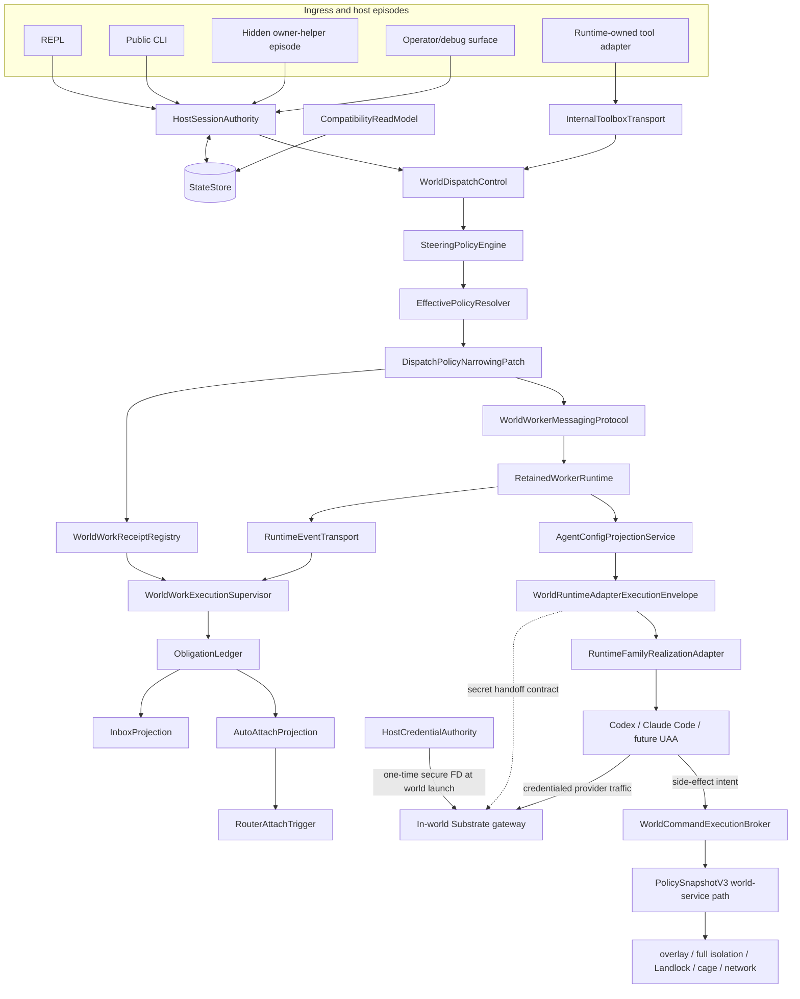

**Kind:** architecture
**Stable ID:** `shared-executive-target-decision`
**Canonical for:** shared executive target decision only
**Status:** canonical shared-architecture record
**Authority scope:** exact extracted shared executive-decision source body only; no implementation authority
**Source span:** [`../01-target-architecture.md#executive-decision`](../01-target-architecture.md#executive-decision) lines 3–56
**Supersedes:** canonical ownership of the extracted source body; source heading remains a compatibility anchor
**Superseded by:** none
**Projection consumers:** [`README.md`](README.md), [`../01-target-architecture.md`](../01-target-architecture.md)

# Executive target decision

## Executive decision

Substrate's permanent runtime architecture is a surface-neutral durable control plane:

> Surfaces are ingress. Sessions are authority. Long-lived work returns receipts. World work is supervised. Obligations are canonical. Credentials enter worlds once through the in-world gateway. UAA side effects are brokered. Policy can only narrow. Runtime-family adapters stay thin.

`RuntimeToolInvocationAdapter -> InternalToolboxTransport` is the model-visible ingress route. Native CLI, REPL, and operator surfaces call the same authority and dispatch core through typed internal APIs; they do not detour through an agent-visible tool protocol.
