# PLAN — AUX-R3-MAC-EVIDENCE-RECOVERY-PLAN

## Source-grounded root cause

The preserved subject is not an implementation candidate. It combines three independently proven
small corrections with a broad amendment-0007 pairing prototype. The prototype both encodes an
unapproved `lima-stdio-v1` single-stream/exclusive-channel claim and fails to connect generic
mapped lifecycle calls to the hardened executor: the shell sends `lima-action`, but the executor
accepts only its typed bootstrap/publisher paths. Its static fixture mocks that incompatibility.
The current control pack instead demands independent guest TTY confirmation and authenticates
host/guest pairing by canonical P-256 ticket/anchor/record joins—not channel continuity.

GitNexus keyword retrieval for the exact-base index is degraded because FTS is missing; an empty
query is therefore inconclusive. This plan uses the exact-base manual source/donor audit as the
controlling blast-radius closure and requires a repaired/current GitNexus index plus manual
shell/cfg/FFI/Drop review before source edits.

## Donor salvage/discard matrix

Legend: **retain** = recreate only named hunks in a new worktree; **replace** = do not copy donor
bytes, implement the contract below; **discard** = no donor hunk may enter recovery. Every
unlisted hunk in a retain path is discarded.

| Donor path | Material hunk/symbol family | Disposition and rationale | Future owner |
|---|---|---|---|
| `Cargo.toml` | root-package `[dependencies]` entries `libc = "0.2"` and `sha2 = { workspace = true }` | **retain exactly these two additions only** when R4's named macOS FFI/SPKI implementation imports them; no other manifest key, package, feature, version, target section, workspace entry, or dependency is mutable. | R4 host authority |
| `Cargo.lock` | the `substrate` package dependency-list insertions `libc` and `sha2` | **retain exactly this closure only** if the two preceding manifest additions are retained; lockfile regeneration may not alter any package/checksum/version/feature or any other dependency edge. | R4 host authority |
| `crates/common/src/lib.rs` | managed-artifact re-exports | **retain selectively** for the closed ticket/record/Stage-1 types only; no stdio-channel export. | R4 |
| `crates/common/src/managed_artifact.rs` | ticket, record, P-256, Stage-1, canonical/CAS helpers and `lima-stdio-v1` model | **replace/select** canonical ticket/record/Stage-1/expiry/replay helpers proven necessary by R4/R6; **discard** `GuestPublisherPairingGuestChannelV1`, all stdio frames/phases, alternate-channel prohibition, and unrelated prototype bulk. | R4 then R6 |
| `crates/shell/src/builtins/world_deps/mod.rs` | macOS shell compile borrow correction | **retain** exact compile correction only. | R2 |
| `crates/shell/src/execution/agent_runtime/mod.rs` | cfg admission of existing supervisor | **retain** macOS cfg admission only. | R2 |
| `crates/shell/src/execution/agent_runtime/state_store.rs` | existing state types/functions cfg admission | **retain** macOS cfg admission only; no state-model rewrite. | R2 |
| `crates/shell/src/execution/managed_lifecycle.rs` | pairing client trait/request plumbing | **replace selectively** with only typed submit/data/TTY operations named in R5/R6. | R5/R6 |
| `crates/shell/src/execution/managed_lifecycle/linux_client.rs` | non-Linux close-on-exec fallback and Linux pairing stubs | **retain** only `cfg(not(target_os = "linux"))` compile fallback; **discard** pairing client API/stub changes. | R2 |
| `crates/shell/src/execution/managed_lifecycle/macos_client.rs` | FD3 bootstrap and typed XPC client | **replace/select** fixed-image bootstrap and typed `request_bytes` XPC client; no direct helper, caller operation, or unaudited response. | R5 |
| `crates/shell/src/execution/managed_lifecycle/windows_client.rs` | shared pairing signature adaptation | **discard** entirely; Windows source/runtime behavior stays unchanged. | none |
| `crates/shell/src/execution/orchestrator_world_dispatch.rs` | macOS cfg admission | **retain** cfg admission only. | R2 |
| `crates/shell/src/execution/platform/macos.rs` | cfg-local doctor/test correction | **retain** exact correction only. | R2 |
| `crates/shell/src/repl/async_repl.rs` | macOS cfg admission | **retain** cfg admission only. | R2 |
| `crates/shell/tests/managed_lifecycle_v1.rs` | pairing/control prototype tests | **discard** prototype assertions; R5/R6 add only tests for their named contract. | none |
| `scripts/ci/validate_r3_native_evidence.py` | expected project-ID argument | **retain** complete narrow CLI/validator correction. | R3 |
| `scripts/ci/test_validate_r3_native_evidence.py` | caller-bound/historical/mismatch tests | **retain** exact narrow test set. | R3 |
| `scripts/mac/lima-lifecycle.sh` | generic `lima-action` and pairing relay | **replace** with fixed control-binary `submit-mapped-lifecycle-v1` request; no raw helper, ticket, host record, direct Lima action, or transport selection. | R5 |
| `scripts/substrate/dev-install-substrate.sh` | Bash FD reader and MAC binary build/copy | **retain split**: R1 keeps only Bash-3.2 FD reader; R2 keeps only exact MAC build/copy/managed-list portions once binaries are allowlisted. | R1/R2 |
| `src/bin/substrate-lifecycle-control.rs` | direct interactive issue/advance/consume and one-stream TTY gate | **replace** fixed request validation/session join; discard `ssh` prohibition and any stdin/TTY alias. | R5/R6 |
| `src/bin/substrate-lifecycle-linux.rs` | `guest-pairing-stdio`, guest intent/bootstrapping helpers | **replace selectively** only PM-bound guest executor/session verification and intent logic required by R6; discard all stdio frame command and ordinary-host exposure. | R6 |
| `src/bin/substrate-lifecycle-macos.rs` | Keychain/P-256/XPC/Stage-1/ticket + raw dispatch bulk | **replace/select** R4 protected primitives and R5 typed submit path; discard generic `lima-action`, unrelated prototype, and any unjoined action. | R4/R5 |
| `tests/mac/lifecycle_r3.sh` | static mock of `lima-action` and blocked gate | **replace** with real source-shape/typed-bridge negatives; it cannot mock a helper protocol. | R5/R6 |
| `llm-last-mile/runtime-refactor/03-phase-slice-map.md` | trusted expected-project-ID wording | **retain** semantics in R3 status append only. | R3 docs |
| `llm-last-mile/runtime-refactor/04-contracts-and-gates.md` | validator project-ID wording | **retain** semantics in R3 status append only. | R3 docs |
| `llm-last-mile/runtime-refactor/05-debug-regression-ledger.md` | validator project-ID wording | **retain** semantics in R3 status append only. | R3 docs |
| `tests/installers/dev_install_bash32_fd_regression.sh` | FD proof plus MAC-binary copy proof | **split/recreate** R1 FD/caller-descriptor proof; R2 may add only exact binary compile/copy assertions. | R1/R2 |
| `tests/mac/dev_install_compile_surface_r3.sh` | MAC compile and installer build surface | **retain split/recreate** only the exact R2 compile/build-surface assertions. | R2 |

No donor path is silently retained. The matrix covers all 26 tracked and both untracked paths; the
only material source families absent from the table are forbidden whole-file wholesale copies.

## Ordered recovery packets

Each packet begins in a fresh exact-predecessor worktree, has one reviewed subject, commits only
its allowlist, and normally fast-forwards its one commit before the next packet. A later dispatch
may combine no packets without a fresh authority amendment.

### R1 — Bash 3.2 installer descriptor preservation

- **Completion claim:** the installer reads its canonical bootstrap context under `/bin/bash` 3.2
  without allocating or closing a caller descriptor.
- **Predecessor / successor:** planning landing -> R2; no evidence task.
- **Production allowlist:** `scripts/substrate/dev-install-substrate.sh`, only
  `resolve_install_bootstrap_context`.
- **Test allowlist:** `tests/installers/dev_install_bash32_fd_regression.sh`, limited to the
  caller-FD/context argv/environment/no-temp assertions.
- **Run-only frozen paths:** all `tests/mac/*`, lifecycle binaries, and R3 control docs.
- **Proof:** `/bin/bash` regression on macOS; shell syntax check; diff/secret/allowlist;
  no install outside its temporary fixture prefix.
- **Stops/non-goals:** no lifecycle binary build/copy, Keychain/Lima, selector, or pairing change.

### R2 — macOS compile admission and fixed installer build surface

- **Completion claim:** the existing MAC cfg leaves compile and the installer builds only its
  explicit lifecycle binaries; Linux host behavior is unchanged.
- **Predecessor / successor:** R1 -> R3.
- **Production allowlist:** `crates/shell/src/builtins/world_deps/mod.rs`
  (`resolve_current_inventory_view`); `agent_runtime/mod.rs`
  (`world_work_execution_supervisor` cfg); `agent_runtime/state_store.rs` (existing
  `SharedWorldMetadataV1`, `ResolvedInternal*`, `WorldWork*`, `BoundAgentRuntimeStateStore*` cfg
  family); `execution/managed_lifecycle/linux_client.rs` (`set_close_on_exec_v1` cfg fallback
  only); `execution/orchestrator_world_dispatch.rs` (`PreparedOrchestratorWorldDispatch`,
  `prepare_orchestrator_world_dispatch`, authority/receipt cfg family); `execution/platform/macos.rs`
  cfg-local branch; `repl/async_repl.rs` (`start_remote_member_runtime` cfg); and
  `scripts/substrate/dev-install-substrate.sh` exact MAC `BUILD_FLAGS`/fixed managed-copy branch.
- **Test allowlist:** the two donor regression paths, recreated only for compile/build-copy claims.
- **Run-only frozen paths:** every Windows client/file, Linux pairing API, common pairing contract,
  Keychain/XPC, and native action.
- **Proof:** target MAC checks, installer compile-surface regression, `cargo fmt`, and a manual
  diff against Linux cfg branches proving no ordinary Linux behavior change.
- **Stops/non-goals:** no new dependency, no Windows signature adaptation, no guest command.

### R3 — trusted evidence project binding

- **Completion claim:** native-evidence validation accepts only a dispatch-supplied expected project
  ID and preserves the historical Linux artifact under its declared historical expected ID.
- **Predecessor / successor:** R2 -> R4.
- **Production allowlist:** `scripts/ci/validate_r3_native_evidence.py`
  (`validate_artifact`, `parse_args`, `main`).
- **Test allowlist:** `scripts/ci/test_validate_r3_native_evidence.py` exact valid/missing/mismatch
  and historical-Linux cases.
- **Documentation/control surface:** append only the recovery-current authoritative invocation in
  `03`, `04`, and `05`: `validate_r3_native_evidence.py <artifact> --expected-evidence-id <id>
  --expected-source-commit <oid> --expected-source-tree <tree> --expected-source-ref <ref>
  --expected-product-project-id <dispatch-bound-project-id> --expected-gated-successor <value>`.
  The historical Linux case passes `2ccb802f-301c-4af4-9bd5-51d22808f0a2`; no frozen architecture
  or prior evidence is rewritten.
- **Proof:** Python unit suite; direct missing/mismatch rejection; a test that the required CLI
  argument is present in every current authoritative validation command; historical artifact
  validation with the declared historical ID; no evidence execution.
- **Stops/non-goals:** artifact project ID is never authorization; no MAC session/Keychain source.

### R4 — MAC protected authority and Stage-1 minimum

- **Completion claim:** only the System-Keychain/P-256/XPC/Stage-1/ticket/record core required by
  the existing control pack exists, with no channel protocol or mapped action.
- **Predecessor / successor:** R3 -> R5.
- **Production allowlist:** `Cargo.toml` only the two literal entries `libc = "0.2"` and
  `sha2 = { workspace = true }`, and `Cargo.lock` only the matching `substrate` dependency-list
  entries; `crates/common/src/lib.rs` only re-exports of the named types below;
  `crates/common/src/managed_artifact.rs` only `MacPublisherControlAuthorityV1`,
  `LimaStageOneAuthorizationV1`, `GuestPublisherPairingChallengeV1`,
  `GuestPublisherPairingTicketV1`, `GuestPublisherPairingHostRecordV1`, their canonical encoders,
  `validate_lifecycle_publisher_protected_state_v1`,
  `validate_guest_publisher_pairing_ticket_v1`, and the exact SPKI/P1363/expiry/CAS/replay helpers;
  `src/bin/substrate-lifecycle-macos.rs` only `open_system_keychain_protected_state_v1`,
  `compare_and_swap_mac_publisher_protected_state_v1`,
  `open_mac_lima_guest_pairing_stage_one_record_v1`,
  `validate_mac_lima_guest_pairing_stage_one_record_for_issue_v1`,
  `export_mac_p256_spki_der_v1`, `normalize_mac_p256_signature_p1363_low_s_v1`,
  `run_mac_xpc_publisher_v1`, `accept_mac_xpc_connection_v1`,
  `attest_mac_xpc_audit_token_v1`, `verify_mac_control_designated_requirement_v1`, and
  `issue_lima_guest_pairing_ticket_v1`. Every other donor hunk in these files, including each
  stdio frame/channel type, generic request wrapper, retirement prototype, and unrelated FFI bulk,
  is discarded.
- **Test allowlist:** focused inline unit tests in those exact Rust files plus a new/updated
  `tests/mac/lifecycle_r3.sh` source-shape test only for audit-before-decode, canonical key, and
  Stage-1 ordering.
- **Run-only frozen paths:** all Windows, ordinary Linux host lifecycle, `lima-lifecycle.sh`,
  `lima-warm.sh`, and native evidence artifacts.
- **Proof:** MAC target compile; canonical malformed-SPKI/high-S/expired/replay/Stage-1 negative
  tests; manual FFI caller review; no Keychain action.
- **Stops/non-goals:** no `lima-stdio-v1`, guest command, direct lifecycle action, bootstrap effect,
  or raw XPC caller operation.

### R5 — mapped lifecycle control bridge

- **Completion claim:** the shell can submit only the two ordinary typed bridge branches and can
  never turn a Stage-1 record, a raw `lima-action`, or a caller value into publisher-bootstrap
  authority. The third bootstrap branch remains the direct-interactive, retained-terminal/channel
  path only.
- **Predecessor / successor:** R4 -> R6. The R5 landing receipt names `R6` but does not start it.
- **Production allowlist:**
  - `crates/shell/src/execution/managed_lifecycle.rs`: `ManagedLifecycleControlRequestV1`,
    `LifecyclePublisherClientV1::submit_publisher_request_v1`, and the exact tag decoder;
  - `crates/shell/src/execution/managed_lifecycle/macos_client.rs`:
    `submit_stage_one_absent_instance_create_v1`, `submit_post_pm_managed_action_v1`,
    `open_mac_xpc_channel_v1`, and `attest_mac_publisher_response_v1`;
  - `src/bin/substrate-lifecycle-control.rs`: `submit_mapped_lifecycle_v1`,
    `publisher_bootstrap_direct_interactive_v1`, `read_exact_bootstrap_confirmation_v1`, and the
    branch/terminal admission functions;
  - `src/bin/substrate-lifecycle-macos.rs`: `handle_mac_publisher_request_v1`,
    `execute_mac_managed_action_v1`, `publish_mac_action_receipt_v1`, the audit-token-before-decode
    XPC admission, and descriptor-preserving known-host/SSH-UDS predecessor helpers only; and
  - `scripts/mac/lima-lifecycle.sh`: `load_mapped_lifecycle_v1`,
    `invoke_mac_lifecycle_control_v1`, and the two literal wrapper branches `stage_one_create` and
    `post_pm_action`.
  No other path, symbol, helper invocation, shell branch, or wrapper selector is mutable.
- **Closed role/action map:** `stage_one_create` maps only to `mac.lima.instance` / `Create`.
  `post_pm_action` may map only to the existing closed `ManagedArtifactRoleV1` MAC rows in
  `04-contracts-and-gates.md`: `mac.lima.instance` (`Start`, `Stop`, `Remove`, `Restore`),
  `mac.lima.staged-workspace`, `mac.lima.guest-binary(kind)`, `mac.lima.guest-unit(kind)`,
  `mac.lima.guest-directory(kind)`, `mac.lima.guest-group`, `mac.lima.guest-membership(principal)`,
  `mac.lima.guest-private-home`, `mac.lima.layout-sentinel`, `mac.lima.publisher-executor`,
  `mac.lima.publisher-state-directory`, `mac.lima.publisher-service-unit`,
  `mac.lima.publisher-socket-unit`, `mac.lima.publisher-signing-key`,
  `mac.lima.publisher-current-anchor`, `mac.lima.publisher-bootstrap-intent`, and
  `mac.host.known-hosts-entry`, each only with its table-listed actions; plus the table's fixed
  coupled `mac.lima.guest-service-state(kind)` actions. Non-requestable endpoint/Mach-service rows,
  all `mac.publisher.*` bootstrap/service-state rows, and every new pair are decoder errors. The
  exact mapping table is copied by reference, not extended; test fixtures enumerate every accepted
  pair and prove every unlisted pair rejects before XPC/effect.
- **Descriptor-preservation fence:** the R5 helper may open known-host and SSH-UDS/socket
  predecessors only by retained descriptor/no-follow identity; it records manifest/receipt identity
  before unlink, replacement, timeout/cancellation, handle drop, or retry. It must prove no
  `StreamLocalBindUnlink` replacement, no endpoint fallback, and exact preserve/rejoin after each
  failure boundary.
- **Test allowlist:** `crates/shell/tests/managed_lifecycle_v1.rs` and `tests/mac/lifecycle_r3.sh`
  only. Required cases: raw helper/action/generic request; missing or stale carrier/mapping/build;
  each invalid role/action; Stage-1 reused for forwarding/post-PM; stage1-as-bootstrap; missing or
  replayed `PublisherBootstrapAuthorizationV1`; absent direct terminal; audit-before-decode;
  unreceipted/ambiguous receipt; no-follow predecessor substitution; unlink/timeout/cancellation/
  Drop/retry preservation; and XPC response attestation.
- **Run-only frozen paths:** `scripts/mac/lima-warm.sh`, `scripts/mac/lima-stop.sh`, all forwarding
  implementation, all guest-session code, Windows and ordinary Linux host code, and evidence
  artifacts.
- **Proof:** source-shape plus focused tests, explicit manual shell/XPC/descriptor caller review,
  `cargo check --target x86_64-apple-darwin`, and zero native helper/XPC/Lima action.
- **Stops/non-goals:** unknown pair, caller ticket/record, raw `lima-action`, generic request,
  Stage-1 reuse, bootstrap without independent direct authorization, descriptor identity loss, or an
  ambiguous receipt is a closed stop.

### R6 — PM-bound dual-session guest pairing

- **Completion claim:** signed pairing uses exactly one PM-bound data session and one independent
  PM-bound operator-TTY session; the retained host terminal is the sole confirmation display source
  and no transport continuity is authority.
- **Predecessor / successor:** R5 -> `EVIDENCE:R3-MAC-IMP-01` only after a final combined recovery
  review and a remote-equal recovery implementation receipt.
- **Production allowlist:**
  - `crates/common/src/managed_artifact.rs` and `crates/common/src/lib.rs` only
    `GuestPublisherPairingDataSessionV1`, `GuestPublisherPairingOperatorTtySessionV1`,
    `GuestPublisherPairingSessionBindingV1`, `GuestPublisherPairingHostRecordV1`, and their exact
    canonical validation/transition functions;
  - `crates/shell/src/execution/managed_lifecycle.rs` and `macos_client.rs` only the typed issue,
    relay, and response-attestation calls for those two session tags;
  - `src/bin/substrate-lifecycle-control.rs` only
    `guest_publisher_pairing_direct_interactive_v1`, `display_guest_pairing_challenge_v1`,
    `issue_lima_guest_pairing_ticket_v1`, `advance_lima_guest_pairing_record_v1`, and
    `consume_lima_guest_pairing_ticket_v1`;
  - `src/bin/substrate-lifecycle-linux.rs` only the PM-bound guest executor, independent controlling
    TTY opener, `publish_guest_pairing_intent_v1`, `validate_resumable_guest_pairing_intent_v1`,
    `load_transcript_input_v1`, `commit_guest_publisher_bootstrap_v1`, and ticket/transcript/intent
    verification; and
  - `src/bin/substrate-lifecycle-macos.rs` only `issue_lima_guest_pairing_ticket_v1`,
    `advance_lima_guest_pairing_record_v1`, `consume_lima_guest_pairing_ticket_v1`,
    `open_mac_guest_pairing_record_v1`, and `compare_and_swap_mac_guest_pairing_record_v1`.
  Every `GuestPublisherPairingGuestChannelV1`, `GuestPublisherPairingStdioPhaseV1`,
  `GuestPublisherPairingStdioFrameV1`, `guest-pairing-stdio` command, extra selector, and all
  unlisted donor hunk is discarded.
- **Two-session durable transition table:**

  | Durable point / loss | Required retry and identity rule | Required proof |
  |---|---|---|
  | before guest intent publication; either logical session/TTY loss | preserve record; a fresh attempt must reopen both logical sessions and repeat host-terminal-to-guest-TTY confirmation; ticket/nonce/record are not silently adopted. | kill before TTY and data start; wrong/absent host terminal and injected-value negatives. |
  | `GuestStateRootDurable` through `HelloDurable`; EOF/data/TTY loss | exact rejoin to same PM/machine/source/artifact/session nonce and generation-CAS record; relay only byte-identical durable hello; never mint ticket/key/nonce/transcript. | kill/reconnect and changed-hello/nonce/key negatives. |
  | `TranscriptDurable` through `TicketConsumed`; either loss | reopen transport observation only, replay only the byte-identical durable hello/transcript, retain consumed record, and reject duplicate/alternate instance replay. | transcript replay, stale generation, consume-retry, and alternate transport observations. |
  | identity, descriptor, ticket, TTY, record, or CAS mismatch | no resume, no mutation; preserve evidence for the closed status. | substitution, stale-CAS, session swap, and deletion/Drop boundary tests. |

- **Test allowlist:** focused inline tests, `crates/shell/tests/managed_lifecycle_v1.rs`, and
  `tests/mac/lifecycle_r3.sh` only. Cases include two-session shared binding/distinct IDs, host-only
  display source, data/ticket-derived confirmation rejection, absent-host-terminal and absent/non-TTY
  guest rejection, no stdio alias/no third session, every transition-table loss/replay/expiry case,
  and Linux-host-unreachable source-shape.
- **Run-only frozen paths:** scripts other than R5's wrapper, all Windows, Linux host provider,
  direct SSH/VSock/TCP selectors, native evidence artifacts, and historical R3 MAC review files.
- **Proof:** non-native unit/static checks, precise manual guest/TTY/record caller review, MAC target
  compile, explicit Linux and Windows compatibility gates below; native availability is not claimed.
  The evidence task alone proves real sessions and restoration.
- **Stops/non-goals:** missing host terminal or distinct guest TTY, PM/machine/session mismatch,
  replay/expiry, confirmation leakage, third session/transport, ordinary Linux host behavior, or a
  Windows behavior change is forbidden.

## Dependency and evidence graph

```mermaid
flowchart LR
  P["Published recovery plan"] --> R1["R1 Bash descriptor"]
  R1 --> R2["R2 macOS compile"]
  R2 --> R3["R3 trusted project ID"]
  R3 --> R4["R4 protected MAC authority"]
  R4 --> R5["R5 mapped submit bridge"]
  R5 --> R6["R6 dual PM-bound sessions"]
  R6 --> IR["Fresh combined implementation review and one remote recovery receipt"]
  IR --> E["EVIDENCE:R3-MAC-IMP-01 native proof"]
  E --> C["AUTHORITY_REQUIRED:A1.1d-5R3-MAC-CLOSEOUT"]
```

No arrow authorizes its successor automatically. Each source packet has a fresh explicit start
binding; the native task begins only when the complete recovery source commit is remote-equal.

## Global proof matrix

| Gate | R1 | R2 | R3 | R4 | R5 | R6 | Official evidence |
|---|---:|---:|---:|---:|---:|---:|---:|
| exact predecessor/remote | yes | yes | yes | yes | yes | yes | yes |
| GitNexus + manual callers | script | cfg | validator | FFI/Keychain | client/XPC/script | guest/control | source checkpoint |
| focused non-native tests | yes | yes | yes | yes | yes | yes | no substitute |
| Linux compatibility proof | script-only | cfg differential | Python-only | common-type cfg compile + Linux focused tests | Linux build/test of unchanged client path + source diff | Linux guest-only build/test + prove no ordinary host route | observed native guest only |
| Windows behavior proof | no Windows path | no Windows path + Windows target compile | no Windows path | Windows target compile of common types + unchanged `windows_client.rs` hash | Windows target compile + unchanged `windows_client.rs` and Windows branch hash | Windows target compile + unchanged `windows_client.rs`/Windows source-shape hash | unchanged |
| exact command evidence | `/bin/bash` FD test | MAC target check + Linux/Windows gates | Python unit suite | named Rust tests + target gates | named bridge tests + target gates | transition matrix + target gates | artifact/receipt only |
| native Keychain/XPC/Lima mutation | no | no | no | no | no | no | exact allowed actions |
| restoration/evidence receipt | no | no | no | no | no | no | required |

## Rollback, abandonment, and hard ceilings

- A recovery source packet may be abandoned only before commit by preserving its worktree and
  returning the closed blocker; it must not use donor reset/clean/reconstruction.
- A published packet is rolled back only by a separately authorized exact revert; it never gives
  permission to reuse a discarded donor hunk.
- No packet may add a new source path beyond its allowlist, change a Windows runtime path, or add an
  ordinary Linux host pairing route. R4/R5/R6 collectively may not add a third logical session,
  new endpoint, new principal, ambient selector, direct helper route, generic transport broker, or
  substitute native proof.
- The evidence task is the first location allowed to use host Keychain/XPC/Lima state. It returns
  `BLOCKED_PLATFORM_HANDOFF_REQUIRED` only if the required supported platform, privilege, or
  two-session capability is unavailable before action. An available run with action failure,
  invalid evidence, or failed exact restoration returns `BLOCKED_NATIVE_EVIDENCE`; neither case may
  weaken the design.

## Exact hunk-recovery and platform-proof ledger

The donor is consulted only after re-hashing its declared binary diff. In a fresh exact-base worktree,
the implementation author must materialize a candidate by manual audited hunk selection, save a
`git diff --binary` digest, and prove that every selected line belongs to one of the following
closed families. A matching donor path never authorizes any other line in that path.

| Packet | Exact retained/recreated donor family | Explicit discard / platform proof |
|---|---|---|
| R1 | `scripts/substrate/dev-install-substrate.sh:resolve_install_bootstrap_context`; `tests/installers/dev_install_bash32_fd_regression.sh` caller-FD cases. | all build/copy changes; shell test under `/bin/bash`; no Windows/Linux runtime surface. |
| R2 | the single macOS cfg admissions in `world_deps/mod.rs`, `agent_runtime/mod.rs`, `state_store.rs`, `orchestrator_world_dispatch.rs`, `execution/platform/macos.rs`, `async_repl.rs`; `linux_client.rs:set_close_on_exec_v1` non-Linux fallback; installer `BUILD_FLAGS` and fixed `MANAGED_MAC_LINUX_BINARIES_PATH` branches; only the compile-surface portions of the two donor tests. | all lifecycle protocol changes; `cargo check --target x86_64-apple-darwin`, Linux cfg comparison/focused test, and Windows target compile/source hash. |
| R3 | `validate_artifact`, `parse_args`, `main` and their exact test helper/cases; only current-status command-contract appends. | every evidence artifact/receipt and MAC authority hunk; Python test, missing/mismatch/historical-ID checks. |
| R4 | literal Cargo/lock entries above; common canonical authority types/helpers and macOS Keychain/P-256/XPC/Stage-1 symbols listed in R4. | all stdio/channel/retirement/general request hunks; macOS target compile, Linux common-type test, Windows common-type target compile and no Windows file diff. |
| R5 | exact R5 named client/control/executor/wrapper symbols and the existing closed MAC role/action table only. | every direct helper/raw action/bootstrap bypass; MAC target compile, unchanged Linux client build/test, Windows target compile and hashes, descriptor no-follow/retry tests. |
| R6 | exact R6 named session/record/TTY/guest symbols and transition table only. | all `lima-stdio-v1` types/commands and Windows client hunks; Linux guest-only checks proving no host provider route, Windows target compile and source hashes, MAC target compile. |

The exact Linux gate means a before/after diff restricted to the named shared symbol's Linux cfg
branch plus its focused Linux test; the exact Windows gate means `cargo check --target
x86_64-pc-windows-msvc` for the touched crate(s) and byte-identical hash of every forbidden
`windows_client.rs`/Windows-only file. A toolchain/platform unavailable for a required source packet
is a closed pre-action authority/platform handoff, not a reason to claim compatibility.
