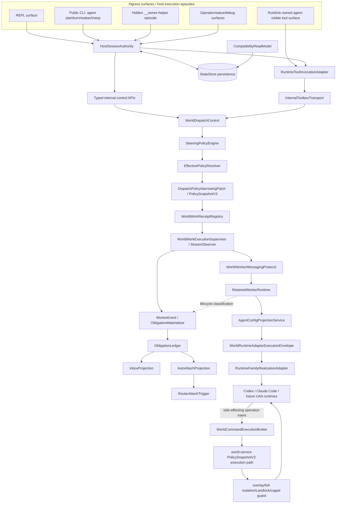

# Substrate Runtime Refactor Directive

**Subtitle:** Surface-neutral durable authority, receipt-oriented world work, and policy-mediated runtime adapters  
**Purpose:** Direct the next refactor pass across Substrate’s agent runtime, world dispatch, retained workers, UAA adapters, policy projection, and world filesystem enforcement.  
**Status:** Synthesized from the staged architecture responses dated July 5–6, 2026. Treat this as a consolidated direction document, then verify code paths against the live worktree before landing changes.

---

## 1. Executive decision

Substrate should be refactored around a durable, surface-neutral control plane.

The permanent architecture is not:

```text
public CLI / REPL / hidden helper / toolbox
  → process liveness
  → private socket reachability
  → durable truth
```

It is:

```text
surface adapters
  → HostSessionAuthority
  → runtime-owned tool invocation and world dispatch
  → deny-by-default steering policy
  → receipt-oriented world work
  → retained worker runtime
  → obligation ledger and projections
  → Substrate-owned config/policy/runtime projection
  → world execution envelope and command broker
  → thin runtime-family adapters
```

The most compact north star is:

> **Surfaces are ingress. Sessions are authority. Long-lived work returns receipts. World work is supervised. UAA side effects are brokered. Policy can only narrow. Runtime adapters are thin.**

The prior recommendations did not contradict each other. Each later steer added a missing lower-level authority boundary:

1. **Durable authority:** demote `__owner-helper`; durable truth belongs to the orchestration session/control plane.
2. **Surface neutrality:** REPL, public CLI, hidden helper, and toolbox are peer ingress surfaces over the same authority model.
3. **First-class ledgers/projections:** obligations, inbox, auto-attach, router triggers, policy, retained messaging, and config projection are architecture seams, not helper/state-store details.
4. **Receipt-oriented work:** long-lived world work must hand back accepted receipts and be observed by a supervisor, not block the foreground tool call until terminal exit.
5. **UAA execution envelope:** Codex/UAA world adapters must be guest-realizable and policy-mediated for every side-effecting operation, not merely launched with a world cwd/env.
6. **Dispatch-scoped narrowing:** world tasks/workers may receive narrowing-only capability leases.
7. **Repo-grounded world_fs enforcement:** file read/write/discover narrowing should thread into the existing `PolicyPatch.world_fs → PolicySnapshotV3 → world-service overlay/Landlock/full-isolation` path, not invent a separate sandbox.

---

## 2. Final target architecture



The diagram is intentionally layered. The goal is not to create large god modules. The goal is to move each kind of authority into the narrowest module that can own it.

`RuntimeToolInvocationAdapter → InternalToolboxTransport` is one ingress route into `WorldDispatchControl`, not the exclusive route. Model-visible tool invocation should use that adapter path, but public CLI, REPL, and operator/debug surfaces may call `WorldDispatchControl` through typed internal APIs after `HostSessionAuthority` resolves the session, caller, world binding, and target identity. Do not route native CLI/REPL control through the agent-visible toolbox layer just to match the diagram.

Named seams in this document are authority/API boundaries first. They may begin as modules, traits, structs, or extracted functions inside existing crates. Do not create unnecessary crates, giant rewrites, or premature abstractions merely to match the diagram. The refactor is successful when authority boundaries, call paths, enforcement points, and tests are correct.

---

## 3. Non-negotiable invariants

### 3.1 Durable authority belongs to the orchestration session

The durable source of truth is the tuple:

```text
orchestration_session_id
+ authoritative participant lineage
+ exact workspace/world binding
+ host attach contract
+ retained worker identity
+ internal resume handle
+ lifecycle posture
+ policy snapshot/revision where applicable
```

The durable source of truth is not:

```text
REPL process liveness
CLI process liveness
__owner-helper PID
private stop socket reachability
prompt socket reachability
toolbox socket reachability
startup stream state
owner process liveness
Codex process cwd
SUBSTRATE_CAGED env alone
```

Helper/process/socket status may be a useful signal, but it must not decide durable truth.

### 3.2 Surfaces are peer ingress paths

Substrate has several surfaces:

```text
REPL surface
Public CLI surface
Hidden __owner-helper episode
Runtime-owned toolbox/tool adapter surface
World/member runtime surface
Operator/status/debug surfaces
```

None of them is the authority root. Each normalizes user/model/runtime intent and calls the shared control plane.

### 3.3 `__owner-helper` is demoted, not deleted first

`__owner-helper` may remain as a hidden attached episode process for the CLI path. It may host live prompt/stop/toolbox transports, stream startup prompts, run `ResumeOneTurn`, emit heartbeats, and report adapter status.

It must not own:

```text
durable session identity
retained worker identity
world binding truth
successor allocation
authoritative lifecycle posture
stop/closeout truth
worker continuity truth
```

Do not remove it as a first step. First demote it behind `HostExecutionEpisode` / `HostExecutionAdapter` semantics.

### 3.4 Private transports are fast paths only

Private prompt, stop, toolbox, and heartbeat channels should be classified as:

```text
Available
UnavailableButDurableAuthorityExists
UnavailableAndNoAuthoritativeRoute
StaleOrOrphaned
```

A failed private socket should not prevent durable closeout or park if `HostSessionAuthority` can resolve the exact session, binding, worker, and resume-handle truth.

A stale private socket must never rewrite a newer authoritative posture.

### 3.5 Exact identity and fail-closed routing

All world-dispatch verbs must resolve exact identity and fail closed on ambiguity:

```text
run_world_task
spawn_world_worker
continue_world_worker
inspect_world_worker
fork_world_worker
cancel_world_work
stop_world_worker
```

Public selectors may expose session/backend IDs. Internal participant IDs, UAA session IDs, lease tokens, active-run IDs, and resume handles should be injected by runtime authority, not invented by the model or ordinary public API.

### 3.6 Detached world follow-up remains fail-closed

Until deliberately redesigned, detached world/member follow-up must fail closed unless an exact retained-worker route is resolved through `HostSessionAuthority` and `WorldDispatchControl`.

Allowed detached cases:

1. Host reattach restores an attached owner episode.
2. Explicit `ResumeOneTurn` runs through `HostSessionAuthority` and `WorldDispatchControl`, then parks/closes according to durable posture.

Do not let “some helper is still alive” become authorization.

### 3.7 State store is persistence, not policy authority

`StateStore` persists durable records and provides atomic read/write helpers. It should not remain the combined authority, compatibility repair, lifecycle policy, routing, projection, and persistence module.

Split:

```text
HostSessionAuthority      authoritative state transitions and exact target resolution
StateStore                persistence and migrations
CompatibilityReadModel    legacy layout projection, diagnostics, torn-root repair
```

Compatibility read-repair can report and migrate stale state. It must not override new authority writes.

### 3.8 Obligations are canonical durable truth

Attention, review, deferred action, and auto-attach should be modeled as durable obligations, not scattered notification rows or helper queues.

Correct chain:

```text
worker event / runtime alert
  → policy-gated obligation creation
  → inbox/review projection
  → optional auto-attach projection
  → router restores host attachment when eligible
  → host resolves obligation through explicit action
```

Incorrect chain:

```text
worker event
  → hidden prompt replay
  → direct retained-worker continuation
  → router as mini-orchestrator
```

Host `awaiting_attention` should be derived from unresolved attention-driving obligations. Worker `attention_pending` is worker lifecycle state. Keep those separate.

`ObligationLedger` is fed by durable worker/runtime events materialized by `WorldWorkExecutionSupervisor` or the event materializer. `RetainedWorkerRuntime` may participate in lifecycle classification, but obligations must not wait for retained-worker terminal closeout or helper lifecycle handling.

### 3.9 Auto-attach restores host ownership only

Auto-attach is not “resume the worker.” It is “restore sanctioned host ownership so the host can address the obligation.”

The router may:

```text
watch attach-eligible obligations
claim one attach job per session
restore or launch a sanctioned host execution client
record attach outcome
stop
```

The router must not:

```text
answer the worker
approve work
fork workers
submit prompts
continue world work directly
become a hidden orchestrator
```

### 3.10 World work is receipt-oriented

Long-lived or resumable world work should not require the foreground agent-visible tool call to remain open until terminal process exit.

Correct:

```text
tool call validates target and policy
  → starts/submits work
  → persists accepted active-run receipt
  → returns durable handle
  → background supervisor observes stream/events/terminal closeout
  → obligations/inbox/auto-attach are materialized durably
```

Incorrect:

```text
tool call validates target and policy
  → starts work
  → blocks until worker exits
  → only then returns outcome / creates obligations / enables cancel
```

Internal transport streams may remain terminal-framed. The foreground tool contract should still be able to return accepted receipts.

### 3.11 Cancel targets active work receipts

`cancel_world_work` should target an active work receipt/run, not broad participant liveness.

Resolution should separate:

```text
retained worker routing validity
active turn/run existence
cancel transport reachability
durable closeout truth
```

If no active run exists, return `NoActiveCancelableWork`, not `stale_linkage`.

### 3.12 UAA adapters are world-placed and world-policy-mediated

For world-scoped UAA adapters, it is not enough that Codex starts with a workspace cwd and Substrate env vars.

Two questions must both be true:

1. Did the UAA adapter process start in a guest-realizable world runtime?
2. Are all side-effecting operations performed by that adapter forced through Substrate’s world policy/cage/enforcement path?

Side-effecting operations include shell commands, patch/apply-edit operations, direct file writes, MCP/tool calls that can touch filesystem/network/process state, provider-native edit APIs, process spawning, and network-affecting adapter features. If an operation cannot be brokered or proven policy-mediated, disable it or fail closed in world scope.

The current architectural target must enforce both runtime placement and operation mediation.

### 3.13 Caging is active execution mediation, not passive env

`SUBSTRATE_CAGED=1` and `SUBSTRATE_ANCHOR_MODE=project` describe policy. They do not enforce it by themselves.

Caging requires the command text to pass through the same shell process/path that applies:

```text
should_guard_anchor(...)
wrap_with_anchor_guard(...)
wrap_with_world_env_contract(...)
PolicySnapshotV3-derived world-service execution inputs
```

Wrapping only the initial Codex process is insufficient if later Codex shell/tool commands, patch/apply-edit calls, write-capable MCP tools, or provider-native edit APIs are executed directly by Codex outside Substrate’s world execution path.

### 3.14 `external_sandbox` means “Substrate owns sandboxing”

For Codex/UAA, `agent_api.exec.external_sandbox.v1=true` must not mean “sandboxing is disabled.”

It should mean:

```text
Codex-native sandbox is not the authority;
Substrate's WorldCommandExecutionBroker / world-service policy path is the authority.
```

If the broker is not active for world-scoped side-effecting operations, fail closed.

### 3.15 Dispatch narrowing can only remove power

World tasks and retained world workers may receive dispatch-scoped policy narrowing, but never broadening.

Effective policy composition is monotonic:

```text
effective_dispatch_policy =
  current_global/workspace/session/world_policy
  ∧ retained_worker_capability_cap if present
  ∧ dispatch_or_turn_narrowing
```

Where `∧` means “most restrictive compatible policy.”

Parent policy broadening after spawn does not broaden an existing retained worker. Parent policy narrowing after spawn narrows or invalidates future worker turns.

### 3.16 File policy narrowing must use existing world_fs machinery

Do not invent a new file sandbox.

Dispatch-scoped file narrowing should thread into the existing stack:

```text
restricted PolicyPatch.world_fs
  → current effective Policy
  → monotonic/path-containment validation
  → narrowed PolicySnapshotV3
  → world-service policy inputs
  → overlay/full-isolation/Landlock/caged guard enforcement
  → receipt/manifest/active-turn policy hash
```

The main missing carrier is request-scoped narrowing into the dispatch/receipt/manifest path, not a brand-new read/write/discover policy system.

### 3.17 Accepted active runs use immutable policy snapshots

An accepted active task or retained-worker turn runs under the immutable `PolicySnapshotV3` recorded on its receipt. Later parent-policy narrowing applies to future dispatches, continues, forks, and retained-worker turns unless an explicit emergency revocation/cancel path is invoked.

Do not silently mutate the policy snapshot of an already accepted active run. Separate:

```text
policy for future routing/dispatch
policy snapshot already accepted for this active run
emergency revocation/cancel semantics
```

### 3.18 Named seams are boundaries before crates

The named seams in this directive do not require one new module or crate each. Start with the smallest repo-grounded changes that make the boundary true: a trait, helper type, extracted function, facade module, or existing-crate refactor is acceptable. Avoid over-splitting until the authority path and tests prove the shape.

---

## 4. Named seams and responsibilities

### 4.1 `SurfaceAdapter` / `HostExecutionEpisode`

Represents any live attached host execution surface.

Concrete episode kinds:

```rust
enum HostExecutionEpisodeKind {
    ReplAttachedEpisode,
    HiddenOwnerHelperStartEpisode,
    HiddenOwnerHelperAttachEpisode,
    HiddenOwnerHelperResumeOneTurnEpisode,
    RuntimeToolboxEpisode,
    SyntheticOrRecoveredEpisode,
}
```

Owns:

```text
surface-specific input normalization
live prompt/stop/toolbox channel ownership
live stream rendering
surface-local cancellation handles
adapter readiness observations
```

Does not own:

```text
durable session truth
retained worker continuity
world binding truth
successor allocation
terminal closeout truth
```

### 4.2 `HostSessionAuthority`

Owns authoritative orchestration-session meaning.

Minimum API:

```rust
resolve_public_session_authority(...)
resolve_public_control_target(...)
resolve_host_attach_target(...)
resolve_internal_world_dispatch_caller(...)
resolve_internal_world_dispatch_target(...)
resolve_world_binding(...)
resolve_retained_worker(...)
allocate_successor_participant(...)
validate_host_attach_contract(...)
validate_successor_lineage(...)
classify_session_posture(...)
mark_active_attached(...)
mark_parked_resumable(...)
mark_awaiting_attention(...)
mark_stop_requested(...)
mark_stop_closeout(...)
mark_terminal(...)
```

It should be the only module allowed to decide durable posture:

```rust
enum HostSessionPosture {
    ActiveAttached,
    ParkedResumable,
    DetachedReconciled,
    AwaitingAttention,
    Terminal,
    StaleRecoverable,
    Invalid,
}
```

### 4.3 `StateStore`

Owns persistence only:

```text
atomic reads/writes
migrations
snapshots
durable record storage
schema evolution
```

It should not directly encode new routing/lifecycle policy.

### 4.4 `CompatibilityReadModel`

Owns compatibility surfaces:

```text
legacy state inspection
torn-root fallback
old layout projection
migration diagnostics
read-only summaries
```

It may repair or project for compatibility, but it must not become the authority path for new writes.

### 4.5 `InternalToolboxTransport`

Owns internal transport mechanics:

```text
session-scoped internal-only channel
exact-identity request envelope
newline-delimited JSON / event-capable protocol
transport readiness and diagnostics
fail-closed identity binding
```

The model should never discover or reconstruct this endpoint directly.

### 4.6 `RuntimeToolInvocationAdapter` / `AgentVisibleToolSurface`

Owns model-visible tool contract.

Responsibilities:

```text
expose callable tools to the live host agent
validate model-supplied intent
inject runtime-owned identity
translate into internal toolbox requests
return structured outcomes and receipts
hide internal lease/session/participant handles
```

It is distinct from the internal toolbox socket. The socket is transport; this layer is the runtime-owned tool contract.

### 4.7 `WorldDispatchControl`

Owns typed world-control verbs and is reachable through more than one ingress path. Model-visible tool calls should enter via `RuntimeToolInvocationAdapter` and `InternalToolboxTransport`; public CLI, REPL, and operator/debug surfaces may call the same world-dispatch core through typed internal APIs after `HostSessionAuthority` resolution.

Owns typed world-control verbs:

```rust
run_world_task(...)
spawn_world_worker(...)
continue_world_worker(...)
inspect_world_worker(...)
fork_world_worker(...)
cancel_world_work(...)
stop_world_worker(...)
```

Sequence for every verb:

```text
1. Ask HostSessionAuthority to resolve exact caller/session/world/target.
2. Fail closed on ambiguity or invalid binding.
3. Ask SteeringPolicyEngine and EffectivePolicyResolver to validate allowed action and policy envelope.
4. Create or target receipts/manifests as needed.
5. Invoke RetainedWorkerRuntime / WorldWorkExecutionSupervisor.
6. Use live transports only as delivery fast paths.
7. Persist durable state transitions through authority modules.
8. Return a result that distinguishes durable success from transport success.
```

Expected result categories should include:

```text
DurableSuccessTransportUsed
DurableSuccessTransportUnavailable
AcceptedReceiptCreated
FailedNoAuthoritativeSession
FailedAmbiguousTarget
FailedInvalidWorldBinding
FailedNoResumeHandle
FailedPolicyDenied
FailedUnsupportedNarrowing
FailedRuntimeAdapterError
```

### 4.8 `SteeringPolicyEngine`

Owns deny-by-default host-to-world steering decisions.

Policy dimensions:

```text
global steering enablement
allowed target backends
allowed modes
allowed actions
same-session boundary
same-world-binding boundary
capability narrowing permission
fork request autonomy
fork depth/concurrency
notification/obligation-driving permission
```

Policy checks should not be scattered through helpers, state store, world dispatch, and runtime adapters.

### 4.9 `EffectivePolicyResolver` and `DispatchPolicyNarrowingPatch`

Own policy composition and dispatch-scoped narrowing.

Responsibilities:

```text
resolve current parent effective policy
check agents.world_dispatch.allow_capability_narrowing
validate monotonic narrowing
apply restricted PolicyPatch.world_fs initially
re-run existing effective-policy validation/finalization
materialize narrowed PolicySnapshotV3
return snapshot hash/ref for receipts/manifests
```

First-cut allowed narrowing should be limited to existing `world_fs` fields unless broader policy dimensions are already enforceable.

### 4.10 `WorldWorkReceiptRegistry`

Owns durable active-work identity.

For ephemeral tasks:

```rust
struct ActiveEphemeralTaskReceiptV1 {
    task_run_id: String,
    orchestration_session_id: String,
    caller_participant_id: String,
    target_backend_id: String,
    world_id: String,
    world_generation: u64,
    policy_snapshot_hash: String,
    state: ActiveTaskState,
}
```

For retained worker turns:

```rust
struct ActiveRetainedTurnReceiptV1 {
    active_run_id: String,
    orchestration_session_id: String,
    orchestrator_participant_id: String,
    target_participant_id: String,
    target_backend_id: String,
    world_id: String,
    world_generation: u64,
    thread_id: Option<String>,
    message_id: String,
    worker_policy_cap_hash: Option<String>,
    turn_policy_snapshot_hash: String,
    cancel_supported: bool,
    state: ActiveRetainedTurnState,
}
```

Receipt states should include:

```text
accepted
running
attention_pending
parked
terminal
failed
cancelled
stopped
```

### 4.11 `WorldWorkExecutionSupervisor` / `StreamObserver`

Owns background observation of long-lived internal streams.

Responsibilities:

```text
continue consuming internal transport stream after foreground tool returns receipt
persist Start / Registered / Event / Exit / Error frames
materialize active run state
publish terminal truth
publish worker events
create/update obligations
trigger auto-attach discovery when eligible
close active run records
handle cancellation closeout
```

The internal stream can still require terminal `Exit`. The supervisor, not the foreground tool call, should wait for it.

`WorldWorkExecutionSupervisor` must be restart-safe and idempotent. Stream frames, worker events, terminal closeouts, obligation materialization, and active-run state transitions must be keyed by `request_id`, `active_run_id`, frame sequence, event id, or equivalent causation IDs. Supervisor restart or duplicate frame processing must not double-create obligations, double-close runs, regress terminal state, or let a stale observer overwrite a newer active-run state.

### 4.12 `WorldWorkerMessagingProtocol`

Owns typed host-to-worker and worker-to-host messaging.

Host-to-worker message classes:

```text
instruction
clarification_response
approval_response
progress_ack
control_directive
fork_command
```

Worker-to-host event classes:

```text
reply
follow_up_question
progress_update
approval_request
blocked
result
failure
attention_required
fork_request
fork_recommendation
control_ack
```

Preserve:

```text
exact target participant
thread_id
causation IDs
message class
event class
attention_required status
durable event channel
immediate stream channel
```

Attention-driving worker events should materialize durable obligations. They should not be prompt-injected directly into a hidden helper.

### 4.13 `RetainedWorkerRuntime`

Owns retained and ephemeral world-worker lifecycle.

Responsibilities:

```text
create retained worker slot
persist retained identity
persist resume handle
bind worker to session/world/backend
continue retained worker
park retained worker
stop retained worker
cancel active retained turn
close out retained worker
fork retained worker
inspect retained worker
invalidate unroutable workers
```

Important lifecycle distinctions:

```text
ephemeral task vs retained worker
worker lifecycle state vs host-session posture
attention_pending vs awaiting_attention
cancel active turn vs stop retained worker
invalidated worker vs failed worker
clean bootstrap exit after resume handle → parked/resumable
world-generation mismatch → unroutable/invalidated
```

### 4.14 `ObligationLedger`

Owns canonical durable obligations.

Responsibilities:

```text
create policy-gated obligations from durable worker/runtime events
track review_state
track attach_state
derive host awaiting_attention posture
record resolution and causation
support inbox and auto-attach projections
```

Obligations should be materialized by the supervisor/event-materializer path as events arrive. Retained-worker lifecycle classification may inform the obligation, but obligation creation must not wait for retained-worker terminal closeout.

Do not model obligations as ad hoc queues, helper prompts, or direct attach jobs.

### 4.15 `InboxProjection`, `AutoAttachProjection`, and `RouterAttachTrigger`

`InboxProjection` renders review/attention work from obligations.

`AutoAttachProjection` determines attach eligibility from obligations.

`RouterAttachTrigger` restores sanctioned host attachment. It should coalesce per session and stop after attach outcome is recorded.

The router must not become a mini-orchestrator.

### 4.16 `AgentConfigProjectionService` / `RuntimeProjectionAuthority`

Owns Substrate-owned projection into runtime-native config.

Layers:

```text
Logical inventory layer
Effective projection layer
Native projection layer
Launch-time secret handoff layer
```

Substrate owns logical inventory and effective policy. Runtime-native files such as `.codex`, `.claude`, `.mcp.json`, or `CODEX_HOME` are projections, not authority.

Projection identity must include retained-worker identity now and future lane identity later. `workspace + backend + world_generation` is too coarse because same-backend sibling workers can otherwise alias projected state.

### 4.17 `WorldRuntimeAdapterExecutionEnvelope`

Owns launch-time world adapter contract.

Responsibilities:

```text
guest-visible runtime binary
world-visible interpreter/runtime deps
CODEX_HOME / runtime home projection
env projection
cwd/root placement
cgroup/network/fs posture
capability policy
adapter-specific execution extensions
```

Suggested shape:

```rust
enum AdapterExecutionEnvelopeKind {
    HostOrchestrator,
    WorldMember {
        world_id: String,
        world_generation: u64,
        workspace_root: PathBuf,
        retained_participant_id: String,
        policy_snapshot_hash: String,
    },
}
```

Host Codex and world Codex must not share one ambiguous execution posture.

### 4.18 `WorldCommandExecutionBroker`

Owns per-operation mediation for UAA side effects.

Responsibilities:

```text
receive shell/tool/patch/write/process/network intent from UAA runtime
mediate patch/apply-edit and provider-native edit operations
mediate MCP/tool calls that can touch filesystem/network/process state
apply caged anchor guard to shell commands
apply world env contract
validate/repair cwd
apply fs/write/discover/read policy via PolicySnapshotV3 path
apply network policy
apply process telemetry
event capture and result shaping
fail closed for unbrokered side-effecting operations
```

The Codex/UAA adapter must not directly spawn unrestricted shell commands, apply native file edits, call write-capable MCP tools, or invoke other side-effecting provider channels in world scope unless those operations are mediated by this broker or an equivalent policy-proven path.

### 4.19 `RuntimeFamilyRealizationAdapter`

Owns provider-specific mechanics only.

Examples:

```text
Codex launch mechanics
Claude Code launch mechanics
native config file format
prompt delivery mechanism
resume handle extraction
provider-specific cancellation mechanics
provider-specific output parsing
```

It must not own Substrate lifecycle semantics, policy semantics, durable authority, or world binding truth.

---

## 5. Core data contracts

### 5.1 Durable session authority tuple

```rust
struct DurableSessionAuthorityV1 {
    orchestration_session_id: String,
    authoritative_participant_lineage: Vec<String>,
    workspace_binding: WorkspaceBindingV1,
    world_binding: Option<WorldBindingV1>,
    host_attach_contract: Option<HostAttachContractV1>,
    retained_worker_refs: Vec<RetainedWorkerRefV1>,
    lifecycle_posture: HostSessionPosture,
    current_policy_ref: Option<PolicyRefV1>,
    current_policy_revision: Option<String>,
}
```

### 5.2 Host execution episode

```rust
struct HostExecutionEpisodeV1 {
    episode_id: String,
    kind: HostExecutionEpisodeKind,
    orchestration_session_id: String,
    backend_id: Option<String>,
    process_ref: Option<ProcessRefV1>,
    transport_status: HostExecutionEpisodeTransportStatus,
    started_at: Timestamp,
    last_heartbeat_at: Option<Timestamp>,
}
```

### 5.3 Dispatch-scoped world_fs narrowing

Do not create a custom file-policy model. Use a restricted policy patch.

```rust
struct DispatchPolicyNarrowingPatchV1 {
    request_id: String,
    orchestration_session_id: String,
    caller_participant_id: String,
    target_backend_id: String,
    target_world: WorldBindingRefV1,
    applies_to: DispatchCapabilitySubject,
    parent_policy_ref: PolicyRefV1,
    parent_policy_revision: String,
    restricted_policy_patch: RestrictedPolicyPatchV1,
    reason: Option<String>,
}
```

Initial `RestrictedPolicyPatchV1` should allow only `world_fs` fields:

```text
world_fs.host_visible: true → false only
world_fs.fail_closed.routing: false → true only
world_fs.caged_required: false → true only
world_fs.write.enabled: true → false only
world_fs.deny_enforcement: may only strengthen
world_fs.discover.allow_list: path-containment narrowing only
world_fs.read.allow_list: path-containment narrowing only
world_fs.write.allow_list: path-containment narrowing only
world_fs.discover/read/write.deny_list: may add denial only
```

### 5.4 Retained worker manifest with policy cap

```rust
struct RetainedWorkerManifestV1 {
    retained_participant_id: String,
    orchestration_session_id: String,
    target_backend_id: String,
    world_id: String,
    world_generation: u64,
    runtime_family: String,
    resume_handle_ref: Option<String>,
    worker_policy_cap_hash: String,
    worker_policy_cap_snapshot: PolicySnapshotV3,
    lifecycle_state: RetainedWorkerLifecycleState,
    created_at: Timestamp,
    updated_at: Timestamp,
}
```

Spawn-time narrowing becomes the worker’s maximum capability cap. Future turns may narrow further, never broaden.

### 5.5 Active retained turn receipt

```rust
struct ActiveRetainedTurnReceiptV1 {
    active_run_id: String,
    request_id: String,
    orchestration_session_id: String,
    orchestrator_participant_id: String,
    target_participant_id: String,
    target_backend_id: String,
    world_id: String,
    world_generation: u64,
    message_id: String,
    thread_id: Option<String>,
    worker_policy_cap_hash: String,
    turn_policy_snapshot_hash: String,
    accepted_at: Timestamp,
    state: ActiveRetainedTurnState,
    cancel_supported: bool,
}
```

Accepted active-run receipts are policy commitments. Their `PolicySnapshotV3` hash/ref is immutable for that active run. Later parent-policy changes affect future work and may trigger explicit emergency revocation/cancel handling, but they must not silently rewrite an already accepted run’s recorded snapshot.

### 5.6 Adapter execution envelope

```rust
struct WorldRuntimeAdapterExecutionEnvelopeV1 {
    envelope_id: String,
    kind: AdapterExecutionEnvelopeKind,
    runtime_family: String,
    guest_entrypoint: PathBuf,
    projected_home: Option<PathBuf>,
    workspace_root: PathBuf,
    world_id: String,
    world_generation: u64,
    retained_participant_id: Option<String>,
    policy_snapshot_hash: String,
    env_projection_ref: String,
    config_projection_ref: String,
    command_broker_required: bool,
}
```

For world-scoped Codex, guest entrypoint must be world-realizable, for example a `/var/lib/substrate/world-deps/bin/codex`-style path. It must not silently resolve to a host NVM path.

---

## 6. Refactor landing plan

### Phase 0 — Mark authority leaks before moving code

Find every place where durable truth is gated on:

```text
owner_helper_exited
helper PID alive
private stop socket reachable
prompt transport reachable
toolbox transport reachable
runtime_owns_private_stop
attached client present
owner_process_is_alive
Codex cwd/env alone
```

Classify each usage:

```text
SignalOnly
FastPathTransport
AuthorityDecision
CompatibilityRead
```

Anything classified as `AuthorityDecision` should move behind `HostSessionAuthority`, `WorldDispatchControl`, `WorldWorkReceiptRegistry`, or the relevant policy/runtime boundary.

### Phase 1 — Introduce surface-neutral session authority

Create/consolidate `HostSessionAuthority` around existing orchestration-session state.

Move shared writes from REPL, CLI, hidden helper, toolbox, stop, reattach, resume, and auto-park through authority methods.

Do not allow surface-specific direct lifecycle mutations except as thin wrappers over authority APIs.

### Phase 2 — Generalize helper concepts into host execution episodes

Rename/genericize helper-specific concepts where appropriate:

```text
HiddenOwnerHelperLaunchContinuity → HostExecutionEpisodeContinuity
HiddenOwnerHelperLaunchReadiness → HostExecutionEpisodeReadiness
owner_helper_exited → episode_exit_observation
owner_process_alive → episode_process_signal
```

Keep `__owner-helper` as one implementation of `HostExecutionEpisode`, not the root abstraction.

### Phase 3 — Split state store, authority, and compatibility read model

Move policy/routing/lifecycle decisions out of broad state-store code where possible.

State store should persist. Authority modules should decide. Compatibility read model should project legacy truth without overriding new truth.

### Phase 4 — Harden world dispatch around exact identity and policy

Refactor world verbs to route through:

```text
HostSessionAuthority
→ WorldDispatchControl
→ SteeringPolicyEngine
→ EffectivePolicyResolver
→ RetainedWorkerRuntime / WorldWorkReceiptRegistry
```

Every target must resolve exact session/backend/world/worker identity or fail closed.

### Phase 5 — Add receipt-oriented world work

For `continue_world_worker`:

```text
validate exact target/policy
submit retained turn
observe accepted/start frame
persist ActiveRetainedTurnReceipt
return ContinueWorldWorkerAcceptedV1
supervisor continues stream observation
```

The accepted receipt must record the immutable `PolicySnapshotV3` hash/ref for that run. Supervisor state transitions and stream frames must be idempotent and replay-safe from this receipt.

For `run_world_task`:

```text
observe/register task_run_id
persist ActiveEphemeralTaskReceipt
return RunWorldTaskReceiptV1
supervisor publishes terminal truth later
```

The task receipt must record the immutable `PolicySnapshotV3` hash/ref for that task run.

Any blocking/waiting UI mode should be a wrapper over receipt semantics, not the core semantic contract.

### Phase 6 — Refactor cancel around active receipts

Change `cancel_world_work` from participant/process liveness targeting to active-run targeting.

Expected outcomes:

```text
CancelledViaLiveTransport
CancelAcceptedPendingCloseout
AlreadyTerminal
NoActiveCancelableWork
OwnerUnreachable
InvalidTarget
WorldBindingMismatch
AmbiguousTarget
PolicyDenied
```

`NoActiveCancelableWork` is not `stale_linkage`.

### Phase 7 — Materialize obligations from background events

Move attention-driving event handling into the supervisor/materializer path:

```text
worker event arrives
  → classify event
  → enforce event policy
  → persist durable worker event
  → create/update obligation
  → update inbox projection
  → trigger auto-attach discovery if eligible
  → continue observing stream
```

Do not wait until the foreground `continue_world_worker` call exits to publish obligations.

### Phase 8 — Implement router attach as host-ownership restoration only

Router attach flow:

```text
watch attach-eligible obligations
claim one attach job per session
restore or launch sanctioned host episode
record attach outcome
stop
```

No prompt replay. No direct worker continuation. No approval. No fork.

### Phase 9 — Add UAA world adapter execution envelopes

Separate host and world runtime adapter posture.

For world Codex/UAA:

```text
guest-realizable runtime entrypoint
world deps
world cwd/root
CODEX_HOME/config projection
policy snapshot hash
command broker required
world-service execution envelope required
```

If side-effect mediation is unavailable, fail closed rather than running advisory-only.

### Phase 10 — Route UAA side effects through the existing world-service policy path

Do not build a new filesystem sandbox.

Ensure UAA side-effecting operations flow through a policy-mediated broker path. This includes shell commands, patch/apply-edit operations, direct file writes, MCP/tool calls that can touch filesystem/network/process state, provider-native edit APIs, process spawning, and network-affecting features. Shell command execution should flow through:

```text
WorldCommandExecutionBroker
→ PolicySnapshotV3-derived world-service execution inputs
→ caged guard/world env wrapper
→ overlay/full-isolation/Landlock enforcement
```

Equivalent brokered paths are acceptable for non-shell operations only if they enforce the same `PolicySnapshotV3` envelope. Passing `SUBSTRATE_WORLD_FS_*` or `SUBSTRATE_CAGED` env vars into Codex is not sufficient if Codex executes shell commands, patch operations, or MCP/tool writes directly outside this path.

### Phase 11 — Add dispatch-scoped `world_fs` narrowing

Implement a restricted policy patch carrier:

```text
DispatchPolicyNarrowingPatchV1 = restricted PolicyPatch.world_fs
```

Gated by:

```text
agents.world_dispatch.allow_capability_narrowing
```

Processing:

```text
resolve current effective policy
validate monotonic narrowing
apply restricted patch
run existing effective-policy finalization
materialize narrowed PolicySnapshotV3
persist snapshot/hash on receipts/manifests
execute through narrowed snapshot
```

For retained workers:

```text
spawn: worker_policy_cap = current parent policy ∧ spawn narrowing
continue: turn_policy = current parent policy ∧ worker_policy_cap ∧ turn narrowing
fork: child inherits parent cap by default and may narrow further
```

An already accepted active task/turn continues under the immutable snapshot recorded on its receipt unless explicit emergency revocation/cancel is invoked. Parent-policy changes affect future dispatches, continues, forks, and turns, not the recorded snapshot of work already accepted.

### Phase 12 — Improve path-containment validation

Existing monotonic validators may be equality-based for allow-list subsets. Dispatch narrowing needs path containment:

```text
base "." contains "src/parser.rs"
base "src" contains "src/parser.rs"
base "src/parser.rs" contains only "src/parser.rs"
```

Reject:

```text
absolute host paths
../ escapes
globs in allow_list if unsupported
symlink escapes
paths outside world/project root
broadening from file to directory
broadening from directory to root
```

### Phase 13 — Config projection as first-class authority boundary

Add/clarify `AgentConfigProjectionService` so runtime-native files are projections, not truth.

For Codex, preserve the direction:

```text
CODEX_HOME explicit home-root projection
workspace .codex compatibility-only
per-retained-worker projected state
Substrate-owned logical inventory and effective policy
launch-time secret handoff
```

---

## 7. Regression gates and acceptance tests

### 7.1 Surface and authority tests

1. Killing `__owner-helper` does not delete durable orchestration session truth.
2. A stale private stop socket does not prevent durable retained-worker closeout when exact identity resolves.
3. An orphaned helper cannot rewrite newer authoritative posture.
4. REPL and CLI state transitions go through the same authority path.
5. Public selectors use session/backend IDs; internal participant/UAA/resume IDs stay internal.
6. Detached world follow-up fails closed unless an exact retained-worker route is resolved.
7. Clean bootstrap exit after valid resume handle produces `ParkedResumable`, not lost/deleted.

### 7.2 Existing debug invariants to preserve

Do not regress:

1. Public world-scoped start → reattach → stop works.
2. REPL first-dispatch `run_world_task` world_id mismatch repair remains fixed.
3. Ordinary unprefixed REPL `ls`/`pwd` after parked host turn works.
4. `cd ../` remains blocked by caged-root guard where policy requires it.
5. REPL and public CLI targeted host-turn continuity remain green.
6. Retained spawn/fork/exact continue remain green.
7. Exact retained source stop succeeds via detached durable closeout.
8. Fork-child stop succeeds through live private owner surface when available.
9. Backend-only `cli:codex-world` follow-up after multiple retained workers ambiguity-closes.
10. `cli:codex-host` remains the durable orchestration-session continuity health check.

### 7.3 Receipt/supervisor tests

1. `continue_world_worker` returns an accepted receipt before terminal worker exit.
2. `run_world_task` returns a durable task receipt once task identity is registered.
3. Background supervisor persists stream frames after foreground return.
4. Worker events create obligations before terminal exit when attention is required.
5. Same-turn continue → cancel can target the active run receipt.
6. Cancel with no active run returns `NoActiveCancelableWork`, not `stale_linkage`.
7. Already-terminal active run returns `AlreadyTerminal`.
8. Owner transport unavailable distinguishes pending/durable closeout from invalid identity.
9. Supervisor crash after accepted receipt but before terminal exit can resume observation or reconcile terminal state.
10. Duplicate stream/event frames do not duplicate obligations or active-run transitions.
11. Terminal closeout is idempotent.
12. A stale supervisor cannot overwrite a newer active-run state.
13. Already accepted active runs preserve their recorded policy snapshot across later parent-policy changes.

### 7.4 Obligation/router tests

1. Attention-driving worker event creates canonical obligation.
2. Host `awaiting_attention` derives from unresolved obligation.
3. Worker `attention_pending` remains separate from host posture.
4. Inbox projection renders obligation state; it is not the canonical ledger.
5. Auto-attach projection is derived from obligation attach state.
6. Router attach restores host ownership and stops.
7. Router does not submit prompts, approve work, fork workers, or continue world work.

### 7.5 UAA runtime realization tests

1. `cli:codex_world` must not resolve to host `~/.config/nvm/.../codex`.
2. World-scoped Codex requires a guest-visible world-deps entrypoint or fails closed.
3. Host Codex and world Codex have distinct execution envelope kinds.
4. Per-retained-worker Codex home/config projection does not alias sibling workers.

### 7.6 UAA side-effect mediation and caging tests

1. With `world.caged=true` and `anchor_mode=project`, retained Codex worker command:

   ```sh
   pwd && cd ../ && pwd
   ```

   remains anchored at the project root or emits the expected caged-root guard behavior.

2. Same security result through:

   ```text
   substrate -c
   run_world_task
   spawn_world_worker
   continue_world_worker
   retained Codex shell/tool execution
   ```

3. With `anchor_mode=follow-cwd`, behavior matches policy expectations.
4. With `world.caged=false`, leaving root is allowed, proving the test checks policy rather than a hard-coded guard.
5. Prompt attempts to bypass policy do not change enforcement.
6. `external_sandbox=true` without an active Substrate command broker fails closed.
7. Provider-native apply/edit operations cannot write outside the active `PolicySnapshotV3` envelope.
8. Write-capable MCP/tool calls are disabled or brokered through the same policy envelope.
9. Unbrokered side-effecting adapter operations fail closed in world scope.

### 7.7 Dispatch-scoped `world_fs` narrowing tests

1. `allow_capability_narrowing=false` rejects dispatch-time `world_fs` narrowing.
2. `allow_capability_narrowing=true` accepts narrowing-only patches.
3. Base `write.allow_list=["."]`, dispatch `write.allow_list=["src/parser.rs"]`: writing `src/parser.rs` succeeds; writing `README.md` fails.
4. Base `write.allow_list=["src"]`, dispatch `write.allow_list=["src/parser.rs"]` is accepted by path containment.
5. Base `write.allow_list=["src/parser.rs"]`, dispatch `write.allow_list=["."]` fails as broadening.
6. Dispatch cannot enable write if parent `write.enabled=false`.
7. Dispatch cannot weaken `caged_required`, `fail_closed.routing`, or `deny_enforcement`.
8. `host_visible=true` plus read/discover/write narrowing fails closed unless dispatch legally narrows to full isolation and full isolation is supported.
9. Retained worker spawn cap persists across `continue_world_worker`.
10. Per-turn narrowing can further narrow retained worker cap but cannot broaden it.
11. Parent policy broadening after worker spawn does not broaden the worker.
12. Parent policy narrowing after worker spawn narrows or invalidates the next turn.
13. Forked worker inherits parent worker cap by default and may narrow further.
14. Receipts/manifests record policy snapshot hash/revision and narrowing reason.

### 7.8 Config projection tests

1. Runtime-native workspace files are projections, not durable truth.
2. Workspace `.codex` remains compatibility-only if Codex projection uses `CODEX_HOME`.
3. Per-worker projected config does not alias sibling retained workers.
4. Secrets are handed off only through the launch-time secret projection layer.
5. Adapter config projection includes narrowed hints, but enforcement remains in command broker/world-service path.

### 7.9 Open debug buckets to re-baseline

These buckets must be explicitly re-baselined during the refactor rather than lost inside broader architecture work:

1. Codex/UAA worker-turn non-zero exit behavior must produce durable failed/terminal active-run state, useful diagnostics, and no false session-authority loss.
2. Host-visible file/write sync semantics must be tested under `host_visible=true`, full isolation, narrowed write allowlists, and retained-worker turns.

---

## 8. What not to do

Do not remove `__owner-helper` first. Demote it behind a generic episode boundary first.

Do not replace the helper with a giant daemon unless the daemon is still subordinate to `HostSessionAuthority`.

Do not let REPL become a separate orchestration authority.

Do not let private prompt/stop/toolbox reachability decide durable truth.

Do not let `state_store.rs` remain persistence, lifecycle authority, compatibility repair, routing policy, and projection logic all at once.

Do not make Codex/Claude adapters own Substrate semantics.

Do not expose internal participant IDs, UAA session IDs, lease IDs, or resume handles as normal public API.

Do not allow detached world follow-up merely because a helper process is alive.

Do not implement auto-attach as prompt replay or worker continuation.

Do not treat the internal toolbox socket as the agent-visible tool layer.

Do not force long-lived world work to block foreground tool calls until terminal exit.

Do not fix `cancel_world_work` by simply weakening liveness predicates. Add active-run receipts and target those.

Do not fix Codex caging by only adding env vars or only preserving cwd.

Do not wrap only the initial Codex process and assume later shell/tool commands are mediated.

Do not cage shell while leaving provider-native apply/edit APIs, direct file writes, write-capable MCP tools, or other side-effecting adapter channels unmediated.

Do not let `external_sandbox=true` mean “sandbox disabled.”

Do not invent a new file-policy sandbox when existing `world_fs` policy and overlay/Landlock/full-isolation machinery should be used.

Do not silently run dispatch narrowing as advisory-only. If enforcement is unavailable, fail closed.

Do not let parent policy broadening automatically broaden existing retained workers.

---

## 9. Agent-ready implementation objective

Use this as the directive for implementation agents:

```text
Refactor Substrate’s agent/world runtime around a surface-neutral durable control plane.

REPL, public CLI, hidden __owner-helper episodes, runtime toolbox/tool calls, and operator surfaces must be ingress surfaces into shared HostSessionAuthority, WorldDispatchControl, SteeringPolicyEngine, EffectivePolicyResolver, WorldWorkReceiptRegistry, WorldWorkExecutionSupervisor, RetainedWorkerRuntime, ObligationLedger, AgentConfigProjectionService, and WorldRuntimeAdapterExecutionEnvelope seams. RuntimeToolInvocationAdapter/InternalToolboxTransport is the model-visible tool route into WorldDispatchControl, not the exclusive native CLI/REPL/operator route.

Demote __owner-helper to a HostExecutionEpisode implementation. It may host live transports and helper episodes, but it must not own durable session truth, retained-worker continuity, world binding truth, stop/closeout truth, or lifecycle posture.

Make world work receipt-oriented. run_world_task and continue_world_worker must validate exact identity/policy, persist accepted active-work receipts, return durable handles, and let a restart-safe/idempotent background supervisor consume streams, persist worker events, materialize obligations, update terminal state, and support cancel/inspect/stop. Blocking UI behavior may exist only as a wrapper over receipt semantics. Accepted active task/turn receipts record immutable PolicySnapshotV3 hashes/refs; later parent-policy changes affect future work unless emergency revocation/cancel is invoked.

Refactor cancel_world_work to target active run receipts, not broad owner-process liveness. Distinguish no active cancelable work, already terminal, owner unreachable, durable pending closeout, invalid target, world-binding mismatch, and ambiguity.

Make obligations canonical. Worker attention/follow-up/approval/blocking events should create durable obligations, from which inbox, awaiting_attention, auto-attach eligibility, and router attach triggers are projected. Router auto-attach restores sanctioned host ownership only; it must not replay prompts, approve work, fork workers, or continue workers directly.

For world-scoped UAA adapters, require a guest-realizable runtime entrypoint and a Substrate-owned execution envelope. All Codex/UAA side-effecting operations must be brokered or policy-mediated: shell commands, patch/apply-edit operations, direct file writes, MCP/tool calls that can touch filesystem/network/process state, provider-native edit APIs, process spawning, and network-affecting features. The broker path must use the existing world-service PolicySnapshotV3 execution envelope, caged guard where applicable, world env wrapper, overlay/full-isolation/Landlock enforcement, network/fs policy, and telemetry. Passing cwd/env to Codex is not enough. external_sandbox=true means Substrate owns sandboxing; if broker enforcement is unavailable, fail closed.

Add dispatch-scoped capability narrowing as a restricted PolicyPatch.world_fs path, gated by agents.world_dispatch.allow_capability_narrowing. Narrowing may only remove power. Apply it to the current effective policy, run existing validation/finalization, materialize a narrowed PolicySnapshotV3, and persist snapshot hashes on run_world_task receipts, retained worker manifests, active retained-turn receipts, and fork records.

For retained workers, spawn-time narrowing becomes the worker’s maximum policy cap. Future continue_world_worker calls recompute current parent policy ∧ worker cap ∧ optional turn narrowing. Parent policy narrowing after spawn still applies; parent broadening does not automatically broaden the worker.

Preserve existing debug invariants: REPL/CLI continuity parity, ordinary unprefixed REPL command survivability after parked host turns, world-binding repair boundaries, exact retained continue/stop behavior, fork-child stop behavior, backend-only ambiguity close for multiple retained world workers, and cli:codex-host as the durable host continuity health check.

Do not invent a separate file sandbox. Use PolicyPatch.world_fs → effective Policy → PolicySnapshotV3 → world-service overlay/Landlock/full-isolation/caged enforcement. Add path-containment-aware monotonic validation where equality-only allow-list checks are too strict.
```

---

## 10. Practical review checklist for each PR

Every PR in this refactor should answer:

1. **Which authority boundary did this move clarify?**
2. **Did any surface-specific code still write durable lifecycle state directly?**
3. **Does this treat process/socket state as signal or authority?**
4. **Does the change preserve exact identity and fail-closed ambiguity behavior?**
5. **Does long-lived work return a durable receipt before terminal exit?**
6. **Does cancel target active work, not just participant/process liveness?**
7. **Are attention events durable obligations, not hidden prompt replay?**
8. **Do all UAA side-effecting operations go through a policy-mediated broker/world-service path?**
9. **Does dispatch narrowing use existing `world_fs` policy machinery?**
10. **Is every policy operation monotonic, or does it accidentally broaden power?**
11. **Are projected runtime config files treated as projections, not authority?**
12. **Did the PR add or preserve regression tests for the debug invariants?**
13. **Are supervisor frame processing, obligation creation, and terminal closeout idempotent/restart-safe?**
14. **Are already accepted active-run policy snapshots immutable unless explicit emergency revocation/cancel is invoked?**
15. **Are all UAA side-effecting operations mediated, not only shell commands?**
16. **Did the PR avoid creating crates/modules merely to satisfy diagram naming?**

---

## 11. Final bottom line

The refactor is not one cleanup. It is a layered control-plane correction.

The target architecture is:

```text
surface-neutral durable host orchestration
+ runtime-owned tool invocation
+ exact-identity world dispatch
+ deny-by-default steering policy
+ monotonic effective policy resolution
+ receipt-oriented active work
+ background stream supervision
+ typed retained-worker messaging
+ canonical obligation ledger
+ inbox/auto-attach/router projections
+ Substrate-owned runtime config/auth projection
+ guest-realizable UAA execution envelopes
+ brokered per-operation world policy enforcement
+ existing world_fs/PolicySnapshotV3 overlay/Landlock/full-isolation enforcement
+ thin runtime-family adapters
```

The refactor should be judged by one question:

> Can Substrate prove that every agent action ran under exact session identity, exact applicable binding, exact applicable policy snapshot, exact retained-worker/task receipt when world work is involved, and durable lifecycle/obligation truth — regardless of whether the request entered through REPL, CLI, hidden helper, toolbox, or UAA runtime?

If yes, the architecture is moving in the right direction.
