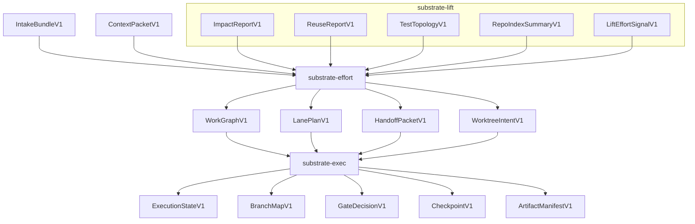

# Workstream / Worktree Parallel Orchestration Planner Proposal

Grounded in:

- `docs/code-intelligence-program.md`
- `crates/lift/README.md`
- current repository shape from the attached zip
- existing manual orchestration precedent in `ORCH_PLAN.md`
- durable host-session truth in `HOST_ORCHESTRATOR_INTENDED_BEHAVIOR_TRUTH.md`

## 1. Executive decision

The earlier `lift orchestrate` idea should be rewritten.

In the new code-intelligence program, the workstream/worktree planner should **not** be owned by Lift as a Lift app.

The correct ownership split is:

```text
lift    -> repository intelligence signals and artifacts
intake  -> task shaping and normalized task brief
context -> context packet assembly
effort  -> static work decomposition and parallel workstream planning
exec    -> runtime execution state, gates, checkpoints, and worktree materialization
```

So the feature becomes a cross-crate capability:

```text
Parallel Workstream Orchestration
  static planner: crates/effort
  worktree/runtime materializer: crates/exec
  repo intelligence provider: crates/lift
```

The short version:

> Lift says what is touched, risky, reusable, connected, testable, and likely to conflict.  
> Effort turns that into a deterministic work graph, lanes, freeze map, and handoff packets.  
> Exec materializes worktrees, records branch maps, evaluates gates, checkpoints progress, and manages resumable runtime state.

This keeps the system aligned with the new program rule: Lift remains the repository/code-intelligence engine and does not absorb context, effort, or execution ownership back into itself.

---

## 2. Why this is still a strong tool

This is one of the highest-value tools to build on top of the code-intelligence program because it is deterministic, useful without LLM calls, and directly addresses multi-agent execution failure modes.

The manual `ORCH_PLAN.md` already demonstrates the shape humans are hand-authoring today:

- source lock
- parent-owned run state
- worktree and branch protocol
- hard guards
- blocked-run conditions
- hotspot ownership map
- freeze gates
- dependency lanes
- only-safe-parallel windows
- worker handoff instructions
- validation wall
- final acceptance checklist

The planner can make that repeatable.

It should not “run agents.”

It should produce deterministic artifacts that an agent runtime, human operator, or future exec session can consume.

---

## 3. Does the existing plan already provide most of what we need?

Yes for repository intelligence.

No for static work decomposition and runtime materialization.

### Already covered by Lift-local plans

The current Lift architecture already plans most of the raw intelligence substrate:

```text
repo snapshots and diffs
language parsed units
concrete adapters
graph and scope
topology and classification
query and match
facts and detectors
derive and provenance
score app
impact app
policy app
contract app
index/export app
```

Those are the signals a planner needs.

### Already covered by the peer-crate program

The top-level code-intelligence program already introduces the ownership homes:

```text
intake -> task brief
context -> context packet
effort -> work graph, lanes, critical path, handoffs
exec -> execution state, gates, checkpoints, resumability, manifests
```

So the planner is not a new stray tool. It fits directly into the `effort` and `exec` roles.

### Still missing

We still need to add:

1. `crates/effort` static planning contracts and planner.
2. `crates/exec` worktree materialization and run-state contracts.
3. Lift export artifacts stable enough for effort to consume without deep Lift imports.
4. A small set of deterministic algorithms for conflict graph, lane partitioning, merge ordering, and gate generation.

No solver, LLM, or heavy optimizer dependency is needed for the first version.

---

## 4. What changes compared to the earlier plan

### Old shape

```text
lift orchestrate plan
lift orchestrate materialize
```

### New shape

```text
lift export impact/test-topology/reuse/repo-index/score-signals
substrate-effort plan
substrate-exec materialize-worktrees
substrate-exec status/checkpoint/gate
```

The exact CLI names can wait, but the ownership should not.

The key move is:

```text
orchestrate planning leaves Lift
```

Lift remains an input provider.

---

## 5. Program-level placement

This tool spans three program rollout points.

### A4 — Freeze early Lift export contracts

Needed before rich planning.

Lift should stabilize:

- `ImpactReportV1`
- `ReuseReportV1`
- `TestTopologyV1`
- `RepoIndexSummaryV1`
- `LiftEffortSignalV1` or equivalent score/effort signal artifact

The code-intelligence program doc already names the first four Lift artifacts. This proposal adds one missing artifact family for planning: a Lift-produced effort signal derived from Lift score inputs and outputs.

### A5 — Land `effort`

This is where the planner itself belongs.

Effort owns:

- `EffortRequestV1`
- `WorkGraphV1`
- `WorkNodeV1`
- `WorkEdgeV1`
- `LanePlanV1`
- `CriticalPathReportV1`
- `HandoffPacketV1`

This proposal extends that artifact family with:

- `OwnershipMapV1`
- `FreezeMapV1`
- `ParallelWindowV1`
- `WorktreeIntentV1`
- `ValidationWallV1`

These are still static-planning artifacts.

### A6 — Land `exec`

Exec owns runtime state and mutation.

Exec consumes the effort output and owns:

- worktree creation/removal
- branch-map state
- accepted gate tips
- checkpointing
- resumability
- stale review detection
- artifact write manifests
- gate decisions

This matches the program rule:

```text
effort defines the graph
exec runs the graph
```

---

## 6. Architecture



---

## 7. Core data flow

```text
1. intake produces TaskBriefV1
2. context produces ContextPacketV1
3. lift exports repo-intelligence artifacts
4. effort builds a static WorkGraphV1
5. effort partitions the graph into lanes
6. effort generates LanePlanV1 + HandoffPacketV1 + WorktreeIntentV1
7. exec source-locks the authoritative checkout
8. exec materializes worktrees from committed gate tips
9. exec records branch-map and gate state
10. workers execute externally or through future agent sessions
11. exec evaluates gates and checkpoint state
12. parent/human/exec integrates according to LanePlanV1
```

The planner itself does not call an LLM and does not mutate the repo.

---

## 8. Crate responsibilities

## 8.1 `lift`

Lift should produce planning inputs, not plans.

### Lift owns

- path/symbol impact
- repo index summary
- test topology
- reuse opportunities
- contract/policy findings
- score/effort signal reports

### Lift does not own

- workstream graph semantics
- lane scheduling
- worktree branch protocols
- runtime gate state
- checkpointing
- worker lifecycle

### Required Lift export contracts

```text
ImpactReportV1
ReuseReportV1
TestTopologyV1
RepoIndexSummaryV1
LiftEffortSignalV1
```

`LiftEffortSignalV1` should be a lightweight bridge from Lift score into effort planning.

It should include:

- score or size estimate
- estimated slices
- confidence
- triggers
- missing inputs
- touched files/components/boundaries
- contract-surface counts
- risk flags
- relevant evidence refs

It should not contain lane plans.

## 8.2 `effort`

Effort is the static planner.

### Effort owns

- work graph
- work nodes
- dependency edges
- conflict edges
- critical path
- lane plan
- parallel windows
- frozen-surface map
- ownership map
- workstream handoff packets
- worktree intents / branch hints

### Effort does not own

- runtime execution state
- `git worktree add`
- actual branch creation
- merge execution
- gate persistence
- checkpointing

## 8.3 `exec`

Exec is the runtime/mutation owner.

### Exec owns

- source lock
- run root
- branch map
- worktree allocation
- materialization
- gate decisions
- checkpoint state
- resumability
- stale review detection
- artifact write manifests

### Exec does not own

- replanning semantics
- work graph definitions
- context assembly
- Lift repo intelligence

Exec may refuse to materialize a plan if it violates policy or if the authoritative checkout cannot be source-locked.

---

## 9. Artifact contracts

## 9.1 `LiftEffortSignalV1`

Owned by `lift`.

Purpose: bridge Lift score and repo intelligence into effort planning without exposing Lift internals.

```json
{
  "schema_version": 1,
  "artifact_id": "artifact:...",
  "repo_snapshot_ref": "artifact:...",
  "scope": {
    "paths": ["crates/lift/src/repo/snapshot.rs"],
    "symbols": []
  },
  "score": {
    "lift_score": 23,
    "estimated_slices": 3,
    "confidence": "medium",
    "triggers": ["contract_surface"],
    "missing_inputs": []
  },
  "touch": {
    "paths": ["crates/lift/src/repo/snapshot.rs"],
    "components": ["lift.repo"],
    "boundaries": ["repo_substrate"]
  },
  "risk": {
    "security_sensitive": false,
    "concurrency_or_ordering": false,
    "migration_or_backfill": false,
    "contract_sensitive": true
  },
  "evidence_refs": []
}
```

This artifact should be stable enough for `effort` to consume before Lift is fully complete.

## 9.2 `EffortRequestV1`

Owned by `effort`.

```json
{
  "schema_version": 1,
  "task_brief_ref": "artifact:...",
  "context_packet_ref": "artifact:...",
  "lift_artifact_refs": ["artifact:impact", "artifact:test-topology", "artifact:score-signals"],
  "constraints": {
    "max_parallel_lanes": 4,
    "strategy": "balanced",
    "allow_low_confidence_parallelism": false,
    "require_source_lock": true,
    "docs_last": true,
    "test_only_parallel_window_allowed": true
  }
}
```

## 9.3 `WorkGraphV1`

Owned by `effort`.

```json
{
  "schema_version": 1,
  "graph_id": "plan:...",
  "nodes": [
    {
      "id": "work_node:repo-snapshot-diff",
      "label": "Repo snapshot diff support",
      "owned_paths": ["crates/lift/src/repo/diff.rs"],
      "read_context_paths": ["crates/lift/src/repo/snapshot.rs"],
      "forbidden_paths": [".runs/**", "PLAN.md", "ORCH_PLAN.md"],
      "components": ["lift.repo"],
      "boundaries": ["repo_substrate"],
      "estimated_slices": 2,
      "risk_class": "medium",
      "evidence_refs": []
    }
  ],
  "edges": [
    {
      "from": "work_node:repo-snapshot-diff",
      "to": "work_node:repo-tests",
      "kind": "must_precede",
      "reason": "tests depend on diff contract"
    }
  ]
}
```

## 9.4 `LanePlanV1`

Owned by `effort`.

```json
{
  "schema_version": 1,
  "plan_id": "plan:...",
  "source_lock_required": true,
  "strategy": "balanced",
  "lanes": [
    {
      "lane_id": "lane:L1",
      "label": "Repo substrate change",
      "node_ids": ["work_node:repo-snapshot-diff"],
      "owned_paths": ["crates/lift/src/repo/diff.rs"],
      "read_context_paths": ["crates/lift/src/repo/snapshot.rs"],
      "forbidden_paths": [".runs/**", "PLAN.md", "ORCH_PLAN.md"],
      "estimated_slices": 2,
      "parallel_group": "serial-1",
      "depends_on_lanes": [],
      "merge_gate": "G1",
      "required_checks": ["cargo test -p substrate-lift repo_diff"],
      "stop_conditions": ["owned path has unexpected pre-existing edits"]
    }
  ],
  "parallel_windows": [
    {
      "id": "parallel-window-1",
      "lane_ids": ["lane:L4", "lane:L4T"],
      "preconditions": ["runtime hotspots frozen"],
      "merge_order": ["lane:L4", "lane:L4T"]
    }
  ],
  "merge_sequence": ["lane:L1", "lane:L2", "lane:L3", "parallel-window-1", "lane:L5"]
}
```

## 9.5 `FreezeMapV1`

Owned by `effort`.

This encodes the manual ORCH_PLAN concept of hotspots and freeze gates.

```json
{
  "schema_version": 1,
  "surfaces": [
    {
      "path": "crates/shell/src/execution/agent_runtime/dispatch_contract.rs",
      "owner_lane": "lane:L1",
      "freeze_gate": "G3",
      "reopen_policy": "forbidden_after_gate"
    }
  ]
}
```

## 9.6 `HandoffPacketV1`

Owned by `effort`.

This is what a worker/agent/human receives.

```json
{
  "schema_version": 1,
  "lane_id": "lane:L1",
  "goal": "Implement repo snapshot diff support",
  "owned_paths": ["crates/lift/src/repo/diff.rs"],
  "read_context_paths": ["crates/lift/src/repo/snapshot.rs"],
  "forbidden_paths": [".runs/**", "PLAN.md", "ORCH_PLAN.md"],
  "required_context_refs": ["artifact:context-packet"],
  "required_checks": ["cargo test -p substrate-lift repo_diff"],
  "acceptance_criteria": ["diff is path-based add/remove/modify only"],
  "stop_conditions": ["scope requires editing frozen surface"],
  "return_contract": {
    "required_fields": ["files_changed", "tests_run", "tests_not_run", "assumptions", "blockers"]
  }
}
```

## 9.7 `WorktreeIntentV1`

Owned by `effort`, consumed by `exec`.

This is a **request/intention**, not proof that worktrees exist.

```json
{
  "schema_version": 1,
  "worktree_root_hint": "../.worktrees/my-run",
  "base_ref": "HEAD",
  "lanes": [
    {
      "lane_id": "lane:L1",
      "branch_hint": "ci/run-123-l1-repo-substrate",
      "worktree_path_hint": "../.worktrees/my-run/l1-repo-substrate",
      "cut_from": "base_or_gate_tip:G0"
    }
  ]
}
```

## 9.8 `BranchMapV1`

Owned by `exec`.

This is runtime truth after materialization.

```json
{
  "schema_version": 1,
  "run_id": "run:...",
  "base_head": "abc123",
  "worktrees": [
    {
      "lane_id": "lane:L1",
      "branch": "ci/run-123-l1-repo-substrate",
      "worktree_path": "../.worktrees/my-run/l1-repo-substrate",
      "cut_sha": "abc123",
      "accepted_sha": null,
      "merge_sha": null,
      "status": "allocated"
    }
  ]
}
```

## 9.9 `ExecutionStateV1`

Owned by `exec`.

```json
{
  "schema_version": 1,
  "run_id": "run:...",
  "plan_ref": "artifact:lane-plan",
  "state": "active",
  "current_gate": "G1",
  "lanes": [
    {
      "lane_id": "lane:L1",
      "state": "running",
      "worktree_ref": "worktree:l1",
      "last_checkpoint_ref": "checkpoint:..."
    }
  ]
}
```

---

## 10. Deterministic planning algorithm

The first `effort` planner should be heuristic but deterministic.

No LLM. No solver.

### Step 1 — normalize inputs

Inputs:

- `TaskBriefV1`
- `ContextPacketV1`
- Lift artifact refs
- user constraints

Normalize to:

- candidate surfaces
- candidate work nodes
- explicit task constraints
- owned/read/forbidden path classes

### Step 2 — build candidate work nodes

Sources:

- explicit task brief sections
- Lift impact scope
- Lift score/effort signals
- test topology
- contract/policy surfaces
- context items marked high-trust

Initial node types:

```text
implementation
test
docs
contract
migration
config
review_gate
validation_wall
```

### Step 3 — build conflict graph

Conflict edge classes:

```text
hard_same_file
hard_generated_or_lockfile
hard_migration
hard_frozen_surface
medium_same_contract_surface
medium_same_schema_or_config
medium_public_api_producer_consumer
soft_same_component
soft_same_boundary
```

### Step 4 — build dependency graph

Dependency edge classes:

```text
must_precede
producer_before_consumer
contract_before_implementation
implementation_before_tests
runtime_before_docs
freeze_before_parallel_window
validation_after_all
```

### Step 5 — classify safe parallelism

A lane pair is parallel-safe only if:

- no hard conflict edge exists;
- all shared hotspots are already frozen or read-only;
- no unfulfilled dependency path exists between lanes;
- both lanes have explicit owned path boundaries;
- low-confidence Lift signals do not affect shared contract or migration surfaces.

### Step 6 — partition into lanes

Initial algorithm:

1. sort work nodes by dependency rank, risk class, estimated slices, and id;
2. place serialized nodes first;
3. isolate security/migration/contract-breaking nodes;
4. bin-pack remaining nodes by estimated slices while respecting hard conflicts;
5. create parallel windows only when both lane ownership and gate prerequisites are clear.

### Step 7 — generate gates and freeze map

Every lane or lane group gets:

- preconditions;
- merge gate;
- freeze rules;
- required checks;
- blocked conditions.

### Step 8 — generate handoff packets

Each handoff packet must contain:

- lane id;
- goal;
- owned files;
- read-only context files;
- forbidden surfaces;
- source-lock reminder;
- required checks;
- acceptance criteria;
- explicit stop conditions;
- required return shape.

This mirrors the successful manual pattern in `ORCH_PLAN.md`.

---

## 11. Worktree materialization protocol

Worktree materialization belongs to `exec`, not `effort`.

### Static planning output

Effort emits `WorktreeIntentV1`:

- branch hints;
- path hints;
- cut-from gate references;
- lane ids;
- worktree root hints.

### Runtime materialization

Exec produces `BranchMapV1` by:

1. verifying source lock;
2. resolving `base_head` and accepted gate tips;
3. creating worktrees;
4. recording branch names, paths, cut SHAs, and status;
5. checkpointing state.

### Materialization should be explicit

Do not make planning mutate the repo.

Use two steps:

```text
effort plan          -> writes static artifacts
exec materialize     -> creates worktrees and branch map
```

### Initial worktree implementation

The first exec implementation can use the system `git` executable for worktree operations.

Reason:

- this repo already has manual worktree command protocols;
- `lift` currently uses `gix` for snapshot/rev materialization, but worktree lifecycle is runtime mutation and does not need to share Lift internals;
- a command-backed materializer is easier to audit and can write exact command manifests.

Future versions can replace or wrap this if the broader execution stack standardizes a Git library path.

---

## 12. Relationship to existing host orchestrator model

The workstream/worktree planner should not redefine the host orchestrator durable-session model.

The existing host truth says:

- the durable authority is Substrate-owned session state;
- backend processes are attachable execution clients;
- sessions can park and resume;
- `agent start`, `turn`, `reattach`, `fork`, `stop`, and `status` already have intended semantics.

So exec should integrate as a **state and artifact owner**, not as a hidden prompt wrapper.

Potential future mapping:

```text
ExecutionStateV1 run
  -> one durable orchestration session
lane handoff packet
  -> one agent turn or worker allocation
worktree allocation
  -> lane-specific execution workspace
checkpoint
  -> durable execution-state artifact
```

But the deterministic planner itself should not start agents or submit prompts.

---

## 13. Workstream planning strategies

Start with three deterministic strategies.

### `safe`

Prioritize correctness and low conflict.

- more serialized lanes;
- isolate contract and migration work;
- no low-confidence parallelism;
- docs last;
- tests can parallelize only after frozen behavior.

### `balanced`

Default.

- balance estimated slices;
- allow soft component overlap;
- disallow hard path conflict;
- generate explicit parallel windows.

### `minimal`

Reduce operational overhead.

- fewer lanes;
- more serialized work;
- less worktree churn;
- useful for humans or small tasks.

---

## 14. The role of Lift score

Lift score is not the planner.

Lift score is an input to capacity and risk estimation.

Useful score-derived signals:

- estimated slices;
- confidence;
- triggers;
- missing inputs;
- file count;
- component count;
- boundary crossings;
- contract deltas;
- config/schema/format impact;
- QA/docs/ops load;
- risk flags.

Planning interpretation examples:

```text
low confidence
  -> avoid parallelization or require explicit override

security-sensitive
  -> isolate lane, add human review gate

migration/backfill
  -> serialize and merge late unless dependencies require early

contract/file-format changes
  -> schedule before consumers, freeze after gate

many boundary crossings
  -> split by producer/consumer lane, not by file count

high estimated slices
  -> decompose into multiple work nodes before assigning lanes
```

This lets Lift score drive planning without making planning a Lift concern.

---

## 15. Minimal viable version

The first MVP should be static only.

### MVP input

- one `TaskBriefV1` or hand-authored equivalent;
- one or more Lift artifact refs, or fixture equivalents;
- optional context packet ref;
- explicit constraints like `max_parallel_lanes`.

### MVP output

- `WorkGraphV1`
- `LanePlanV1`
- `HandoffPacketV1`
- `WorktreeIntentV1`
- `CriticalPathReportV1`

### MVP does not do

- create worktrees;
- run tests;
- start agents;
- merge branches;
- detect live conflicts after execution;
- call an LLM.

This lands under `crates/effort`.

The second MVP is `exec materialize-worktrees`, which consumes `WorktreeIntentV1` and writes `BranchMapV1`.

---

## 16. Suggested implementation sequence

### P0 — document the cross-crate proposal

Add a source-of-truth proposal document, likely:

```text
docs/code-intelligence-workstream-orchestration.md
```

Purpose:

- explain ownership split;
- define artifact families;
- state no-LLM/no-mutation planner rule;
- connect to `effort` and `exec` rollout.

### P1 — freeze artifact schemas

Add schema drafts for:

```text
schemas/effort/effort_request.v1.json
schemas/effort/work_graph.v1.json
schemas/effort/lane_plan.v1.json
schemas/effort/handoff_packet.v1.json
schemas/effort/worktree_intent.v1.json
schemas/exec/branch_map.v1.json
schemas/exec/execution_state.v1.json
```

Physical location can be crate-local once crates exist:

```text
crates/effort/schemas/...
crates/exec/schemas/...
```

### P2 — land `crates/effort` skeleton

Package:

```text
crates/effort -> substrate-effort
```

Initial modules:

```text
src/kernel_bridge.rs
src/request.rs
src/work_graph.rs
src/lane.rs
src/conflict.rs
src/schedule.rs
src/handoff.rs
src/worktree_intent.rs
src/fingerprint.rs
```

### P3 — deterministic planner over fixture artifacts

Use fixture inputs first.

No Lift dependency required on day one.

Planner should prove:

- deterministic graph assembly;
- deterministic lane partitioning;
- hard conflict serialization;
- safe parallel windows;
- handoff packet generation.

### P4 — Lift export contract bridge

Lift produces stable artifact outputs that effort can consume by schema/artifact ref.

Do not import Lift internals into effort.

### P5 — land `crates/exec` skeleton

Package:

```text
crates/exec -> substrate-exec
```

Initial modules:

```text
src/state.rs
src/gate.rs
src/checkpoint.rs
src/worktree.rs
src/branch_map.rs
src/artifact_manifest.rs
```

### P6 — materialize worktrees dry-run

Exec consumes `WorktreeIntentV1` and emits a command manifest without running it.

### P7 — materialize worktrees apply mode

Exec runs the commands and writes `BranchMapV1`.

### P8 — integrate with durable execution/session model

Only after static artifacts and worktree materialization are stable.

---

## 17. Acceptance criteria

The feature is on track when all are true:

1. Lift does not own orchestration planning.
2. Effort can plan lanes from schema-backed artifacts without importing Lift internals.
3. Exec can materialize a worktree plan without replanning it.
4. Every top-level output has deterministic canonical JSON bytes and a fingerprint.
5. The same inputs produce the same lane plan and worktree intent.
6. Hard conflict paths never appear in parallel lanes.
7. Low-confidence Lift signals never silently parallelize risky work.
8. Handoff packets include owned paths, read context, forbidden paths, checks, stop conditions, and return contract.
9. Worktree materialization is opt-in and never happens during static planning.
10. Runtime state transitions live in exec, not effort.

---

## 18. Invariants

1. Planning is static and deterministic.
2. Planning performs no LLM calls.
3. Planning performs no repo mutation.
4. Lift artifacts are consumed through artifact refs and schemas.
5. Effort defines work graph semantics.
6. Exec does not replan work graphs.
7. Context assembles context packets but does not define planning semantics.
8. Worktree creation is a runtime mutation owned by exec.
9. Parent/gate authority remains explicit.
10. Workers never own final acceptance.
11. Workstreams have explicit owned and forbidden surfaces.
12. Parallel lanes require disjoint ownership or explicitly frozen shared surfaces.
13. Merge order is deterministic and topologically valid.
14. A need to touch a frozen hotspot becomes a blocked condition, not silent replanning.

---

## 19. Falsification questions

If any answer becomes “yes,” the design is drifting:

1. Can Lift produce a lane plan directly instead of an impact/score artifact?
2. Can effort import Lift internals instead of consuming Lift artifacts?
3. Can exec change the work graph because runtime state changed?
4. Can context decide lane boundaries?
5. Can static planning create worktrees or branches?
6. Can a worker lane omit owned paths or forbidden paths?
7. Can two lanes edit the same hard-conflict file in parallel?
8. Can a low-confidence risky change be parallelized without an explicit override?
9. Can branch-map state be inferred from directories instead of durable exec artifacts?
10. Can gate acceptance be lane-local only instead of merged-tree truth?
11. Can workers write `.runs/**` or parent-owned run state?
12. Can final acceptance happen without one merged validation wall?
13. Can a plan depend on nondeterministic ordering from maps, filesystem reads, or artifact refs?
14. Can stale worktree state be treated as current without checkpoint validation?

---

## 20. Risks and mitigations

### Risk: Lift reabsorbs orchestration

Mitigation:

- keep orchestrate out of `crates/lift`;
- Lift exports artifacts only;
- effort owns `WorkGraphV1` and `LanePlanV1`.

### Risk: effort becomes runtime state

Mitigation:

- effort outputs immutable plans;
- exec owns state transitions and gate decisions.

### Risk: worktree materialization mutates too early

Mitigation:

- split `plan` from `materialize`;
- first exec materializer is dry-run only.

### Risk: context assembly and handoff packets blur together

Mitigation:

- context owns `ContextPacketV1`;
- effort owns `HandoffPacketV1` that references context items.

### Risk: planning quality depends on unfinished Lift seams

Mitigation:

- start effort with fixture Lift artifacts;
- consume early frozen Lift exports as they land;
- do not wait for all Lift apps to be complete.

### Risk: deterministic heuristics produce suboptimal plans

Mitigation:

- start conservative;
- expose warnings and rationale;
- do not add a solver until simple heuristics fail on fixture/stress cases.

### Risk: manual ORCH_PLAN semantics are lost

Mitigation:

- explicitly model source lock, parent ownership, hotspots, freeze gates, blocked conditions, and validation wall.

---

## 21. In scope / out of scope

### In scope for first static planner

- deterministic work graph
- conflict graph
- dependency graph
- lane plan
- parallel windows
- freeze map
- handoff packets
- worktree intent
- critical path report
- validation wall description

### Out of scope for first static planner

- worktree creation
- branch creation
- agent execution
- LLM calls
- auto-merge
- auto-conflict-resolution
- live status tracking
- checkpointing
- gate persistence

### In scope for first exec materializer

- source lock
- command manifest
- worktree creation dry-run
- worktree creation apply mode
- branch map
- checkpoint after materialization

### Out of scope for first exec materializer

- running agents
- interpreting task semantics
- replanning lanes
- auto-merge
- broad UI

---

## 22. Final recommendation

Build it, but do not build it as `lift orchestrate`.

The aligned shape is:

```text
Lift   -> produces deterministic repo-intelligence artifacts
Effort -> produces deterministic workstream/lane/handoff/worktree-intent plans
Exec   -> materializes worktrees and owns runtime gate/checkpoint state
```

The existing plans and landed Lift work give you most of the intelligence substrate.

The additional layer you need is not more analysis. It is a pair of peer-crate surfaces:

```text
crates/effort: static planner
crates/exec: runtime materializer/state owner
```

That keeps the design aligned with the code-intelligence program while preserving the practical value of the earlier worktree orchestration idea.
